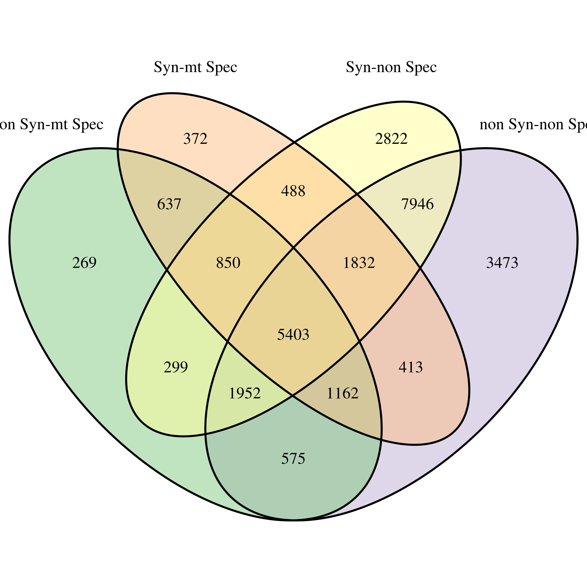

```{r setup_transcripto, include=FALSE}
rm(list = ls()) ; invisible(gc()) ; set.seed(42)
library(knitr)
library(tidyverse)
opts_chunk$set(
  echo = F, message = F, warning = F, fig.height = 6, fig.width = 8,
  cache = T, cache.lazy = F)
theme_set(bayesplot::theme_default())
path <- "~/Documents/BIOGECO/PhD/data/Symphonia_Niklas/k2rt"
```

# Transcriptomic data

Niklas used 20 Symphonia juveniles from the transplantation garden experiment for transcriptomic analysis. RNA sequence were captured. The analysis followed the scheme suggested by @Lopez-Maestre2016 (see below). First, reads were assembled with `Trinity` into transcripts. In parrallel, SNPs were detected with `Kissplice`. Then SNPs have been mapped on the transcritpome with `BLAT`. In parrallel SNPs have been tested to be morphotype-specific at the level $\alpha = 0.001$ with `KissDE` and transcriptome Open Reading Frames (ORF) have been indentified with `Transdecoder`. Finally, SNPs functional impact have been evaluated through `k2rt`. Consequently, for every SNP we have the following informations: (i) inside coding DNA sequence (CDS), (ii) synonymous or not, (iii) morphotype-specificity.


## Quality check

We assessed transcriptomic analysis quality with possible sequencing errors, and SNPs in multiple assembled genes or isoforms (see table \@ref(tab:Qcheck)). We find...

```{r Qcheck}
data <- read_delim(file.path(path, "symphonia_juv_fullsample_trinity500_k2rt_type_0a_mainOutput.tsv"),
           delim = "\t")
data %>% 
  select(Possible_sequencing_error,
         SNP_in_mutliple_assembled_genes,
         SNP_in_mutliple_assembled_isoforms) %>% 
  mutate(Count = 1) %>%
  reshape2::melt(id.vars = "Count") %>% 
  filter(value == "True") %>% 
  mutate(variable = gsub("_", " ", variable)) %>% 
  group_by(variable) %>% 
  summarise(n = n()) %>% 
  mutate(Percentage = round(n/nrow(data)*100,2)) %>% 
  kable(caption = "Quality check with single SNPs....",
        format.args = list(big.mark = " "))
rm(data) ; invisible(gc())
```

## SNPs

Once quality check, we can look at SNP distribution between the three modalities (see table \@ref(tab:countTable) and and \@ref(fig:sunburstcount)). We can see... More particularly we have 99 491 Non-synonymous SNPs in coding region that are morphotype specific making a pool of SNPs to be used in sequence capture. We now need to identify gene functions for those SNPs (GO terms) and more particularly if some functions are enriched in a particular morphotype.

```{r count_SNP}
data <- read_delim(file.path(path, "symphonia_juv_fullsample_trinity500_k2rt_type_0a_mainOutput.tsv"),
           delim = "\t")
count_SNP <- data %>% 
  filter(Possible_sequencing_error != "True") %>% 
  select(Is_in_CDS, Is_not_synonymous, Is_condition_specific) %>% 
  group_by(Is_in_CDS, Is_not_synonymous, Is_condition_specific) %>% 
  summarize(n = n()) 
rm(data) ; invisible(gc())
```

```{r countTable}
count_SNP %>% 
  dplyr::rename("Coding sequence" = Is_in_CDS,
         "Not synonymous" = Is_not_synonymous,
         "Morphotype-specific" = Is_condition_specific) %>% 
  kable(caption = "Single SNPs headcount for Symphonia juveniles in k2rt main output. First column indicates if the SNP is in a coding sequence, second column indicates is the SNP is not synonymous, third column indicates if the SNP is morphotype-specific, and fourth column indicates the headcount.", format.args = list(big.mark = " "))
```

```{r sunburstcount, fig.cap = "SNPs headcount for Symphonia juveniles by types. Levels precise if the SNP is in a coding region, synonymous and finally morphotype-specific."}
count_SNP %>% 
  ungroup() %>%
  mutate(type = ifelse(Is_in_CDS == "False" & Is_not_synonymous == "N/A", 
                       "UTR-UTR-", NA)) %>% 
  mutate(type = ifelse(Is_in_CDS == "True" & Is_not_synonymous == "False", 
                       "CDS-synonymous-", type)) %>% 
  mutate(type = ifelse(Is_in_CDS == "True" & Is_not_synonymous == "True", 
                       "CDS-not synonymous-", type)) %>% 
  filter(!is.na(type)) %>% 
  mutate(Is_condition_specific = ifelse(Is_condition_specific == "False",
                                        "non specific", "morphotype specific")) %>% 
  mutate(type = paste0(type,Is_condition_specific)) %>% 
  select(type, n) %>% 
  sunburstR::sunburst(count = T)
rm(list = ls())
```

## Genes

We have a total of:

* __2 398 550__ SNPs
* __257 140__ transcripts (including pseudo-genes isoforms)
* __76 032__ candidate genes 

We have a high frequency of SNPs per candidate genes (the majority between 1 SNP per 10 or 100 bp, see figure \@ref(fig:snpGene)).


 <!-- (from 398 to 1, see figure \@ref(fig:totalGraph)). We can see that almost all  so-called "genes" have a coding DNA sequence (CDS, see figure \@ref(fig:geneGraph)). Consequently we can focus on those genes that will contain both neutral and functional regions. Only half of genes, c.a. 120 k, have non-synonymous SNPs. More specifically, as a first choice we can focus on genes contianing SNPs in every categories, i.e. both morphotype-specific or not and synonymous or not, representing 42 966 genes (see figure \@ref(fig:genesVen)). We will use them in subsequent analysis. -->

```{r genes}
snp <- read_delim(file.path(path, "symphonia_juv_fullsample_trinity500_k2rt_type_0a_mainOutput.tsv"),
           delim = "\t") %>% 
  filter(Possible_sequencing_error != "True") %>% 
  dplyr::rename(transcript_id = `#Component_ID`, snp_id = SNP_ID)

transcript <- src_sqlite(file.path("~/Documents/BIOGECO/PhD/data/Symphonia_Niklas/Trinotate/",
                           "symphonia.trinity500.trinotate.sqlite")) %>% 
  tbl("Transcript") %>% 
  collect()

data <- snp %>% 
  left_join(transcript) %>% 
  mutate(width = nchar(sequence)) %>% 
  mutate(type = ifelse(Is_in_CDS == "False" & Is_not_synonymous == "N/A", 
                       "UTR-UTR-", NA)) %>% 
  mutate(type = ifelse(Is_in_CDS == "True" & Is_not_synonymous == "False", 
                       "CDS-Syn-", type)) %>% 
  mutate(type = ifelse(Is_in_CDS == "True" & Is_not_synonymous == "True", 
                       "CDS-non Syn-", type)) %>% 
  filter(!is.na(type)) %>% 
  mutate(Is_condition_specific = ifelse(Is_condition_specific == "False",
                                        "non Spec", "mt Spec")) %>% 
  mutate(type = paste0(type,Is_condition_specific))

snp_genes <- data %>% 
  group_by(gene_id) %>% 
  summarize(n_snp = n(), width = mean(width)) %>% 
  arrange(desc(n_snp))

g <- VennDiagram::venn.diagram(split(data$gene_id, data$Is_in_CDS), 
                               "./probes_data/genesVenCDS.tiff",
                               # fill = RColorBrewer::brewer.pal(3, "Accent"),
                               alpha = 0.5)

data2 <- data %>%
  filter(type != "UTR-UTR-mt Spec") %>% 
  filter(type != "UTR-UTR-non Spec") %>% 
  mutate(type = gsub("CDS-", "", type))
g <- VennDiagram::venn.diagram(split(data2$gene_id, data2$type), 
                               "./probes_data/genesVen.tiff",
                               fill = RColorBrewer::brewer.pal(4, "Accent"),
                               alpha = 0.5)

rm(snp, transcript, data, data2, g) ; invisible(gc())
```

```{r snpGenes, fig.cap="Number of SNP by gene width. Blue and red lines represent respectivelly a frequency of 1 SNP per 100 and 10 bp."}
snp_genes %>%
  ggplot(aes(width, n_snp)) +
  geom_point() +
  # scale_x_log10() +
  # scale_y_log10() +
  xlab("candidate gene mean width (bp)") +
  ylab("number of SNPs") +
  ylim(c(NA,1500)) +
  geom_abline(slope = 0.1, col = "red") +
  geom_abline(slope = 0.01, col = "blue")
rm(snp_genes)
```

```{r genesVenCDS, fig.cap="Genes having SNPs in CDS, UTR or both."}
include_graphics("./probes_data/genesVenCDS.jpg")
```

```{r genesVen, fig.cap="Genes distribution depending on the type of their SNPs. Gene including SNP with coding DNA sequences (CDS), functional synonymy, or morphtype pspecificity."}

```

## Gene ontology

We have few selected genes with numerous GO terms (figure \@ref(fig:GOgraph)). And *879* genes presents GO terms with all type of enrichment depending on the morphotype, i.e. both depleted and enriched GO terms for *S. globulifera* and *S. sp1* morphotypes. We will use those 879 genes for subsequent analysis, more particularly if we look at GO terms abundance and gene width for those genes (figure \@ref(fig:GOEGraph)), we have a maximum of 10 GO terms but for only a thousand of bp against genes with more than 10 000 bp with only several GO terms.

```{r GO, eval=F}
data <- read_delim(file.path(path, "symphonia_juv_fullsample_trinity500_k2rt_type_0a_mainOutput.tsv"),
           delim = "\t") %>% 
  filter(Possible_sequencing_error != "True")
venn.genes <- list(Synonymous = data$`#Component_ID`[data$Is_not_synonymous == "False" &
                                                    data$Is_in_CDS == "True"],
                  "Not Synonymous" = data$`#Component_ID`[
                    data$Is_not_synonymous == "True" &
                      data$Is_in_CDS == "True"],
                  "Morphotype-specific" = data$`#Component_ID`[
                    data$Is_condition_specific == "True" & data$Is_in_CDS == "True"],
                  "Not Morphotype-specific" = data$`#Component_ID`[
                    data$Is_condition_specific == "False" & data$Is_in_CDS == "True"])
data <- data %>% 
  dplyr::rename(gene = `#Component_ID`, snp = SNP_ID) %>% 
  filter(gene %in% Reduce(intersect, venn.genes)) %>% 
  select(gene, snp)
GO <- src_sqlite(file.path("~/Documents/BIOGECO/PhD/data/Symphonia_Niklas/Trinotate/",
                           "symphonia.trinity500.trinotate.sqlite")) %>% 
  tbl("Transcript") %>% 
  collect() %>% 
  separate_rows(annotation, sep = '\t') %>% 
  filter(grepl("GO:", annotation)) %>% 
  separate_rows(annotation, sep = '`') %>% 
  separate(annotation, sep = "\\^",
           into = c("go_id", "go_namespace", "go_name"))

data_GO <- data %>% 
 inner_join(GO, by = c(gene = "transcript_id"))
countGO <- data_GO %>% 
  select(gene, go_id, go_namespace, go_name) %>% 
  unique() %>% 
  group_by(gene) %>% 
  summarize(n = n()) %>% 
  arrange(desc(n))
OE <- sapply(list.files("~/Documents/BIOGECO/PhD/data/Symphonia_Niklas/GO_term_enrichment/",
                        full.names = T), read_tsv, simplify = F) %>%
  bind_rows(.id = "id") %>% 
  mutate(id = gsub("/home/sylvain/Documents/BIOGECO/PhD/data/Symphonia_Niklas/GO_term_enrichment//OE_",
                  "", id)) %>% 
  mutate(id = gsub(".GOseq", "", id)) %>% 
  mutate(id = gsub(".tsv", "", id))
data_GOE <- data_GO %>% 
  inner_join(OE, by = c("go_id" = "category"))
rm(data, GO, data_GO, OE)
```

```{r GOGraph, fig.cap="GO rank-abundance by gene.", fig.height=4}
countGO %>%
  ggplot(aes(1:nrow(countGO), n)) +
  geom_linerange(ymin = 0, aes(ymax = n)) +
  ylab("Number of GO") +
  xlab("gene")
```

```{r enrichedGO, fig.cap="Genes distribution depending on their GO term enrichment. This graph include the 42 966 which represents all type of SNPs."}
# g <- VennDiagram::venn.diagram(split(data_GOE$gene, data_GOE$id), "./images/GOEVen.tiff",
#                                         fill = RColorBrewer::brewer.pal(4, "Accent"),
#                                         alpha = 0.5)

```

```{r GOEGraph, fig.cap="Number of enriched GO terms vs gene width for selected genes (representing all types of enrichment)."}
data_GOE %>% 
  filter(gene %in% Reduce(intersect, split(data_GOE$gene, data_GOE$id))) %>% 
  mutate(width = nchar(sequence)) %>% 
  select(gene, width, go_name) %>% 
  unique() %>% 
  group_by(gene, width) %>% 
  summarize(n = n()) %>% 
  arrange(desc(width)) %>% 
  ggplot(aes(width, n)) +
  geom_point() +
  scale_x_log10() +
  xlab("Gene width (bp)") +
  ylab("Number of GO terms")
```

