```{r setup_complexes, include=FALSE}
rm(list = ls()) ; invisible(gc()) ; set.seed(42)
library(knitr)
library(kableExtra)
if(knitr:::is_html_output()) options(knitr.table.format = "html") 
if(knitr:::is_latex_output()) options(knitr.table.format = "latex") 
library(parallel)
library(tidyverse)
library(ggfortify)
library(raster)
library(rstan)
library(bayesplot)
theme_set(bayesplot::theme_default())
opts_chunk$set(
  echo = F, message = F, warning = F, fig.height = 6, fig.width = 6,
  cache = T, cache.lazy = T)
options(mc.cores = parallel::detectCores())
rstan_options(auto_write = T)
path <- "~/Documents/BIOGECO/PhD/data/Paracou/"
crs <- '+proj=longlat +datum=NAD83 +no_defs +ellps=GRS80 +towgs84=0,0,0' # global crs definition
```

# Complexes delineation

Species complex were defined based on evidence for low phylogenetic resolution or plastid DNA sharing in the clade [@baraloto_using_2012-1; @Gonzalez2009]: *Eschweilera* (Lecythidaceae); *Licania* (Chrysobalanaceae); *Iryanthera* (Myristicaceae); *Symphonia* (Clusiaceae); *Talisia* (Sapindaceae). We will further keep species with more than 10 individuals. We thus obtained 6 species complexes (Table \@ref(tab:summary)) including 2 to 9 species.

We compared species present in Paracou for the genus suspected as a species complex with @baraloto_using_2012-1 phylogeny and other resources if needed to complete the species complex delineation.

```{r complexes_complexes}
complexes <- bind_rows(
  data.frame(Complex = "E. Chartacea", Genus = "Eschweilera",
             Species = c("simiorum", "congestiflora")),
  data.frame(Complex = "E. Parvifolia", Genus = "Eschweilera",
             Species = c("pedicellata", "coriacea", "decolorans", "sagotiana",
                         "wachenheimii", "grandiflora_form2")),
  data.frame(Complex = "Licania", Genus = "Licania",
             Species = c("alba", "membranacea", "canescens", "micrantha",
                         "ovalifolia", "sprucei", "densiflora",
                         "laxiflora", "parvifructa")),
  data.frame(Complex = "Iryanthera", Genus = "Iryanthera",
             Species = c("hostmannii", "sagotiana")),
  data.frame(Complex = "Talisia", Genus = "Talisia",
             Species = c("hexaphylla", "praealta", "simaboides")),
  data.frame(Complex = "Symphonia", Genus = "Symphonia",
             Species = c("globulifera", "sp.1")))
```

```{r trees_complexes}
trees <- src_sqlite(file.path(path, "trees", "Paracou.sqlite")) %>% 
  tbl("Paracou") %>% 
  filter(CensusYear == 2015) %>%
  filter(Species != "Indet.") %>% 
  mutate(DBH = CircCorr/pi) %>% 
  collect()
```

```{r data_complexes}
data <- trees %>% 
  left_join(complexes, by = c("Genus", "Species")) %>% 
  filter(!is.na(Complex))
```

## E. Chartacea

Within Lecythidaceae, *Eschweilera* and *Lecythis* genera are known as paraphyletic. Several clade have been defined within including clades *Charatcea*, *Parvifolia*, *Poiteaui*, *Pisonis*, and *Corrugata*. The genera are represented by 13 species with more than 10 individuals in Paracou (Table \@ref(tab:ChartaceaParacou)). Most of them are related to *Eschweilera* clade *Parvifolia* and only *E. congestiflora* and *E. simiorum* are both included in the *Eschweilera* clade *Chartacea* of @baraloto_using_2012-1 and Chave et al, unpublished (Fig. \@ref(fig:ChartaceaBaraloto) and \@ref(fig:ChartaceaChave)).

```{r ChartaceaParacou}
trees %>% 
  filter(Genus %in% c("Eschweilera", "Lecythis")) %>% 
  mutate(Species = paste(substr(Genus, 1, 1), Species)) %>% 
  group_by(Species) %>%
  filter(n() > 10) %>% 
  summarise(N = n()) %>% 
  arrange(desc(N)) %>% 
  kable(caption = "Eschweilera and Lecythis species with more than 10 individuals in Paracou.", format = "pandoc") %>% 
  kable_styling(full_width = F)
```

```{r ChartaceaBaraloto, fig.cap="Eschweilera clade Chartacea phylogeny from @baraloto_using_2012-1."}
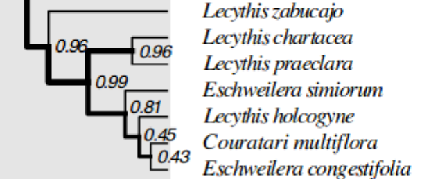
```

```{r ChartaceaChave, fig.cap="Eschweilera clade Chartacea phylogeny from Chave et al, unpublished."}
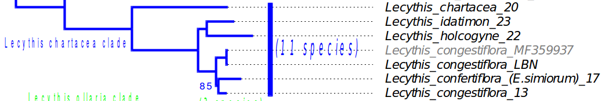
```

## E. Parvifolia

Regarding *Eschweilera* clade *Parvifolia*, among the 13 species of Paracou (Table \@ref(tab:ParvifoliaParacou)) all resources agreed (@baraloto_using_2012-1, Chave et al, unpublished, Heuertz et al, unpublished, Fig. \@ref(fig:ParvifoliaBaraloto), \@ref(fig:ParvifoliaChave), and \@ref(fig:ParvifoliaHeuertz)) on *E. sagotiana*, *E. coriacea*, *E. decolorans*, *E. pedicellata*, *E. wachenheimii* and *E. grandiflora_form2*.

```{r ParvifoliaParacou}
trees %>% 
  filter(Genus %in% c("Eschweilera", "Lecythis")) %>% 
  mutate(Species = paste(substr(Genus, 1, 1), Species)) %>% 
  group_by(Species) %>%
  filter(n() > 10) %>% 
  summarise(N = n()) %>% 
  arrange(desc(N)) %>% 
  kable(caption = "Eschweilera and Lecythis species with more than 10 individuals in Paracou.", format = "pandoc") %>% 
  kable_styling(full_width = F)
```

```{r ParvifoliaBaraloto, fig.cap="Eschweilera clade Parvifolia phylogeny from @baraloto_using_2012-1."}
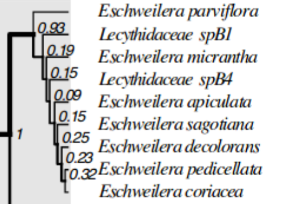
```

```{r ParvifoliaChave, fig.cap="Eschweilera clade Parvifolia phylogeny from Chave et al, unpublished."}
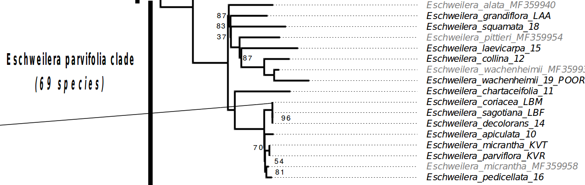
```

```{r ParvifoliaHeuertz, fig.cap="Eschweilera clade Parvifolia phylogeny from Heuertz et al, unpublished."}
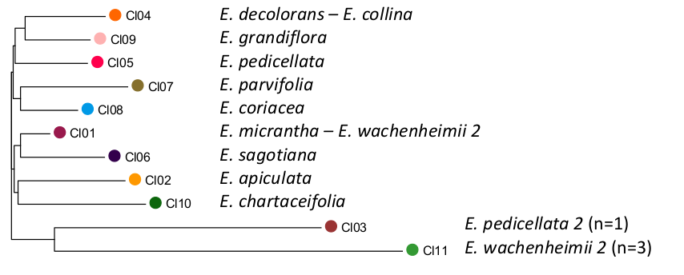
```

## Iryanthera

*Iryanthera* genus is represented only by two species with more than 10 individuals in Paracou (Table \@ref(tab:IryantheraParacou)) corresponding to the species of the phylogeny in @baraloto_using_2012-1 (Fig. \@ref(fig:IryantheraBaraloto)).

```{r IryantheraParacou}
trees %>% 
  filter(Genus == "Iryanthera") %>% 
  mutate(Species = paste(substr(Genus, 1, 1), Species)) %>% 
  group_by(Species) %>%
  filter(n() > 10) %>% 
  summarise(N = n()) %>% 
  arrange(desc(N)) %>% 
  kable(caption = "Iryanthera species with more than 10 individuals in Paracou.", format = "pandoc") %>% 
  kable_styling(full_width = F)
```

```{r IryantheraBaraloto, fig.cap="Iryanthera phylogeny from @baraloto_using_2012-1."}
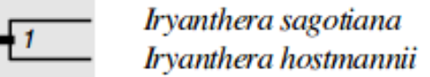
```

## Licania

*Licania* genus is represented by 12 species with more than 10 individuals in Paracou (Table \@ref(tab:LicaniaParacou)). We specifically used the more recent phylogeny of @Bardon2016 instead of @baraloto_using_2012-1 more focused on the Chrysobalanaceae family. Paracou species are all included into clades defined by @Bardon2016: *Licania* 3 (Fig. \@ref(fig:Licania3Bardon)) and *Licania* 4 (Fig. \@ref(fig:Licania4Bardon)). We will exclude the three species of clade *Licania* 4 (*L. heteromorpha*, *L. licaniflora*, and *L. latistipulata*), and consequently keep the all 9 remaining species as *Licania* species complex.

```{r LicaniaParacou}
trees %>% 
  filter(Genus == "Licania") %>% 
  mutate(Species = paste(substr(Genus, 1, 1), Species)) %>% 
  group_by(Species) %>%
  filter(n() > 10) %>% 
  summarise(N = n()) %>% 
  arrange(desc(N)) %>% 
  kable(caption = "Licania species with more than 10 individuals in Paracou.", format = "pandoc") %>% 
  kable_styling(full_width = F)
```

```{r LicaniaBaraloto, fig.cap="Licania phylogeny from @baraloto_using_2012-1."}
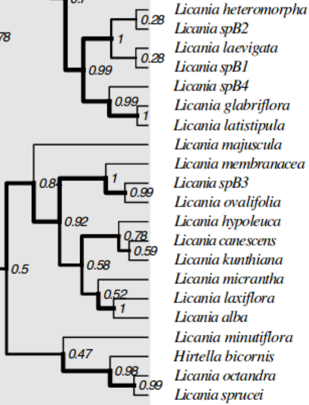
```

```{r Licania3Bardon, fig.cap="Clade Licania 3 phylogeny from @Bardon2016."}
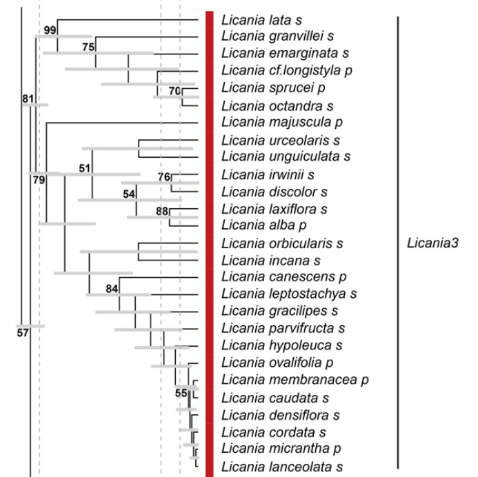
```

```{r Licania4Bardon, fig.cap="Clade Licania 4 phylogeny from @Bardon2016."}
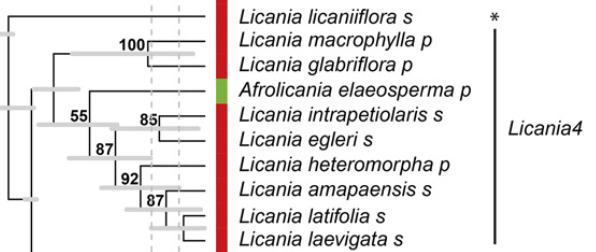
```

## Symphonia

*Symphonia* genus is represented only by two species with more than 10 individuals in Paracou (Table \@ref(tab:SymphoniaParacou)) corresponding to the species of the phylogeny in @baraloto_using_2012-1 (Fig. \@ref(fig:SymphoniaBaraloto)).

```{r SymphoniaParacou}
trees %>% 
  filter(Genus == "Symphonia") %>% 
  mutate(Species = paste(substr(Genus, 1, 1), Species)) %>% 
  group_by(Species) %>%
  filter(n() > 10) %>% 
  summarise(N = n()) %>% 
  arrange(desc(N)) %>% 
  kable(caption = "Symphonia species with more than 10 individuals in Paracou.", format = "pandoc") %>% 
  kable_styling(full_width = F)
```

```{r SymphoniaBaraloto, fig.cap="Symphonia phylogeny from @baraloto_using_2012-1."}
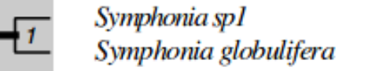
```

## Talisia

*Talisia* genus is represented by four species with more than 10 individuals in Paracou (Table \@ref(tab:TalisiaParacou)) among which 3 (*T. hexaphylla*, *T. praelata*, and *T. simaboides*) correspond to the species of the phylogeny in @baraloto_using_2012-1 (Fig. \@ref(fig:TalisiaBaraloto)). We thus must determine if *T. furfuracea* is included within the complex or not. For the moment we do not have any additional informations and we will exclude *T. furfuracea* only represented by 24 individuals.

```{r TalisiaParacou}
trees %>% 
  filter(Genus == "Talisia") %>% 
  mutate(Species = paste(substr(Genus, 1, 1), Species)) %>% 
  group_by(Species) %>%
  filter(n() > 10) %>% 
  summarise(N = n()) %>% 
  arrange(desc(N)) %>% 
  kable(caption = "Talisia species with more than 10 individuals in Paracou.", format = "pandoc") %>% 
  kable_styling(full_width = F)
```

```{r TalisiaBaraloto, fig.cap="Talisia phylogeny from @baraloto_using_2012-1."}
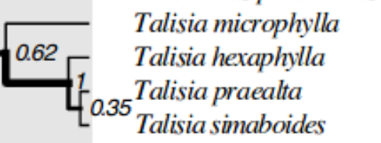
```

## Conclusion

```{r summary}
data %>% 
  mutate(Species = paste(substr(Genus, 1, 1), Species)) %>% 
  group_by(Complex, Genus, Species) %>% 
  summarise(N = n()) %>% 
  arrange(Complex, desc(N)) %>% 
  kable(caption = "Identified species complexes with species including more than 10 individuals in Paracou.", format = "pandoc") %>% 
  kable_styling(full_width = F) %>% 
  collapse_rows(1:2)
```
