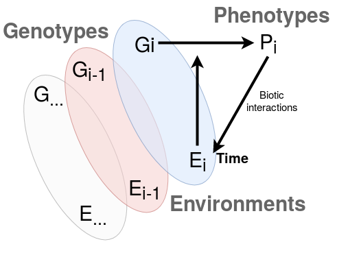

<!-- https://ed-environnements.u-bordeaux.fr/var/ezdemo_site/storage/images/media/ecole-doctorale-sciences-et-environnements/sources/ed-304-footer-1280x280/70041-3-fre-FR/ED-304-Footer-1280x280_FooterLogoTiers.png -->

```{r setup, cache=FALSE, include=FALSE}
library(ggplot2)
library(knitr)
library(tidyverse)
library(raster)
knitr::opts_chunk$set(fig.width = 8, fig.height = 6, 
                      echo = FALSE, message = FALSE, warning = FALSE)
```

# Administrative situation of the PhD

<!-- Nom, prénom du(de la) doctorant(e), Titre et spécialité de la thèse, Date de 1ère inscription, Unité de Recherche et partenaire(s) (le cas échéant), Nom, prénom du(de la) directeur(rice) de thèse, Nom, prénom du(de la) codirecteur(rice) de thèse, Type de financement et type de contrat -->

The PhD thesis work conducted by Sylvain SCHMITT is entitled "Ecological genomics of niche exploitation and individual performance in tropical forest trees". The main research field is ecology and evolution. The thesis started September $1^{th}$, 2017 in the UMR Biodiversité Gènes et Communautés (BIOGECO), under the supervision of Bruno Hérault and Myriam Heuertz, under a doctoral contract (contrat doctoral) funded by a grant from the Ministry of Research (bourse du ministère de l'enseignement supérieur et de la recherche, MESR).

# Synthetic description of the PhD subject

<!-- 200 mots maximum. -->

Understanding characteristics, causes and consequences of biodiversity is a fundamental challenge in ecology and evolution. Biodiversity presents three nested levels, from individuals, over species, to ecosystems.

Intraspecific variability affects the individual level of biodiversity. High levels of intraspecific variability, notably in ecologically important traits have been reported. Intraspecific trait variability is shaped by the interaction between genetic variability, environmental heterogeneity, and stochastic factors.

However, we still know little about the effects of this variability on population dynamics, species interactions and ecosystem processes. Interestingly though, variability at the level of genotypes and traits has been suggested to  promote local adaptation of populations and to promote species coexistence at the community level, thus suggesting a role for this variability in the origin and maintenance of  biodiversity.

The main objective of the thesis is to further explore the genotype-environment interactions in shaping the intraspecific trait variability of tropical tree species, and  derive its impact on the origin and maintenance of biodiversity. The study site for the thesis is the lowland rainforest in the research station of Paracou, French Guiana, where detailed inventory and tree growth data, as well as environmental characterization are available. We specifically wish to consider the intraspecific genomic variability as a continuum within structured populations of closely related species, and measure its role on individual tree performance through growth over time, while accounting for effects of a finely-characterized environment at the abiotic and biotic level. Eventually, we expect to help building a theory of community ecology starting with individuals, because interactions with environment is based at the individual level.

# Summary of work accomplished

<!-- 500 mots maximum -->

## Realized

The PhD thesis is based on the general hypothesis that intraspecific genetic and phenotypic variability promote species local coexistence within tropical tree community through local adaptation. As the sampling of the whole tropical tree community is unrealistic, we decided to focus on two hyperdominant and abundant species complexes, *Symphonia globulifera* (Clusiacea) and *Eschweilera* clade *Parvifolia* (Lecythidaceae). We thus aimed to focus the sampling on a large individual diversity of several species, hopping to eventually open on community hypotheses through modelling or simulations. The main objective is to explore genotype-environment interactions in shaping the intraspecific variability of both functional and performance traits (Fig. \@ref(fig:PhDscheme)) through several steps: 

1. How abiotic environment and biotic interactions shape species distributions between and within species complexes of a local community  ($E_i$ in Fig. \@ref(fig:PhDscheme)) ?
1. How is genetic variability structured within species complexes of a local community ($G_i$ in Fig. \@ref(fig:PhDscheme)) ?
1. How abiotic environment and biotic interactions shape genetic variability structure within species complexes of a local community ($G_i \sim E_i$ interaction in Fig. \@ref(fig:PhDscheme)) ?
1. How genetic variability shapes phenotypes within species complexes of a local community ($P_i \sim G_i$ in Fig. \@ref(fig:PhDscheme)) ?
1. How does ontogeny, abiotic environment and biotic interactions drive phenotypes within species complexes of a local community ($P_i \sim E_i$ interaction in Fig. \@ref(fig:PhDscheme)) ?
1. How genetic variability interaction with abiotic and biotic environment, through phenotypic traits, drive individual performance ($P_i \sim E_i \times G_i$ interaction in Fig. \@ref(fig:PhDscheme)) ?

We first explored the distribution of 6 species complexes belonging to 5 family in the Paracou station and the relative distribution of the species within the species complexes with  Bernoulli and Dirichlet multinomial distributions through a bayesian framework described with both abiotic (topographic wetness index) and biotic (neighbor crowding index of conspecific and heterospecific) variables. The work is in progress, but preliminary results indicates that species complexes are widely spread across habitats at local scale, whereas their species show pervasive niche differentiation mainly with topography and conspecific crowding. 

Secondly, we sampled 838 individuals of *Symphonia globulifera* and *Eschweilera* clade *Parvifolia* species complexes at the end of years 2017 and 2018. We noticed tree characteristics for botanical identification and sampled leaf, wood, flower and fruits (when available). We measured leaf and wood functional traits and extract DNA from leaves. We studied leaf functional traits covariation with a within groups principal component analysis (wPCA) and response of traits variation to ontogeny, topography and neighbors with a Michaelis model described by tree diameter, topographic wetness index, and neighbor crowding index through a bayesian framework. We found that changes towards more conservative trait values for bigger trees in more luminous environment persist throughout adult stage. Moreover, our result suggest that intraspecific trait variability could increase tolerance to environmental filtering and thus contribute to species coexistence.

Finally, we started genetic data production with a gene capture experiment for both *Symphonia globulifera* (done) and *Eschweilera* clade *Parvifolia* species (work in progress). We selected neutral and functional (candidate and not) target sequences through bioinformatics pipeline from transcriptomic data (Vargas *et al.* Tysklind *et al. in prep.*), genome draft (Olsson *et al.* 2017, Scotti *et al. pers. com.*) and ddRAD-seq data (Torroba-Balmori *et al. unpublished*, Heuertz *et al. unpublished*). We prepared DNA library and realized sequence capture by hybridization developing low cost protocol (LOCOCAP project) for *Symphonia globulifera*. *Symphonia* libraries are under sequencing and *Eschweilera* libraries will be hopefully prepared and sequenced in a near future.

```{r PhDscheme, fig.cap="General scheme of the PhD thesis."}

```

## Scheduled

* Genetic data production for *Eschweilera*. Extraction, library preparation and capture by hybridization. *May - June 2019*
* Genetic raw data analysis. Reads cleaning and filtering and polymorphisms discovery. *July 2019*
* Population genetic structure (step 2). Estimation of diversity patterns, demography and introgression history. *August - September 2019* 
* Environment-Genotype association (step 3). Environmental genomics with abiotic environment and biotic interactions. *October - November 2019*
* Genotype-Phenotype association (step 4). Association genomics with leaf and wood functional traits and ultimately growth patterns (and maybe survival if exploitable). *December 2019  January 2020*
* Integrative model of environment and genotype interaction in shaping phenotype and performance (step 6). We wish to join genotype, environment, functional traits and performance data and observed relations in a final integrative model, either with a correlative approach or through a forest simulator to test hypotheses. *February - April 2020*

# Publications and conferences

## Article {-}

* __Schmitt S.__, Pouteau R., Justeau D., de Boissieu F., & Birnbaum P. (2018). SSDM: An R package to predict distribution of species richness and composition based on stacked species distribution models. *Methods in Ecology and Evolution*. 2017;8:1795–1803. https://doi.org/10.1111/2041-210X.12841
* __Schmitt, S.__, Chave, J., Fischer, F., Maréchaux, I., Piponiot, C., Traissac, S., & Hérault, B. (In revision). Functional diversity improves tropical forest resilience, insights from a long-term virtual experiment. *Manuscript in revision*.
* __Schmitt S.__, Hérault B., Ducouret E., Baranger A., Tysklind N., Heuertz M., Marcon E., Cazal S.O. &  Derroire G. (In prep). Ontogeny and abiotic environment drive intraspecific trait variation in Neotropical tree species. *Manuscript in preparation*.
* __Schmitt S.__, Tysklind N., Derroire G., Heuertz M., & Hérault B. (In prep). Pervasive local-scale species niche differentiation within tropical tree species complexes. *Manuscript in preparation*.
* __Schmitt, S.__, Raevel, V., Réjou-Méchain, M., Ayyappan, N., Balachandran, N., Barathan N., &
Munoz, F. (In prep). Tree functional traits answer differently to environment between understory and canopy species. *Manuscript in preparation*.

## Conferences {-}

* __Schmitt S.__, Heuertz M., Hérault B., & Tysklind N. (March 2018). Ecological genomics of niche exploitation
and individual performance in tropical forest trees. *Poster presented at the European Conference of Tropical Ecology and the Journée des Doctorants de l'École Doctorale*. https://www.soctropecol-conference.eu/download/SocTropEcol_Tagungsband2018.pdf
* __Schmitt S.__, Hérault B., Ducouret E., Baranger A., Tysklind N., Heuertz M., Marcon E., Cazal S.O. &  Derroire G. (April 2019). L'ontogénie, la lumière et la topographie structurent les traits fonctionnels des individus chez les espèces d'arbres tropicaux. *Talk presented at the Journée des Doctorants de l'École Doctorale*. https://ed-environnements.u-bordeaux.fr/Doctorant/Journees-ED
* __Schmitt S.__, Hérault B., Ducouret E., Baranger A., Tysklind N., Heuertz M., Marcon E., Cazal S.O. &  Derroire G. (July 2019). Ontogeny and abiotic environment drive intraspecific trait variation in Neotropical tree species. *Talk to be presented at the Annual meeting of the Association for Tropical Biology and Conservation*.

## Other {-}

* __Schmitt S.__, Pouteau R., Justeau D., de Boissieu F., & Birnbaum P. (2017). SSDM: Stacked Species Distribution Modelling. *R package version 0.2.4*. https://cran.r-project.org/web/packages/SSDM/index.html
* Fischer, F., & __Schmitt S.__. (In prep). RconTroll: Front and back ends package for individual-based forest growth simulator TROLL. *R package in development*. https://github.com/fischer-fjd/RconTroll

# Trainings courses, and mobility

<!-- Lister en préciser le lieu et la durée ce qui a été effectué depuis le début de la thèse ou ce qui est à prévoir -->

## Training courses {-}

* "MOD : Formation Intégrité Scientifique" 4 week online lecture 
* "Introduction to next-generation sequencing: applications in ecology and evolution" 1 week lecture in Barcelona

## Mobility {-}

* Mobility to Kourou in French Guiana for field sampling, genetic & functional analysis and supervising (3 times: 5 months, 1 month and 6 months)
* Future mobility to Yamoussoukro in Ivory Coast for data analysis (2-3 months beginning of 2020)
* Potential mobility abroad but risk to lack of time (EIRA)

## Other {-}

* Supervising of Émilie Ducouret master 2 thesis (6 months)
* Supervising of Adeline Adam, Agathe Benfredj Zaleski, Numa Faucherre, and David zipper engineer/master student project (2 weeks)
* Supervising of Anne Baranger gap year internship (3 months)

# Scientific animation

<!-- Lister participations aux séminaires de l’équipe, du laboratoire, de la structure fédérative de rattachement et de l’ED. Indiquer le titre des présentations réalisées s’il y a lieu. -->

## Presentation

* __Schmitt S__, Heuertz M, Hérault B, Tysklind N. (January 2017). Ecological genomics of niche exploitation
and individual performance in tropical forest trees. *Talk presented at the Journée des Thésards de l’UMR ECOFOG.*
* __Schmitt S__, Heuertz M, Hérault B, Tysklind N. (May 2018). Ecological genomics of niche exploitation
and individual performance in tropical forest trees. *Poster presented at the Journée des Doctorants de l’ED Sciences et Environnements.* https://jded-2018.sciencesconf.org/
* __Schmitt S__. (March 2018). Introduction to bayesian modelling with stan. *Lecture realized at UMR ECOFOG* (https://sylvainschmitt.netlify.com/files/stan/stan.html#/)
* __Schmitt S__. (November 2018). Introduction to bayesian modelling with winbugs. *Lecture realized for Msc student of Écologie des Forêts de Guyane.*
* __Schmitt S.__, Hérault B., Ducouret E., Baranger A., Tysklind N., Heuertz M., Marcon E., Cazal S.O. &  Derroire G. (April 2019). L'ontogénie, la lumière et la topographie structurent les traits fonctionnels des individus chez les espèces d'arbres tropicaux. *Talk presented at the E4E team seminar, the Journal Club, and the Journée des Doctorants de l'École Doctorale*.

## Participation

* Participation in meetings of the former BIOGECO team "Équipe de génétique et écologie des populations"
* Participation in meetings of the new BIOGECO team "E4E Evolution in Forest Ecosystems"
* Attendance to seminars of the UMR BIOGECO
* Attendance to meetings of the Journal Club from the PhD and postdoc students of the UMR BIOGECO
* Attendance to meetings "bidouillons ensemble" of the UMR BIOGECO
* Participation in meetings of the genetics lab and meetings of the research unit UMR Écologie des Forêts de Guyane (ECOFOG) when present in Kourou

# Educational work

<!-- Lister les différentes heures effectuées. Préciser s’il s’agit de vacations ou d’une mission complémentaire d’enseignement. Indiquer la composante d’enseignement concernée. -->

Nothing realized, hesitancy for a 30h teaching contract with Bordeaux University to get a recognized experience in teaching.

# Other activities

<!-- Pour missions complémentaires d’expertise indiquer le nombre d’heures ou de jours, l’organisme ou l’entreprise qui vous emploie. Pour les mandats électifs, préciser le nombre de réunions par an. -->

Nothing realized or scheduled.

# Professional perspective

<!-- Indiquer les perspectives de poursuite de carrière post-thèse auxquelles doit faire écho le plan de formation durant la thèse. Indiquer les perspectives de candidature pour un post doc en France ou à l’étranger, de candidature à la qualification aux fonctions de Maitres de conférences, de chercheur CNRS, INRA, IRSTEA, INRAP, etc... -->

After my PhD thesis, I aim to realize a postdoc at the international or in France in tropical ecology and/or evolution aming to further try to obtain a researcher position.

# Opinion from PhD student

* _Frequency of contacts with the directeur de thèse (not including mail)_: Less than one per month (Directeur de thèse based in Ivory Coast)
* _Frequency of contacts with the co-directeur de thèse_: Several times a week when in Bordeaux
* _Relations with other scientist outside from the supervising_:
    * _Local_: YES (Géraldine Derroire, Éric Marcon, Sabrina Coste, Stéphane Traissac, Sébastien Levionnois...)
    * _National_: YES (Isabelle Maréchaux, Fabian Fischer, Jérôme Chave, Maxime Réjou-Méchain, François Munoz, Valérie Raevel)
    * International: YES (Mainly linked to R package maintenance and scientists met at international conference)
* _General opinion on the PhD precising potential difficulties_: Positive opinion in general. Potential difficulties due to distance (Bordeaux, Kourou, Yamoussoukro), which are easily solved by new technologies, or availability. And maybe a difficulty on lab work timing for genetic analysis, with a lot of issues encountered, and a resulting delay in sequences delivery for *Symphonia* that I hope to reduce with more efficiency on *Eschweilera*. 

*Nom, prénom du signataire, date et signature*

`r if (knitr:::is_latex_output()) '\\vspace{3cm}'`
`r if (knitr:::is_latex_output()) '\\newpage'`

# Opinions of directeurs de thèse

Concise opinion (< 100 words) precising organisation and autonomy from the PhD student in his work justifying his progress in his research project.

`r if (knitr:::is_latex_output()) '\\vspace{5cm}'`

*Nom, prénom du(des) signataire(s), date et signature(s)*

`r if (knitr:::is_latex_output()) '\\vspace{3cm}'`

# Opinion of comité de suivi de thèse

Concise opinion (< 200 words) tackling specific orientation and progress in the research project, training plan for the student, and student insertion in the professional framework (team, lab, école doctorale, institution, ...).

`r if (knitr:::is_latex_output()) '\\vspace{5cm}'`

*Nom, prénom du signataire, date et signature*

`r if (knitr:::is_latex_output()) '\\vspace{3cm}'`
