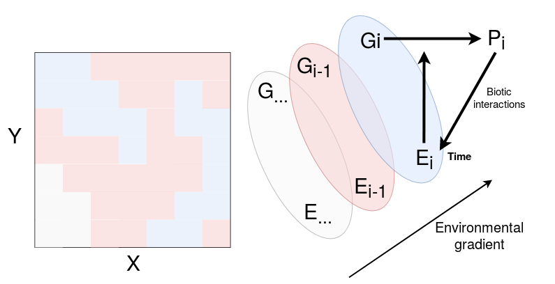

%% smart
%% to=latex
%% template=tex/poster_night.tex
%% filter=tex/poster-filters.py
%% biblatex

```{r packages-and-options, cache=FALSE}
library(ggplot2)
library(knitr)
# library(tidyverse)
# library(raster)
knitr::opts_chunk$set(fig.width = 8, fig.height = 6)
```

[columns=2]

[column]

# Introduction

Biodiversity presents three nested levels, from **individuals**, over **species**, to **ecosystems**. **Intraspecific variability** affects the individual level of biodiversity. However, we still know little about the effects of intraspecific variability on **population dynamics**, **species interactions** and **ecosystem processes**. Interestingly though, variability at the level of genotypes and phenotypes has been suggested to  promote **local adaptation** of populations and to promote **species coexistence** at the community level, thus suggesting a role for intraspecific variability in the origin and maintenance of  biodiversity.

# Origin and maintenance of intraspecific variability

**Intraspecific variability** is ultimately represented by phenotypic variation among communities and ecosystems. **Phenotypic variation** will be shaped (i) by **genetic heritage**, through genotypes, (ii) by the **environment** (both abiotic and biotic) with spatial and temporal heterogeneity, and (iii) by **random** stochastic factors (see figure **1**).

### Genetic

Genetic variability is the genetic differences we find within and among genomes of individuals within the population. Woody species have been shown to harbour more **genetic variation within populations** but less among populations than non woody species. **Local adaptations** are not random inside populations and results in a **structured genetic variability** within demes. The fields of **ecological genomics** and **association genetics** aims to relate genotype respectively to their specific habitat and phenotype.

### Environment

Trees interaction with environment go ultimately through resources acquisition and predation. **Biotic interactions**, **hydrology**, **pedology** and **topography** are locally driving trees' access to resources. They are all **spatially structured** and heterogeneous. Contrarily to hydrology, pedology and topography relatively stable over an individual life time, biotic factors vary at the individual timescale. The **temporal component** of environment has been little exploited to our knowledge and might play an important role in population genetic and phenotypic variability, by challenging local adaptation.

### Phenotype

Local adaptation reflects the fact that local populations tend to have a higher fitness in their native environment than in other environment, increasing performance of locally adapted individual. Tree species performance have been related to their ability to **survive**, **grow** and **reproduce**.  Performance can be directly measured (growth rate, mortality rate, monitoring of cohorts or allele frequencies) or approached with functional traits. Functional traits can be be numerous and can be classified as traits relating to **biochemistry**, **physiology**, **anatomy**, **morphology**, or **phenology**.  Ultimately functional traits arise from expressed genes through transcripts. Consequently, **performance and functional traits** allow to assess **fitness**, and thus help to explore **genetic variability** and **environmental heterogeneity** link due to **local adaptation**.

```{r scheme, fig.cap="Local adapatation within a taxa complex living in sympatry. Different demes $G$ grow in sympatry in specific habitat $E$ along an environmental gradient. Interaction of local environment $E_i$ and genotype $G_i$ result in phenotype $P_i$. But the phentoype $P_i$ feed back itself local environment through biotic interactions and local environment variation in time influence the phenotype of the established genotype.", fig.height=10, fig.width=16}

```

# Acknowledgements

[columns=2]

[column]

We thanks Bordeaux university and COLLEVOL project for funding. We are grateful to Pascal Petronelli and the CIRAD inventory team for their work on tree inventories and botanical identification. Special thanks go to Saint-Omer and Josselin Cazal, Ilke Gelaldi, and Fabien Lehuede for their fieldwork during sampling. We also thank Émilie Ducouret for her work on functional traits.

[column]


[/columns]

[column]

# Hypothesis

We want to use this theoretical framework to test subsequent hypothesis:

**H1. Closely related species exploit locally different niches due to specific functional adaptation diverging from a common genetic basis.**

*Genomic scans of species pairs growing in different environmental conditions (e.g. hydric) will be examined to reveal putative sign of differential adaptation to habitat in order to explore phenotype-genotype link.*

**H2. Hybridization is an important factor from adaptive evolution.**

*Hybridization of closely related species results in new genic complexes on which natural selection can act. We thus expect genomic scans to reveal adaptive introgression. We expect (i) adaptive genes of primordial phenotypes to be more shared between closely related species, (ii) performant individual growing at the limit of their ecological niche to show higher levels of adaptive introgression.*

**H3. Individual performance, especially in tree growth, is shaped by both environmental conditions (abiotic and biotic) and genetic characteristics, which might be potentially underevaluated for tropical tree species.**

*We will use several systems of closely related species to improve growth model of tropical trees, including individual phenotypic traits and genomic scan, to reveal mechanisms of adaptive evolution to niche and to estimate heritability of performance for tropical trees.*

**H4. Intraspecific genetic and phenotypic variability promotes species coexistence through local adaptation.**

*Merging results on niche exploitation (H1), hybridization (H2), and individual performance (H3) of several systems of closely related species, we want to explore the role of both intraspecific genetic and phenotypic variability on species coexistence within the community. We want to use several taxa of dominant species, and we expect local adaptation to play an important role in species local coexistence despite competition.*

# Symphonia first leads

*Symphonia globulifera* (Clusiaceae) is a **species complex** comprising two weakly differentiated morphotype leaving in differentiated habitat: *S. globulifera* (sensu stricto) preferentially growing in valley bottoms experiencing seasonal flooding and *S. sp.1* exploiting a variety of drier habitats along well-drained slopes and hilltops. We explored more deeply **habitat preference** of the two morphotypes, highlighting topographic wetness index as a good predictor of morphotypes distributions (see figure **2A**). We **sampled 402 adult trees** from the long-term forest monitoring plot of Paracou, French Guiana. We are using transcriptomic analysis of transplantation experiment (Tysklind et al, in prep) to design a **sequence capture** on the sampled trees (see figure **2B**). In addition, leaves and wood were sampled for **functional trait analysis**  (see figure **2C**). Finally, we hope to integrate environmental, genetic, and phenotypic information to individual performance through an **individual growth model**  (see figure **2D**).

```{r environmentOverlap, fig.cap="Morphotypes distribution along the topographical wetness index (TWI)"}
path <- "~/Documents/BIOGECO/PhD/data/Paracou"
docpath <- "~/Documents/BIOGECO/PhD/documents/Symphonia/"
crs <- '+proj=longlat +datum=NAD83 +no_defs +ellps=GRS80 +towgs84=0,0,0' # global crs definition
load(file = file.path(path, 'trees', 'symphonia.Rdata'))
sympho <- sympho %>% 
  filter(campagne == 2015) %>% 
  filter(code_vivant == 1) %>% 
  filter(code_mesure == 0) %>% 
  filter(n_parcelle != 18) %>% 
  mutate(morphotype = espece)
symphoXY <- sympho
coordinates(symphoXY) <- ~Xutm + Yutm
proj4string(symphoXY) <- '+proj=utm +zone=22 +datum=WGS84 +units=m +no_defs +ellps=WGS84 +towgs84=0,0,0'
symphoXY <- spTransform(symphoXY, CRSobj = crs)
wetness <- raster(file.path(docpath, "./environment_save/env/wetness.tiff"))
dem <- raster(file.path(path, "topography", "MNT_ParacouAvril2009_5m.tif")) # for CRS
projection(wetness) <- projection(dem)
wetness <- projectRaster(wetness, crs = crs)
sympho$wetness <- raster::extract(wetness, symphoXY)
ge <- sympho %>% 
  ggplot(aes(wetness, col = morphotype, fill = morphotype)) +
  geom_histogram(aes(y = ..density..), binwidth = 0.05,
                 alpha = 0.1, position = "dodge") +
  geom_density(alpha = 0.2) +
  xlab('Tropographic wetness index') +
  bayesplot::theme_default()
```

```{r transciptomic, fig.cap="Candidate SNPs for sequence capture from Tysklind et al, in prep."}
path <- "~/Documents/BIOGECO/PhD/data/Symphonia_Niklas/k2rt"
load(file.path(path, "count_SNP.Rdatat"))
gg <- count_SNP %>% 
  ungroup() %>% 
  mutate(type = ifelse(Is_in_CDS == "False" & Is_not_synonymous == "N/A", 
                       "SNP in untranslated\nregion (UTR)", NA)) %>% 
  mutate(type = ifelse(Is_in_CDS == "True" & Is_not_synonymous == "False", 
                       "Synonymous SNP in\ncoding region", type)) %>% 
  mutate(type = ifelse(Is_in_CDS == "True" & Is_not_synonymous == "True", 
                       "SNP in coding region\nwith functional impact", type)) %>% 
  filter(!is.na(type)) %>% 
  ggplot(aes(type, n, fill = Is_condition_specific)) +
  geom_bar(stat = "identity", position = "dodge") +
  coord_flip() +
  scale_y_continuous(labels = function(x) format(x, big.mark = " ")) +
  xlab(" ") + scale_x_discrete(limits = c("SNP in coding region\nwith functional impact",
                                          "Synonymous SNP in\ncoding region",
                                          "SNP in untranslated\nregion (UTR)")) +
  scale_fill_discrete("Morphotype-specific", labels = c("no", "yes")) +
  geom_text(aes(y = n + 10^5, 
                col = Is_condition_specific,
                label = paste(format(n, big.mark = " "))), 
            size = 3,
            position = position_dodge(width = 1)) +
  scale_color_discrete(guide = "none") +
  bayesplot::theme_default()
```

```{r functionalOverlap, fig.cap="Morphotypes distribution in SLA-BrWD scatterplot."}
path <- "~/Documents/BIOGECO/PhD/data/Symphonia_Paracou/"
load(file.path(path, "data.Rdata"))
gf <- data  %>% 
  dplyr::select(morphotype, Dry_Weight, Area_exclude, Wood_infra_density) %>% 
  mutate(SLA = Area_exclude / Dry_Weight) %>% 
  mutate(WD = Wood_infra_density) %>% 
  na.omit() %>% 
  ggplot(aes(WD, SLA, col = morphotype)) +
  geom_point() +
  stat_ellipse() +
  xlab("Branch wood density (BrWD in g/g)") +
  ylab("Specific leaf area (SLA in cm/g)") +
  bayesplot::theme_default()
```

```{r individualGrowth, fig.cap="Symphonia growth model with individual maximum growth rate (Gmax)."}
docpath <- "~/Documents/BIOGECO/PhD/documents/Symphonia/growth/"
mpath <- "./growth_models"
load(file.path(docpath, "./growth_save/model_data.Rdata"))
load(file.path(docpath, mpath, 'Nio2.Rdata'))
pars <- c("AGRmax", "Dopt", "Ks", "sigma", "sigma_ind")
gp <- data.frame(
  mean_all = apply(as.matrix(fit, pars = "AGRpred"), 2, mean),
  mean_ind = apply(as.matrix(fit, pars = "AGRpred_ind"), 2, mean),
  t(apply(as.matrix(fit, pars = "AGRpred_ind"), 2, quantile, probs = c(0.05, 0.95))),
  data2$trees
) %>% 
  filter(agr < 2) %>% 
  ggplot(aes(dbh_c, agr)) +
  geom_point(aes(col = espece)) +
  geom_line(aes(y = mean_ind, group = idArbre), alpha = 0.4) +
  geom_ribbon(aes(ymin = X5., ymax = X95., group = idArbre), color = 'grey', alpha = 0.05) +
  geom_line(aes(y = mean_all), lwd = 1.2) +
  ylab("Annual growth rate (AGR in cm/yr)") +
  xlab("Diameter at breast height (dbh in cm)") +
  scale_color_discrete("morphotype") +
  bayesplot::theme_default()
```

```{r allSympho, fig.cap="Preliminary results for \\emph{Symphonia} study case. Subplot \\textbf{A} shows morphotypes distribution along the topographical wetness index (TWI). Subplot \\textbf{B} shows candidate SNPs for sequence capture from Tysklind et al, in prep. Subplot \\textbf{C} shows morphotypes distribution in SLA-BrWD scatterplot. Subplot \\textbf{D} shows growth model with individual maximum growth rate.", fig.height=10, fig.width=16}
cowplot::plot_grid(ge, gg, gf, gp, labels = LETTERS[1:4]) 
```

[/columns]
