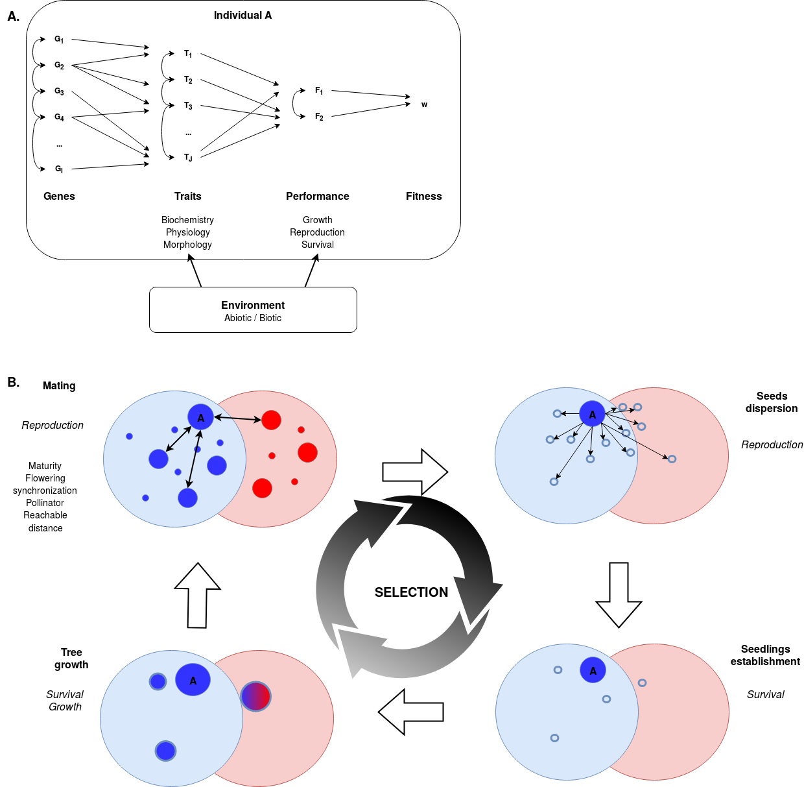

  
Characterizing biological diversity, or so-called biodiversity, and understanding its causes and consequences have been central to the development of ecology and evolution [@Messier2010]. Three simple questions arise from this statement: (1) what is biodiversity, (2) what is the cause of its existence, (3) and what are the consequences of its existence. Characterizing biodiversity is a *sine qua non* condition to embrace the two following questions. Once the biodiversity is characterised we can study its causes. But biodiversity is dynamic, so we can study its origin, maintenance, and future, or more generally how it evolves. Once biodiversity is characterised, we can also study consequences of its existence. But this is a different question which will not be addressed here despite a huge litterature around the question [@Cardinale2012; @diaz_biodiversity_2006; @Liang2016; @Loreau2000; @Naeem2002; @Oliver2015; @Yachi1999].

_**What is biodiversity ?**_

Biodiversity can be divided in three fundamental categories: genetic, species and ecosystem diversity. Ecosystem diversity encompass the range of terrestrial and aquatic environements found on earth classified into ecosystems. Ecosystems encompass both the biological community of interacting organisms and their physical environment. Moreover, species diversity represents species in which are categorized the interacting organisms of the ecosystem. Species have been defined as groups of organims which are reproducing isolated from other such groups, protecting the integrity of their genotypes [@Mayr1996]. This reflects the biological species concept based on reproductive isolation. But species concepts and defintions have been largely debated [@Mayden1997], especially concerning plants, and many species concepts can be defined (phylogenetic, biological, ecological, morphological or genetic, see @DeQueiroz2007). However, indivduals presents variations in performance, phenotypes, and genes within species itself representing genetic diversity.

_**What is the cause of biodiversity existence ?**_

Earth present a lagre amount of terrestrial and marine ecosystems. Among theim, the outstanding biodiversity of coral reefs and tropical rainforests has always fascinated ecologists [@connell_diversity_1978]. At the species level, different theories have been developed to explain the persistence of biodiversity. Niche theory explains species coexistence depending on niche differences to limit competitive exclusion [@Weiher; @lortie_rethinking_2004-1], while neutral theory shows that maintenance of high diversity is possible even for functionally equivalent species, because of stochastic life, death, reproduction and dispersal dynamics [@Hubbell2001]. But numerous theories exists [@wright2002plant]. Still, theories often ignore genetic biodiversity represented by intraspecific variability arising from indivdual diversity inside populations and communities. Yet, numerous studies have shown that (i) intraspecific variation is high [@Messier2010; @Vieilledent2010], (ii) intraspecific variation play an important role at population and community level [@Albert2010; @Albert2011a; @Albert2015; @Messier2010], (iii) intraspecific variation can answer paradox in theories of species coexistence [@Laughlin2012], and (iv) intraspecific variation is needed to understand maintenance of species coexistence [@chave_neutral_2004; @Chesson2000a; @Clark2007; @Clark2010; @Violle2012] and therefore is one of the causes of biodiversity existence.

Consequently, we want to include genetic diversity through a bottom-up study starting from indivdual to population instead of classical top-down studies going from communities to species and sometimes until individuals. Because interactions with the biotic and abiotic environement are ultimately based at the level of individuals, we want to discuss eco-evolutionary theories starting with individuals [@Violle2012]. We thus wish to discuss individual level diversity through ecology and evolution to participate to the question of biodiversity characteristics and causes. We want to use an integrative and dynamic model of the individual functionement in interaction with its population and environment through time coupled with a litterature review to explore this question.

# Model 1 description

If we a consider an individual tree *A* (see figure \@ref(fig:model)A). *A* is constituted of a genome with different genes ($G_1,...G_I$). Genes are expressed and result in phenotypic or functional traits ($T_1,...T_J$) among biochemistry, physiolgy and morphology. All functional traits finally influence integrative traits represented by performance traits ($F_1,...F_K$) which directly plays on individual fitness ($w$). But all those step resulting in individual fitness through genes, traits and performance are influenced by their local environment, either biotic or abiotic. 

Now if we consider the same individual *A* inside its environment and its population (see figure \@ref(fig:model)B) with the environment presenting two habitats (blue and red), and the population two genotypes associated to each habitat (blue and red). Once the indivdual will have reached maturity to reproduce, the first step will be mating. Mating will happen between individuals through pollen, in the limit of reproductive barriers, with sometimes mating between different genotypes (blue and red individuals). After mating, individuals will disperse seeds, which will established or not in the two habitats. Finally, once established, trees will grow until maturity to mate again and reproduce, closing the cycle. The whole cycle through reproduction, survival and growth performance traits will be the core of selection on individual fitness responsible of evolution of our population.

```{r model1, fig.height=10, fig.width=10, fig.cap='Model of individual functionement in interaction with its population and environment through time. *See model description paragraphs for more explanation.*'}
# 
```

## Genes

* Genetic local adaptation arise from new mutations, standing genetic variation and adaptive introgression [@Tigano2016].
* Genome to transcriptome and traits ? Effect of ontogeny ? Effect of envrionment ?
* Transcripts will result in molecules forming biochemistrial traits of the individual.

## Traits

* Traits variability will be shaped by: (i) genetic heritage, (ii) environment, (ii) ontogeny and (iv) random
* Basic functional traits resulting from transcript expression can be considered as primary traits. Interactions in individuals biochemistrial traits will then be the basis for individual physiological and morphological traits.
* Tropical tree genetic diversity [@Scotti2016] in combination to the environement results in phenotypic variability [@Albert2015] and ultimately to *in situ* performance differences [@Bec2015].
* Phenotypic plasticity can be reversible, also called phenotypic flexibility, or irreversible, also called development plasticity [@Turcotte2016].
* Phenotypic plasiticy can play on morphology, physiology, phenology, and ontgeny [@Turcotte2016].

## Performance and fitness

* Perfomance traits are growth, reproduction and survival. Fitness (**define fitness**) of the individual will then result in the balance of those three performance traits (**add example of opposite trade-offs**).

## Environment

* Local environment is both abiotic (nutrients, water, light...) and biotic (competition, predation)
* *On which level(s) is interacting the environment ?*

## Mating

* A first pre-zygotic barrier happens with all limits to individuals mating: (i) individuals maturity, (ii) flowering synchronization between individuals, (iii) common pollinator if needed, and (iv) distance reachability.
* Mating can happen between individuals of close but different species [@Cannon2015] resulting in the mating between the two genotypes in figure 1B.
* Tropical tree have great size, long life time, numerous seeds, large effective population size [@Brown2004], outcrossing mating system and and maintain a strong gene flow [@Hamrick1992; @Nybom2004]. Thus, neutral processes maintain tree diversity over time by connecting populations with high gene flow and large effective population, while adaptive processes lead to local adaptation on short times with an expected genetic differentiation at the loci underlying heritable traits [@Howe2003; @LeCorre2003].

## Seeds dispersion and establishment

* Seeds dispersal and establishment are related to individual reproduction and survival performance capacities.
* Seeds establishment will be limited by abiotic environment through environmental filtering, but we can imagine an hybrid due to mating with the second ecotype to established in the second ecotype thanks to genetic introgression.
* Seeds establishment will be limited by biotic environment through the Jansen-Conell hypothesis.

## Tree growth and survival

## Conclusion: Performance & Selection

* Interaction between Performance (Ecology) and Selection (Evolution) through fitness
* Directional and balanced selection ?
* Selection is driving speciation.
* Before true phylogenetic species can be defined, populations can diverge into ecotypes due to local adaptation. At this stage of ecotypes, gene flow maintains adaptive polymorphisms inside the whole population [@Tigano2016]. 
* When populations face a reproductive barrier, they will still largely share genetic variation due to the often large effective population size of the common ancestor, and potentially, due to hybridization between the incipient species. These incipient species can thus be qualified as species complex. At this stage of species complex, gene flow between incipient species can increase standing genetic variation favouring divergent selection, resulting in differential niche adaptation [@Tigano2016]. 
* True phylogenetic species will exists where gene flow can still be responsible of adaptive introgression through hybrids in secondary contact, allowing species to share genetic polymorphisms or adaptations [@Lindtke2013].

# Model 2 description

Indivduals presents variations in performance, phenotypes, and genes within species itself representing intraspecific variability. So we can first consider independently each space independently: (i) genes space, (ii) traits space, and (iii) performances space. For schematic purposes we will consider only two axes of each space in the followings (see figure \@ref(fig:model)), besides each space posses obviously much more axis. 

```{r model2, fig.height=10, fig.width=10, fig.cap='Caption. *Details.*'}
knitr::include_graphics("./images/PhD4.jpg")
```

## Genes

Genes space is constituted of all loci with all polymorphisms. Each loci is constituting a gene space axis. But all polymorphims and moreover all polymorhisms association are not viable for individuals, constituting a first filter. So if we consider only vaible loci assoiations we obtain the possible genes space. Then, a pre-zygotic barrier happens with all limits to individuals mating: (i) individuals maturity, (ii) flowering synchronization between individuals, (iii) common pollinator if needed, and (iv) distance reachability. This reproduction limitation is combined with envioronmental filtering preventing seedlings establishment and survival. After this filter, we finally obtain the population gene space within the environment, excluding epigenetic considerations.

## Traits

Traits space is constituted of all functional traits (biochemistry, phisolgy or morphology) with all existing values. But all traits associations are not possible because of traits covariations and trade-offs, constituting a first traits filter. Considering trade-offs, we thus obtain possible traits space. Then population gene space within the environment is also limiting available traits, constituting a second filter. Gene space restriction are responsible for the potential traits space. Finally, phenotypic plasiticity allow for traits to adapt to their environment, creating a new filter on trait space, resulting in the expressed traits space. Lastly, during whole tree life time, performances space will directly influence and filter expressed traits space.

## Performances

Performances space is constituted of all performance variables, trees growth, reproduction and survival, with all possible values. But all performances association are not possible because of trade-offs, constituting a first performances filter, resulting in the possible performances space. Then, potential traits space, depending on gene possibilities itself, is limiting performances possibilites, constituting a new filter resulting in potential performances space. Next, population performances will be regulated by their environment, rconsituting the environmental filtering, resulting in expressed performances spaces. Finally, besides performances influence traits, expressed traits space is also filtering expressed performances space in a retroaction loop for the whole individual life time. Performances are ultimately responsible for individuals reproduction, through survival and growth. Thus, performancesare also have feedback on population gene space within the environment, resulting in population evolution.

# Model 3

# Performance

Considering tree species, and moreover tropical trees, literature seems to relate performance to growth, survival and sometimes reproduction [@Baraloto2005; @Poorter2006; @Roman-Danobeytia2012; @violle_let_2007]. Each of them might be related to an indicator, as relative growth rate (RGR) or annual growth rate (AGR) for growth [@Baraloto2005; @Herault2010; @Osazuwa-Peters2017], mortality rate for survival [@Osazuwa-Peters2017], and ? for reproduction. Some indicators stand at the individual level if we want to assess individual performance, as annual growth rate (AGR) for growth, but other are more tricky, as mortality rate for survival. Indeed survival rate has been shown to be related to annual growth rate representing vitality and diameter at breast height representing ontogeny [@Buchman1983]. Anyway, trade-off exists between performance component. Indeed, tropical trees has been shown to present a trade-off between growth and survival through the so-called growth-mortality trade-off [@Wright2010]. Conseuqently, one might explore tropcail tree individual performance through few components relating them to other with trade-offs. More particularly in our case, if we want to look at individual performance among tropical trees 

# Litterature review

*Litterature review is only here as a work in progress and will be integrated to the previous text structure.*

## TO CLASSIFY

* "The concept of dynamic species pools is underappreciated in community assembly." [@Mittelbach2015a]

* "Community mean height, leaf area, and SLA increased in response to fertilization, and these shifts were driven almost entirely by intraspecific variation." [@Siefert2016]

* "Trait shifts due to species turnover were generally weak and opposed intraspecific responses." [@Siefert2016]

* "These results highlight the importance of intraspecific variation for short-term community functional responses" [@Siefert2016]

* "However, when intraspecific variation is heritable, allowing for the possibility of trait evolution, communities are much more resilient against environmental disturbance and exhibit far more predictable trait patterns." [@Barabas2016]

* "no study fully traces the pathway of causality from trait change to competitive outcomes" [@Turcotte2016]

* "Further progress on both the empirical and theoretical front should culminate in a more general integration of plasticity, intraspecific variation, and rapid evolution into community ecology." [@Turcotte2016]

## Advocate for individual level

* "a much needed demonstration of the pivotal role of intraspecific variability in ecology" [@chave_neutral_2004]

* "Site and individual variability are typically ignored when considering crown size and light interception by trees, and residual variability is relegated to a residual error term, which is then ignored when studying ecological processes." [@Vieilledent2010]

* "Because interactions with the biotic and abiotic environment are ultimately based at the level of the individual, it makes sense to build a theory of community ecology starting with individuals." [@Violle2012]

* "Our findings suggest that intraspecific trait variability promotes species coexistence, by enabling species to pass through both abiotic and biotic filters. " [cite Jung et al, 2010]

## Theory

* @Chesson2000a suggested two diversity maintenance mechanisms, the second being the stabilizing mechanisms: "if negative intraspecific interactions tend to be greater than intraspecific interactions"

* "Variation among individuals within populations allows species to differ in their distributions of responses to the environment despite the fact that the populations to which they belong do not differ on average" [@Clark2010]

* "Consistent with theory predicting that coexistence depends on competition being stronger within than between species" [@Clark2010]

* "Just a variation among individuals is required to maintain species by natural selection, providing a means for adaptive evolution in response to many factors ... explaining why large number of intensely competitive species coexist" [@Clark2010]

* "Traitspace can test for the effects of limiting similarity by explicitly incorporating intraspecific trait variation." [cite Laughlin et Laughlin, 2013]

* "We may expect long-lived (i.e. woody) species to have high onto- genetic variation and express strong phenotypic plasticity to face environmental hazards over their lifetimes, leading to high ITV (Sultan 1987; Borges 2009)."

* "Previous work suggests that ITV should be most important in species-poor
communities (e.g. MacArthur 1972; Antonovics 1992; Whi-tham et al. 2006), and niche theory predicts that the relative extent of ITV should decrease with increasing species richness (Violle et al. 2012). However, few studies have empirically examined this relationship in plant communities, and these have produced conflicting results (Hulshof et al. 2013; Le Bagousse-Pinguet et al. 2014)."

## Observation

* "individual variability accounted for a large part of the variation in allometric relations" [@Vieilledent2010]

* "A global meta-analysis of the relative extent of intraspecific trait variation in plant communities" [@Siefert2015a]

* "Over- all, ITV accounted for 25% of the total trait variation within communities and 32% of the total trait variation among communities on average." [@Siefert2015a]

* "Hulshof & Swenson (2010), partitioning varia- tion in four leaf traits in a tropical forest in Costa Rica, found that ITV ranged from 36 to 83% of total trait variance." [@Siefert2015a]

## Phenotypic plasticity

* "The phenotypic plasticity of species in response to light and space availability suggests that intraspecific variability can have potential consequences on light interception and community dynamics." [@Vieilledent2010]

* "For many traits, much of this variation (intraspecific variability) is caused by phenotypic plasticity." [@Turcotte2016]

* "Plants experiencing herbivory can produce progenies that have higher induced resistances" [cite Agrawal, 2002]

## References
