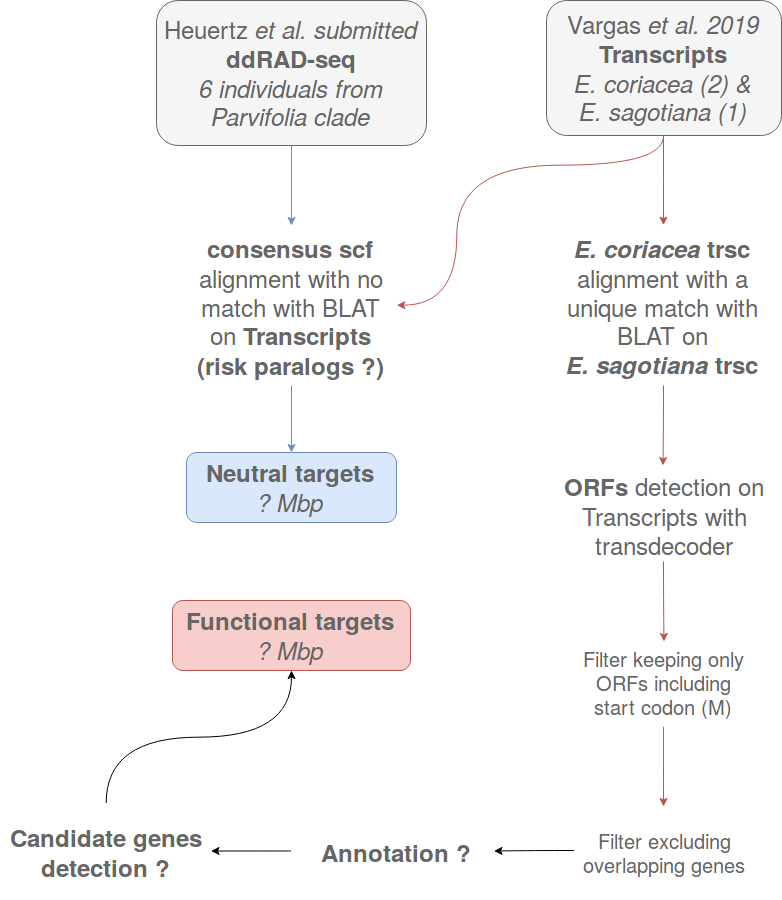

```{r setup_intro, include=FALSE}
rm(list = ls()) ; invisible(gc()) ; set.seed(42)
library(tidyverse)
```

# Introduction {-}

This document review and summarize sequence capture and genomic analysis of *Eschweilera* clade *Parvifolia*.

## Modus operandi

We will proceed sequence capture and genomic analysis of *Eschweilera* clade *Parvifolia* with following steps:

- [ ] Select sequence to be captured
- [ ] Extract DNA
- [ ] Choose genomic sampling strategy (capture vs SPET)
- [ ] Raw data analysis
    - [ ] Genome by Sequencing (GbS)
    - [ ] Reads mapping
    - [ ] SNP call
    - [ ] SNP filtering
- [ ] Genetic data analysis
    - [ ] Genetic structure of populations
    - [ ] Genomic structure of polymorphisms
    - [ ] Ecological genomic (genotype-environment association)
    - [ ] Assocaition genomic (genotype-phenotype association)

## Sequence selection

Selection of target sequences is based on following scheme \@ref(fig:targets):

```{r targets, fig.cap="Schemes of selection of target sequences.", echo=F}

```
