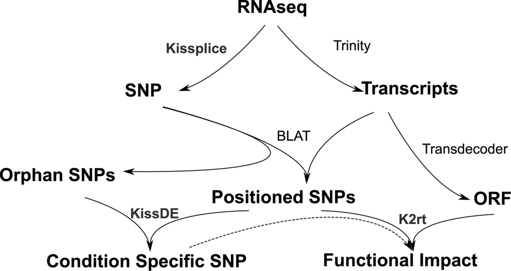
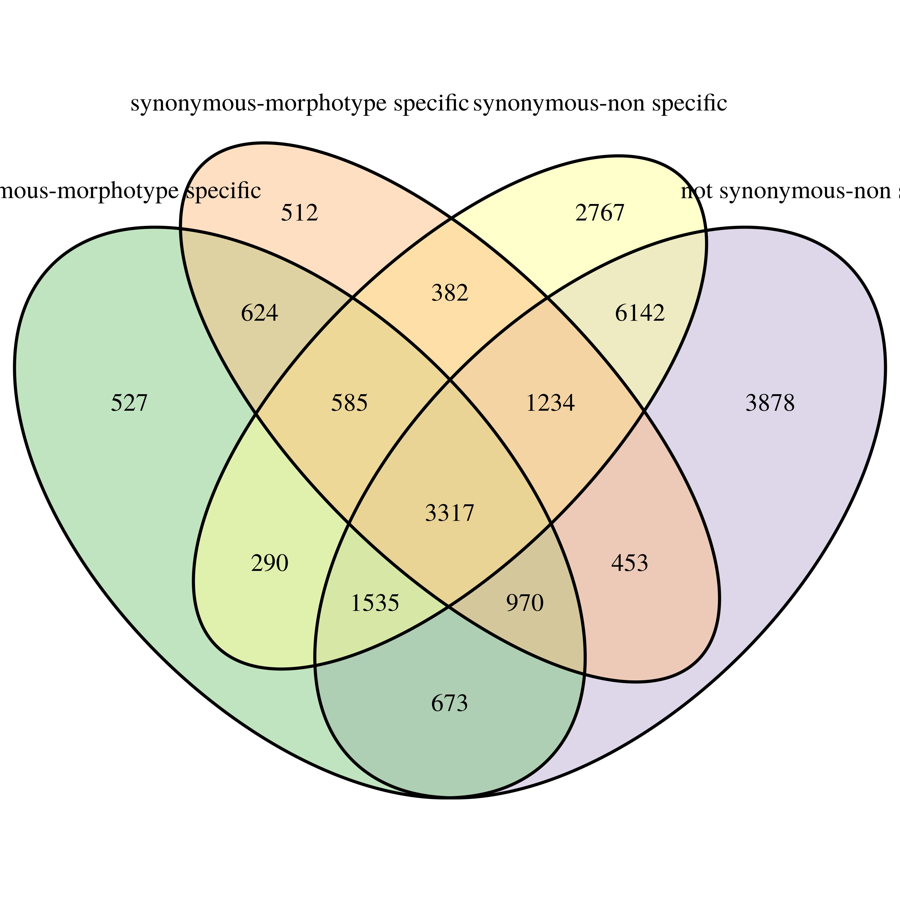
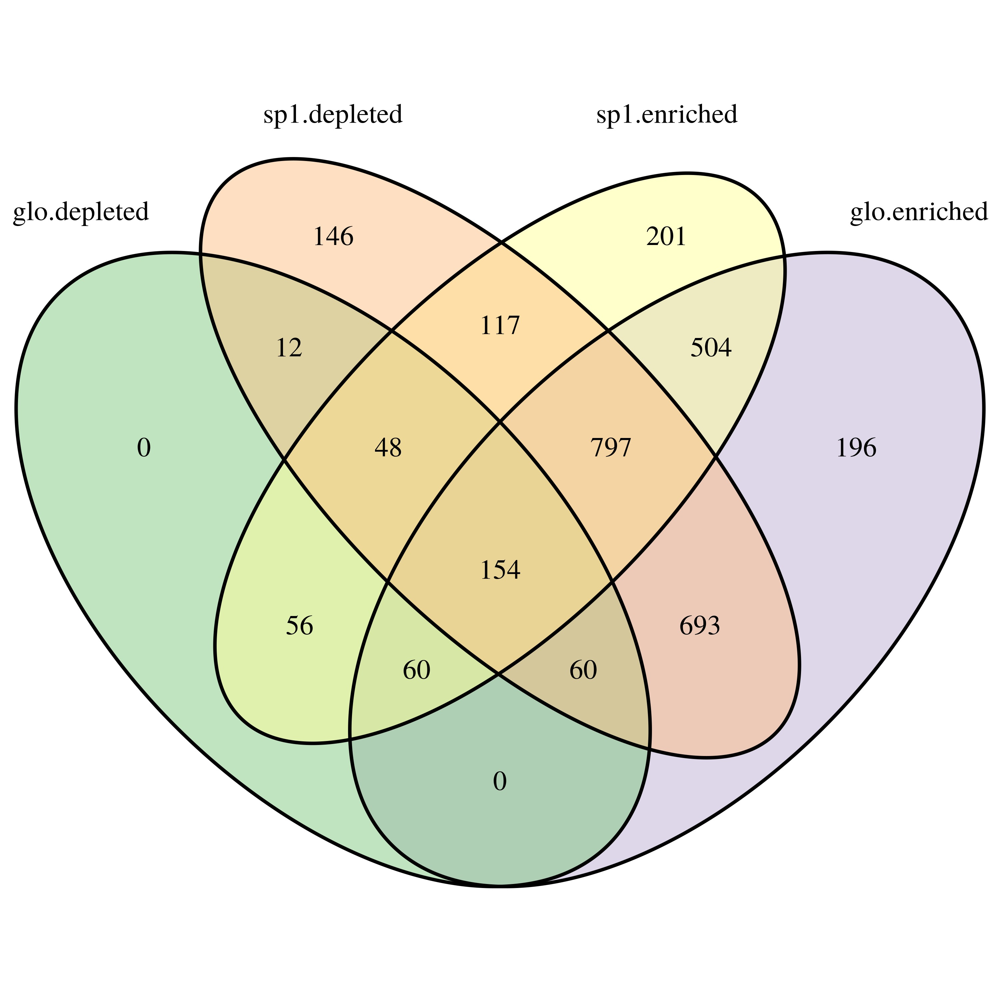

```{r setup, include=FALSE}
library(knitr)
library(Biostrings)
library(tidyverse)
theme_set(bayesplot::theme_default())
opts_chunk$set(echo = F, eval = T, cache = T, 
               warnings = F, message = F, fig.height = 5)
path <- "~/Documents/BIOGECO/PhD/data/Symphonia_Niklas/k2rt"
```

# Introduction

## Probes ?

- Choose kit (MyBaits ?, NEBnext ?)
- Total sequence length ?
- Number of sequences ?
- Sequences depth (O.5-1 kbp ?) ?
- Probes overlap ?

## Sequences selection

* From transcriptome (Tysklind et al)
* From genome (Olsson et al, Scotti et al, Torroba-Balmori et al)
* From chloroplast (Bautista and Claro, NCBI)

## Next steps

- Design probes (software with the kit)
- Extract DNA
- Raw data analysis
- Genetic structure of populations
- Genomic structure of polymorphisms
- Ecological genomic (genotype-environment association)
- Association genomic (genotype-phenotype association)

## Sequences type ?

<!-- [graph](file:///home/sylvain/Documents/BIOGECO/PhD/documents/Symphonia/probes/_book/introduction.html#sequence-selection) -->

```{r planCapture, fig.cap = "Sequences to be captured.", echo=FALSE}
data.frame(
  category = c("CDS-MtSpecific", "CDS-NonSpecific", "Neutral-Neutral", "Chloroplast-Chloroplast"),
  size = c(40, 20, 30, 10)
) %>% 
  sunburstR::sunburst()
```

# Transcriptomic data

## Introduction



## SNPs

<!-- [graph](file:///home/sylvain/Documents/BIOGECO/PhD/documents/Symphonia/probes/_book/transcriptomic-data.html#snps) -->

```{r count_SNP}
data <- read_delim(file.path(path, "symphonia_juv_fullsample_trinity500_k2rt_type_0a_mainOutput.tsv"),
           delim = "\t")
count_SNP <- data %>% 
  filter(Possible_sequencing_error != "True") %>% 
  select(Is_in_CDS, Is_not_synonymous, Is_condition_specific) %>% 
  group_by(Is_in_CDS, Is_not_synonymous, Is_condition_specific) %>% 
  summarize(n = n()) 
rm(data) ; invisible(gc())
```

```{r sunburstcount, fig.cap = "SNPs headcount for Symphonia juveniles by types. Levels precise if the SNP is in a coding region, synonymous and finally morphotype-specific."}
count_SNP %>% 
  ungroup() %>%
  mutate(type = ifelse(Is_in_CDS == "False" & Is_not_synonymous == "N/A", 
                       "UTR-UTR-", NA)) %>% 
  mutate(type = ifelse(Is_in_CDS == "True" & Is_not_synonymous == "False", 
                       "CDS-synonymous-", type)) %>% 
  mutate(type = ifelse(Is_in_CDS == "True" & Is_not_synonymous == "True", 
                       "CDS-not synonymous-", type)) %>% 
  filter(!is.na(type)) %>% 
  mutate(Is_condition_specific = ifelse(Is_condition_specific == "False",
                                        "non specific", "morphotype specific")) %>% 
  mutate(type = paste0(type,Is_condition_specific)) %>% 
  select(type, n) %>% 
  sunburstR::sunburst(count = T)
```

## Genes - Total

* __2 398 550__ SNPs
* __257 140__ transcripts (including pseudo-genes isoforms)
* __76 032__ candidate genes 

```{r genes, include=FALSE}
snp <- read_delim(file.path(path, "symphonia_juv_fullsample_trinity500_k2rt_type_0a_mainOutput.tsv"),
           delim = "\t") %>% 
  filter(Possible_sequencing_error != "True") %>% 
  dplyr::rename(transcript_id = `#Component_ID`, snp_id = SNP_ID)

transcript <- src_sqlite(file.path("~/Documents/BIOGECO/PhD/data/Symphonia_Niklas/Trinotate/",
                           "symphonia.trinity500.trinotate.sqlite")) %>% 
  tbl("Transcript") %>% 
  collect()

data <- snp %>% 
  left_join(transcript) %>% 
  mutate(width = nchar(sequence)) %>% 
  mutate(type = ifelse(Is_in_CDS == "False" & Is_not_synonymous == "N/A", 
                       "UTR-UTR-", NA)) %>% 
  mutate(type = ifelse(Is_in_CDS == "True" & Is_not_synonymous == "False", 
                       "CDS-Syn-", type)) %>% 
  mutate(type = ifelse(Is_in_CDS == "True" & Is_not_synonymous == "True", 
                       "CDS-non Syn-", type)) %>% 
  filter(!is.na(type)) %>% 
  mutate(Is_condition_specific = ifelse(Is_condition_specific == "False",
                                        "non Spec", "mt Spec")) %>% 
  mutate(type = paste0(type,Is_condition_specific))

snp_genes <- data %>% 
  group_by(gene_id) %>% 
  summarize(n_snp = n(), width = mean(width)) %>% 
  arrange(desc(n_snp))

rm(snp, transcript, data, data2, g) ; invisible(gc())
```

## Genes - Width

```{r snpGenes, fig.cap="Number of SNP by gene width. Blue and red lines represent respectivelly a frequency of 1 SNP per 100 and 10 bp.", warning=FALSE}
snp_genes %>%
  ggplot(aes(width, n_snp)) +
  geom_point() +
  xlab("candidate gene mean width (bp)") +
  ylab("number of SNPs") +
  ylim(c(NA,1500)) +
  geom_abline(slope = 0.1, col = "red") +
  geom_abline(slope = 0.01, col = "blue")
rm(snp_genes)
```

## Genes - CDS

```{r genesVenCDS, fig.cap="Genes having SNPs in CDS, UTR or both.", fig.height=4}
include_graphics("../probes_data/genesVenCDS.jpg")
```

## Genes - SNPs type

```{r genesVen, fig.cap="Genes distribution depending on the type of their SNPs. Gene including SNP with coding DNA sequences (CDS), functional synonymy, or morphtype specificity.", fig.height=4}

```

## GO - Width

```{r GO}
snp <- read_delim(file.path(path, "symphonia_juv_fullsample_trinity500_k2rt_type_0a_mainOutput.tsv"),
           delim = "\t") %>% 
  filter(Possible_sequencing_error != "True") %>% 
  dplyr::rename(transcript_id = `#Component_ID`, snp_id = SNP_ID)

transcript <- src_sqlite(file.path("~/Documents/BIOGECO/PhD/data/Symphonia_Niklas/Trinotate/",
                           "symphonia.trinity500.trinotate.sqlite")) %>% 
  tbl("Transcript") %>% 
  collect() %>%  
  separate_rows(annotation, sep = '\t') %>% 
  filter(grepl("GO:", annotation)) %>% 
  separate_rows(annotation, sep = '`') %>% 
  separate(annotation, sep = "\\^",
           into = c("go_id", "go_namespace", "go_name"))

data <- snp %>% 
  left_join(transcript) %>% 
  mutate(width = nchar(sequence)) %>% 
  mutate(type = ifelse(Is_in_CDS == "False" & Is_not_synonymous == "N/A", 
                       "UTR-UTR-", NA)) %>% 
  mutate(type = ifelse(Is_in_CDS == "True" & Is_not_synonymous == "False", 
                       "CDS-Syn-", type)) %>% 
  mutate(type = ifelse(Is_in_CDS == "True" & Is_not_synonymous == "True", 
                       "CDS-non Syn-", type)) %>% 
  filter(!is.na(type)) %>% 
  mutate(Is_condition_specific = ifelse(Is_condition_specific == "False",
                                        "non Spec", "mt Spec")) %>% 
  mutate(type = paste0(type,Is_condition_specific)) %>% 
  filter(type != "UTR-UTR-mt Spec") %>% 
  filter(type != "UTR-UTR-non Spec") %>% 
  mutate(type = gsub("CDS-", "", type)) %>% 
  filter(gene_id %in% Reduce(intersect, split(.$gene_id, .$type)))

OE <- sapply(list.files("~/Documents/BIOGECO/PhD/data/Symphonia_Niklas/GO_term_enrichment/",
                        full.names = T), read_tsv, simplify = F) %>%
  bind_rows(.id = "id") %>% 
  mutate(id = gsub("/home/sylvain/Documents/BIOGECO/PhD/data/Symphonia_Niklas/GO_term_enrichment//OE_",
                  "", id)) %>% 
  mutate(id = gsub(".GOseq", "", id)) %>% 
  mutate(id = gsub(".tsv", "", id))

data <- data %>% 
  inner_join(OE, by = c("go_id" = "category"))

goe_gene <- data %>% 
  select(gene_id, width, id, go_id) %>% 
  unique() %>% 
  group_by(gene_id, id) %>% 
  summarize(n_go = n(), width = mean(width)) %>% 
  arrange(desc(n_go)) %>% 
  dplyr::rename(goe = id) %>% 
  mutate(goe = gsub("glo", "globulifera", goe)) %>% 
  mutate(goe = gsub(".", " ", goe, fixed = T)) %>% 
  mutate(goe = paste("S.", goe))

rm(snp, transcript, OE, data) ; invisible(gc())
```

```{r goeGenes, fig.cap="Number of GO term by candidate gene width. Graph are facetted by enrichment or depletion by morphotype. This graph include the 5 403 candidate genes which represents all type of SNPs."}
goe_gene %>%
  ggplot(aes(width, n_go)) +
  geom_point() +
  xlab("candidate gene mean width (bp)") +
  ylab("number of GO terms") +
  facet_wrap(~goe, scales = "free") +
  
rm(goe_gene)
```

## GO - Types

```{r enrichedGO, fig.cap="Candidate genes distribution depending on their GO term enrichment. This graph include the 5 403 candidate genes which represents all type of SNPs."}

```

# Genomic data

## Introduction

* The African genome scaffolds from @Olsson2017
* The Guianan scaffolds from Scotti *et al (in prep)*
* The Guianan sequences from Torroba-Balmor *et al (unpublished)*

## Scaffolds from Scotti *et al (in prep)* - Steps

* Filtering (0.5 or 1 kbp minimum)
* Renaming
* Merging (`quickmerge`)
* Blast (consensus sequences from Torroba-Balmor *et al (unpublished)*)
* Align (`bwa` with raw read from  Torroba-Balmor *et al (unpublished)*)

## Scaffolds from @Olsson2017 - Steps

* Renaming
* Blast (consensus sequences from Torroba-Balmor *et al (unpublished)*)
* Align (`bwa` with raw read from  Torroba-Balmor *et al (unpublished)*)
* Overlap (`quickmerge` on merged scaffolds from Scotti *et al (in prep)*)

## Scaffolds from @Olsson2017 - Blast

```{r blastResultOlssonFig, fig.cap="Number of match with Torroba consensus reads vs gene width.", fig.height=4, warning=F}
path <- "~/Documents/BIOGECO/PhD/data/Symphonia_Genomes/"
blast <- read_tsv(file.path(path, "Olsson_2016", "blast_consensus_torroba.txt"), col_names = F)
names(blast) <- c("Read", "Scaffold", "Perc_Ident", "Alignment_length", "Mismatches",
                  "Gap_openings", "R_start", "R_end", "S_start", "S_end", "E", "Bits")
scf <- readDNAStringSet(file.path(path, "Olsson_2016", "selected_scaffolds_blast_consensus.fa"))
blast %>%
  dplyr::left_join(data.frame(Scaffold = names(scf), width = width(scf))) %>% 
  select(Scaffold, Read, width) %>%
  unique() %>%
  group_by(Scaffold, width) %>%
  summarise(n = n()) %>% 
  ggplot(aes(width, n)) +
  geom_point() +
  geom_jitter() +
  ylab("Number of match with consensus sequences from Torroba-Balmori et al (unpublished)") +
  xlab("Width of scaffolds from 0lsson et al. (2017) (in bp)")
```

# Chloroplastic data

## MIA assemblage

```{r chloroRef, fig.cap="Result from anotation of 14 scaffolds from chloroplastic genom from *Symphonia globulifera* witg cpGAVAS (Rocio Bautista and M. Gonzalo Claros)"}
include_graphics("/home/sylvain/Documents/BIOGECO/PhD/data/Symphonia_Genomes/Chloroplast_Africa/Final_Result/Annotacion/annotation_Chloroplast_Symphonia_scaffolds.png")
```

## American sequences on NCBI

* PopSet = 261864032 [@Kress2009]
* PopSet = 1139718125 (Caron,H., Molino,J.-F., Sabatier,D., Leger,P., Chaumeil,P., Scotti Saintagne,C., Frigerio,J.-M., Scotti,I., Franc,A. and Petit,R.J. Pervasive introgression in a tropical tree community)
* PopSet = 261279143 [@Kress2009]
* PopSet = 224986824 [@Gonzalez2009]
* PopSet = 263042640 [@Gonzalez2009]
* PopSet = 194410525 [@Dick2008]

## Blast - Barplot

```{r blastChloroResult, fig.cap="Number of sequences matching reference gene (total of 170 sequences blasted).", fig.height=4}
path <- "~/Documents/BIOGECO/PhD/data/Symphonia_Genomes/"
blast <- read_tsv(file.path(path, "NCBI", "blast_result.txt"),
                  col_names = F)
names(blast) <- c("Seq", "Gene", "Perc_Ident", "Alignment_length", "Mismatches",
                  "Gap_openings", "R_start", "R_end", "S_start", "S_end", "E", "Bits")
blast %>% 
  group_by(Gene) %>% 
  summarise(n = n()) %>% 
  ggplot(aes(Gene, n)) +
  geom_bar(stat = "identity")
```

## Blast - Table

```{r blastChloroResult2}
db <- readDNAStringSet(file.path(path, "NCBI", "chloroplast_db", "chloroplast.fa"))
db[unique(blast$Gene),] %>% 
  data.frame(Gene = names(.), Width = width(.)) %>% 
  select(Gene, Width) %>% 
  kable(row.names = F, caption = "Selected genes.")
```

## Additional chloroplastic sequences

- matK
- inter trnT
-rbcL
- psbA
- trnF
- trnL

# Conclusion

## Probes ?

- Choose kit (MyBaits ?, NEBnext ?)
- Total sequence length ?
- Number of sequences ?
- Sequences depth (O.5-1 kbp ?) ?
- Probes overlap ?