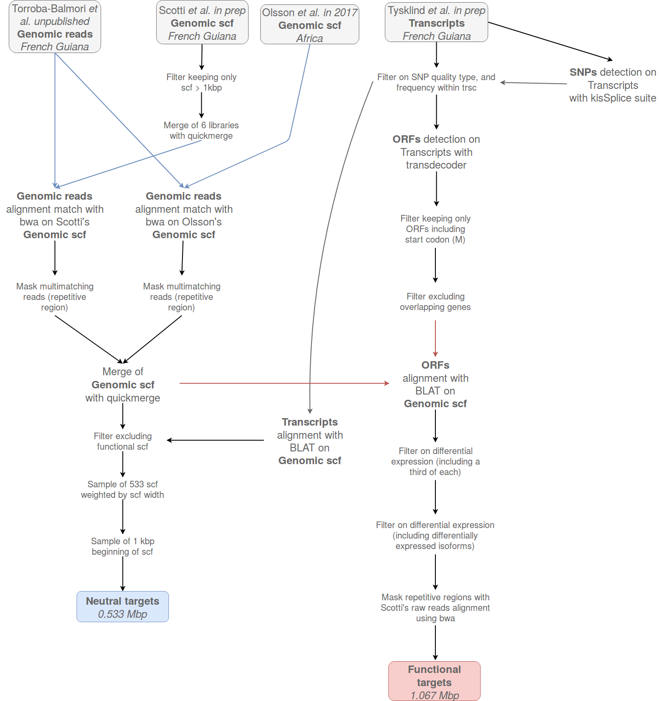

```{r setup_intro, include=FALSE}
rm(list = ls()) ; invisible(gc()) ; set.seed(42)
library(tidyverse)
```

# Introduction {-}

This document review and summarize sequence capture and genomic analysis of *Symphonia globulifera*.

## Modus operandi (to discuss):

We will proceed sequence capture and genomic analysis of *Symphonia globulifera* with following steps:

- [x] Choose kit
- [x] Select sequence to be captured
- [x] Extract DNA
- [ ] Prepare libraries
- [ ] Raw data analysis
    - [ ] Genome by Sequencing (GbS)
    - [ ] Reads mapping
    - [ ] SNP call
    - [ ] SNP filtering
- [ ] Genetic data analysis
    - [ ] Genetic structure of populations
    - [ ] Genomic structure of polymorphisms
    - [ ] Ecological genomic (genotype-environment association)
    - [ ] Assocaition genomic (genotype-phenotype association)

```{r seqTree, fig.cap="Different types in which to choose sequences to capture. CDS stand for Coding DNA sequence and UTR for UnTranscribed Region.", echo=F}
DiagrammeR::DiagrammeR("
   graph TB
   DNA-->Nucleus
   DNA-->Chlorplast
   Nucleus-->Neutral
   Neutral-->Intron
   Neutral-->UTR
   UTR-->Specific
   UTR-->Non_Specific
   Nucleus-->CDS
   CDS-->Synonymous
   CDS-->Non_Synonymous
   Synonymous-->Specific
   Synonymous-->Non_Specific
   Non_Synonymous-->Specific
   Non_Synonymous-->Non_Specific
")
```

## Sequence selection

Selection of target sequences is based on following scheme \@ref(fig:targets):

```{r targets, fig.cap="Schemes of selection of target sequences.", echo=F}

```

## Lexicon

* nuclear gene
* isoform
* scaffold
* transcript
* gene sensu Trinity

