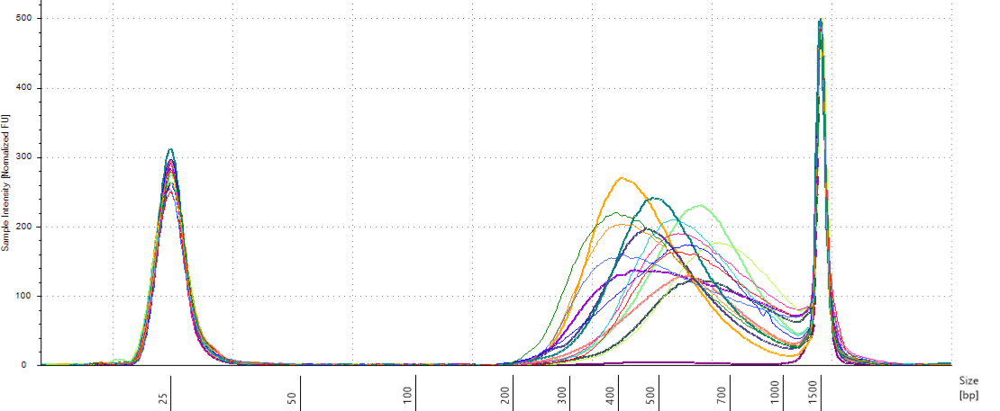

```{r setup_capture, include=FALSE}
rm(list = ls()) ; invisible(gc()) ; set.seed(42)
library(knitr)
library(kableExtra)
if(knitr:::is_html_output()) options(knitr.table.format = "html") 
if(knitr:::is_latex_output()) options(knitr.table.format = "latex") 
library(tidyverse)
library(rstan)
options(mc.cores = parallel::detectCores())
rstan_options(auto_write = T)
theme_set(bayesplot::theme_default())
opts_chunk$set(
  echo = F, message = F, warning = F, fig.height = 6, fig.width = 8,
  cache = T, cache.lazy = F)
path <- "~/Documents/BIOGECO/PhD/data/Symphonia_Paracou/"
```

```{r capture}
library <- googlesheets::gs_title("Symcapture") %>% 
  googlesheets::gs_read("Library")
amplification <- googlesheets::gs_title("Symcapture") %>% 
  googlesheets::gs_read("Amplification")
repetitions <- googlesheets::gs_title("Symcapture") %>% 
  googlesheets::gs_read("Repetitions")
capture <- bind_rows(library %>% 
                         select(ID, Plate_library, Position_library, i5, i7, Concentration_QuantIt) %>% 
                         left_join(amplification %>% 
                                     select(Plate_library, Position_library, Concentration_Amplified)),
                       repetitions %>% 
                         select(ID, Plate_library_1, Position_library_1, i5, i7, Repeated_Extraction) %>% 
                         dplyr::rename(Plate_library = Plate_library_1, Position_library = Position_library_1))
```

# Capture

We will do 16 reactions of gene capture by hybridization. Each reaction can have up to 32 samples. We will proceed as follow:

1. __Amplifcation 1 Plate reorganization__: plates state and volme will be assessed and 6 new plates (P1 to P6) will be build from (i) original libraries (P1-P5), (ii) reamplified libraries (A1-A2), and (iii) extraction and library repeat (P6). In order to do so, P6 will stay unchanged, and new plate 1 to 5 will be either reamplified libraries or original libraries if not reamplified. *Tip: remove unwanted cone from boxes when transfering original P1 to P5 to new ones to work with multi-channel pipette and prepare correspondance table to transfer reamplified plates A1 and A2 to new P1 to P5 plates crossing each line one-by-one.*
1. __DNA dosage 1__: with [PicoGreen](https://www.thermofisher.com/document-connect/document-connect.html?url=https%3A%2F%2Fassets.thermofisher.com%2FTFS-Assets%2FLSG%2Fmanuals%2Fmp07581.pdf&title=UXVhbnQtaVQgUGljb0dyZWVuIGRzRE5BIFJlYWdlbnQgYW5kIEtpdHM), we will assess DNA concentration of each sample with a lader from 5 to 30 $ng.\mu L^{-1}$ in order to correctly dose low concentration samples. *Tip: PicoGreen have to be used before the 26/03 12h or after the 1/04.*
1. __Amplification 2__: Samples that have never been reamplified with a concentration below 1 $ng.\mu L^{-1}$ will be reorganized on a new plate (A3) and reamplified with 8 cycles.
1. __DNA dosage 2__: Re-amplified samples (A3) will be dosed through NanoDrop and other more accurate technology depending on the availability.
1. __Amplifcation 2 and Library Repeat Plates reorganization__: Re-amplified samples (A3) will be redistributed in their original position within library plates, and plates  and 6.2 will be reorganized in a unique plate 6.3 for pools building.
1. __Pool building__:  Pool building will follow plate organization, with re-extracted samples (P6.2) pooled together due to high fragmet size heterogeneity. Pool building must be equimolar and will thus depend on DNA dosage. Because we won't pipette less than 0.5 $\mu L$ of the most concentrated sample of one pool, depending on the concetration of the less concentrated sample, we might need to do dilution.
1. __Purification & Concentration__: AMPure beads will be used to clean pools. We will also use this step to concentrate samples in a smaller volume for the reaction (targeted volume of reaction is [7 $\mu L$ with 100 to 500 $ng$ of DNA](https://arborbiosci.com/wp-content/uploads/2018/04/myBaits-Manual-v4.pdf)).
1. __Size assessment__: Pools fragments size will be assessed with  [TapeStation](https://www.agilent.com/en/promotions/agilent-4200-tapestation-system?gclid=Cj0KCQjwj9LkBRDnARIsAGQ-hUcY74n88A8zk5NB8XdzdlXYtE0IiZF7aUzKr9-RG1duhTQ7_5PoMykaAgByEALw_wcB&gclsrc=aw.ds), in order to check for correct fragment size distribution, and eventuelly further clean library pools.
1. __Size selection ?__:  if size distribution result is not good enough, we will further clean library pools through size selection with a [BluePippin](http://www.sagescience.com/products/bluepippin/). *Info: we thus avoid capture fail with too small fragments but we risk losing libraries.*
1. __Capture__: ...

## Amplifcation 1 Plate reorganization

First amplification plates (A1 and A2) have been redistributed within their original library plates removing previous libraries.

```{r originToKeep, fig.cap="Original libraries to be kept (P1-P5)."}
capture %>% 
  filter(Plate_library != 6) %>% 
  mutate(origin = ifelse(is.na(Concentration_Amplified), "first", "amplified")) %>% 
  mutate(row = substr(Position_library, 1, 1)) %>% 
  mutate(col = substr(Position_library, 2, 3)) %>% 
  ggplot(aes(y = factor(row,levels = rev(LETTERS[1:8])),
             x = factor(col,levels = 1:12))) + 
  geom_point(aes(col = origin), size =6)  +
  geom_text(aes(label = Position_library), size = 2.5, col = "white") +
  facet_wrap(~ Plate_library, ncol = 2, labeller = "label_both") +
  theme_bw() +
  theme(legend.position = c(0.9, 0.1)) +
  labs(x=NULL, y = NULL)
```

```{r amplifiedReorganizationFig, fig.cap="Original position of amplified samples."}
amplification %>% 
  mutate(Plate_library = as.factor(Plate_library)) %>% 
  mutate(row = substr(Position_amplification, 1, 1)) %>% 
  mutate(col = substr(Position_amplification, 2, 3)) %>% 
  ggplot(aes(y = factor(row,levels = rev(LETTERS[1:8])),
             x = factor(col,levels = 1:12))) + 
  geom_point(aes(col = Plate_library), size =6)  +
  geom_text(aes(label = Position_library), size = 2.5, col = "white") +
  facet_wrap(~ Plate_amplification, ncol = 2, labeller = "label_both") +
  theme_bw() +
  labs(x=NULL, y = NULL)
```

```{r amplifiedReorganizationTab, eval=F}
amplification %>% 
  select(Plate_amplification, Position_amplification, Plate_library, Position_library) %>% 
  kable(caption = "Original position of amplified samples.",
        col.names = c("Plate amplification", "Position amplification",
                      "Plate library", "Position library"),
        format = "pandoc", escape = F) %>% 
  kable_styling(full_width = F)
```

## DNA dosage 1

Samples concentration has been assessed by PicoGreen with ca 60 samples having a concentration below $1 ng.\mu L^{-1}$ among which 50 have not been reamplified (34 among original libraries, and the rest among repeated libraries or extractions). Those samples will be reamplified.

```{r PicoGreen, fig.cap="Sampled dosage by PicoGreen (concetration in ng.uL)."}
picogreen1 <- read_csv(file.path(path, "QuantIt", 
                   "SYMCAPTURE_25032019_PicoGreen_fluo.csv"), skip = 52)[2:4] %>% 
  dplyr::rename(position = Well, fluo = `dosage_fluo_384_CB:485,520`) %>% 
  dplyr::select(position, fluo) %>% 
  filter(!is.na(fluo)) %>% 
  left_join(read_csv(file.path(path, "QuantIt", 
                               "SYMCAPTURE_25032019_PicoGreen_plates.csv"),  skip = 36) %>% 
              dplyr::rename(row = X1) %>% 
              reshape2::melt(id.vars = "row", variable.name = "col", value.name = "library") %>% 
              mutate(position = paste0(row, col)) %>% 
              select(position, library)) %>% 
  separate(library, c("Plate_library", "Position_library"), "_") %>% 
  mutate(Plate_library = as.numeric(gsub("P", "", Plate_library))) %>% 
  select(Plate_library, Position_library, fluo) %>% 
  arrange(Plate_library, Position_library) %>% 
  left_join(data.frame(Plate_library = 0,
                       Position_library = as.vector(sapply(1:6, function(x) paste0(LETTERS[1:4], x))),
                       concentration = rep(c(0, 5, 10, 20, 25, 40), each = 4)))
data1 <- filter(picogreen1, Plate_library == 0)
picogreen1 <- picogreen1 %>% 
  mutate(concentration_est = lm(concentration ~ fluo, data = data1)$coefficients[2]*fluo)
picogreen2 <- read_csv(file.path(path, "QuantIt", 
                   "SYMCAPTURE_26032019_PicoGreen_fluo.csv"), skip = 52)[2:4] %>% 
  dplyr::rename(position = Well, fluo = `dosage_fluo_384_CB:485,520`) %>% 
  dplyr::select(position, fluo) %>% 
  filter(!is.na(fluo)) %>% 
  left_join(read_csv(file.path(path, "QuantIt", 
                               "SYMCAPTURE_26032019_PicoGreen_plates.csv"),  skip = 36) %>% 
              dplyr::rename(row = X1) %>% 
              reshape2::melt(id.vars = "row", variable.name = "col", value.name = "library") %>% 
              mutate(position = paste0(row, col)) %>% 
              select(position, library)) %>% 
  separate(library, c("Plate_library", "Position_library"), "_") %>% 
  mutate(Plate_library = as.numeric(gsub("P", "", Plate_library))) %>% 
  select(Plate_library, Position_library, fluo) %>% 
  arrange(Plate_library, Position_library) %>% 
  left_join(data.frame(Plate_library = 0,
                       Position_library = as.vector(sapply(1:6, function(x) paste0(LETTERS[1:4], x))),
                       concentration = rep(c(0, 5, 10, 20, 25, 40), each = 4))) %>% 
  filter(!is.na(Plate_library))
data2 <- filter(picogreen2, Plate_library == 0)
picogreen2 <- picogreen2 %>% 
  mutate(concentration_est = lm(concentration ~ fluo, data = data2)$coefficients[2]*fluo)
picogreen <- picogreen1 %>% 
  bind_rows(picogreen2) %>% 
  filter(Plate_library != 0) %>% 
  select(-concentration) %>% 
  dplyr::rename(concentration = concentration_est)
rm(picogreen1, picogreen2)
picogreen %>% 
  filter(Plate_library != 0) %>% 
  mutate(row = substr(Position_library, 1, 1)) %>% 
  mutate(col = substr(Position_library, 2, 3)) %>% 
  ggplot(aes(y = factor(row,levels = rev(LETTERS[1:8])),
             x = factor(col,levels = 1:12))) + 
  geom_point(aes(col = round(concentration)), size =6)  +
  geom_text(aes(label = round(concentration)), size = 2.5, col = "white") +
  facet_wrap(~ Plate_library, ncol = 2, labeller = "label_both") +
  theme_bw() +
  labs(x=NULL, y = NULL) +
  theme(legend.position = c(0.9, 0.1))
```

```{r secondAmplification, fig.cap="Samples to be re-amplified."}
picogreen %>% 
  mutate(Plate_library0 =  Plate_library) %>% 
  mutate(Repetition = (Plate_library - round(Plate_library))*10) %>% 
  mutate(Plate_library = round(Plate_library)) %>% 
  left_join(capture) %>% 
  group_by(ID) %>% 
  filter(max(concentration) < 1) %>% 
  filter(is.na(Concentration_Amplified)) %>% 
  mutate(row = substr(Position_library, 1, 1)) %>% 
  mutate(col = substr(Position_library, 2, 3)) %>% 
  ggplot(aes(y = factor(row,levels = rev(LETTERS[1:8])),
             x = factor(col,levels = 1:12))) + 
  geom_point(aes(col = round(concentration, 1)), size =8)  +
  geom_text(aes(label = round(concentration, 1)), size = 2.5, col = "white") +
  facet_wrap(~ Plate_library0, ncol = 2, labeller = "label_both") +
  theme_bw() +
  labs(x=NULL, y = NULL) +
  theme(legend.position = c(0.9, 0.1)) +
  ggtitle("Individual with a maximum concentration < 1 ng.uL which have never been reamplified.", 
          "N = 50 (75% of individual maximum concentration < 1 ng.uL)")
```

## Amplification 2

```{r picogreen2}
picogreen2 <- picogreen %>% 
  mutate(Plate_library0 =  Plate_library) %>% 
  mutate(Repetition = (Plate_library - round(Plate_library))*10) %>% 
  mutate(Plate_library = round(Plate_library)) %>% 
  left_join(capture) %>% 
  group_by(ID) %>% 
  filter(max(concentration) < 1) %>% 
  filter(is.na(Concentration_Amplified)) %>% 
  ungroup() %>% 
  dplyr::select(Plate_library0, Position_library) %>% 
  mutate(Plate_amplification = 3,
         Position_amplification = as.vector(sapply(1:12, function(x) paste0(LETTERS[1:8], x)))[1:nrow(.)]) 
picogreen <- left_join(picogreen, dplyr::rename(picogreen2, Plate_library = Plate_library0))
```

```{r secondAmplificationtTab, eval=F}
kable(picogreen2, caption = "Samples to amplify.",
      col.names = c("Plate library", "Position library",
                    "Plate amplification", "Position amplification"),
      format = "pandoc", escape = F) %>% 
  kable_styling(full_width = F)
```

```{r secondAmplificationtFig, fig.cap="Original position of amplified samples in A3."}
picogreen2 %>% 
  mutate(row = substr(Position_amplification, 1, 1)) %>% 
  mutate(col = substr(Position_amplification, 2, 3)) %>% 
  ggplot(aes(y = factor(row,levels = rev(LETTERS[1:8])),
             x = factor(col,levels = 1:12))) + 
  geom_point(aes(col = as.factor(Plate_library0)), size =6)  +
  geom_text(aes(label = Position_library), size = 2.5, col = "white") +
  facet_wrap(~ Plate_amplification, ncol = 2, labeller = "label_both") +
  theme_bw() +
  labs(x=NULL, y = NULL) +
  theme(legend.position = c(0.9, 0.1))
```

## DNA dosage 2

```{r PicoGreen2, fig.cap="Reampified sampled dosage by PicoGreen (concetration in ng.uL)."}
picogreen2 <- read_csv(file.path(path, "QuantIt", 
                   "SYMCAPTURE_PicoGreen_A3_fluo.csv"), skip = 52)[2:4] %>% 
  dplyr::rename(position = Well, fluo = `dosage_fluo_384_CB:485,520`) %>% 
  dplyr::select(position, fluo) %>% 
  filter(!is.na(fluo)) %>% 
  left_join(read_csv(file.path(path, "QuantIt", 
                               "SYMCAPTURE_PicoGreen_A3_plates.csv"),  skip = 37) %>% 
              dplyr::rename(row = X1) %>% 
              reshape2::melt(id.vars = "row", variable.name = "col", value.name = "library") %>% 
              mutate(position = paste0(row, col)) %>% 
              select(position, library) %>% 
              na.omit()) %>% 
  separate(library, c("Plate_library", "Position_library"), "_") %>% 
  select(Plate_library, Position_library, fluo) %>% 
  arrange(Plate_library, Position_library) %>% 
  left_join(data.frame(Plate_library = "A0",
                       Position_library = as.vector(sapply(1:6, function(x) paste0(LETTERS[1:4], x))),
                       concentration = rep(c(0, 5, 10, 20, 25, 40), each = 4))) %>% 
  filter(!is.na(Plate_library))
data <- filter(picogreen2, Plate_library == "A0")
picogreen2 <- mutate(picogreen2,
                    concentration_est = lm(concentration ~ fluo, data = data1)$coefficients[2]*fluo)
picogreen <- left_join(picogreen,
          picogreen2 %>% 
            filter(Plate_library != "A0") %>% 
            mutate(Plate_amplification = 3, 
                   Position_amplification = Position_library,
                   Concentration_amplification = concentration_est) %>% 
            dplyr::select(Plate_amplification, Position_amplification, Concentration_amplification))
picogreen2 %>% 
  filter(Plate_library != "A0") %>% 
  mutate(row = substr(Position_library, 1, 1)) %>% 
  mutate(col = substr(Position_library, 2, 3)) %>% 
  ggplot(aes(y = factor(row,levels = rev(LETTERS[1:8])),
             x = factor(col,levels = 1:12))) + 
  geom_point(aes(col = round(concentration_est)), size =6)  +
  geom_text(aes(label = round(concentration_est)), size = 2.5, col = "white") +
  facet_wrap(~ Plate_library, ncol = 2, labeller = "label_both") +
  theme_bw() +
  labs(x=NULL, y = NULL) +
  theme(legend.position = c(0.9, 0.1))
```

## Amplifcation 2 and Library Repeat Plates reorganization

```{r secondAmplificationtTab2, eval=F}
picogreen %>% 
  mutate(Plate_library0 =  Plate_library) %>% 
  mutate(Repetition = (Plate_library - round(Plate_library))*10) %>% 
  mutate(Plate_library = round(Plate_library)) %>% 
  left_join(capture) %>% 
  group_by(ID) %>% 
  filter(max(concentration) < 1) %>% 
  filter(is.na(Concentration_Amplified)) %>% 
  ungroup() %>% 
  dplyr::select(Plate_library0, Position_library) %>% 
  mutate(Plate_amplification = 3,
         Position_amplification = as.vector(sapply(1:12, function(x) paste0(LETTERS[1:8], x)))[1:nrow(.)]) %>% 
  select(Plate_amplification, Position_amplification, Plate_library0, Position_library) %>% 
  kable(caption = "Amplified samples to redistribute.",
        col.names = c("Plate amplification", "Position amplification",
                      "Plate library", "Position library"),
        format = "pandoc", escape = F) %>% 
  kable_styling(full_width = F)
```

```{r P6reorganizationTab, eval=F}
repetitions %>% 
  dplyr::select(LibraryRep_Position, ExtractionRep_Position, Final_Position) %>% 
  dplyr::rename(P6.1 = LibraryRep_Position, P6.2 = ExtractionRep_Position, P6.3 = Final_Position) %>% 
  mutate(P6.1 = ifelse(!is.na(P6.2), NA, P6.1)) %>% 
  reshape2::melt(id.vars = "P6.3", variable.name = "Plate", value.name = "Position") %>% 
  filter(!is.na(Position)) %>% 
  select(Plate, Position, P6.3) %>% 
  kable(caption = "P6 reorganization.",
        col.names = c("Plate 6 origin", "Position origin",
                      "Position destination"),
        format = "pandoc", escape = F) %>% 
  kable_styling(full_width = F)
```

```{r P6reorganizationFig, fig.cap="Original position of plate 6.1 and 6.2 reorganization in 6.3."}
repetitions %>% 
  select(LibraryRep_Position, ExtractionRep_Position, Final_Position) %>% 
  dplyr::rename(P6.1 = LibraryRep_Position, P6.2 = ExtractionRep_Position, P6.3 = Final_Position) %>% 
  mutate(P6.1 = ifelse(!is.na(P6.2), NA, P6.1)) %>% 
  reshape2::melt(id.vars = "P6.3", variable.name = "Plate", value.name = "Position") %>% 
  filter(!is.na(Position)) %>% 
  select(Plate, Position, P6.3) %>% 
  mutate(row = substr(P6.3, 1, 1)) %>% 
  mutate(col = substr(P6.3, 2, 3)) %>% 
  ggplot(aes(y = factor(row,levels = rev(LETTERS[1:8])),
             x = factor(col,levels = 1:12))) + 
  geom_point(aes(col = as.factor(Plate)), size =6)  +
  geom_text(aes(label = Position), size = 2.5, col = "white") +
  theme_bw() +
  labs(x=NULL, y = NULL)
```

## Pool building

Due to non uniformity of fragment size re-extracted samples from P6 (P6.2) will be treated in a single separated reaction (so 15 remainings). All other samples will be pulled by batch of 32 following plate order. We want 100 to 500 ng of DNA per reaction, and the reaction with the least samples have 16 samples. Consequently we will use 15 ng of each sample, resulting in 240 to 645 ng of DNA per sample (but we may lost material in purification, so we should aim for extra). Samples reaching to high concentration, for which we should sample less than 0.5 $\mu L$ will be diluted 2 to 4 times.

```{r FinalConcentration}
concentration <- picogreen %>% 
  dplyr::rename(Plate_library0 = Plate_library, Position_library0 = Position_library) %>% 
  left_join(repetitions %>% 
              select(LibraryRep_Position, ExtractionRep_Position, Final_Position) %>% 
              dplyr::rename(`6.1` = LibraryRep_Position, `6.2` = ExtractionRep_Position,
                            Position_library = Final_Position) %>% 
              mutate(`6.1` = ifelse(!is.na(`6.2`), NA, `6.1`)) %>% 
              reshape2::melt(id.vars = "Position_library", variable.name = "Plate_library0", 
                             value.name = "Position_library0") %>% 
              mutate(Plate_library0 = as.numeric(as.character(Plate_library0))) %>% 
              filter(!is.na(Position_library0)) %>% 
              mutate(Plate_library = 6) %>% 
              dplyr::select(Plate_library0, Position_library0, Plate_library, Position_library)) %>% 
  mutate(Plate_library = round(ifelse(Plate_library0 %in% c(6.1,6.2), Plate_library, Plate_library0)),
         Position_library = ifelse(is.na(Position_library), Position_library0, Position_library),
         Concentration_PicoGreen = ifelse(is.na(Concentration_amplification), 
                                          concentration, Concentration_amplification)) %>% 
  filter(!is.na(Plate_library)) %>% 
  select(Plate_library, Position_library, Concentration_PicoGreen)
```

```{r captureData}
capture <- capture %>% 
  mutate(row = substr(Position_library, 1, 1)) %>% 
  mutate(col = as.numeric(substr(Position_library, 2, 3))) %>% 
  arrange(Plate_library, col, row) %>% 
  mutate(Reaction = as.factor(c(rep(1:14, each = 32)[1:432], 
                                rep(15,26),rep(16, 43)))) %>% 
  left_join(concentration) %>% 
  select(Reaction, ID, Plate_library, Position_library, Concentration_PicoGreen, i5, i7) %>% 
  mutate(dilution = 1) %>% 
  mutate(volume = round(ifelse(round(Concentration_PicoGreen) < 1, 15,
                         15/round(Concentration_PicoGreen)),1)) %>% 
  mutate(dilution = ifelse(volume < 0.5, dilution/2, dilution)) %>% 
  mutate(volume = ifelse(volume < 0.5, volume*2, volume)) %>% 
  mutate(dilution = ifelse(volume < 0.5, dilution/2, dilution)) %>% 
  mutate(volume = ifelse(volume < 0.5, volume*2, volume))
# write_csv(capture, file.path(path, "capture.csv"))
```

```{r captureTab, eval=F}
capture %>% 
  select(Reaction, Plate_library, Position_library,
         dilution, volume) %>% 
  kable(caption = "Capture reactions.",
        col.names = c("Reaction", "Plate", "Position", "Dilution", "Volume"),
        format = "pandoc", escape = F) %>% 
  kable_styling(full_width = F)
```

```{r captureReactions, fig.cap="Sample reaction tube per plate."}
capture %>%
  mutate(row = substr(Position_library, 1, 1)) %>% 
  mutate(col = substr(Position_library, 2, 3)) %>% 
  ggplot(aes(y = factor(row,levels = rev(LETTERS[1:8])),
             x = factor(col,levels = 1:12))) + 
  geom_point(aes(col = Reaction), size =6)  +
  geom_text(aes(label = Reaction), size = 2.5, col = "white") +
  facet_wrap(~ Plate_library, ncol = 2, labeller = "label_both") +
  theme_bw() +
  labs(x=NULL, y = NULL)
```

```{r captureVolume, fig.cap="Sample reaction volume per plate."}
capture %>%
  mutate(row = substr(Position_library, 1, 1)) %>% 
  mutate(col = substr(Position_library, 2, 3)) %>% 
  ggplot(aes(y = factor(row,levels = rev(LETTERS[1:8])),
             x = factor(col,levels = 1:12))) + 
  geom_point(aes(col = as.factor(dilution)), size =6)  +
  geom_text(aes(label = volume), size = 2.5, col = "white") +
  facet_wrap(~ Plate_library, ncol = 2, labeller = "label_both") +
  theme_bw() +
  labs(x=NULL, y = NULL) +
  theme(legend.position = c(0.4, 0.1))
```

```{r captureTotalVolume, eval=F}
capture %>% 
  group_by(Reaction) %>% 
  summarise(volume = sum(volume),
            concentration = n()*10) %>% 
  mutate(concentration = round(concentration/volume)) %>% 
  kable(caption = "Reaction volume total volume per tube.",
        col.names = c("Reaction", "Total volume", "Concentration"),
        format = "pandoc", escape = F) %>% 
  kable_styling(full_width = F)
```


## Purification & Concentration

```{r NanoDropC1}
nanodrop <- read.delim2(file.path(path, "NanoDrop", "Capture", "SYMCAPTURE_NanoDrop_C1.txt")) %>% 
  mutate(Plate = "C1") %>% 
  mutate(Reaction = 1:16) %>% 
  mutate(Volume = 25-1-1) %>% # Minus NanoDrop & TapeStation
  dplyr::rename(Position = Well, Concentration = Conc.) %>% 
  mutate(DNA = Concentration*Volume) %>% 
  dplyr::select(Reaction, Plate, Position, Concentration, Volume, DNA)
```

```{r NanoDropC1Fig, fig.cap="Reactions DNA content assessed by NanoDrop."}
nanodrop %>% 
  mutate(row = substr(Position, 1, 1)) %>% 
  mutate(col = substr(Position, 2, 3)) %>% 
  ggplot(aes(y = factor(row,levels = rev(LETTERS[1:8])),
             x = factor(col,levels = 1:12))) + 
  geom_point(aes(col = Concentration), size =6)  +
  geom_text(aes(label = round(DNA)), size = 2.5, col = "white") +
  theme_bw() +
  labs(x=NULL, y = NULL)
```

```{r NanoDropC1Tab, eval=F}
nanodrop %>% 
  mutate(VolumeTapeStation = 1) %>% 
  mutate(DilutionTapeStation = round(Concentration/2)) %>% 
  mutate(ConcentrationTapeStation = Concentration/DilutionTapeStation) %>% 
  mutate(VolumeWater = DilutionTapeStation-1) %>% 
  select(Reaction, Position, DilutionTapeStation, VolumeTapeStation,
         VolumeWater, ConcentrationTapeStation) %>% 
  kable(caption = "Capture pools preparation for TapeStation (1-2ng.uL).",
        col.names = c("Reaction", "Position", "Dilution", "Pool", "Water", "Concentration"),
        format = "pandoc", escape = F) %>% 
  kable_styling(full_width = F)
```

## Size assessment

We have an heterogeneity of ffragments size distribution among pools with a large spectrum (Fig. \@ref(fig:TapeStation)). We will use TapeStation to select fragments between 330 and 700 bp.

```{r TapeStation, fig.cap="Pools size assessment."}

```

## Size selection

We will do pools of pools for the size selection with Pippin (Fig. \@ref(fig:PoolGraph)), resulting in $22*4=88 \mu L$ per pool. But the Pippin uses 30 $\mu L$ and we want to do two reactions of Pippin per pool. So we reduced pool volume to 60 $\mu L$ per pool with the speed vac. Then we used TapeStation with a repeat of the 4 pools with 30 $\mu L$ per pool and size selection. We obtained ... about final size distribution...

```{r PoolData}
capture <- capture %>% 
  mutate(Pool = rep(1:4, each = 4)[Reaction])
# write_csv(capture, file.path(path, "capture.csv"))
```

```{r PoolGraph, fig.cap="Pool of reactions."}
capture %>% 
  mutate(row = substr(Position_library, 1, 1)) %>% 
  mutate(col = substr(Position_library, 2, 3)) %>% 
  ggplot(aes(y = factor(row,levels = rev(LETTERS[1:8])),
             x = factor(col,levels = 1:12))) + 
  geom_point(aes(col = Pool), size =6)  +
  geom_text(aes(label = Pool), size = 2.5, col = "white") +
  facet_wrap(~ Plate_library) +
  theme_bw() +
  labs(x=NULL, y = NULL)
```

## Capture

