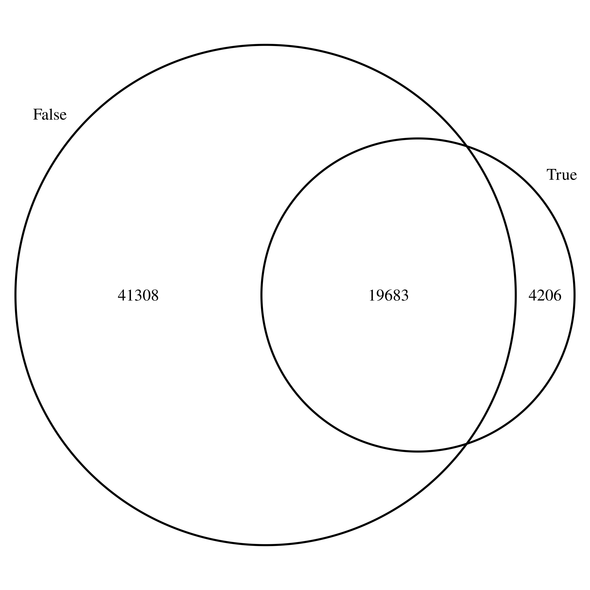
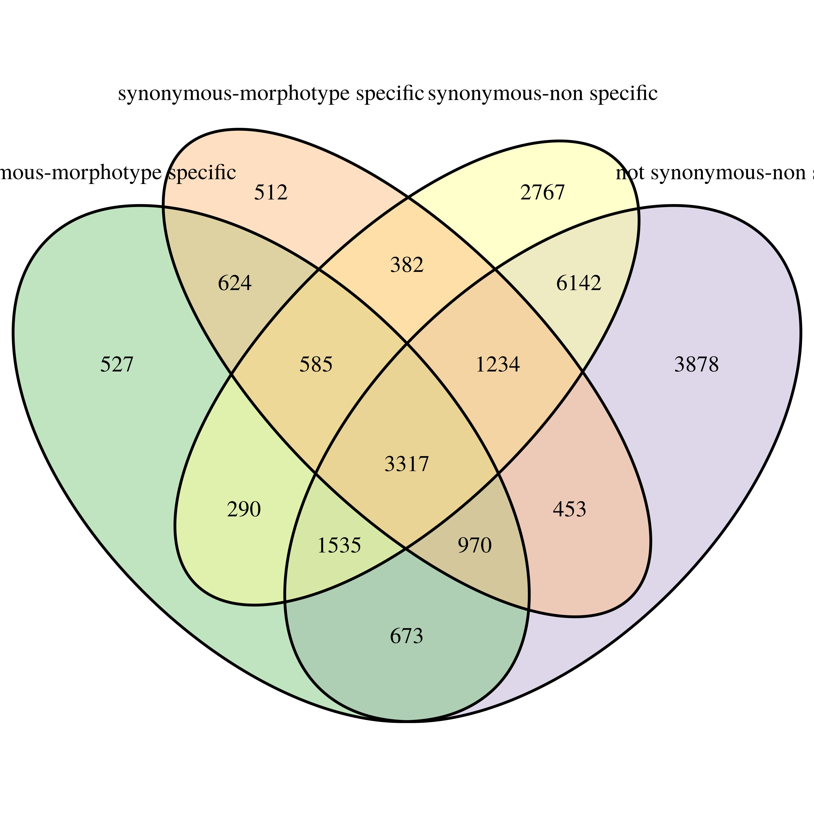
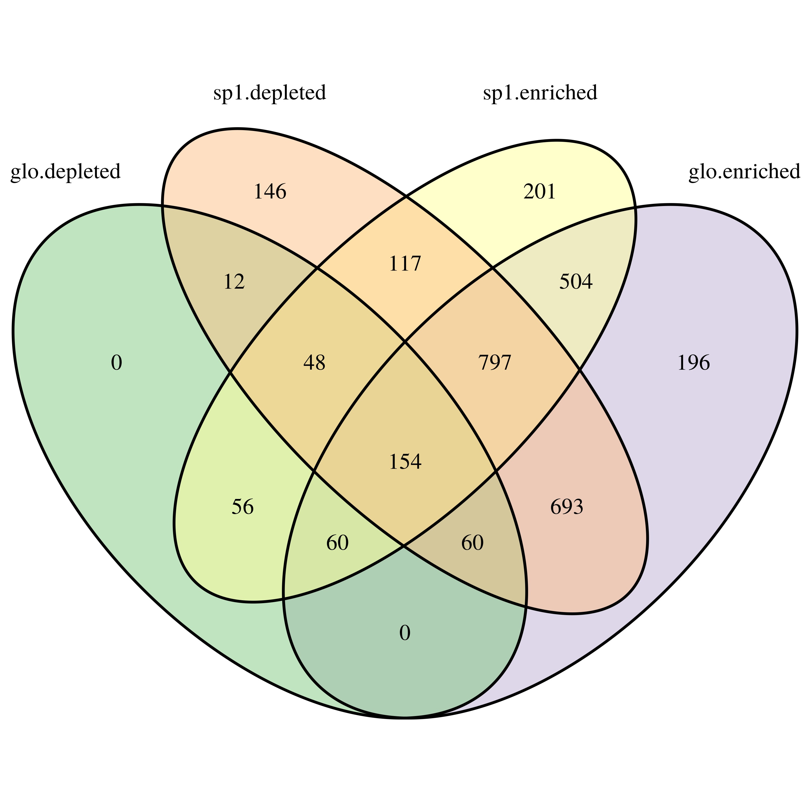

```{r setup_transcripto, include=FALSE}
rm(list = ls()) ; invisible(gc()) ; set.seed(42)
library(knitr)
library(tidyverse)
opts_chunk$set(
  echo = F, message = F, warning = F, fig.height = 6, fig.width = 8,
  cache = T, cache.lazy = F)
theme_set(bayesplot::theme_default())
path <- "~/Documents/BIOGECO/PhD/data/Symphonia_Genomic/Niklas_transcripts/k2rt"
```

# (APPENDIX) Appendix {-} 

# Appendix 1: Transcriptomic data

## SNPs

Once quality checked and SNPs filtered, we can look at SNP distribution between the three modalities (see table \@ref(tab:countTable) and and \@ref(fig:sunburstcount)). We have **72 623** Non-synonymous SNPs in coding region that are morphotype specific making a pool of SNPs to be used in sequence capture. We now need to identify gene functions for those SNPs (GO terms) and more particularly if some functions are enriched in a particular morphotype.

```{r sunburstcount, fig.cap = "SNPs headcount for Symphonia juveniles by types. Levels precise if the SNP is in a coding region, synonymous and finally morphotype-specific."}
data <- read_delim(file.path(path, "symphonia_juv_fullsample_trinity500_k2rt_type_0a_mainOutput.tsv"),
           delim = "\t") %>% 
  filter(Possible_sequencing_error != "True") %>% 
  filter(SNP_in_mutliple_assembled_genes != "True")
count_SNP <- data %>% 
  select(Is_in_CDS, Is_not_synonymous, Is_condition_specific) %>% 
  group_by(Is_in_CDS, Is_not_synonymous, Is_condition_specific) %>% 
  summarize(n = n()) %>% 
  ungroup() %>%
  mutate(type = ifelse(Is_in_CDS == "False" & Is_not_synonymous == "N/A", 
                       "UTR-UTR-", NA)) %>% 
  mutate(type = ifelse(Is_in_CDS == "True" & Is_not_synonymous == "False", 
                       "CDS-synonymous-", type)) %>% 
  mutate(type = ifelse(Is_in_CDS == "True" & Is_not_synonymous == "True", 
                       "CDS-not synonymous-", type)) %>% 
  mutate(Is_condition_specific = ifelse(Is_condition_specific == "False" & !is.na(type),
                                        "non specific", "morphotype specific")) %>% 
  mutate(type = ifelse(!is.na(type),
                       paste0(type,Is_condition_specific), type)) %>% 
  mutate(type = ifelse(is.na(type), "unpossible", type))
rm(data) ; invisible(gc())
count_SNP %>% 
  filter(type != "unpossible") %>%
  select(type, n) %>% 
  sunburstR::sunburst(count = T)
```

## Genes

More than half of candidate genes do not present SNP in coding sequence (41 308, see figure \@ref(fig:genesVenCDS)). We will first focus on candidate genes with SNPs in coding sequences. Among those candidate genes, we have a broad distribution of SNPs synonymous or not and morphotype specific or not (figure \@ref(fig:genesVen)). More particularly 3 317 candidate genes include SNPs of all types.

```{r genesVenCDS, fig.cap="Genes having SNPs in CDS, UTR or both."}
 
```

```{r genesVen, fig.cap="Genes distribution depending on the type of their SNPs. Gene including SNP with coding DNA sequences (CDS), functional synonymy, or morphtype specificity."}
 
```

## Gene ontology

**154** candidate genes presents GO terms with all type of enrichment depending on the morphotype, i.e. both depleted and enriched GO terms for *S. globulifera* and *S. sp1* morphotypes (figure \@ref(fig:enrichedGO)). Finally most of candidate genes present a low frequency of GO terms (inferior to 50 or 20 for *S. globulifera* depleted GO terms, see figure \@ref(fig:goeGenes)), besides some candidate genes show higher values maybe due to transcript assembly or annotation errors. 

We will use this annotation to filter out transcripts with ribosomic, mitochondrial or chloroplastic genes. We thus obtained **74 526** transcripts (175 Mbp) representing **844** putative genes (14 Mbp).

```{r GO, eval=F}
snp <- read_delim(file.path(path, "symphonia_juv_fullsample_trinity500_k2rt_type_0a_mainOutput.tsv"),
           delim = "\t") %>% 
  filter(Possible_sequencing_error != "True") %>% 
  dplyr::rename(transcript_id = `#Component_ID`, snp_id = SNP_ID)

transcript <- src_sqlite(file.path(path, "../Trinotate/",
                           "symphonia.trinity500.trinotate.sqlite")) %>% 
  tbl("Diff_expression") %>% 
  collect() %>%  
  separate_rows(annotation, sep = '\t') %>% 
  filter(grepl("GO:", annotation)) %>% 
  separate_rows(annotation, sep = '`') %>% 
  separate(annotation, sep = "\\^",
           into = c("go_id", "go_namespace", "go_name"))

data <- snp %>% 
  left_join(transcript) %>% 
  mutate(width = nchar(sequence)) %>% 
  mutate(type = ifelse(Is_in_CDS == "False" & Is_not_synonymous == "N/A", 
                       "UTR-UTR-", NA)) %>% 
  mutate(type = ifelse(Is_in_CDS == "True" & Is_not_synonymous == "False", 
                       "CDS-Syn-", type)) %>% 
  mutate(type = ifelse(Is_in_CDS == "True" & Is_not_synonymous == "True", 
                       "CDS-non Syn-", type)) %>% 
  filter(!is.na(type)) %>% 
  mutate(Is_condition_specific = ifelse(Is_condition_specific == "False",
                                        "non Spec", "mt Spec")) %>% 
  mutate(type = paste0(type,Is_condition_specific)) %>% 
  filter(type != "UTR-UTR-mt Spec") %>% 
  filter(type != "UTR-UTR-non Spec") %>% 
  mutate(type = gsub("CDS-", "", type)) %>% 
  filter(gene_id %in% Reduce(intersect, split(.$gene_id, .$type)))

OE <- sapply(list.files(path, "../GO_term_enrichment/",
                        full.names = T), read_tsv, simplify = F) %>%
  bind_rows(.id = "id") %>% 
  mutate(id = gsub("/home/sylvain/Documents/BIOGECO/PhD/data/Symphonia_Niklas/GO_term_enrichment//OE_",
                  "", id)) %>% 
  mutate(id = gsub(".GOseq", "", id)) %>% 
  mutate(id = gsub(".tsv", "", id))

data <- data %>% 
  inner_join(OE, by = c("go_id" = "category"))

# g <- VennDiagram::venn.diagram(split(data$gene_id, data$id.x), "./probes_data/GOEVen.tiff",
#                                fill = RColorBrewer::brewer.pal(4, "Accent"),
#                                alpha = 0.5)

goe_gene <- data %>% 
  select(gene_id, width, id, go_id) %>% 
  unique() %>% 
  group_by(gene_id, id) %>% 
  summarize(n_go = n(), width = mean(width)) %>% 
  arrange(desc(n_go)) %>% 
  dplyr::rename(goe = id) %>% 
  mutate(goe = gsub("glo", "globulifera", goe)) %>% 
  mutate(goe = gsub(".", " ", goe, fixed = T)) %>% 
  mutate(goe = paste("S.", goe))

unsel <- data %>% 
  filter(grepl("RNA", go_name) | grepl("ribo", go_name) | grepl("mito", go_name) | grepl("chloro", go_name)) %>% 
  select(transcript_id, gene_id, go_name, width)

rm(snp, transcript, OE, data) ; invisible(gc())
```

```{r goeGenes, fig.cap="Number of GO term by candidate gene width. Graph are facetted by enrichment or depletion by morphotype. This graph include the 5 403 candidate genes which represents all type of SNPs.", eval=F}
goe_gene %>%
  ggplot(aes(width, n_go)) +
  geom_point() +
  xlab("candidate gene mean width (bp)") +
  ylab("number of GO terms") +
  facet_wrap(~goe, scales = "free") +
  
rm(goe_gene)
```

```{r enrichedGO, fig.cap="Candidate genes distribution depending on their GO term enrichment. This graph include the 5 403 candidate genes which represents all type of SNPs."}

```


