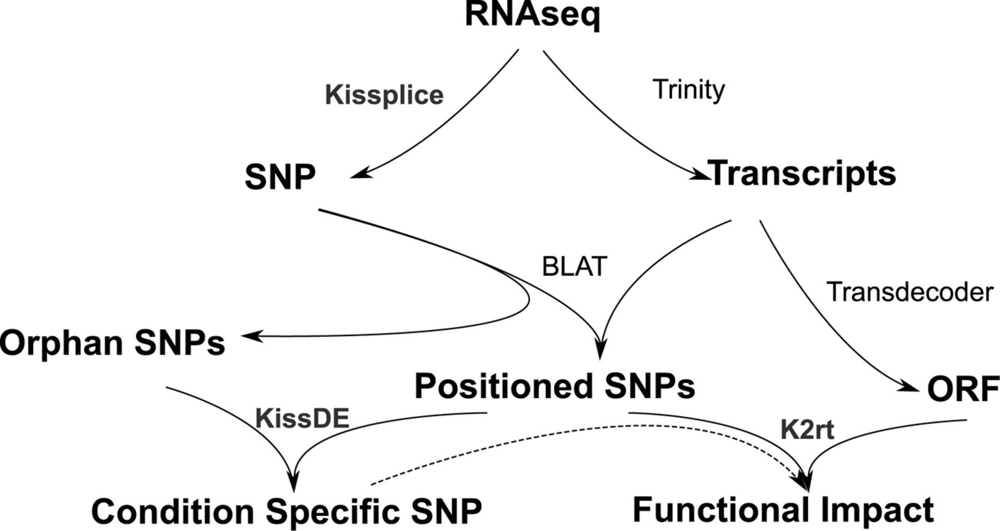
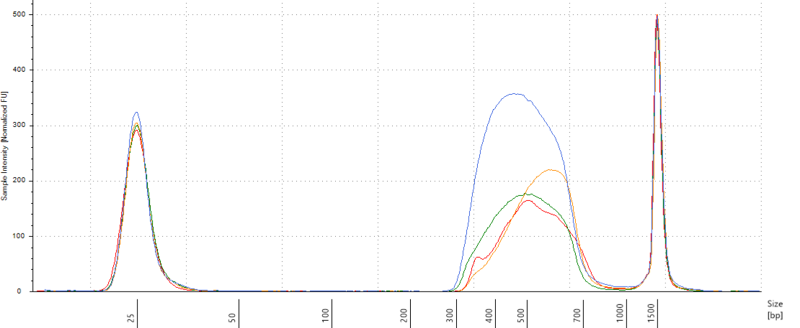

--- 
title: "Symcapture"
subtitle: "*Symphonia globulifera* gene capture"
author: "Sylvain Schmitt"
date: "`r Sys.Date()`"
site: bookdown::bookdown_site
documentclass: book
csl: /home/sylvain/Documents/Bibliography/csl/mee.csl
bibliography: /home/sylvain/Documents/Bibliography/library.bib
link-citations: yes
colorlinks: yes
description: "Gene capture of *Symphonia globulifera* individuals from Paracou."
---


`r if (knitr:::is_html_output()) '# Preface {-}'`

`r if (knitr:::is_html_output()) ''`

`r if (knitr:::is_html_output()) 'Gene capture of *Symphonia globulifera* individuals from Paracou.'`

`r if (knitr:::is_html_output()) 'Have a nice reading.'`

`r if (knitr:::is_html_output()) '<div align="right">  *Sylvain*'`

<!--chapter:end:index.Rmd-->

```{r setup_intro, include=FALSE}
rm(list = ls()) ; invisible(gc()) ; set.seed(42)
library(tidyverse)
```

# Introduction {-}

This document review and summarize sequence capture and genomic analysis of *Symphonia globulifera*.

## Modus operandi (to discuss):

We will proceed sequence capture and genomic analysis of *Symphonia globulifera* with following steps:

- [x] Choose kit
- [x] Select sequence to be captured
- [x] Extract DNA
- [ ] Prepare libraries
- [ ] Raw data analysis
    - [ ] Genome by Sequencing (GbS)
    - [ ] Reads mapping
    - [ ] SNP call
    - [ ] SNP filtering
- [ ] Genetic data analysis
    - [ ] Genetic structure of populations
    - [ ] Genomic structure of polymorphisms
    - [ ] Ecological genomic (genotype-environment association)
    - [ ] Assocaition genomic (genotype-phenotype association)

```{r seqTree, fig.cap="Different types in which to choose sequences to capture. CDS stand for Coding DNA sequence and UTR for UnTranscribed Region.", echo=F}
DiagrammeR::DiagrammeR("
   graph TB
   DNA-->Nucleus
   DNA-->Chlorplast
   Nucleus-->Neutral
   Neutral-->Intron
   Neutral-->UTR
   UTR-->Specific
   UTR-->Non_Specific
   Nucleus-->CDS
   CDS-->Synonymous
   CDS-->Non_Synonymous
   Synonymous-->Specific
   Synonymous-->Non_Specific
   Non_Synonymous-->Specific
   Non_Synonymous-->Non_Specific
")
```

## Sequence selection

Selection of target sequences is based on following scheme \@ref(fig:targets):

```{r targets, fig.cap="Schemes of selection of target sequences.", echo=F}
knitr::include_graphics("images/Probes2.png")
```

## Lexicon

* nuclear gene
* isoform
* scaffold
* transcript
* gene sensu Trinity


<!--chapter:end:01-Intro.Rmd-->

```{r setup_Scotti_prep, include=FALSE}
rm(list = ls()) ; invisible(gc()) ; set.seed(42)
library(knitr)
library(parallel)
library(Biostrings)
library(tidyverse)
theme_set(bayesplot::theme_default())
opts_chunk$set(
  echo = F, message = F, warning = F, fig.height = 6, fig.width = 8,
  cache = T, cache.lazy = F)
path <- "~/Documents/BIOGECO/PhD/data/Symphonia_Genomic/"
```


# Scotti *et al. (in prep)* scaffolds preparation

The Guianan scaffolds from Scotti *et al (in prep)*...

## Filtering scaffolds over $1kbp$

Because of the maybe poor quality of the assembly for scaffolds from Scotti *et al (in prep)*, we first start by filtering scaffolds with a width superior to **1000 bp**.

```{bash filteringScotti, eval=F, echo=T}
cd ~/Documents/BIOGECO/PhD/data/Symphonia_Genomes/Ivan_2018/
mkdir scf_1000
for scf in $( ls raw/ | grep scafSeq$); 
do
  echo item: $scf
  perl ~/Tools/SeqFilter/bin/SeqFilter -l 1000 raw/$scf --out scf_1000/$scf
done
```

## Renaming

For all scaffolds we will use following code : **Ivan_2018_[file name without .scafSeq]_[scaffold name]**.

```{r renamingScotti, eval=F, echo=T}
dir.create(file.path(path, "Ivan_2018", "renamed_scf_1000"))
files <- list.files(file.path(path, "Ivan_2018", "scf_1000"))
sapply(files, function(file){
  scf <- readDNAStringSet(file.path(path, "Ivan_2018", "scf_1000", file))
  names(scf) <- paste0("Ivan_2018_", gsub(".scafSeq", "", file), "_", gsub(" ", "_", names(scf)))
  writeXStringSet(scf, file.path(path, "Ivan_2018", "renamed_scf_1000",
                                 paste0(gsub(".scafSeq", "", file), ".1000.renamed.scafSeq")))
}, simplify = F)
unlink(file.path(path, "Ivan_2018", "scf_1000"), recursive = T)
```

## Libraries merging

We will successively merge scaffolds from all libraries with `quickmerge`. We have 9 libraries resulting in 8 successive merge. We were only able to merge the 6 first libraries due to memory limiitation on my local machine and the absence of `quickmerge` on genotoul/genologin. We will still use this merging as a new reference.

```{bash mergingScotti, eval=F, echo=T}
cd ~/Documents/BIOGECO/PhD/data/Symphonia_Genomes/Ivan_2018/renamed_scf_1000
ref=(sympho47_1L1_002.1000.renamed.scafSeq merge1.fasta merge2.fasta merge3.fasta merge4.fasta merge5.fasta merge6.fasta merge7.fasta)
query=(sympho47_1L2_001.1000.renamed.scafSeq sympho47_2L1_008.1000.renamed.scafSeq sympho47_2L1_009.1000.renamed.scafSeq sympho47_2L1_010.1000.renamed.scafSeq sympho47_2L1_011.1000.renamed.scafSeq sympho47_2L1_012.1000.renamed.scafSeq sympho47_3L2_013.1000.renamed.scafSeq sympho47_4L1_014.1000.renamed.scafSeq)
for i in {0..7} 
do
  mkdir merge$i
  cp  "${ref[$i]}" "${query[$i]}" ./merge$i/
  cd merge$i
  nucmer -l 100 -prefix out ${ref[$i]} ${query[$i]}
  delta-filter -i 95 -r -q out.delta > out.rq.delta
  ~/Tools/quickmerge/quickmerge -d out.rq.delta -q ${query[$i]} -r ${ref[$i]} -hco 5.0 -c 1.5 -l n -ml m
  cd ..
  cp merge$i/merged.fasta ./merge$((i+1)).fasta
done
```

```{bash dbScotti, eval=F, echo=T}
cd ~/Documents/BIOGECO/PhD/data/Symphonia_Genomes/Ivan_2018
mkdir merged_1000
cp  renamed_scf_1000/merge5/merged.fasta merged_1000/merged_1000.fa
cd merged_1000
makeblastdb -in merged_1000.fa -parse_seqids -dbtype nucl
```

## Removing scaffolds with multimatch blasted consensus sequence from Torroba-Balmori *et al. (unpublished)*

We used the consensus sequence for French Guianan reads from Torroba-Balmori *et al. (unpublished)* previously assembled with ipyrad. As a first brutal approach we only keep the first sequence of the consensus loci file and transform it to fasta (see loci2fa.py script below). We then blast those consensus sequences on merged scaffolds from Scotti *et al (in prep)* with `blastn` in order to detect scaffolds with repetitive regions thanks to multimapped consensus sequences. Those sequences will be saved as a list to be removed in final selected scaffolds list.

```{python loci2fa, eval=F, echo=T}
infile = open("symphoGbS2.loci", "r")
outfile = open("symphoGbS2.firstline.fasta", "w")
loci = infile.read().split("|\n")[:-1]
for loc in loci:
    reads = loc.split("\n")
    name, seq = reads[0].split()
    print >>outfile, ">"+name+"\n"+seq
outfile.close()
```

```{bash loci2fa2, eval=F, echo=T}
cd ~/Documents/BIOGECO/PhD/data/Symphonia_Torroba/assembly/symphoGbS2_outfile
python loci2fa.py
cat symphoGbS2.firstline.fasta | tr - N >> symphoGbS2.firstline.fasta
```

```{bash, blastScotti, eval=F, echo=T}
cd ~/Documents/BIOGECO/PhD/data/Symphonia_Genomes/Ivan_2018
query=~/Documents/BIOGECO/PhD/data/Symphonia_Torroba/assembly/symphoGbS2_outfiles/symphoGbS2.firstline.fasta
blastn -db merged_1000/merged_1000.fa -query $query -out blast_consensus_torroba2.txt -evalue 1e-10 -best_hit_score_edge 0.05 -best_hit_overhang 0.25 -outfmt 6 -perc_identity 75 -max_target_seqs 10
```

```{r blastResultScotti, eval=F, echo=T}
blast <- read_tsv(file.path(path, "Ivan_2018", "blast_consensus_torroba2.txt"), col_names = F)
names(blast) <- c("Read", "Scaffold", "Perc_Ident", "Alignment_length", "Mismatches",
                  "Gap_openings", "R_start", "R_end", "S_start", "S_end", "E", "Bits")
write_file(paste(unique(blast$Scaffold), collapse = "\n"), 
           file.path(path, "Ivan_2018", "selected_scaffolds_blast_consensus2.list"))
```

```{bash blastResultScotti2, eval=F, echo=T}
seqtk subseq merged_1000/merged_1000.fa selected_scaffolds_blast_consensus2.list >> selected_scaffolds_blast_consensus2.fa
```

In total **542 scaffolds** from Scotti *et al (in prep)* match consensus sequences from Torroba-Balmori et al. (unpublished). But several scaffolds obtained multiple matches that we cannot use for probes. We will thus exclude the whole scaffold if the scaffold is shorter than 2000 bp or the scaffold region matching the raw read if the scaffold is longer than 2000 bp.

```{r blastResultScottiFig, fig.cap="Number of match with Torroba consensus reads vs gene width.", fig.height=4}
blast_Ivan <- read_tsv(file.path(path, "Ivan_2018", "torroba_blast", "blast_consensus_torroba2.txt"), col_names = F)
names(blast_Ivan) <- c("Read", "Scaffold", "Perc_Ident", "Alignment_length", "Mismatches",
                  "Gap_openings", "R_start", "R_end", "S_start", "S_end", "E", "Bits")
scf_Ivan <- readDNAStringSet(file.path(path, "Ivan_2018", "torroba_blast", "selected_scaffolds_blast_consensus2.fa"))
blast_Ivan %>%
  dplyr::left_join(data.frame(Scaffold = names(scf_Ivan), width = width(scf_Ivan))) %>% 
  select(Scaffold, Read, width) %>%
  unique() %>%
  group_by(Scaffold, width) %>%
  summarise(n = n()) %>% 
  ggplot(aes(width, n)) +
  geom_point() +
  geom_jitter() +
  ylab("Number of match with consensus sequences from Torroba-Balmori et al (unpublished)") +
  xlab("Width of scaffolds from Scotti et al. (in prep) (in bp)")
```

```{r blastResultScottiFilter}
sel_Ivan <- blast_Ivan %>%
  dplyr::left_join(data.frame(Scaffold = names(scf_Ivan), width = width(scf_Ivan))) %>% 
  select(Scaffold, Read, width, S_start, S_end) %>% 
  group_by(Read) %>%
  filter(n() > 2) %>% 
  ungroup() %>% 
  mutate(remove = ifelse(width < 2000, "X", " ")) %>% 
  mutate(cut = ifelse(width > 2000, paste0(S_start, "-", S_end), " ")) %>% 
  select(Scaffold, width, remove, cut)
sel_Ivan <- list(rm = gsub("Ivan_2018_sympho47_", "", sel_Ivan$Scaffold[sel_Ivan$remove == "X"]),
                 cut = sel_Ivan[sel_Ivan$remove == " ",])
kable(sel_Ivan$cut, caption = "Scaffold to cut due to multiple read match.")
```

Following scaffolds will be removed due to multitple matches and a length $<200bp$: `r paste0(sel_Ivan$rm, collapse = ", ")`. And other will be cut (see table \@ref(tab:blastResultScottiFilter)).

## Total filtered scaffolds

```{r scfIvanFilterFig}
scf <- readDNAStringSet(file.path(path, "Ivan_2018", "merged_1000", "merged_1000.fa"))
scf <- scf[-match(paste0("Ivan_2018_sympho47_",sel_Ivan$rm),  names(scf))]
scf <- data.frame(name = names(scf), width = width(scf))
scf %>% 
  ggplot(aes(width)) +
  geom_histogram() +
  ggtitle("190 094 scaffolds", "436.118 Mbp") +
  scale_x_log10() +
  xlab("Width of filtered scaffolds from Scotti et al. (in prep) (bp)")
```


<!--chapter:end:02-Scotti-Prep.Rmd-->

```{r setup_Olsson_prep, include=FALSE}
rm(list = ls()) ; invisible(gc()) ; set.seed(42)
library(knitr)
library(parallel)
library(Biostrings)
library(tidyverse)
theme_set(bayesplot::theme_default())
opts_chunk$set(
  echo = F, message = F, warning = F, fig.height = 6, fig.width = 8,
  cache = T, cache.lazy = F)
path <- "~/Documents/BIOGECO/PhD/data/Symphonia_Genomic/"
```


# Olsson *et al. (2017)* scaffolds preparation

The African genome scaffolds from @Olsson2017...

## Renaming

We renamed scaffolds from Olsson using following code : **Olsson_2017_[scaffold name]**.

```{r renamingOlsson, eval=F, echo=T}
scf <- readDNAStringSet(file.path(path, "Olsson_2016", "symph_genome.fa"))
names(scf) <- paste0('Olsson_2017_', names(scf))
dir.create(file.path(path, "Olsson_2016", "db"))
writeXStringSet(scf, file.path(path, "Olsson_2016", "db", "Olsson2017.fa")))
```

## Removing scaffolds with multimatch blasted consensus sequence from Torroba-Balmori *et al. (unpublished)*

We will again use the consensus sequence for French Guianan reads from Torroba-Balmori *et al. (unpublished)*, by blasting them on scaffolds from @Olsson2017 with `blastn`.

```{bash, blastOlsson, eval=F, echo=T}
cd ~/Documents/BIOGECO/PhD/data/Symphonia_Genomes/Olsson_2016
cd Olsson2017
makeblastdb -in Olsson2017.fa -parse_seqids -dbtype nucl
cd ..
query=~/Documents/BIOGECO/PhD/data/Symphonia_Torroba/assembly/symphoGbS2_outfiles/symphoGbS2.firstline.fasta
blastn -db Olsson2017/Olsson2017.fa -query $query -out blast_consensus_torroba2.txt -evalue 1e-10 -best_hit_score_edge 0.05 -best_hit_overhang 0.25 -outfmt 6 -perc_identity 75 -max_target_seqs 10
```

```{r blastResultOlsson, eval=F, echo=T}
blast <- read_tsv(file.path(path, "Olsson_2016", "blast_consensus_torroba2.txt"), col_names = F)
names(blast) <- c("Read", "Scaffold", "Perc_Ident", "Alignment_length", "Mismatches",
                  "Gap_openings", "R_start", "R_end", "S_start", "S_end", "E", "Bits")
write_file(paste(unique(blast$Scaffold), collapse = "\n"), 
           file.path(path, "Olsson_2016", "selected_scaffolds_blast_consensus2.list"))
```

```{bash blastResultOlsson2, eval=F, echo=T}
seqtk subseq Olsson2017/Olsson2017.fa selected_scaffolds_blast_consensus2.list >> selected_scaffolds_blast_consensus2.fa
```

We finally have most of scaffolds with on match in a broad range of sizes (from 100 bp to 33.2 kbp). In total **688** scaffolds from @Olsson2017 match consensus sequences from Torroba-Balmori *et al. (unpublished)*. But several scaffolds obtained multiple matches that we cannot use for probes. We will thus exclude the whole scaffold if the scaffold is shorter than 2000 bp or the scaffold region matching the raw read if the scaffold is longer than 2000 bp.

```{r blastResultOlssonFig, fig.cap="Number of match with Torroba consensus reads vs gene width.", fig.height=4}
blast_Olsson <- read_tsv(file.path(path, "Olsson_2016", "torroba_blast", "blast_consensus_torroba2.txt"), col_names = F)
names(blast_Olsson) <- c("Read", "Scaffold", "Perc_Ident", "Alignment_length", "Mismatches",
                  "Gap_openings", "R_start", "R_end", "S_start", "S_end", "E", "Bits")
scf_Olsson <- readDNAStringSet(file.path(path, "Olsson_2016", "torroba_blast", "selected_scaffolds_blast_consensus2.fa"))
blast_Olsson %>%
  dplyr::left_join(data.frame(Scaffold = names(scf_Olsson), width = width(scf_Olsson))) %>% 
  select(Scaffold, Read, width) %>%
  unique() %>%
  group_by(Scaffold, width) %>%
  summarise(n = n()) %>% 
  ggplot(aes(width, n)) +
  geom_point() +
  geom_jitter() +
  ylab("Number of match with consensus sequences from Torroba-Balmori et al (unpublished)") +
  xlab("Width of scaffolds from 0lsson et al. (2017) (in bp)")
```

```{r blastResultOlssonFilter}
sel_Olsson <- blast_Olsson %>%
  dplyr::left_join(data.frame(Scaffold = names(scf_Olsson), width = width(scf_Olsson))) %>% 
  select(Scaffold, Read, width, S_start, S_end) %>% 
  group_by(Read) %>%
  filter(n() > 2) %>% 
  ungroup() %>% 
  mutate(remove = ifelse(width < 2000, "X", " ")) %>% 
  mutate(cut = ifelse(width > 2000, paste0(S_start, "-", S_end), " ")) %>% 
  select(Scaffold, width, remove, cut)
sel_Olsson <- list(rm = gsub("Olsson_2017_", "", sel_Olsson$Scaffold[sel_Olsson$remove == "X"]),
                 cut = sel_Olsson[sel_Olsson$remove == " ",])
kable(sel_Olsson$cut, caption = "Scaffold to cut due to multiple read match.") 
```

Following scaffolds will be removed due to multitple matches and a length $<200bp$: `r paste0(sel_Olsson$rm, collapse = ", ")`. And other will be cut (see table \@ref(tab:blastResultOlssonFilter)).

## Total filtered scaffolds

```{r scfOlssonFilterFig}
scf <- readDNAStringSet(file.path(path, "Olsson_2016", "Olsson2017", "Olsson2017.fa"))
scf <- scf[-match(paste0("Olsson_2017_",sel_Olsson$rm),  names(scf))]
scf <- data.frame(name = names(scf), width = width(scf))
scf %>% 
  ggplot(aes(width)) +
  geom_histogram() +
  ggtitle("2 653 440 scaffolds", "1 027.332 Mbp") +
  scale_x_log10() +
  xlab("Width of filtered scaffolds from Olsson et al. (2017) (bp)")
```

<!--chapter:end:03-Olsson-Prep.Rmd-->

```{r setup_tysklind_prep, include=FALSE}
rm(list = ls()) ; invisible(gc()) ; set.seed(42)
library(knitr)
library(tidyverse)
opts_chunk$set(
  echo = F, message = F, warning = F, fig.height = 6, fig.width = 8,
  cache = T, cache.lazy = F)
theme_set(bayesplot::theme_default())
path <- "~/Documents/BIOGECO/PhD/data/Symphonia_Genomic/Niklas_transcripts/k2rt"
```

#  Tysklind *et al (in prep)* transcript preparation

Tysklind *et al (in prep)* used 20 Symphonia juveniles from the transplantation garden experiment for transcriptomic analysis. RNA sequence were captured. The analysis followed the scheme suggested by @Lopez-Maestre2016 (see below). First, reads were assembled with `Trinity` into transcripts. In parrallel, SNPs were detected with `Kissplice`. Then SNPs have been mapped on the transcritpome with `BLAT`. In parrallel SNPs have been tested to be morphotype-specific at the level $\alpha = 0.001$ with `KissDE` and transcriptome Open Reading Frames (ORF) have been indentified with `Transdecoder`. Finally, SNPs functional impact have been evaluated through `k2rt`. Consequently, for every SNP we have the following informations: (i) inside coding DNA sequence (CDS), (ii) synonymous or not, (iii) morphotype-specificity.



## Filtering SNP on quality

We assessed transcriptomic analysis quality with possible sequencing errors, and SNPs in multiple assembled genes or isoforms (see table \@ref(tab:Qcheck)). We found **38 594** SNPs with possible sequencing error, and **609 214** SNPs associated to multiple assembled genes that we will remove from further analysis.

```{r Qcheck}
data <- read_delim(file.path(path, "symphonia_juv_fullsample_trinity500_k2rt_type_0a_mainOutput.tsv"),
           delim = "\t")
data %>% 
  select(Possible_sequencing_error,
         SNP_in_mutliple_assembled_genes,
         SNP_in_mutliple_assembled_isoforms) %>% 
  mutate(Count = 1) %>%
  reshape2::melt(id.vars = "Count") %>% 
  filter(value == "True") %>% 
  mutate(variable = gsub("_", " ", variable)) %>% 
  group_by(variable) %>% 
  summarise(n = n()) %>% 
  mutate(Percentage = round(n/nrow(data)*100,2)) %>% 
  kable(caption = "Quality check with single SNPs....",
        format.args = list(big.mark = " "))
rm(data) ; invisible(gc())
```

## Filtering SNP on type

We also highlighted SNPs which met unpossible association of characteristic (table \@ref(tab:countTable)), that we will remove from further analysis.

```{r count_SNP}
data <- read_delim(file.path(path, "symphonia_juv_fullsample_trinity500_k2rt_type_0a_mainOutput.tsv"),
           delim = "\t") %>% 
  filter(Possible_sequencing_error != "True") %>% 
  filter(SNP_in_mutliple_assembled_genes != "True")
count_SNP <- data %>% 
  select(Is_in_CDS, Is_not_synonymous, Is_condition_specific) %>% 
  group_by(Is_in_CDS, Is_not_synonymous, Is_condition_specific) %>% 
  summarize(n = n()) %>% 
  ungroup() %>%
  mutate(type = ifelse(Is_in_CDS == "False" & Is_not_synonymous == "N/A", 
                       "UTR-UTR-", NA)) %>% 
  mutate(type = ifelse(Is_in_CDS == "True" & Is_not_synonymous == "False", 
                       "CDS-synonymous-", type)) %>% 
  mutate(type = ifelse(Is_in_CDS == "True" & Is_not_synonymous == "True", 
                       "CDS-not synonymous-", type)) %>% 
  mutate(Is_condition_specific = ifelse(Is_condition_specific == "False" & !is.na(type),
                                        "non specific", "morphotype specific")) %>% 
  mutate(type = ifelse(!is.na(type),
                       paste0(type,Is_condition_specific), type)) %>% 
  mutate(type = ifelse(is.na(type), "unpossible", type))
rm(data) ; invisible(gc())
```

```{r countTable}
count_SNP %>% 
  filter(type == "unpossible") %>%
  dplyr::rename("Coding sequence" = Is_in_CDS,
         "Not synonymous" = Is_not_synonymous,
         "Morphotype-specific" = Is_condition_specific) %>% 
  kable(caption = "Single SNPs with unpossible association of characteristic. First column indicates if the SNP is in a coding sequence, second column indicates is the SNP is not synonymous, third column indicates if the SNP is morphotype-specific, and fourth column indicates the headcount.", format.args = list(big.mark = " "))
```

## Filtering transcripts on SNP frequency

We had a high frequency of SNPs per candidate genes (the majority between 1 SNP per 10 or 100 bp), with some scaffolds with a frquency superior to 0.2 (see figure \@ref(fig:snpGenes2)). We assumed those hyper SNP-rich scaffolds to be errors and we decided to remove them of the reference transcriptome. In order to do that we fitted a $\Gamma$ law into the SNP frequency distribution and we kept scaffolds with a SNP frequency under the $99^{th}$ quantile ($q_{99} = 0.07810194$). We thus removed:

* __358 308__ SNPs
* including __20 521__ transcripts
* representing __1 490__ candidate genes

```{r genes}
snp <- read_delim(file.path(path, "symphonia_juv_fullsample_trinity500_k2rt_type_0a_mainOutput.tsv"),
           delim = "\t") %>% 
  filter(Possible_sequencing_error != "True") %>% 
  filter(SNP_in_mutliple_assembled_genes != "True") %>% 
  mutate(type = ifelse(Is_in_CDS == "False" & Is_not_synonymous == "N/A", 
                       "UTR-UTR-", NA)) %>% 
  mutate(type = ifelse(Is_in_CDS == "True" & Is_not_synonymous == "False", 
                       "CDS-synonymous-", type)) %>% 
  mutate(type = ifelse(Is_in_CDS == "True" & Is_not_synonymous == "True", 
                       "CDS-not synonymous-", type)) %>% 
  mutate(Is_condition_specific = ifelse(Is_condition_specific == "False" & !is.na(type),
                                        "non specific", "morphotype specific")) %>% 
  mutate(type = ifelse(!is.na(type),
                       paste0(type,Is_condition_specific), type)) %>% 
  filter(!is.na(type)) %>% 
  dplyr::rename(transcript_id = `#Component_ID`, snp_id = SNP_ID)

transcript <- src_sqlite(file.path(path, "..", "Trinotate",
                           "symphonia.trinity500.trinotate.sqlite")) %>% 
  tbl("Transcript") %>% 
  collect()

data <- snp %>% 
  left_join(transcript) %>% 
  mutate(width = nchar(sequence))

snp_genes <- data %>% 
  group_by(gene_id) %>% 
  summarize(n_snp = n(), width = mean(width)) %>% 
  mutate(freq = n_snp/width) %>% 
  arrange(desc(freq))

g <- VennDiagram::venn.diagram(split(data$gene_id, data$Is_in_CDS), 
                               "./symcapture_data/genesVenCDS.tiff",
                               # fill = RColorBrewer::brewer.pal(3, "Accent"),
                               alpha = 0.5)

data2 <- data %>%
  filter(type != "UTR-UTR-morphotype specific") %>% 
  filter(type != "UTR-UTR-non specific") %>% 
  mutate(type = gsub("CDS-", "", type))

g <- VennDiagram::venn.diagram(split(data2$gene_id, data2$type), 
                               "./symcapture_data/genesVen.tiff",
                               alpha = 0.5)

rm(snp, transcript, data, data2, g) ; invisible(gc())
```

```{r snpGenes2, fig.cap="Distribution of SNP frequencies in scaffolds. Histogram (gray bars) represents the data, red line represents the Gamma law fit, and blue area represents X*sigma were scaffolds are not excluded.", fig.height=4}
fit.params <- MASS::fitdistr(snp_genes$freq, "gamma", lower = c(0, 0))
q99 <- qgamma(0.99,fit.params$estimate["shape"], fit.params$estimate["rate"])
ggplot(snp_genes) +
  geom_rect(aes(xmin=0, xmax=q99, ymin=0, ymax=Inf), fill = "blue", alpha = 0.002) +
  geom_histogram(aes(freq, ..density..), binwidth = 0.001) +
  geom_line(aes(freq, 
                y=dgamma(snp_genes$freq,fit.params$estimate["shape"], fit.params$estimate["rate"])), 
            color="red", size = 1) +
  xlab("SNP frequency (N/bp)")
```

```{r transcriptFiltering, eval=F, echo=T}
filtered_data <- snp_genes %>% 
  filter(freq <= q99) %>% 
  left_join(data, by = "gene_id") %>% 
  select(transcript_id, sequence) %>% 
  unique() %>% 
  mutate(transcript_id = paste0(">", transcript_id))
filtered_data_fasta <- do.call(rbind, lapply(seq(nrow(filtered_data)),
                                             function(i) t(filtered_data[i, ])))
write.table(filtered_data_fasta, row.names = F, col.names = F, quote = F, 
            file = file.path(path, "..", "filtered_transcripts.fasta"))
```

## Total filtered transcript

We have a total of:

* __1 382 525__ filtered SNPs (over 2 398 550)
* including __177 388__ transcripts (over 257 140, including pseudo-genes isoforms)
* representing __63 707__ candidate genes (over 76 032)
* for a total of Mbp

```{r trscFilterFig}
trsc <- readDNAStringSet(file.path(path, "..", "filtered_transcripts.fasta"))
data.frame(name = names(trsc), width = width(trsc)) %>% 
  ggplot(aes(width)) +
  geom_histogram() +
  ggtitle("177 388 transcripts", "283.4103 Mbp") +
  scale_x_log10() +
  xlab("Width of filtered transcript from Tysklind et al. (in prep) (bp)")
```


<!--chapter:end:04-Tysklind-Prep.Rmd-->

```{r setup_neutral_sel, include=FALSE}
rm(list = ls()) ; invisible(gc()) ; set.seed(42)
library(knitr)
library(parallel)
library(Biostrings)
library(tidyverse)
theme_set(bayesplot::theme_default())
opts_chunk$set(
  echo = F, message = F, warning = F, fig.height = 6, fig.width = 8,
  cache = T, cache.lazy = F)
path <- "~/Documents/BIOGECO/PhD/data/Symphonia_Genomic/"
```

# Neutral region selection

The Guianan sequences from Torroba-Balmor *et al (unpublished)*...

## Raw reads from Torroba-Balmori *et al. (unpublished)* alignment on scaffolds from Scotti *et al. (in prep)*

We will use the French Guianan raw reads from Torroba-Balmori *et al. (unpublished)*, by aligning them on scaffolds from @Olsson2017 with `bwa`.

```{bash alignmentIvan, eval=F, echo=T}
#!/bin/bash
#SBATCH --time=36:00:00
#SBATCH -J alignIvan
#SBATCH -o alignIvan_output.out
#SBATCH -e alignIvan_error.out
#SBATCH --mem=20G
#SBATCH --cpus-per-task=1
#SBATCH --mail-type=BEGIN,END,FAIL

# Environment
module purge
module load bioinfo/bwa-0.7.15
module load bioinfo/picard-2.14.1
module load bioinfo/samtools-1.4
module load bioinfo/bedtools-2.26.0

# read preparation
cd ~/work/Symphonia_Torroba/
tar -xvzf Gbs.tar.gz
cd raw
rm PR_49.fastq RG_1.fastq
for file in ./*.fastq
do
  echo $file
  filename=$(basename "$file")
  filename="${filename%.*}"
  perl -pe 's|[\h]||g' $file > "${filename}".renamed.fastq
  rm $file
done
# variables
cd ~/work/Symphonia_Genomes/Ivan_2018/torroba_alignment
reference=~/work/Symphonia_Genomes/Ivan_2018/merged_1000/merged_1000.fa
query_path=~/work/Symphonia_Torroba/raw
# alignment
bwa index $reference
mkdir bwa
for file in $query_path/*.fastq
do
  filename=$(basename "$file")
  filename="${filename%.*}"
  rg="@RG\tID:${filename}\tSM:${filename}\tPL:IONTORRENT"
  bwa mem -M -R "${rg}" $reference $file > bwa/"${filename}.sam"	
#  rm $file
done
# sam2bam
for file in ./bwa/*.sam
do
  filename=$(basename "$file")
  filename="${filename%.*}"
  java -Xmx4g -jar $PICARD SortSam I=$file O=bwa/"${filename}".bam SORT_ORDER=coordinate
done
# Bam index
for file in bwa/*.bam
do
  filename=$(basename "$file")
  filename="${filename%.*}"
  java -Xmx4g -jar $PICARD BuildBamIndex I=$file O=bwa/"${filename}".bai
done
# sam2bed
mkdir bed
for file in ./bwa/*.bam
do
  filename=$(basename "$file")
  filename="${filename%.*}"
  bedtools bamtobed -i bwa/"${filename}".bam > bed/"${filename}".bed
done
# merge bed
mkdir merged_bed
for file in ./bed/*.bed
do
  filename=$(basename "$file")
  filename="${filename%.*}"
  bedtools merge -i bed/"${filename}".bed > merged_bed/"${filename}".bed
done
cat bed/* | sort -k 1,1 -k2,2n >  all.nonunique.bed
bedtools merge -i all.nonunique.bed -c 1 -o count > all.merged.bed
```

```{r bwatResultScotti, eval=F, echo=T}
bed <- read_tsv(file.path(path, "Ivan_2018", "torroba_alignment", "all.merged.bed"), col_names = F)
names(bed) <- c("scaffold", "start", "end", "coverage")
write_file(paste(unique(bed$scaffold), collapse = "\n"), 
           file.path(path, "Ivan_2018", "torroba_alignment", "scaffolds.list"))
```

```{bash bwaResultScotti2, eval=F, echo=T}
cd ~/Documents/BIOGECO/PhD/data/Symphonia_Genomes/Ivan_2018/torroba_alignment
ref=~/Documents/BIOGECO/PhD/data/Symphonia_Genomes/Ivan_2018/merged_1000/merged_1000.fa
seqtk subseq $ref scaffolds.list >> scaffolds.fa
```

```{r  bwaReadResultIvanCov}
total_length <- sum(width(readDNAStringSet(file.path(path, "Ivan_2018", "merged_1000", "merged_1000.fa"))))
n_total <- length(readDNAStringSet(file.path(path, "Ivan_2018", "merged_1000", "merged_1000.fa")))
bed <- read_tsv(file.path(path, "Olsson_2016", "torroba_alignment", "all.merged.bed"), 
                col_names = F) %>% unique()
names(bed) <- c("scaffold", "start", "end", "coverage")
alignment_coverage <- sum(bed$end-bed$start)
scf <- readDNAStringSet(file.path(path, "Ivan_2018", "torroba_alignment", "scaffolds.fa"))
scf <- data.frame(scaffold = names(scf), width_scf = width(scf))
selection_coverage <- sum(scf$width_scf)
data.frame(name = c("aligned sequence", "selected scaffold", "total"),
           n = c(nrow(bed), nrow(scf), n_total),
           width = c(alignment_coverage, selection_coverage, total_length)) %>% 
  mutate(coverage = width/total_length*100) %>% 
  mutate(width = width / 10^6) %>% 
  kable(caption = "alignment coverage summary",
        col.names = c("", "N", "Width (Mbp)", "Coverage (%)"),
        format.args = list(big.mark = " "))
```

## Masking scaffolds with multimatch from Scotti *et al. (in prep)*

```{r bwaResultScottiFilter, eval=F, echo=T}
bed <- data.table::fread(file.path(path, "Ivan_2018", "torroba_alignment", 
                                   "all.nonunique.bed"), header = F)
names(bed) <- c("scaffold", "start", "end", "read", "quality", "orientation")
multimatch_reads <- bed %>% 
  filter(duplicated(read)) %>% 
  select(read) %>% 
  unique() %>% 
  unlist()
bed %>% 
  filter(read %in% multimatch_reads) %>% 
  write_tsv(file.path(path, "Ivan_2018", "torroba_alignment", 
                       "multimatch.bed"), col_names = F)
rm(bed, multimatch_reads) ; invisible(gc())
```

```{bash bwaResultScottiFilter2, eval=F, echo=T}
cd ~/Documents/BIOGECO/PhD/data/Symphonia_Genomes/Ivan_2018/torroba_alignment
bedtools maskfasta -fi scaffolds.fa -bed multimatch.bed -fo masked.scaffolds.fa
```

```{r bwaResultScottiFilter3, eval=F, echo=T}
scf <- readDNAStringSet(file.path(path, "Ivan_2018", 
                                  "torroba_alignment", "masked.scaffolds.fa"))
scf <- data.frame(scaffold = names(scf), width = width(scf), 
           N = letterFrequency(scf, letters = "N")) %>% 
  mutate(Nperc = N/width*100) %>% 
  filter(Nperc < 25 & width > 1000) %>% 
  select(scaffold)
write_file(paste(scf$scaffold, collapse = "\n"), 
           file.path(path, "Ivan_2018", "torroba_alignment", "final.scaffolds.list"))
```

```{bash bwaResultScottiFilter4, eval=F, echo=T}
cd ~/Documents/BIOGECO/PhD/data/Symphonia_Genomes/Ivan_2018/torroba_alignment
seqtk subseq masked.scaffolds.fa final.scaffolds.list >> final.scaffolds.fa
```

```{r  bwaFilterScottiCov}
total_length <- sum(width(readDNAStringSet(file.path(path, "Ivan_2018", "merged_1000", "merged_1000.fa"))))
n_total <- length(readDNAStringSet(file.path(path, "Ivan_2018", "merged_1000", "merged_1000.fa")))
scf <- readDNAStringSet(file.path(path, "Ivan_2018", "torroba_alignment", "final.scaffolds.fa"))
scf <- data.frame(scaffold = names(scf), width = width(scf),
                  N = letterFrequency(scf, letters = "N"))
data.frame(name = c("selected scaffold", "total"),
           n = c(nrow(scf), n_total),
           width = c(sum(scf$width), total_length),
           N = c(sum(scf$N), NA)) %>% 
  mutate(mask = N/width*100) %>% 
  mutate(coverage = width/total_length*100) %>% 
  mutate(width = width / 10^6) %>% 
  select(-N) %>% 
  kable(caption = "alignment coverage summary",
        col.names = c("", "N", "Width (Mbp)", "Mask (%N)", "Coverage (%)"),
        format.args = list(big.mark = " "))
```

## Raw reads from Torroba-Balmori *et al. (unpublished)* alignment on scaffolds from @Olsson2017 
We will again use the French Guianan raw reads from Torroba-Balmori *et al. (unpublished)*, by aligning them on scaffolds from @Olsson2017 with `bwa`.

```{bash alignmentOlsson, eval=F, echo=T}
#!/bin/bash
#SBATCH --time=36:00:00
#SBATCH -J alignOlsson
#SBATCH -o alignOlsson_output.out
#SBATCH -e alignOlsson_error.out
#SBATCH --mem=20G
#SBATCH --cpus-per-task=1
#SBATCH --mail-type=BEGIN,END,FAIL

# Environment
module purge
module load bioinfo/bwa-0.7.15
module load bioinfo/picard-2.14.1
module load bioinfo/samtools-1.4
module load bioinfo/bedtools-2.26.0

# read preparation
cd ~/work/Symphonia_Torroba/
tar -xvzf Gbs.tar.gz
cd raw
rm PR_49.fastq RG_1.fastq
for file in ./*.fastq
do
  echo $file
  filename=$(basename "$file")
  filename="${filename%.*}"
  perl -pe 's|[\h]||g' $file > "${filename}".renamed.fastq
  rm $file
done
# variables
cd ~/work/Symphonia_Genomes/Olsson_2016/torroba_alignment
reference=~/work/Symphonia_Genomes/Olsson_2016/Olsson2017/Olsson2017.fa
query_path=~/work/Symphonia_Torroba/raw
# alignment
bwa index $reference
mkdir bwa
for file in $query_path/*.fastq
do
  filename=$(basename "$file")
  filename="${filename%.*}"
  rg="@RG\tID:${filename}\tSM:${filename}\tPL:IONTORRENT"
  bwa mem -M -R "${rg}" $reference $file > bwa/"${filename}.sam"	
  rm $file
done
# sam2bam
for file in ./bwa/*.sam
do
  filename=$(basename "$file")
  filename="${filename%.*}"
  java -Xmx4g -jar $PICARD SortSam I=$file O=bwa/"${filename}".bam SORT_ORDER=coordinate
done
# Bam index
for file in bwa/*.bam
do
  filename=$(basename "$file")
  filename="${filename%.*}"
  java -Xmx4g -jar $PICARD BuildBamIndex I=$file O=bwa/"${filename}".bai
done
# sam2bed
mkdir bed
for file in ./bwa/*.bam
do
  filename=$(basename "$file")
  filename="${filename%.*}"
  bedtools bamtobed -i bwa/"${filename}".bam > bed/"${filename}".bed
done
# merge bed
mkdir merged_bed
for file in ./bed/*.bed
do
  filename=$(basename "$file")
  filename="${filename%.*}"
  bedtools merge -i bed/"${filename}".bed > merged_bed/"${filename}".bed
done
cat bed/* | sort -k 1,1 -k2,2n >  all.nonunique.bed
bedtools merge -i all.nonunique.bed -c 1 -o count > all.merged.bed
```

```{r bwatResultOlsson, eval=F, echo=T}
bed <- read_tsv(file.path(path, "Olsson_2016", "torroba_alignment", "all.merged.bed"), col_names = F)
names(bed) <- c("scaffold", "start", "end", "coverage")
write_file(paste(unique(bed$scaffold), collapse = "\n"), 
           file.path(path, "Olsson_2016", "torroba_alignment", "scaffolds.list"))
```

```{bash bwaResultOlsson2, eval=F, echo=T}
cd ~/Documents/BIOGECO/PhD/data/Symphonia_Genomes/Olsson_2016/torroba_alignment
ref=~/Documents/BIOGECO/PhD/data/Symphonia_Genomes/Olsson_2016/Olsson2017/Olsson2017.fa
seqtk subseq $ref scaffolds.list >> scaffolds.fa
```

```{r  bwaReadResultOlssonCov}
total_length <- sum(width(readDNAStringSet(file.path(path, "Olsson_2016", "Olsson2017", "Olsson2017.fa"))))
n_total <- length(readDNAStringSet(file.path(path, "Olsson_2016", "Olsson2017", "Olsson2017.fa")))
bed <- read_tsv(file.path(path, "Olsson_2016", "torroba_alignment", "all.merged.bed"), 
                col_names = F) %>% unique()
names(bed) <- c("scaffold", "start", "end", "coverage")
alignment_coverage <- sum(bed$end-bed$start)
scf <- readDNAStringSet(file.path(path, "Olsson_2016", "torroba_alignment", "scaffolds.fa"))
scf <- data.frame(scaffold = names(scf), width_scf = width(scf))
selection_coverage <- sum(scf$width_scf)
data.frame(name = c("aligned sequence", "selected scaffold", "total"),
           n = c(nrow(bed), nrow(scf), n_total),
           width = c(alignment_coverage, selection_coverage, total_length)) %>% 
  mutate(coverage = width/total_length*100) %>% 
  mutate(width = width / 10^6) %>% 
  kable(caption = "alignment coverage summary",
        col.names = c("", "N", "Width (Mbp)", "Coverage (%)"),
        format.args = list(big.mark = " "))
```

## Masking scaffolds with multimatch from @Olsson2017

```{r bwaResultOlssonFilter, eval=F, echo=T}
bed <- data.table::fread(file.path(path, "Olsson_2016", "torroba_alignment", 
                                   "all.nonunique.bed"), header = F)
names(bed) <- c("scaffold", "start", "end", "read", "quality", "orientation")
multimatch_reads <- bed %>% 
  filter(duplicated(read)) %>% 
  select(read) %>% 
  unique() %>% 
  unlist()
bed %>% 
  filter(read %in% multimatch_reads) %>% 
  write_tsv(file.path(path, "Olsson_2016", "torroba_alignment", 
                       "multimatch.bed"), col_names = F)
rm(bed, multimatch_reads) ; invisible(gc())
```

```{bash bwaResultOlssonFilter2, eval=F, echo=T}
cd ~/Documents/BIOGECO/PhD/data/Symphonia_Genomes/Olsson_2016/torroba_alignment
bedtools maskfasta -fi scaffolds.fa -bed multimatch.bed -fo masked.scaffolds.fa
```

```{r bwaResultOlssonFilter3, eval=F, echo=T}
scf <- readDNAStringSet(file.path(path, "Olsson_2016", 
                                  "torroba_alignment", "masked.scaffolds.fa"))
scf <- data.frame(scaffold = names(scf), width = width(scf), 
           N = letterFrequency(scf, letters = "N")) %>% 
  mutate(Nperc = N/width*100) %>% 
  filter(Nperc < 25 & width > 1000) %>% 
  select(scaffold)
write_file(paste(scf$scaffold, collapse = "\n"), 
           file.path(path, "Olsson_2016", "torroba_alignment", "final.scaffolds.list"))
```

```{bash bwaResultOlssonFilter4, eval=F, echo=T}
cd ~/Documents/BIOGECO/PhD/data/Symphonia_Genomes/Olsson_2016/torroba_alignment
ref=~/Documents/BIOGECO/PhD/data/Symphonia_Genomes/Olsson_2016/Olsson2017/Olsson2017.fa
seqtk subseq masked.scaffolds.fa final.scaffolds.list >> final.scaffolds.fa
```

```{r  bwaFilterOlssonCov}
total_length <- sum(width(readDNAStringSet(file.path(path, "Olsson_2016", "Olsson2017", "Olsson2017.fa"))))
n_total <- length(readDNAStringSet(file.path(path, "Olsson_2016", "Olsson2017", "Olsson2017.fa")))
scf <- readDNAStringSet(file.path(path, "Olsson_2016", "torroba_alignment",
                                  "final.scaffolds.fa"))
scf <- data.frame(scaffold = names(scf), width = width(scf),
                  N = letterFrequency(scf, letters = "N"))
data.frame(name = c("selected scaffold", "total"),
           n = c(nrow(scf), n_total),
           width = c(sum(scf$width), total_length),
           N = c(sum(scf$N), NA)) %>% 
  mutate(mask = N/width*100) %>% 
  mutate(coverage = width/total_length*100) %>% 
  mutate(width = width / 10^6) %>% 
  select(-N) %>% 
  kable(caption = "alignment coverage summary",
        col.names = c("", "N", "Width (Mbp)", "Mask (%N)", "Coverage (%)"),
        format.args = list(big.mark = " "))
```

## Removing scaffolds already matching transcripts

```{r trscFilterScotti, eval=F, echo=T}
func <-unlist(read_tsv(file.path(path, "Ivan_2018", 
                          "transcript_alignment", "selected_scaffolds.list"), col_names = F))
neutral <- readDNAStringSet(file.path(path, "Ivan_2018", "torroba_alignment",
                                  "final.scaffolds.fa"))
writeXStringSet(neutral[setdiff(names(neutral), func)], file.path(path, "neutral_selection", "Ivan.selected.scaffolds.fa"))
```

```{r trscFilterOlsson, eval=F, echo=T}
func <-unlist(read_tsv(file.path(path, "Olsson_2016", 
                          "transcript_alignment", "selected_scaffolds.list"), col_names = F))
neutral <- readDNAStringSet(file.path(path, "Olsson_2016", "torroba_alignment",
                                  "final.scaffolds.fa"))
writeXStringSet(neutral[setdiff(names(neutral), func)], file.path(path, "neutral_selection", "Olsson.selected.scaffolds.fa"))
```

## Merge of selected scaffolds

We merged selected scaffolds from Scotti *et al (in prep)* and @Olsson2017 with `quickmerge`.

```{bash mergeNeutralScottiOlsson, eval=F, echo=T}
cd ~/Documents/BIOGECO/PhD/data/Symphonia_Genomes/neutral_selection
ref=Ivan.selected.scaffolds.fa
query=Olsson.selected.scaffolds.fa
nucmer -l 100 -prefix out $ref $query
delta-filter -i 95 -r -q out.delta > out.rq.delta
~/Tools/quickmerge/quickmerge -d out.rq.delta -q $query -r $ref -hco 5.0 -c 1.5 -l n -ml m
```

We merged selected scaffolds from Scotti *et al (in prep)* and @Olsson2017 with `quickmerge`. We found **13 343** overlaps resulting a final merged assembly of **82 792** scaffolds for a total lenght of **146.80 Mb**.

```{r neutralSelectionOverlap, fig.cap="Merging result from quickmerge. Left graph represents the overlap distribution. Right graph represent the merged scaffolds distribution."}
scf <- readDNAStringSet(file.path(path, "neutral_selection", "merged.fasta"))
data <- read_tsv(file.path(path, "neutral_selection", "summaryOut.txt"))
g1 <- data %>%
  select(REF, QUERY, OVERLAP_LEN) %>%
  mutate(QUERY = gsub("Olsson_2017_", "", QUERY)) %>%
  mutate(REF = gsub("Ivan_2018_sympho47_", "", REF)) %>% 
  ggplot(aes(OVERLAP_LEN)) +
  geom_histogram() +
  scale_x_log10() +
  xlab("Overlap length of selected scaffolds\n(from Ivan et al. (in prep) and Olsson et al. (2017)") +
  ggtitle("n = 13 343") +
  coord_flip()
g2 <- data.frame(scf = names(scf), width = width(scf)) %>% 
  ggplot(aes(width)) +
  geom_histogram() +
  scale_x_log10() +
  ggtitle("n = 82 792", "total width = 146.80 Mbp") +
  xlab("Merged scaffolds width (bp)") +
  coord_flip()
cowplot::plot_grid(g1, g2)
```

## Final subset of selected neutral scaffolds

We finally selected 0.533 Mb of sequences by sampling 533 1-kb sequences among 533 scaffolds (1 sequence per scaffold) with a probability $p=\frac{scaffold\_length}{total\_length}$.

```{r neutralSelection, eval=F, echo=T}
scf <- readDNAStringSet(file.path(path, "neutral_selection", "merged.fasta"))
selection <- data.frame(scf = names(scf), width = width(scf), 
                        N = letterFrequency(scf, "N")) %>% 
  sample_n(533, weight = width) %>% 
  select(scf) %>% 
  unlist()
scf_sel <- subseq(scf[selection], end=1000, width=1000)
writeXStringSet(scf_sel, file.path(path, "neutral_selection", "selected.scaffolds.fa"))
```

```{r neutralSelectionTab}
scf <- readDNAStringSet(file.path(path, "neutral_selection", "selected.scaffolds.fa"))
data.frame(n = length(scf),
           width = sum(width(scf))/10^6,
           Nperc = sum(letterFrequency(scf, "N"))/sum(width(scf))) %>% 
    kable(caption = "Selected neutral scaffolds",
        col.names = c("N", "Width (Mbp)", "Mask (%N)"),
        format.args = list(big.mark = " "))
```

## Repetitive regions final check

Last but not least, we do not want to include repetitive regions in our targets for baits design. We consequently aligned raw reads from one library from Scotti *et al. (in prep)* on our targets with `bwa`. 

```{bash neutralBWAcheck, eval=F, echo=T}
cd ~/Documents/BIOGECO/PhD/data/Symphonia_Genomes/neutral_selection
reference=selected.scaffolds.fa
query=~/Documents/BIOGECO/PhD/data/Symphonia_Genomes/Ivan_2018/raw_reads/globu1_symphonia_globulifera_CTTGTA_L001_R1_001.fastq.gz
bwa index $reference
bwa mem -M $reference $query > raw_read_alignment.sam
picard=~/Tools/picard/picard.jar
java -Xmx4g -jar $picard SortSam I=raw_read_alignment.sam O=raw_read_alignment.bam SORT_ORDER=coordinate
bedtools bamtobed -i raw_read_alignment.bam > raw_read_alignment.bed
cat raw_read_alignment.bed | sort -k 1,1 -k2,2n >  raw_read_alignment.sorted.bed
bedtools merge -i raw_read_alignment.sorted.bed -c 1 -o count > raw_read_alignment.merged.bed
```

```{r neutralRepeatFilter1}
bed <- read_tsv(file.path(path, "neutral_selection", "raw_read_alignment.merged.bed"), 
                col_names = c("target", "start", "end", "coverage"))
```

We obtained a continuous decreasing distribution of read coverage across our scaffolds regions (figure \@ref(fig:neutralRepetFilter2)). We fitted a $\Gamma$ distribution with positive parameters for scaffolds regions with a coverage under 5 000 (non continuous distribution with optimization issues). We obtained a distribution with a mean of 324 reads per region and a $99^{th}$ quantile of 4 042. We decided to mask regions with a coverage over the $99^{th}$ quantile and remove scaffolds with a mask superior to 75% of its total length (figure \@ref(fig:neutralRepetFilter3)).

```{r neutralRepetFilter2, fig.cap="Read coverage distribution."}
data <- bed %>%
  filter(coverage < 5000)
fit.params <- fitdistrplus::fitdist(data$coverage, 
                             "gamma", lower = c(0, 0), "mme")
alpha = fit.params$estimate["shape"]
beta = fit.params$estimate["rate"]
ggplot(data) +
  geom_histogram(aes(coverage, ..density..), binwidth = 100) +
  geom_line(aes(coverage, y=dgamma(data$coverage, alpha, beta)),
            color="red", size = 1) +
  geom_vline(xintercept = alpha/beta, lwd = 1.4) +
  geom_vline(xintercept = qgamma(0.99, alpha, beta), 
             lwd = 1.4, linetype = 2) +
  ylim(NA, 0.005) + xlim(1,5000) +
  ggtitle(paste("Y ~ Gamma(", round(alpha,3), ",", round(beta,4), ")"),
          paste("E(Y) = ", round(alpha/(beta)), 
                ", q99(Y) = ", round(qgamma(0.99, alpha, beta))))
```

```{r neutralRepeatFilter3, echo=T}
repetitive_target <- bed %>% 
  filter(coverage > qgamma(0.99, alpha, beta)) %>% 
  mutate(size = end - start) 
repetitive_target %>% 
  select(target, start, end) %>% 
  arrange(target, start, end) %>% 
  mutate_if(is.numeric, as.character) %>% 
  write_tsv(path = file.path(path, "neutral_selection", "repetitive_targets.bed"),
            col_names = F)
```


```{r neutralRepetFilter4, fig.cap="target regions with a coverage over the 99th quantile of the fitted Gamma distribution (4042)."}
ggplot(repetitive_target, aes(size)) + 
  geom_histogram() +
  ggtitle(paste(nrow(repetitive_target), "targets regions to remove (",
                sum(repetitive_target$size)/10^3, "kbp)"),
          paste(length(unique(repetitive_target$target)), "targets over 1165"))
```

```{bash neutralRepeatFilter5, eval=F, echo=T}
cd ~/Documents/BIOGECO/PhD/data/Symphonia_Genomes/neutral_selection
cat repetitive_targets.bed | sort -k 1,1 -k2,2n >  repetitive_targets.sorted.bed
bedtools maskfasta -fi selected.scaffolds.fa -bed repetitive_targets.sorted.bed -fo targets.masked.fasta
```

```{r neutralRepeatFilter6, echo = T}
targets <- readDNAStringSet(file.path(path, "neutral_selection", "targets.masked.fasta"))
writeXStringSet(targets[which(letterFrequency(targets, "N")/width(targets) < 0.65)],
                file.path(path, "neutral_selection", "targets.filtered.masked.fasta"))
```

```{r neutralRepeatFilter7}
targets <- readDNAStringSet(file.path(path, "neutral_selection", 
                                      "targets.filtered.masked.fasta"))
data.frame(n = length(targets),
           width = sum(width(targets))/10^6,
           Nperc = sum(letterFrequency(targets, "N"))/sum(width(targets))) %>% 
    kable(caption = "Selected, masked and filtered funcional targets.",
        col.names = c("N", "Width (Mbp)", "Mask (%N)"),
        format.args = list(big.mark = " "))
```

```{bash neutralRepeatFilter8, eval=F}
cd ~/Documents/BIOGECO/PhD/data/Symphonia_Genomes/neutral_selection
cp targets.filtered.masked.fasta neutral.targets.20180717.fasta
```

<!--chapter:end:05-Neutral-Sel.Rmd-->

```{r setup_func_sel, include=FALSE}
rm(list = ls()) ; invisible(gc()) ; set.seed(42)
library(knitr)
library(parallel)
library(Biostrings)
library(tidyverse)
library(kableExtra)
theme_set(bayesplot::theme_default())
opts_chunk$set(
  echo = F, message = F, warning = F, fig.height = 6, fig.width = 8,
  cache = T, cache.lazy = F)
path <- "~/Documents/BIOGECO/PhD/data/Symphonia_Genomic/"
```

# Fuctional region selection


We used open reading frames (ORF) to target genes within scaffolds. ORFs have been detected with `transdecoder` on assembled transcripts. First, we filtered ORFs including a start codon(figure \@ref(fig:orfFilterGraph)). Then, we aligned ORFs on pre-selected and merged genomic scaffolds with `blat`. We obtained 7 744 aligned scaffolds (table \@ref(tab:blatCovORF) and figure \@ref(fig:blatFigORF)). Thanks to the alignment, we removed overlapping genes (figure \@ref(fig:orfDist)) and obtained 4 076 pre-selected genes with a total length of 757 hbp (figure \@ref(fig:genesPlot)). Finally we used transcript differential expression to select all genes differentially expressed between *Symphonia globulifera* and *Symphonia sp1* (figure \@ref(fig:diffExprFig)). We selected 1150 sequences of 500 to 1-kbp representing 1 063 Mbp (table \@ref(tab:functionalSelectionTab)). To validate our final target set, we aligned with `bwa` raw reads from one library from Scotti *et al. (in prep)*. ...


## Open Reading Frames (ORFs) filtering

173 828 ORFs including a start codon (Methyonin, M) were detected (over 231 883, 75%, see figure \@ref(fig:orfFilterGraph).

```{r orfFilterGraph, fig.cap="Open Reading Frames left and right peptides."}
src_sqlite(file.path(path, "Niklas_transcripts/Trinotate/",
                     "symphonia.trinity500.trinotate.sqlite")) %>% 
  tbl("ORF") %>% 
  dplyr::rename(orf = orf_id, trsc = transcript_id, width = length) %>% 
  collect() %>% 
  mutate(left = substr(peptide, 1, 1)) %>% 
  mutate(right = substr(peptide, nchar(peptide), nchar(peptide))) %>% 
  select(orf, strand, left, right) %>% 
  reshape2::melt(id.vars = c("orf", "strand"),
                 variable.name = "side",
                 value.name = "peptide") %>% 
  ggplot(aes(peptide, fill = (peptide %in% c("M", "*")))) +
  geom_bar() +
  facet_grid(strand~side, labeller = "label_both") +
  scale_fill_discrete(guide = F)
```

```{r orfFilterBed, echo=T}
orf <- src_sqlite(file.path(path, "Niklas_transcripts/Trinotate/",
                           "symphonia.trinity500.trinotate.sqlite")) %>% 
  tbl("ORF") %>% 
  dplyr::rename(orf = orf_id, trsc = transcript_id,
                orfSize = length) %>% 
  filter(substr(peptide, 1, 1) == "M") %>% 
  select(-peptide, -strand) %>%
  collect() %>% 
  rowwise() %>% 
  mutate(orfStart = min(as.numeric(lend), as.numeric(rend)),
         orfEnd = max(as.numeric(lend), as.numeric(rend))) %>% 
  select(-lend, -rend) %>% 
  select(trsc, orfStart, orfEnd, orf) %>% 
  mutate_if(is.numeric, as.character) %>% 
  write_tsv(path = file.path(path, "functional_selection2", "orf.all.bed"),
            col_names = F)
```

## ORF alignment on genomics scaffolds

7 744 scaffolds matched with ORFs (10.5% for 15.4 Mbp, see table \@ref(tab:blatCovORF) and figure \@ref(fig:blatFigORF)).

```{bash orfAlign, eval=F, echo=T}
cd ~/Documents/BIOGECO/PhD/data/Symphonia_Genomes/functional_selection2
cat orf.all.bed | sort -k 1,1 -k2,2n >  orf.all.sorted.bed
trsc=/home/sylvain/Documents/BIOGECO/PhD/data/Symphonia_Niklas/filtered_transcripts.fasta
bedtools getfasta -name -fi $trsc -bed orf.all.sorted.bed -fo orf.fasta
scf=~/Documents/BIOGECO/PhD/data/Symphonia_Genomes/neutral_selection/merged.fasta
orf=./orf.fasta
blat $scf $orf alignment.psl
```

```{r blatResORF}
alignment <- read_tsv(file.path(path, "functional_selection2", "alignment.psl"), skip = 5, 
         col_names = c("matches", "misMatches", "repMatches", "nCount", 
                       "qNumInsert", "qBaseInsert",
                       "tNumInsert", "tBaseInsert", "strand", 
                       "qName", "qSize", "qStart", "qEnd", 
                       "tName", "tSize", "tStart", "tEnd", 
                       "blockCount", "blockSizes", "qStarts", "tStarts")) %>% # psl3 generics
  dplyr::rename(orf = qName, orfSize = qSize, orfStart = qStart, orfEnd = qEnd, 
         scf = tName, scfSize = tSize, scfStart = tStart, scfEnd = tEnd) %>% 
  mutate(alnSize = matches + misMatches + repMatches) %>% 
  select(alnSize,
         orf, orfSize, orfStart, orfEnd,
         scf, scfSize, scfStart, scfEnd)
```

```{r  blatCovORF}
total_length <- sum(width(readDNAStringSet(file.path(path, "neutral_selection", "merged.fasta"))))
n_total <- length(readDNAStringSet(file.path(path, "neutral_selection", "merged.fasta")))
data.frame(name = c("aligned sequence", "selected scaffold", "total"),
           n = c(nrow(alignment), length(unique(alignment$scf)), n_total),
           width = c(sum(alignment$alnSize), 
                     sum(unique(select(alignment, scf, scfSize))$scfSize), 
                     total_length)) %>% 
  mutate(coverage = width/total_length*100) %>% 
  mutate(width = width / 10^6) %>% 
  kable(caption = "Alignment coverage of  Tysklind et al. (in prep) ORFs over genomic scaffolds with blat.",
        col.names = c("", "N", "Width (Mbp)", "Coverage (%)"),
        format.args = list(big.mark = " "))
```

```{r blatFigORF, fig.cap="Alignment result of Tysklind et al. (in prep) ORFs over genomic scaffolds with blat. Left graph represents the overlap distribution. Right graph represent the selected and deduplicated scaffolds distribution."}
g1 <- ggplot(alignment, aes(alnSize)) +
  geom_histogram() +
  scale_x_log10() +
  xlab("Overlap length of selected transcript\n(from Tysklind et al. (in prep) over genomic scaffolds") +
  coord_flip()
scf <- readDNAStringSet(file.path(path, "Ivan_2018", "transcript_alignment", "unique_selected_scaffolds.fa"))
g2 <- alignment %>% 
  select(scf, scfSize) %>% 
  unique() %>% 
  ggplot(aes(scfSize)) +
  geom_histogram() +
  scale_x_log10() +
  xlab("Selected scaffolds width (bp)") +
  coord_flip()
cowplot::plot_grid(g1, g2)
```

## Overlaping genes filtering

995 genes were overlapping and filtered out (figure \@ref(fig:orfDist)).

```{r genesFilter, echo=T}
alignment %>% 
  separate(orf, into = c("gene", "isoform", "geneNumber", "orfNumber"),
           sep = "::", remove = F) %>% 
  select(gene, orf, orfStart, orfEnd, scf, scfStart, scfEnd) %>% 
  unique() %>% 
  select(scf, scfStart, scfEnd, orf, gene) %>% 
  arrange(scf, scfStart, scfEnd) %>% 
  mutate_if(is.numeric, as.character) %>% 
  write_tsv(path = file.path(path, "functional_selection2", "genes.all.bed"),
            col_names = F)
```

```{bash orfBedMerged, eval=F, echo=T}
cd ~/Documents/BIOGECO/PhD/data/Symphonia_Genomes/functional_selection2
cat genes.all.bed | sort -k 1,1 -k2,2n >  genes.all.sorted.bed
bedtools merge -i genes.all.sorted.bed -c 5 -o collapse > genes.merged.bed
```

```{r orfDist, fig.cap="Genes overlap", fig.height=4}
read_tsv(file.path(path, "functional_selection2", "genes.merged.bed"), 
                col_names = c("scf",  "start",  "end",  "gene")) %>% 
  separate_rows(gene, sep = ",") %>% 
  unique() %>% 
  group_by(scf, start, end) %>% 
  summarise(genes = n())  %>% 
  ggplot(aes(genes, fill = (genes == 1))) + 
  geom_histogram(binwidth = 1) +
  xlab("Number of overlapping genes\n(1 = no overlap)") +
  xlim(0, 12) +
  scale_fill_discrete(guide = F)
```

## Pre-selected genes

We obtained 4 076 genes pre-selected for a total length of 757 kbp (figure \@ref(fig:genesPlot)).

```{r genesFilter2}
overlapping_genes <- read_tsv(file.path(path, "functional_selection2", "genes.merged.bed"), 
                col_names = c("scf",  "start",  "end",  "gene")) %>% 
  separate_rows(gene, sep = ",") %>% 
  unique() %>% 
  group_by(scf, start, end) %>% 
  filter(n() > 1) %>% 
  ungroup() %>% 
  select(gene) %>% unique() %>% unlist()
genes <- alignment %>% 
  separate(orf, into = c("gene", "isoform", "geneNumber", "orfNumber"),
           sep = "::", remove = F) %>% 
  select(gene, orf, orfStart, orfEnd, scf, scfSize, scfStart, scfEnd) %>% 
  unique() %>% 
  filter(!(gene %in% overlapping_genes)) %>% 
  group_by(scf, scfSize, gene) %>% 
  summarise(geneStart = min(scfStart), geneEnd = max(scfEnd)) %>% 
  mutate(geneSize = geneEnd - geneStart) %>% 
  ungroup()
```


```{r genesPlot, fig.cap="Available genes for target sequences design."}
genes %>% 
  ggplot(aes(scfSize/1000, geneSize)) + 
  geom_hline(yintercept = 1000, col = "red", lwd = 1) +
  geom_point(alpha = 0.5) +
  xlab("Scaffold width (kbp)") +
  ylab("Gene width (kbp)") +
  scale_y_log10() +
  ggtitle(paste(nrow(genes), "genes"), 
          paste(format(sum(genes$geneSize)/1000, big.mark = " "), "kbp"))
```

## Differential Expression (DE) of genes

Figure \@ref(fig:diffExprFig) shows genes differential expression. First circle represent genes with isoforms not enriched whereas second and third circle represents respectivelly genes with isoforms *S. sp1* and *S. globulifera* enriched. Relatively few genes contained enriched isoforms, and most of them were *S. globulifera* enriched.

```{r diffExprFig, fig.cap="Genes differential expression."}
de <- read_delim(file.path(path, "Niklas_transcripts", "edgeR",
                     "juv_sympho_43k_retained_genes_DecisionTest.txt"), 
           delim = " ") %>% 
  select(-X) %>% 
  dplyr::rename(trsc = genes, deg = X.0.5.glo_HT..0.5.glo_SF.0.5.sp1_HT.0.5.sp1_SF) %>%
  mutate(deg = ifelse(deg == 1, "Eglo", deg)) %>% 
  mutate(deg = ifelse(deg == -1, "Esp", deg)) %>% 
  mutate(deg = ifelse(deg == 0, "NE", deg)) %>% 
  mutate(gene = gsub("_i[0-9]", "", trsc)) %>% 
  filter(gene %in% genes$gene) %>% 
  select(gene, deg) %>% 
  unique()
de %>% 
  dplyr::count(gene, deg) %>% 
  tidyr::spread(deg, n, fill=0) %>% 
  mutate(NE, NE = recode(NE, "1"="Not enriched")) %>% 
  mutate(Eglo, Eglo = recode(Eglo, "1"="Globulifera enriched")) %>% 
  mutate(Esp, Esp = recode(Esp, "1"="Sp1 enriched")) %>% 
  mutate(deg = paste(NE, Esp, Eglo, sep = "-")) %>% 
  dplyr::count(deg) %>% 
  select(deg, n) %>% 
  sunburstR::sunburst(count = T)
```

## Final subset of selected functional scaffolds

We finally selected 1150 sequences of 500 to 1-kbp with 100 bp before geneStart and a maximum of 900 bp after, resulting in 1 063, 544 kbp of targets. All differentially expressed genes between morphotypes were selected (159). And the rest of sequences were selected among non differentially expressed genes randomly (1001).

```{r candidate_functional_target_list}
genes %>% 
  left_join(de) %>% 
  filter(deg %in% c("Eglo", "Esp")) %>% 
  group_by(scf, gene) %>% 
  filter(n() < 2) %>% 
  mutate(targetStart = max(0, geneStart - 100)) %>% 
  mutate(targetEnd = min(targetStart + 1000, scfSize)) %>% 
  mutate(targetSize = targetEnd - targetStart) %>% 
  filter(targetSize > 500) %>% 
  mutate(target = paste0(gene, "_on_", scf)) %>% 
  ungroup() %>% 
  select(target) %>% 
  write_tsv(path = file.path(path, "functional_selection2",
                             "candidate_functional_target.list"),
            col_names = F)
```

```{r finalSubset, echo=T}
targets <- genes %>% 
  left_join(de) %>% 
  filter(deg %in% c("Eglo", "Esp")) %>% 
  rbind(genes %>% 
          left_join(de) %>% 
          filter(deg %in% c("DE", NA)) %>% 
          sample_n(1309)) %>% 
  group_by(scf, gene) %>% 
  filter(n() < 2) %>% 
  mutate(targetStart = max(0, geneStart - 100)) %>% 
  mutate(targetEnd = min(targetStart + 1000, scfSize)) %>% 
  mutate(targetSize = targetEnd - targetStart) %>% 
  filter(targetSize > 500) %>% 
  mutate(target = paste0(gene, "_on_", scf)) %>% 
  ungroup()
targets %>% 
  select(scf, targetStart, targetEnd, target) %>% 
  arrange(scf, targetStart, targetEnd, target) %>% 
  mutate_if(is.numeric, as.character) %>% 
  write_tsv(path = file.path(path, "functional_selection2", "targets.all.bed"),
            col_names = F)
```

```{bash targetFasta, eval=F, echo=T}
cd ~/Documents/BIOGECO/PhD/data/Symphonia_Genomes/functional_selection2
cat targets.all.bed | sort -k 1,1 -k2,2n >  targets.all.sorted.bed
scf=~/Documents/BIOGECO/PhD/data/Symphonia_Genomes/neutral_selection/merged.fasta
bedtools getfasta -name -fi $scf -bed targets.all.sorted.bed -fo targets.fasta
```

```{r functionalSelectionTab}
scf <- readDNAStringSet(file.path(path, "functional_selection2", "targets.fasta"))
data.frame(n = length(scf),
           width = sum(width(scf))/10^6,
           Nperc = sum(letterFrequency(scf, "N"))/sum(width(scf))) %>% 
    kable(caption = "Selected functional targets",
        col.names = c("N", "Width (Mbp)", "Mask (%N)"),
        format.args = list(big.mark = " "))
```

## Repetitive regions final check

Last but not least, we do not want to include repetitive regions in our targets for baits design. We consequently aligned raw reads from one library from Scotti *et al. (in prep)* on our targets with `bwa`. 

```{bash funcBWAcheck, eval=F, echo=T}
cd ~/Documents/BIOGECO/PhD/data/Symphonia_Genomes/functional_selection2
reference=targets.fasta
query=~/Documents/BIOGECO/PhD/data/Symphonia_Genomes/Ivan_2018/raw_reads/globu1_symphonia_globulifera_CTTGTA_L001_R1_001.fastq.gz
bwa index $reference
bwa mem -M $reference $query > raw_read_alignment.sam
picard=~/Tools/picard/picard.jar
java -Xmx4g -jar $picard SortSam I=raw_read_alignment.sam O=raw_read_alignment.bam SORT_ORDER=coordinate
bedtools bamtobed -i raw_read_alignment.bam > raw_read_alignment.bed
cat raw_read_alignment.bed | sort -k 1,1 -k2,2n >  raw_read_alignment.sorted.bed
bedtools merge -i raw_read_alignment.sorted.bed -c 1 -o count > raw_read_alignment.merged.bed
```

```{r funcRepeatFilter1}
bed <- read_tsv(file.path(path, "functional_selection2", "raw_read_alignment.merged.bed"), 
                col_names = c("target", "start", "end", "coverage"))
```

We obtained a continuous decreasing distribution of read coverage across our scaffolds regions (figure \@ref(fig:funcRepeatFilter2)). We fitted a $\Gamma$ distribution with positive parameters for scaffolds regions with a coverage under 5 000 (non continuous distribution with optimization issues). We obtained a distribution with a mean of 309 reads per region and a $99^{th}$ quantile of 2 606. We decided to mask regions with a coverage over the $99^{th}$ quantile and remove scaffolds with a mask superior to 75% of its total length (figure \@ref(fig:funcRepeatFilter3)).

```{r funcRepeatFilter2, fig.cap="Read coverage distribution."}
data <- bed %>%
  filter(coverage < 5000)
fit.params <- MASS::fitdistr(data$coverage, 
                             "gamma", lower = c(0, 0))
alpha = fit.params$estimate["shape"]
beta = fit.params$estimate["rate"]
ggplot(data) +
  geom_histogram(aes(coverage, ..density..), binwidth = 100) +
  geom_line(aes(coverage, y=dgamma(data$coverage, alpha, beta)),
            color="red", size = 1) +
  geom_vline(xintercept = alpha/beta, lwd = 1.4) +
  geom_vline(xintercept = qgamma(0.99, alpha, beta), 
             lwd = 1.4, linetype = 2) +
  ylim(NA, 0.005) + xlim(1,5000) +
  ggtitle(paste("Y ~ Gamma(", round(alpha,3), ",", round(beta,3), ")"),
          paste("E(Y) = ", round(alpha/(beta)), 
                ", q99(Y) = ", round(qgamma(0.99, alpha, beta))))
```

```{r funcRepeatFilter3, echo=T}
repetitive_target <- bed %>% 
  filter(coverage > qgamma(0.99, alpha, beta)) %>% 
  mutate(size = end - start) 
repetitive_target %>% 
  select(target, start, end) %>% 
  arrange(target, start, end) %>% 
  mutate_if(is.numeric, as.character) %>% 
  write_tsv(path = file.path(path, "functional_selection2", "repetitive_targets.bed"),
            col_names = F)
```

```{r funcRepeatFilter4, fig.cap="target regions with a coverage over the 99th quantile of the fitted Gamma distribution (2606)."}
ggplot(repetitive_target, aes(size)) + 
  geom_histogram() +
  ggtitle(paste(nrow(repetitive_target), "targets regions to remove (",
                sum(repetitive_target$size)/10^3, "kbp)"),
          paste(length(unique(repetitive_target$target)), "targets over 1165"))
```

```{bash funcRepeatFilter5, eval=F, echo=T}
cd ~/Documents/BIOGECO/PhD/data/Symphonia_Genomes/functional_selection2
cat repetitive_targets.bed | sort -k 1,1 -k2,2n >  repetitive_targets.sorted.bed
bedtools maskfasta -fi targets.fasta -bed repetitive_targets.sorted.bed -fo targets.masked.fasta
```

```{r funcRepeatFilter6, echo = T}
targets <- readDNAStringSet(file.path(path, "functional_selection2", "targets.masked.fasta"))
writeXStringSet(targets[which(letterFrequency(targets, "N")/width(targets) < 0.65)],
                file.path(path, "functional_selection2", "targets.filtered.masked.fasta"))
```

```{r funcRepeatFilter7}
targets <- readDNAStringSet(file.path(path, "functional_selection2", 
                                      "targets.filtered.masked.fasta"))
data.frame(n = length(targets),
           width = sum(width(targets))/10^6,
           Nperc = sum(letterFrequency(targets, "N"))/sum(width(targets))) %>% 
    kable(caption = "Selected, masked and filtered funcional targets.",
        col.names = c("N", "Width (Mbp)", "Mask (%N)"),
        format.args = list(big.mark = " "))
```

```{bash funcRepeatFilter8, eval=F}
cd ~/Documents/BIOGECO/PhD/data/Symphonia_Genomes/functional_selection2
cp targets.filtered.masked.fasta functional.targets.20180717.fasta
```


<!--chapter:end:06-Func-Sel.Rmd-->

```{r setup_baits, include=FALSE}
rm(list = ls()) ; invisible(gc()) ; set.seed(42)
library(knitr)
library(kableExtra)
if(knitr:::is_html_output()) options(knitr.table.format = "html") 
if(knitr:::is_latex_output()) options(knitr.table.format = "latex") 
library(parallel)
library(Biostrings)
library(tidyverse)
# library(rstan)
# options(mc.cores = parallel::detectCores())
# rstan_options(auto_write = T)
theme_set(bayesplot::theme_default())
opts_chunk$set(
  echo = F, message = F, warning = F, fig.height = 6, fig.width = 8,
  cache = T, cache.lazy = F)
path <- "~/Documents/BIOGECO/PhD/data/Symphonia_Paracou/Baits/"
```

# Baits

This chapter introduce the baits selection in collaboration with arbor bioscience staff.

## First design


> I have finished the bait design and analysis, and you will receive an invitation to a Dropbox folder to access the data.  Briefly, I:

>- used Repeat Masker to soft-masked the 1.390 input sequences for simple repeats and those in the Clusiaceae repeat database; 2.29% masked (all simple and low complexity repeats)
>- designed 80 nt baits with 2x tiling density = 29,426 raw unfiltered baits
>-  BLASTed each bait candidate against the two provided genomes
>-  kept only baits passing “Moderate” BLAST filtering, that were $\leq 25\%$ Repeat Masked, had GC content > 20% and < 80% =  20,719 baits 

>These baits cover 76.67% of desired target positions with at least 1 bait, with 91.5% within 100bp of a bait.  If 719 baits are removed, it will fit into our smallest kit (1-20K); you can select the ones to remove, or I can filter them based on GC/deltaG, or remove loci with poor bait coverage.  Please review the files and let me know any changes you would like to make, or if you have any questions.

>Brian

More info are available in the pdf. The main objective so is to select **719 probes to be removed**. We thus want to remove the 719 baits by filtering out loci with poor bait coverage at the exception of loci included in targets with candidate genes \
(see figure \@ref(fig:targetsBaits)).

```{r targetsTypes}
neutral_targets <- readDNAStringSet(file.path(path, "..", "..", "Symphonia_Genomic", "neutral_selection", 
                                      "targets.filtered.masked.fasta"))
functional_targets <- readDNAStringSet(file.path(path, "..", "..", 
                                                 "Symphonia_Genomic", "functional_selection2", 
                                                 "targets.filtered.masked.fasta"))
candidate_functional_targets <- read_tsv(file.path(path, "..", "..", 
                                                 "Symphonia_Genomic", "functional_selection2", 
                                                 "candidate_functional_target.list"), 
                                         col_names = "target")
targets_type <- rbind(data.frame(target = names(neutral_targets), type = "neutral"),
                      data.frame(target = names(functional_targets), type = "functional")) %>% 
  mutate(type = as.character(type)) %>% 
  mutate(type = ifelse(target %in% candidate_functional_targets$target, "candidate", type)) %>% 
  mutate(target = gsub("TRINITY_", "", target)) %>% 
  mutate(target = gsub("_", "-", target)) %>% 
  mutate(target = gsub("Ivan-2018-sympho47-2L1-", "Iv18", target))
```

```{r baits}
baits <- read_tsv(file.path(path, "files-Symphonia",
                   "Olsson2017Reference-baits-80-40-filtration.txt")) %>% 
left_join(read_tsv(file.path(path, "files-Symphonia",
                   "ScottiUnpublishedReference-baits-80-40-filtration.txt")),
          by = "Bait(1)", suffix = c(".Olsson", ".Scotti")) %>% 
  filter(`%GC(2).Olsson` > 20, `%GC(2).Olsson` < 80) %>% 
  mutate(perc_masked = (80-nchar(gsub("[^::A-Z::]","", X15.Olsson)))/80*100) %>% 
  filter(perc_masked <= 25) %>% 
  filter(`Moderate(12).Olsson` == "pass" & `Moderate(12).Scotti` == "pass") %>% 
  dplyr::rename(bait = `Bait(1)`) %>% 
  separate(bait, c("target", "baitStart"), sep = "_", remove = F) %>% 
  dplyr::select(target, bait) %>% 
  group_by(target) %>% 
  summarise(n_baits = n())
```

```{r targetsBaits, fig.cap="Targets baits headcount and coverage by type."}
targets <- read_tsv(file.path(path, "files-Symphonia",
                   "baits-moderate-25pcRM.bothGenomes.list.targcovg.table")) %>% 
  dplyr::rename(target = Target, within100 = `w/in100nt`, 
                within200 = `w/in200nt`, within500 = `w/in500nt`) %>% 
  mutate_at(vars(-target), funs(as.numeric(gsub("%", "", .)))) %>% 
  filter(target != "ALLTARGS")
targets %>% 
  left_join(targets_type) %>% 
  arrange(desc(BaitCovg)) %>% 
  left_join(baits) %>% 
  ggplot(aes(BaitCovg, n_baits, col = type)) +
  geom_point()
```

<!--chapter:end:07-Baits.Rmd-->

```{r setup_plates, include=FALSE}
rm(list = ls()) ; invisible(gc()) ; set.seed(42)
library(knitr)
library(kableExtra)
if(knitr:::is_html_output()) options(knitr.table.format = "html") 
if(knitr:::is_latex_output()) options(knitr.table.format = "latex") 
library(parallel)
library(tidyverse)
library(rstan)
options(mc.cores = parallel::detectCores())
rstan_options(auto_write = T)
theme_set(bayesplot::theme_default())
opts_chunk$set(
  echo = F, message = F, warning = F, fig.height = 6, fig.width = 8,
  cache = T, cache.lazy = F)
path <- "~/Documents/BIOGECO/PhD/data/Symphonia_Paracou/"
```

# Plates

This chapter introduce the plates preparation after the extraction and before libraries preparation. First we will look into plates design after extraction. Then we will quantify their oncentration, volume and DNA quantity, before rearranging them based on their concentration. Finally plates concentration will be adjusted to 20 $ng.\mu L^{-1}$ and sorted by electrophoresis evaluation.

## Extraction

### Extraction Plates

Plates after extraction were arranged following figure \@ref(fig:plates).

```{r plates, fig.cap="Extraction plates organization"}
extraction <- googlesheets::gs_title("Symcapture") %>% 
  googlesheets::gs_read("Extraction")
extraction %>% 
  mutate(row = substr(Position_extraction, 1, 1)) %>% 
  mutate(col = substr(Position_extraction, 2, 3)) %>% 
  group_by(Plate_extraction) %>% 
   ggplot(aes(y = factor(row, levels = rev(LETTERS[1:8])),
             x = factor(col, levels = 1:12))) + 
  geom_text(aes(label = ID_genetic), size = 2.5) +
  facet_wrap(~ Plate_extraction, ncol = 2) +
  theme_bw() +
  labs(x=NULL, y = NULL)
```

All plates will be quantified through NanoDrop and some of them with Qbit which is more precise. We will use Qbit-NanoDrop relation to have an estimation of concentration for all samples. Finally electrophoresis are also used to asses DNA quality and degradation.

### Extraction NanoDrop

NanoDrop evaluated $1 \mu L$ of samples DNA concentration (figure \@ref(fig:nanodrop)) by absorption in addition to contamination. But NanoDrop is known to be inaccurate, especially under 25 $ng.\mu L^{-1}$.

```{r nanodrop, fig.cap="Extraction plate NanoDrop concentration (in ng/microL)"}
nanodrop <- do.call("rbind", sapply(list.files(file.path(path, "NanoDrop", "Extraction"), 
                                               full.names = T),
                                  read.delim2, simplify = F)) %>% 
  mutate(row = substr(Well, 1, 1)) %>% 
  mutate(col = substr(Well, 2, 3)) %>% 
  group_by(`Plate.ID`) %>% 
  arrange( Well, -Time) %>% 
  filter(!duplicated(Well)) %>% 
  mutate(Conc. = ifelse(Conc. < 0, NA, Conc.)) %>% 
  mutate(Conc. = ifelse(Conc. > 1000, NA, Conc.)) %>% 
  dplyr::rename(plate = `Plate.ID`, well = Well,
                concentration = Conc., r260.280 = X260.280, 
                r260.230 = X260.230)
nanodrop %>% 
  select(plate, well, row, col, concentration) %>% 
  arrange(plate, row, col) %>% 
  ggplot(aes(y = factor(row,levels = rev(LETTERS[1:8])),
             x = factor(col,levels = 1:12))) + 
  geom_text(aes(label = concentration), size = 2.5) +
  facet_wrap(~ plate, nrow = 3) +
  theme_bw() +
  labs(x=NULL, y = NULL)
```

### Extraction QBit

We used Qbit on 12 samples to have a more precise idea of samples concentration. Qbit is fluorescence to measure samples concentration in $ng.\mu L^{-1}$. We compared QBit estimation of concentration to NanoDrop estimation. We used a bayesian approach to fit the model $Concentration_{Qbit} \sim \mathcal{N}(\beta*Concentration_{NanoDrop},\sigma)$ with a null intercept. We found a pretty strong relation with a beta around 0.3. We thuse used this forumla to estimate better the concentration of all samples.

```{r fit}
qbit <- googlesheets::gs_title("Symcapture") %>% 
  googlesheets::gs_read("QBit_extraction")
data <- filter(qbit, Concentration_NanoDrop < 250)
fit <- stan(model_code = 
  "
  data {
    int N ;
    vector[N] Y ;
    vector[N] X ;
  }
  parameters {
    real beta ;
    real sigma ;
  }
  model {
      Y ~ normal(beta*X, sigma) ;
  }",
                data = list(N = nrow(data),
                            Y = data$Concentration_Final,
                            X = data$Concentration_NanoDrop))
broom::tidyMCMC(fit, droppars = NULL, rhat = T) %>%
  kable(caption = "Summary table of the model")
```

```{r pred, fig.cap="Model result of the relation between DNA concentration measured with Qbit and NanoDrop. Color indicates the electrophoresis classification of the samples."}
beta <- broom::tidyMCMC(fit, droppars = NULL, rhat = T) %>% 
  filter(term == "beta") %>% select(estimate) %>% unlist()
qbit %>% 
  ggplot(aes(Concentration_NanoDrop, Concentration_Final)) +
  geom_point(aes(color = Quality_Electrophoresis)) +
  geom_abline(intercept = 0, slope = beta) +
  xlab("Concentration NanoDrop (ng/microL)") +
  ylab("Concentration Qbit (ng/microL)") +
  scale_color_discrete("Electrophoresis") +
  ggtitle(paste("Y =", round(beta,2), "* X"))
```

### Extraction Electrophoresis

We evaluated samples quality and degradation by an electrophoresis of 1 to 1.5 $\mu L$ of sample DNA with 1 to 1.5 $\mu L$ of **weight** migrating 20 minutes with 20 V on an agarose gel with 80 $mL$ of 0.1 X TAE with 1 $\mu L$ of red gel. Samples were classified as good, medium and bad. "Good" samples only included a band at high molecular weight, "bad" samples only included a smir at low molecular weight indicating degraded DNA, whereas "medium" samples included both.

```{r electrophoresis, fig.cap="Extraction plate Electrophoresis quality"}
electrophoresis <- googlesheets::gs_title("Symcapture") %>% 
  googlesheets::gs_read("Electrophoresis_extraction")
electrophoresis %>% 
  arrange(Plate_extraction, Row_extraction, Column_extration) %>% 
  ggplot(aes(y = factor(Row_extraction,levels = rev(LETTERS[1:8])),
             x = factor(Column_extration,levels = 1:12),
             col = Quality_Electrophoresis)) + 
  geom_point(shape = 21) +
  facet_wrap(~ Plate_extraction, nrow = 3) +
  theme_bw() +
  labs(x=NULL, y = NULL)
```

## Library plates design

We first designed new plates based on the samples concentration in order to bring all samples to the same concentration for further easier manipulations in libraries preparation.

```{r data}
data <- extraction %>% 
  filter(!is.na(ID_genetic)) %>% 
  left_join(nanodrop %>% 
              select(plate, well, concentration) %>% 
              dplyr::rename(Plate_extraction = plate, 
                            Position_extraction = well, 
                            nanodrop = concentration)) %>% 
  mutate(concentration_est = beta*nanodrop) %>%
  mutate(ID_paracou = paste0("P", Plot, "_", SubPlot, "_", TreeFieldNum)) %>% 
  mutate(ID = ifelse(!is.na(Plot), ID_paracou, ID_genetic))
```

### Pool

We pooled all individuals  with 2 extraction and with a nanodrop concentration inferior to 25 $ng.\mu L^{-1}$. Those wiht only one extraction will be further concentrated. **Warning, P7-3-2812 has been pooled from P2.C12 to P7.C12 instead of P7.D12.**

```{r pool}
data %>%
  group_by(ID) %>% 
  filter(nanodrop < 25 | is.na(nanodrop)) %>% 
  filter(n() > 1) %>% 
  arrange(ID) %>% 
  select(ID, Plate_extraction, Position_extraction, nanodrop) %>% 
  head() %>% 
  kable(caption = "Preview of Samples to be pooled. From plates 1, 2 and 3 to plate 5, 6 and 7") %>% 
  kable_styling(full_width = F)
```


### Pool and new samples nanodrop

Pooled individuals and new individuals from Itubera Brazil (n = 3), La Selva Costa Rica (n = 2) and Baro Colorado Island Panama (n = 2)  has been quantified again with the nanodrop.

```{r nanodrop2}
america <- read.delim2(file.path(path, "NanoDrop", "PullNewSamples",
                                 "sylvain_symphonia_america.txt")) %>% 
  dplyr::select(Sample.ID, Conc.) %>% 
  dplyr::rename(ID = Sample.ID, nanodrop = Conc.) %>% 
  mutate(Plate = "America", Position = NA)
itubera <- read.delim2(file.path(path, "NanoDrop", "PullNewSamples",
                                 "sylvain_symphonia_Itubera.txt")) %>% 
  dplyr::select(Plate.ID, Well, Conc.) %>% 
  dplyr::rename(Plate = Plate.ID, Position = Well, nanodrop = Conc.) %>% 
  mutate(Plate = "Itubera") %>% 
  mutate(ID = paste0("IT_", Position))
pull <- read.delim2(file.path(path, "NanoDrop", "PullNewSamples",
                              "sylvain_symphonia_pull.txt")) %>% 
  dplyr::select(Sample.ID, Conc.) %>% 
  dplyr::rename(ID = Sample.ID, nanodrop = Conc.) %>% 
  mutate(Plate = "Pull", Position = NA)
rbind(america, itubera, pull) %>% 
  sample_n(5) %>% 
  kable(caption = "Preview of New nanodrops.")
```

### Concentration Plates

We reorganised plates in a new scheme ordered by concentration followinf figure \@ref(fig:concPlatePosition) design with figure \@ref(fig:concPlateConcentration) concentrations.

```{r newData}
pull <- pull %>% 
  dplyr::rename(nanodrop2 = nanodrop) %>% 
  select(ID, nanodrop2) %>% 
  mutate(ID = gsub("-", "_", ID))
america <- america %>%
  mutate(Origin = substr(ID, 1,2)) %>% 
  mutate(Country = ifelse(Origin == "LS", "Costa Rica", "Panama")) %>% 
  mutate(Origin = ifelse(Origin == "LS", "La Selva", "BCI")) %>% 
  mutate(Species = "S. globulifera",
          ID_genetic = ID, ID_paracou = NA, 
         Plot = NA, Subplot = NA, Number = NA) %>% 
  arrange(ID, Plate, Position, nanodrop,
          Species, Origin, Country,
          ID_genetic, ID_paracou, Plot, Subplot, Number) %>% 
  group_by(Origin) %>% 
  arrange(desc(nanodrop)) %>% 
  dplyr::slice(1:2)
itubera <- itubera %>% 
  mutate(Species = "S. globulifera", Origin = "Itubera", Country = "Brazil",
          ID_genetic = ID, ID_paracou = NA, 
         Plot = NA, Subplot = NA, Number = NA) %>% 
  arrange(ID, Plate, Position, nanodrop,
          Species, Origin, Country,
          ID_genetic, ID_paracou, Plot, Subplot, Number) %>% 
  mutate_if(is.factor, as.character) %>% 
  arrange(desc(nanodrop)) %>% 
  dplyr::slice(1:3)
data <- data %>% 
  filter(!(Plate_extraction %in% 1:2)) %>% 
  group_by(ID) %>% 
  arrange(ID, Plate_extraction) %>% 
  filter(row_number() == n()) %>% 
  left_join(pull, by = "ID") %>% 
  mutate(nanodrop = ifelse(is.na(nanodrop2), nanodrop, nanodrop2)) %>% 
  select(-nanodrop2, -concentration_est, -Comment) %>% 
  arrange(ID, Plate_extraction, Position_extraction, nanodrop,
          Species, Origin, Country,
          ID_genetic, ID_paracou, Plot, SubPlot, TreeFieldNum) %>% 
  mutate(Plate_extraction = as.character(Plate_extraction)) %>%
  bind_rows(america) %>%
  bind_rows(itubera) %>% 
  mutate(concentration = beta*nanodrop)
```

```{r concPlate}
data <- data %>% 
  select(ID, Plate_extraction, Position_extraction, concentration) %>% 
  arrange(concentration)
data$Plate_concentration <- rep(1:5, each = 8*12)[1:432]
data$Position_concentration <- rep(unlist(sapply(1:12, function(x) paste0(LETTERS[1:8], x))), 5)[1:432]
```

```{r concPlatePosition, fig.cap="Previous extraction position in plates arranged by concentration."}
data %>% 
  mutate(row = substr(Position_concentration, 1, 1)) %>% 
  mutate(col = substr(Position_concentration, 2, 3)) %>% 
  group_by(Plate_concentration) %>% 
  mutate(past_Position = ifelse(!is.na(Position_extraction) & Plate_extraction != "Itubera", 
                                paste0("P", Plate_extraction, ".", Position_extraction), ID)) %>% 
  select(Plate_concentration, row, col, past_Position) %>% 
  arrange(Plate_concentration, row, col) %>% 
  ggplot(aes(y = factor(row,levels = rev(LETTERS[1:8])),
             x = factor(col,levels = 1:12))) + 
  geom_text(aes(label = past_Position), size = 2.5) +
  facet_wrap(~ Plate_concentration, nrow = 3) +
  theme_bw() +
  labs(x=NULL, y = NULL)
```

```{r concPlateConcentration, fig.cap="Concentration in plates arranged by concentration."}
data %>% 
   mutate(row = substr(Position_concentration, 1, 1)) %>% 
  mutate(col = substr(Position_concentration, 2, 3)) %>% 
  group_by(Plate_concentration) %>% 
  arrange(Plate_concentration, row, col) %>% 
  ggplot(aes(y = factor(row,levels = rev(LETTERS[1:8])),
             x = factor(col,levels = 1:12),
             col = concentration < 20)) + 
  geom_text(aes(label = round(concentration, 1)), size = 2.5) +
  facet_wrap(~ Plate_concentration, nrow = 3) +
  theme_bw() +
  labs(x=NULL, y = NULL)
```

### Samples volume

In order to adjust samples concentration we need first to assess their current volume, see figure \@ref(fig:volumes). Volume after extraction was around 45 $\mu L$ (estimated loss). Samples have lost volume with NanoDrop, Qbit, electrophoresis, and libraries trial, one or two times. And some sample won volume with pooling. We can consider all samples to have lost 1 $\mu L$ with NanoDrop. Samples used in Qbit lost an additional 1.5 to 3 $\mu L$. Finally samples used in trial libraries lost between 0.5 and 5 $\mu L$ (with library test II repeated). And pooled samples from plate 5, 6 an 7 won 49 $\mu L$ from NanoDroped samples from plate 1, 2, 3 and 4 unused for NanoDrop, Qbit nor libraries trial (original 50 minus 1 nanodropped). Added samples from Itubera, La Selva and Baro Colorado Island have an estimated volume of 10 $\mu L$ (overestimated).


```{r volumes, fig.cap="Samples estimated volumes."}
tests <- googlesheets::gs_title("Symcapture") %>% 
  googlesheets::gs_read("Tests") %>% 
  mutate(Volume_Test = ifelse(Date == "23/07/2018", 
                              Volume_Test*2, Volume_Test)) # repeated library test II
data <- data %>% 
  mutate(volume_init = 45) %>% # lost volume
  mutate(volume_nanodrop = -1) %>% 
  left_join(mutate(qbit, volume_qbit = -Volume_Sample) %>% 
              mutate(Plate_extraction = as.character(Plate_extraction)) %>% 
              select(Plate_extraction, Position_extraction, volume_qbit)) %>% 
  mutate(volume_qbit = ifelse(is.na(volume_qbit), 0, volume_qbit)) %>% 
  mutate(volume_pool = ifelse(ID %in% pull$ID, 49, 0)) %>% 
  left_join(mutate(tests, volume_libraries_test = -Volume_Test) %>% 
              mutate(Plate_extraction = as.character(Plate_extraction)) %>% 
              select(Plate_extraction, Position_extraction, volume_libraries_test)) %>% 
  mutate(volume_libraries_test = ifelse(is.na(volume_libraries_test), 
                                        0, volume_libraries_test)) %>% 
  mutate(volume = sum(volume_init, volume_nanodrop, volume_qbit, 
                      volume_pool, volume_libraries_test)) %>% 
  mutate(volume = ifelse(Plate_extraction %in% c("America", "Itubera"), 10, volume)) %>% 
  select(-volume_init, -volume_nanodrop, -volume_qbit, -volume_pool, -volume_libraries_test)
data  %>% 
  mutate(row = substr(Position_concentration, 1, 1)) %>% 
  mutate(col = substr(Position_concentration, 2, 3)) %>% 
  ggplot(aes(y = factor(row,levels = rev(LETTERS[1:8])),
             x = factor(col,levels = 1:12),
             col = volume)) + 
  geom_text(aes(label = round(volume, 1)), size = 2.5) +
  facet_wrap(~ Plate_concentration, nrow = 3) +
  theme_bw() +
  labs(x=NULL, y = NULL)
```

### DNA quality

We assessed DNA fragment quality and size through electrophoresis and reorganised columns inside plates by quality.

```{r dnaQuality}
electrophoresis <- googlesheets::gs_title("Symcapture") %>% 
  googlesheets::gs_read("Electrophoresis_extraction") %>% 
  select(Plate_extraction, Position_extraction, Quality_Electrophoresis) %>% 
  mutate(Plate_extraction = as.character(Plate_extraction))
data <- data %>%
  left_join(electrophoresis) %>% 
  mutate(Quality_Electrophoresis = ifelse(is.na(Quality_Electrophoresis), 
                                          "Medium", Quality_Electrophoresis))
data <- data %>%  
  mutate(numeric_status = ifelse(Quality_Electrophoresis == "Good", 1, NA)) %>% 
  mutate(numeric_status = ifelse(Quality_Electrophoresis == "Medium", 2, numeric_status)) %>% 
   mutate(numeric_status = ifelse(Quality_Electrophoresis == "Bad", 3, numeric_status)) %>% 
  arrange(Plate_concentration, desc(numeric_status))
data$Plate_library <- rep(1:5, each = 8*12)[1:432]
data$Position_library <- rep(unlist(sapply(1:12, function(x) paste0(LETTERS[1:8], x))), 5)[1:432]
# data %>%
#   select(ID,	Plate_concentration,	Position_concentration,	volume, concentration,
#          Plate_library,	Position_library, Quality_Electrophoresis) %>%
#   write_csv(path = file.path(path, "Final plate.csv"))
```

```{r robotQuality}
data %>%
  mutate(volumeplus5 = volume + 5) %>% 
  mutate(volumeplus5 = ifelse(volume+5 > 50, 50, volumeplus5)) %>% 
  filter(Plate_concentration %in% 1:2) %>% 
  mutate(source_Plate = ifelse(Plate_concentration == 1, "PCR1", "PCR3")) %>% 
  mutate(dest_Plate = ifelse(Plate_concentration == 1, "PCR2", "PCR4")) %>% 
  mutate(source_Position = Position_concentration) %>% 
  mutate(dest_Position = Position_library) %>% 
  select(ID,	source_Plate,	source_Position,	volumeplus5, concentration,
         dest_Plate,	dest_Position) %>%
  write_csv(path = file.path(path, "Robot", "arrangement_quality",
                             "Robot1.csv"))
data %>%
  mutate(volumeplus5 = volume + 5) %>% 
  mutate(volumeplus5 = ifelse(volume+5 > 50, 50, volumeplus5)) %>% 
  filter(Plate_concentration %in% 3:4) %>% 
  mutate(source_Plate = ifelse(Plate_concentration == 3, "PCR1", "PCR3")) %>% 
  mutate(dest_Plate = ifelse(Plate_concentration == 3, "PCR2", "PCR4")) %>% 
  mutate(source_Position = Position_concentration) %>% 
  mutate(dest_Position = Position_library) %>% 
  select(ID,	source_Plate,	source_Position,	volumeplus5, concentration,
         dest_Plate,	dest_Position) %>%
  write_csv(path = file.path(path, "Robot", "arrangement_quality",
                             "Robot2.csv"))
data %>%
  mutate(volumeplus5 = volume + 5) %>% 
  mutate(volumeplus5 = ifelse(volume+5 > 50, 50, volumeplus5)) %>% 
  filter(Plate_concentration %in% 5:6) %>%   
  mutate(source_Plate = ifelse(Plate_concentration == 5, "PCR1", "PCR3")) %>% 
  mutate(dest_Plate = ifelse(Plate_concentration == 5, "PCR2", "PCR4")) %>% 
  mutate(source_Position = Position_concentration) %>% 
  mutate(dest_Position = Position_library) %>% 
  select(ID,	source_Plate,	source_Position,	volumeplus5, concentration,
         dest_Plate,	dest_Position) %>%
  write_csv(path = file.path(path, "Robot", "arrangement_quality",
                             "Robot3.csv"))
data %>%
  mutate(volumeplus5 = volume + 5) %>% 
  filter(volumeplus5 > 50) %>% 
  select(ID,	Plate_concentration,	Position_concentration,	volumeplus5, concentration,
         Plate_library,	Position_library) %>% 
  kable()
```

```{r dnaQualityPlot1, fig.cap="Plates electrophoresis status before rearrangement."}
data %>% 
  mutate(row = substr(Position_concentration, 1, 1)) %>% 
  mutate(col = substr(Position_concentration, 2, 3)) %>% 
  ggplot(aes(y = factor(row,levels = rev(LETTERS[1:8])),
             x = factor(col,levels = 1:12),
             col = Quality_Electrophoresis)) + 
  geom_point(size = 4)  +
  facet_wrap(~ Plate_concentration, nrow = 3) +
  theme_bw() +
  labs(x=NULL, y = NULL)
```

```{r dnaQualityPlot2, fig.cap="Plates electrophoresis status after rearrangement."}
data %>% 
  mutate(row = substr(Position_library, 1, 1)) %>% 
  mutate(col = substr(Position_library, 2, 3)) %>% 
  ggplot(aes(y = factor(row,levels = rev(LETTERS[1:8])),
             x = factor(col,levels = 1:12),
             col = Quality_Electrophoresis)) + 
  geom_point(size = 4)  +
  facet_wrap(~ Plate_library, nrow = 3) +
  theme_bw() +
  labs(x=NULL, y = NULL)
```

### Concentration

All individuals with an estimated concetration inferior to 19 $ng.\mu L^{-1}$ (Plates 1 and 2) have been dried in the speed vacuum centrifuge. And corresponding volume of miliQ water will be added to reach a concentration of 20 $ng.\mu L^{-1}$ (or at least 6.5 $\mu L$ to reach sample volume). Their DNA content in $ng$ has beeen computed multiplying concentration with volume. The volume of water to add is thus the DNA content divided by the objective concentration of 20 $ng.\mu L^{-1}$: $V = \frac{C_0*V_0}{20}$. Corresponding volumes are shown in figure \@ref(fig:concentrationVolume).

```{r concentration, fig.cap="Samples to be concentrated. Estimated concentration in ng/microL"}
data %>% 
  filter(Plate_library %in% 1:2) %>% 
  mutate(row = substr(Position_library, 1, 1)) %>% 
  mutate(col = substr(Position_library, 2, 3)) %>% 
  ggplot(aes(y = factor(row,levels = rev(LETTERS[1:8])),
             x = factor(col,levels = 1:12))) + 
  geom_text(aes(label = round(concentration, 2)), size = 2.5) +
  facet_wrap(~ Plate_library, nrow = 3) +
  theme_bw() +
  labs(x=NULL, y = NULL)
```

```{r concentrationVolume, fig.cap="Volume to resupspend dry samples."}
data %>% 
  filter(Plate_library %in% 1:2) %>% 
  mutate(new_volume = (volume*concentration)/20) %>% 
  mutate(new_volume = ifelse(new_volume < 10, 10, new_volume)) %>% 
  mutate(row = substr(Position_library, 1, 1)) %>% 
  mutate(col = substr(Position_library, 2, 3)) %>% 
  ggplot(aes(y = factor(row,levels = rev(LETTERS[1:8])),
             x = factor(col,levels = 1:12))) + 
  geom_text(aes(label = round(new_volume, 2)), size = 2.5) +
  facet_wrap(~ Plate_library, nrow = 3) +
  theme_bw() +
  labs(x=NULL, y = NULL)
```

```{r robotResuspension}
data %>%
  ungroup() %>% 
  filter(Plate_library %in% 1:2) %>% 
  mutate(new_volume = (volume*concentration)/20) %>% 
  mutate(new_volume = ifelse(new_volume < 10, 10, new_volume)) %>% 
  mutate(new_volume = round(new_volume, 1)) %>% 
  mutate(sample_volume = 0) %>% 
  mutate(source_Plate = ifelse(Plate_library == 1, "PCR1", "PCR3")) %>% 
  mutate(dest_Plate = ifelse(Plate_library == 1, "PCR2", "PCR4")) %>% 
  mutate(source_Position = Position_library) %>% 
  mutate(dest_Position = Position_library) %>% 
  select(source_Plate,	source_Position,	sample_volume, new_volume,
         dest_Plate,	dest_Position) %>%
  write_csv(path = file.path(path, "Robot", "resuspension",
                             "Plate1Plate2.csv"))
```

### Samples volume

The objective is to get 100 $ng$ of DNA in 6.5 $\mu L$ of sample for the library preparation. Consequently we need to extract with the robot $V = \frac{n}{C} = \frac{100}{C}$ with $C$ the sample concentration in $ng.\mu L^{-1}$.

```{r sampleVolume, fig.cap="Sample volume (microL)"}
data <- data %>% 
  mutate(new_concentration = ifelse(Plate_library %in% 1:2, 20, concentration)) %>% 
  mutate(sample_volume = 100/new_concentration) %>% 
  mutate(sample_volume = ifelse(sample_volume < 1, 1, sample_volume)) %>% 
  mutate(sample_volume = ifelse(is.na(sample_volume), 1.5, sample_volume))
data %>% 
  mutate(row = substr(Position_library, 1, 1)) %>% 
  mutate(col = substr(Position_library, 2, 3)) %>% 
  ggplot(aes(y = factor(row,levels = rev(LETTERS[1:8])),
             x = factor(col,levels = 1:12))) + 
  geom_text(aes(label = round(sample_volume, 2)), size = 2.5) +
  facet_wrap(~ Plate_library, nrow = 3) +
  theme_bw() +
  labs(x=NULL, y = NULL)
```

```{r robotSamples}
data %>% 
  filter(Plate_library %in% 3:4) %>% 
  mutate(source_Plate = ifelse(Plate_library == 3, "PCR1", "PCR3")) %>% 
  mutate(dest_Plate = ifelse(Plate_library == 3, "PCR2", "PCR4")) %>% 
  mutate(source_Position = Position_library) %>% 
  mutate(dest_Position = Position_library) %>% 
  mutate(water_volume = 6.5 - sample_volume) %>% 
  mutate(water_volume = ifelse(water_volume < 2, 0, water_volume)) %>% 
  mutate(water_volume = round(water_volume, 1)) %>% 
  mutate(sample_volume = round(sample_volume, 1)) %>% 
  select(source_Plate,	source_Position,	sample_volume, water_volume,
         dest_Plate,	dest_Position) %>% 
    write_csv(path = file.path(path, "Robot", "library_samples",
                             "Plate3Plate4.csv"))
data %>% 
  filter(Plate_library == 5) %>% 
  mutate(source_Plate = "PCR1") %>% 
  mutate(dest_Plate = "PCR2") %>% 
  mutate(source_Position = Position_library) %>% 
  mutate(dest_Position = Position_library) %>% 
  mutate(sample_volume = 2*sample_volume) %>% 
  mutate(water_volume = 13 - sample_volume) %>% 
  mutate(water_volume = round(water_volume, 1)) %>% 
  mutate(sample_volume = round(sample_volume, 1)) %>% 
  select(source_Plate,	source_Position,	sample_volume, water_volume,
         dest_Plate,	dest_Position) %>% 
    write_csv(path = file.path(path, "Robot", "library_samples",
                             "Plate5.csv"))
data %>% 
  ungroup() %>% 
  filter(Plate_library %in% 3:4) %>% 
  mutate(source_Plate = ifelse(Plate_library == 3, "PCR1", "PCR3")) %>% 
  mutate(dest_Plate = ifelse(Plate_library == 3, "PCR2", "PCR4")) %>% 
  mutate(source_Position = Position_library) %>% 
  mutate(dest_Position = Position_library) %>% 
  mutate(water_volume = 6.5 - sample_volume) %>% 
  select(Plate_library, Position_library, sample_volume, water_volume) %>% 
  filter(water_volume < 2) %>% kable()
```

<!--chapter:end:10-Plates.Rmd-->

```{r setup_libraries, include=FALSE}
rm(list = ls()) ; invisible(gc()) ; set.seed(42)
library(knitr)
library(parallel)
library(tidyverse)
library(rstan)
options(mc.cores = parallel::detectCores())
rstan_options(auto_write = T)
theme_set(bayesplot::theme_default())
opts_chunk$set(
  echo = F, message = F, warning = F, fig.height = 6, fig.width = 8,
  cache = T, cache.lazy = F)
path <- "~/Documents/BIOGECO/PhD/data/Symphonia_Paracou/"
```

# Libraries preparation protocol

The protocol is given per sample with the corresponding volume for a plate of 96 samples in bracket.

## Material preparation

* **0.5 $\mu L$ of 10mM TrisHCL + 10 mM NaCl** (48 $\mu L$ per plate)
* **46.875 $\mu L$ of 0.1X TE buffer** (2 136.875 $\mu L$ per plate) = 4.7 $\mu L$ of TE buffer (213.7 $\mu L$ per plate) + 42.3  $\mu L$ of water (1 923.3 $\mu L$ per plate)
* **400 $\mu L$ of fresh 80% Ethanol** (38 400  $\mu L$ per plate)

## Fragmentation

1. Prepare **6.5 $\mu L$ of samples** with *ca* **100 $ng$ of DNA** (see previous chapter)
2. **On ice**, pipette up and down **ULTRA II FS Reaction Buffer** 10X, vortex 5" and spin
3. **On ice**, vortex 5" **Ultra II FS Enzyme Mix** and spin
4. **On ice**, premix **0.5  $\mu L$ of Ultra II FS Enzyme Mix** (48 $\mu L$ per plate) with **1.75 $\mu L$ of Ultra II FS Reaction Buffer** (168 $\mu L$ per plate), vortex and spin
5. **On ice**, add **2.25  $\mu L$ of premix** to each sample, vortex 5" and spin:

```{r}
data.frame(
  Component = c("DNA", "Ultra II FS Enzyme Mix", "Ultra II FS Reaction Buffer", "Total"),
  V = c("6.5 $\\mu L$", "0.5 $\\mu L$", "1.75 $\\mu L$", "8.75 $\\mu L$"),
  Vplate = c("", "48 $\\mu L$", "168 $\\mu L$", "")
) %>% 
kable(col.names = c("Component", "Volume per library", "Volume per plate"))
```

6. Thermocycle with following programs depending on electrophoresis quality:
    * Good: 13'@37°C, 30'@65°C, Hold@-4°C
    * Medium: 9'@37°C, 30'@65°C, Hold@-4°C
    * Bad: 1'@37°C, 30'@65°C, Hold@-4°C
7. *Optionally, put the **NEBNext adaptor for Illumina** out of the freezer (long to melt)*
8. *Optionally, samples can be stored overnight at $-20^\circ$*

## Adaptor ligation

1. **On ice**, prepare diluted adaptor (1:5) with **0.125 $\mu L$ of NEBNext adaptor for Illumina** (12 $\mu L$ per plate) diluted into **0.5 $\mu L$ of 10mM TrisHCL + 10 mM NaCl** (48 $\mu L$ per plate)
2. **On ice**, premix **7.5  $\mu L$ of NEBNext Ultra II Ligation Master Mix** (720 $\mu L$ per plate) with **0.25 $\mu L$ of NEBNext ligation enhancer** (24 $\mu L$ per plate), vortex and spin
3. **On ice**, add **0.625 $\mu L$ of diluted adaptor** and **7.75 $\mu L$ of premix** to samples, mix and spin:

```{r}
data.frame(
  Component = c("DNA", "NEBNext Ultra II Ligation Master Mix", 
                "NEBNext ligation enhancer", "diluted NEBNext adaptor (1:5)", "Total"),
  V = c("8.75 $\\mu L$", "7.5 $\\mu L$", "0.25 $\\mu L$", "0.625 $\\mu L$", "17.25 $\\mu L$"),
  Vplate = c("", "720 $\\mu L$", "24 $\\mu L$", "50 $\\mu L$", "")
) %>% 
kable(col.names = c("Component", "Volume per library", "Volume per plate"))
```

4. Incubate 15'@20°C with **lid open**
5. **On ice**, add **0.75 $\mu L$ of USER Enzyme** (72 $\mu L$ per plate) to samples, mix and spin
6. Incubate 15'@37°C with lid hot (>47°C)
7. *Optionally, samples can be stored overnight at $-20^\circ$*

## Size selection

1. Bring the sample volume from **17.125 $\mu L$** to **27.125 $\mu L$** adding **10 $\mu L$ of 0.1X TE buffer** (1 716 $\mu L$ per plate)
1. Vortex **PGTB beads from batch E** at room temperature
1. Add **7 $\mu L$ (~0.28X) of beads** (672 $\mu L$ per plate) to each sample, mix, vortex 5" keeping beads, incubet 5', spin, place on magnet, wait 5', and transfer ~32 $\mu L$ of sample to a new plate
1. Add **3.5 $\mu L$ (~0.14X) of beads** (336 $\mu L$ per plate) to each sample, mix, wait 5' without the magnet
1. Place on magnet, wait 5" and discard ~35.5 $\mu L$ of supernatant
1. Add **100 $\mu L$ of fresh 80% Ethanol** (9 600 $\mu L$ per plate) to the beads on the magnet, wait 30' remove supernatant
1. Repeat, add **100 $\mu L$ of fresh 80% Ethanol** (9 600 $\mu L$ per plate) to the beads on the magnet, wait 30" remove supernatant
1. Air dry beads 3' on magnet
1. Remove magnet, elute into **12 $\mu L$ of hot 0.1X TE** (1 152 $\mu L$ per plate) (~40°C), mix, incubate 2', spin, put on magnet, wait 5'
1. Transfer 2 x **5 $\mu L$ of supernatant** to 2 new plates
1. *Optionally, samples can be stored overnight at $-20^\circ$*

## Enrichment and purification

*protocol given for delivered oligos at $100mM$, not NEBNext tag at $10mM$*

1. Prepare diluted index (1:10) with **0.16 $\mu L$ of Index Primer i5 and i7** diluted in **1.44 $\mu L$ of mQ $H_2O$** (1.92 $\mu L$ of i5 per row and 1.28 $\mu L$ of i7 per column)
2. Mix in each plate (2 for the 2 PCR), mix and spin :

```{r}
data.frame(
  Component = c("sample", "NEBNext Ultra II Q5 Master Mix", 
                "diluted Index Primer i5 (1:10)", "diluted Index Primer i7 (1:10)", "Total"),
  V = c("5 $\\mu L$", "8.3 $\\mu L$", "1.6 $\\mu L$", "1.6 $\\mu L$", "16.5 $\\mu L$"),
  Vplate = c("", "796.8 $\\mu L$", "19.2 $\\mu L$", "12.8 $\\mu L$", "")
) %>% 
kable(col.names = c("Component", "Volume per library", "Volume per plate/row/column"))
```

3. Thermocycle with following program
    * 30"@98°C
    * 8 cycles of 10"@98°C and 75"@65°C
    * 5'@65°C
    * Hold@4°C
4. *Optionally, amplify only the first plate, assess it with electrophoresis, and adjust cycles number for the second amplifcation depending on gel migration*
5. Pool PCR results (~16.5 $\mu L$ per sample) from the 2 plates into one (~33.3K $\mu L$ per sample)
6. Vortex **PGTB beads from batch E** at room temperature
7. Add **30 $\mu L$ (~0.9X) of beads** (2 880 $\mu L$ per plate), mix, vortex 5" keeping beads, spin, place on magnet, wait 5', and remove supernatant (~ 63 $\mu L$ per sample)
8. Add **100 $\mu L$ of fresh 80% Ethanol** (9 600 $\mu L$ per plate), wait 30' remove supernatant
9. Repeat, add **100 $\mu L$ of fresh 80% Ethanol** (9 600 $\mu L$ per plate), wait 30" remove supernatant
10. Air dry beads 3' on magnet
11. Remove magnet, elute into **22 $\mu L$ of hot 0.1X TE** (2 112 $\mu L$ per plate) (~40°C), mix, incubate 2', and spin
12. Place on magnet, wait 5', transfer **22 $\mu L$ of supernatant** to a new plate and store at $-20^\circ$

<!--chapter:end:11-Lybrary-prep-protocol.Rmd-->

```{r setup_lib_prep_res, include=FALSE}
rm(list = ls()) ; invisible(gc()) ; set.seed(42)
library(knitr)
library(kableExtra)
if(knitr:::is_html_output()) options(knitr.table.format = "html") 
if(knitr:::is_latex_output()) options(knitr.table.format = "latex") 
library(parallel)
library(tidyverse)
library(rstan)
options(mc.cores = parallel::detectCores())
rstan_options(auto_write = T)
theme_set(bayesplot::theme_default())
opts_chunk$set(
  echo = F, message = F, warning = F, fig.height = 6, fig.width = 8,
  cache = T, cache.lazy = F)
path <- "~/Documents/BIOGECO/PhD/data/Symphonia_Paracou/"
```

# Libraries preparation results

## Post-enrichment PCR1 quantification

After the enrichment and the purification of the first PCR (PCR1), we quantified double strand DNA in every plates in order to adjust the second PCR (PCR2), and more especially in order to increase the number of cycles in PCR2. We used both Quant-It and few samples on Qbit and transformed raw absorbance results into concentration with regressions.

```{r quantit}
quantit <- read_csv(file.path(path, "QuantIt", 
                   "SYMCAPTURE_Library_enriched_PCR1_Plate1_Plate2_QuantIt.csv"), skip = 53)[2:4] %>% mutate(QuantIt = 1) %>% 
  bind_rows(read_csv(file.path(path, "QuantIt", 
                   "SYMCAPTURE_Library_enriched_PCR1_Plate3_Plate4_Plate5_QuantIt.csv"), skip = 53)[2:4] %>% mutate(QuantIt = 2)) %>% 
  select(-`Well ID`) %>% 
  dplyr::rename(position = Well, fluorescence = `dosage_fluo_384_CB:501,527`) %>% 
  filter(!is.na(fluorescence)) %>%
  mutate(row = substr(position, 1, 1)) %>% 
  mutate(col = substr(position, 2, 3)) %>% 
  arrange(QuantIt, row, as.numeric(col)) %>%
  mutate(plate = NA) %>%
  mutate(plate = ifelse(QuantIt == 1 & row != "I" & (as.numeric(col) %% 2 != 0), 
                         1, plate)) %>% 
  mutate(plate = ifelse(QuantIt == 1 & row != "I" & (as.numeric(col) %% 2 == 0), 
                         2, plate)) %>% 
  mutate(plate = ifelse(QuantIt == 1 & row == "I", "ladder", plate)) %>% 
  filter(!(QuantIt == 1 & plate == "ladder" & as.numeric(col) > 12)) %>% 
  mutate(plate = ifelse(QuantIt == 2 & row %in% LETTERS[1:8] & (as.numeric(col) %% 2 != 0), 
                         3, plate)) %>% 
  mutate(plate = ifelse(QuantIt == 2 & row %in% LETTERS[1:8] & (as.numeric(col) %% 2 == 0), 
                         4, plate)) %>% 
  mutate(plate = ifelse(QuantIt == 2 & row %in% LETTERS[9:11], 5, plate)) %>% 
  mutate(plate = ifelse(QuantIt == 2 & row == "L", "ladder", plate)) %>% 
  filter(!(QuantIt == 2 & plate == "ladder" & as.numeric(col) > 12)) %>% 
  mutate(row_plate = NA) %>% 
  mutate(row_plate = ifelse(plate %in% as.character(1:4), row, row_plate)) %>% 
  mutate(col_plate = NA) %>% 
  mutate(col_plate = ifelse(plate %in% c(1,3), (as.numeric(col) + 1)/2, col_plate)) %>% 
  mutate(col_plate = ifelse(plate %in% c(2,4), as.numeric(col)/2, col_plate)) %>% 
  mutate(concentration = NA) %>% 
  mutate(concentration = ifelse(QuantIt == 1 & plate == "ladder", 
                                rep(c(0, 5, 10, 20, 40, 60), each = 2), concentration)) %>% 
  mutate(concentration = ifelse(QuantIt == 2 & plate == "ladder", 
                                rep(c(0, 5, 10, 20, 40, 60)*19/20, each = 2), concentration))
```

```{stan quantitModel, output.var="quantitModel", echo=F, eval=F, cache=F}
  data {
    int N ;
    real fluorescence[N] ;
    real concentration[N] ;
  }
  parameters {
    real beta ;
    real sigma ;
  }
  model {
    for(n in 1:N)
      concentration[n] ~ normal(beta*fluorescence[n], sigma) ;
  }
```

```{r fitQuantit}
data1 <- quantit %>% filter(QuantIt == 1, plate == "ladder")
data2 <- quantit %>% filter(QuantIt == 2, plate == "ladder")
# fit1 <- sampling(quantitModel,
#                 data = list(N = nrow(data1),
#                             fluorescence = data1$fluorescence,
#                             concentration = data1$concentration))
# fit2 <- sampling(quantitModel,
#                 data = list(N = nrow(data2),
#                             fluorescence = data2$fluorescence,
#                             concentration = data2$concentration))
# save(fit1, fit2, file = "./probes_save/MQantIt.Rdata")
load("./symcapture_save/MQantIt.Rdata")
```

```{r quantitConcentration}
beta1 <- broom::tidyMCMC(fit1, droppars = NULL, rhat = T) %>% 
  filter(term == "beta") %>% select(estimate) %>% unlist()
beta2 <- broom::tidyMCMC(fit2, droppars = NULL, rhat = T) %>% 
  filter(term == "beta") %>% select(estimate) %>% unlist()
quantit <- quantit %>% 
  mutate(concentration = ifelse(QuantIt == 1 & plate != "ladder", 
                                fluorescence*beta1, concentration)) %>% 
  mutate(concentration = ifelse(QuantIt == 2 & plate != "ladder", 
                                fluorescence*beta2, concentration))
```

```{r qbit}
qbit <- data.frame(
  plate = as.character(1),
  row = "A",
  col = as.character(1:12),
  Qbit = c(0, 0.186, 2.02, 0.26, 5.6, 0.258, 23.8, 8.12, 0.238, 15.4, 12.8, 4.2) 
) %>% 
  left_join(quantit %>% 
              mutate(col_plate = as.character(col_plate)),
            by = c("plate" = "plate", "row" = "row_plate", "col" = "col_plate"))
```

```{stan qbitModelRes, output.var="qbitModel", echo=F, eval=F, cache=F}
  data {
    int N ;
    real quantit[N] ;
    real qbit[N] ;
  }
  parameters {
    real beta ;
    real sigma ;
  }
  model {
    for(n in 1:N)
      qbit[n] ~ normal(beta*quantit[n], sigma) ;
  }
```

```{r fitQbit}
# fit <- sampling(qbitModel,
#                 data = list(N = nrow(qbit),
#                             quantit = qbit$concentration,
#                             qbit = qbit$Qbit))
# save(fit, file = "./probes_save/MQbit.Rdata")
load("./symcapture_save/MQbit.Rdata")
```

```{r quantitQbit}
beta <- broom::tidyMCMC(fit, droppars = NULL, rhat = T) %>% 
  filter(term == "beta") %>% select(estimate) %>% unlist()
quantit <- quantit %>% 
  mutate(qbit_est = beta*concentration)
```

```{r quantitConcentrationQbit1}
quantit %>% 
  filter(plate %in% 1:4) %>% 
  ggplot(aes(y = factor(row_plate,levels = rev(LETTERS[1:8])),
             x = factor(col_plate,levels = 1:12))) + 
  geom_point(aes(col = concentration), size =6)  +
  geom_text(aes(label = round(qbit_est)), size = 2.5, col = "white") +
  facet_wrap(~ plate, nrow = 2, labeller = "label_both") +
  theme_bw() +
  labs(x=NULL, y = NULL)
```

## Post-enrichment (PCR1 & PCR2) and amplification quantification

Library showing no band or light smir in the electrophoresis have been reamplified, resulting in amplified plates A1 and A2. We used the Quant-It to dose all samples (original libraries and reamplified libraries).

```{r quantit2}
quantit <- read_csv(file.path(path, "QuantIt", 
                   "SYMCAPTURE_P1_P2_P3.csv"), skip = 53)[2:4] %>% 
  mutate(QuantIt = 1) %>% 
  bind_rows(read_csv(file.path(path, "QuantIt", 
                   "SYMCAPTURE_A1_A2_P4_P5.csv"), skip = 53)[2:4] %>% 
              mutate(QuantIt = 2)) %>% 
  select(-`Well ID`) %>% 
  dplyr::rename(position = Well, fluorescence = `dosage_fluo_384_CB:501,527`) %>% 
  filter(!is.na(fluorescence)) %>%
  mutate(row = substr(position, 1, 1)) %>% 
  mutate(col = substr(position, 2, 3)) %>% 
  arrange(QuantIt, row, as.numeric(col)) %>%
  mutate(plate = NA) %>% 
  mutate(plate = ifelse(QuantIt == 1 & row %in% LETTERS[1:4], "P1", plate)) %>% 
  mutate(plate = ifelse(QuantIt == 1 & row %in% LETTERS[5:8], "P2", plate)) %>% 
  mutate(plate = ifelse(QuantIt == 1 & row %in% LETTERS[9:12], "P3", plate)) %>% 
  mutate(plate = ifelse(QuantIt == 1 & row == "M", "ladder", plate)) %>% 
  mutate(plate = ifelse(QuantIt == 2 & row %in% LETTERS[1:4], "A1", plate)) %>% 
  mutate(plate = ifelse(QuantIt == 2 & row %in% LETTERS[5:8], "A2", plate)) %>% 
  mutate(plate = ifelse(QuantIt == 2 & row %in% LETTERS[9:12], "P4", plate)) %>% 
  mutate(plate = ifelse(QuantIt == 2 & row %in% LETTERS[13:14], "P5", plate)) %>% 
  mutate(plate = ifelse(QuantIt == 2 & row == "O", "ladder", plate)) %>% 
  filter(!(plate == "ladder" & as.numeric(col) > 12)) %>% 
  mutate(row_plate = NA) %>% 
  group_by(plate, row, col) %>% 
  mutate(row_plate = ifelse(plate %in% c("P1", "A1") & (as.numeric(col) %% 2 != 0), 
                            LETTERS[which(LETTERS == row)*2-1], row_plate)) %>% 
  mutate(row_plate = ifelse(plate %in% c("P1", "A1") & (as.numeric(col) %% 2 == 0), 
                            LETTERS[which(LETTERS == row)*2], row_plate)) %>%
  mutate(row_plate = ifelse(plate %in% c("P2", "A2") & (as.numeric(col) %% 2 != 0), 
                            LETTERS[(which(LETTERS == row)-4)*2-1], row_plate)) %>% 
  mutate(row_plate = ifelse(plate %in% c("P2", "A2") & (as.numeric(col) %% 2 == 0), 
                            LETTERS[(which(LETTERS == row)-4)*2], row_plate)) %>% 
  mutate(row_plate = ifelse(plate %in% c("P3", "P4") & (as.numeric(col) %% 2 != 0), 
                            LETTERS[(which(LETTERS == row)-8)*2-1], row_plate)) %>% 
  mutate(row_plate = ifelse(plate %in% c("P3", "P4") & (as.numeric(col) %% 2 == 0), 
                            LETTERS[(which(LETTERS == row)-8)*2], row_plate)) %>%
  mutate(row_plate = ifelse(plate == "P5" & row == "M" & col %in% seq(1, 11, length.out = 6), "A", row_plate)) %>% 
  mutate(row_plate = ifelse(plate == "P5" & row == "M" & col %in% seq(2, 12, length.out = 6), "B", row_plate)) %>% 
  mutate(row_plate = ifelse(plate == "P5" & row == "M" & col %in% seq(13, 23, length.out = 6), "C", row_plate)) %>% 
  mutate(row_plate = ifelse(plate == "P5" & row == "M" & col %in% seq(14, 24, length.out = 6), "D", row_plate)) %>% 
    mutate(row_plate = ifelse(plate == "P5" & row == "N" & col %in% seq(1, 11, length.out = 6), "E", row_plate)) %>% 
  mutate(row_plate = ifelse(plate == "P5" & row == "N" & col %in% seq(2, 12, length.out = 6), "F", row_plate)) %>% 
  mutate(row_plate = ifelse(plate == "P5" & row == "N" & col %in% seq(13, 23, length.out = 6), "G", row_plate)) %>% 
  mutate(row_plate = ifelse(plate == "P5" & row == "N" & col %in% seq(14, 24, length.out = 6), "H", row_plate)) %>% 
  mutate(col_plate = NA) %>% 
  mutate(col_plate = ifelse(!(plate %in% c("P5", "ladder")) & (as.numeric(col) %% 2 != 0), 
                            (as.numeric(col)+1)/2, col_plate)) %>% 
  mutate(col_plate = ifelse(!(plate %in% c("P5", "ladder")) & (as.numeric(col) %% 2 == 0), 
                            as.numeric(col)/2, col_plate)) %>% 
  mutate(col_plate = ifelse(plate == "P5" & (as.numeric(col) %% 2 != 0) & as.numeric(col) < 13, (as.numeric(col)+1)/2, col_plate)) %>% 
  mutate(col_plate = ifelse(plate == "P5" & (as.numeric(col) %% 2 == 0) & as.numeric(col) < 13, as.numeric(col)/2, col_plate)) %>% 
  mutate(col_plate = ifelse(plate == "P5" & (as.numeric(col) %% 2 != 0) & as.numeric(col) > 12, (as.numeric(col)-11)/2, col_plate)) %>% 
  mutate(col_plate = ifelse(plate == "P5" & (as.numeric(col) %% 2 == 0) & as.numeric(col) > 12, (as.numeric(col)-12)/2, col_plate)) %>% 
  group_by(plate) %>% 
  mutate(concentration = NA) %>% 
  mutate(concentration = ifelse(plate == "ladder", 
                                rep(c(0, 5, 10, 20, 40, 60)*19/20, each = 2),
                                concentration)) %>% 
  ungroup()
```

```{r fitQuantit2}
data1 <- quantit %>% filter(QuantIt == 1, plate == "ladder")
data2 <- quantit %>% filter(QuantIt == 2, plate == "ladder")
# fit1 <- sampling(quantitModel,
#                 data = list(N = nrow(data1),
#                             fluorescence = data1$fluorescence,
#                             concentration = data1$concentration))
# fit2 <- sampling(quantitModel,
#                 data = list(N = nrow(data2),
#                             fluorescence = data2$fluorescence,
#                             concentration = data2$concentration))
# save(fit1, fit2, file = "./probes_save/MQantIt2.Rdata")
load("./symcapture_save//MQantIt2.Rdata")
```

```{r quantitConcentration2}
beta1 <- broom::tidyMCMC(fit1, droppars = NULL, rhat = T) %>% 
  filter(term == "beta") %>% select(estimate) %>% unlist()
beta2 <- broom::tidyMCMC(fit2, droppars = NULL, rhat = T) %>% 
  filter(term == "beta") %>% select(estimate) %>% unlist()
quantit <- quantit %>% 
  mutate(concentration = ifelse(QuantIt == 1 & plate != "ladder", 
                                fluorescence*beta1, concentration)) %>% 
  mutate(concentration = ifelse(QuantIt == 2 & plate != "ladder", 
                                fluorescence*beta2, concentration))
```

```{r quantitConcentrationPlot4}
quantit %>% 
  filter(plate != "ladder") %>% 
  ggplot(aes(y = factor(row_plate,levels = rev(LETTERS[1:8])),
             x = factor(col_plate,levels = 1:12))) + 
  geom_point(aes(col = concentration), size =6)  +
  geom_text(aes(label = round(concentration)), size = 2.5, col = "white") +
  facet_wrap(~ plate, ncol = 2, labeller = "label_both") +
  theme_bw() +
  labs(x=NULL, y = NULL) +
  scale_color_continuous(guide = F)
```

```{r}
googlesheets::gs_title("Symcapture") %>% 
  googlesheets::gs_read("Amplification") %>% 
  left_join(quantit %>% 
              filter(grepl("A", plate)) %>% 
              mutate(Plate_amplification = as.numeric(sub("A", "", plate))) %>% 
              mutate(Position_amplification = paste0(row_plate, col_plate)) %>% 
              mutate(Concentration_QuantIt = concentration) %>% 
              select(Plate_amplification, Position_amplification, Concentration_QuantIt)) %>% 
  write_csv(path = file.path(path, "Amplification.csv"))
```


## Amplification result

We used electrophoresis and noticed if re-amplified sampled had a band (B), a light smir (L) or nothing (A). Samples without anything (A) had their library remade.

```{r elecrtophoresisAmplified, fig.cap="Electrophoresis Amplified"}
googlesheets::gs_title("Symcapture") %>% 
  googlesheets::gs_read("Amplification") %>% 
  mutate(row = substr(Position_amplification, 1, 1)) %>% 
  mutate(col = substr(Position_amplification, 2, 3)) %>% 
  ggplot(aes(y = factor(row,levels = rev(LETTERS[1:8])),
             x = factor(col,levels = 1:12))) + 
  geom_point(aes(col = Quality_Electrophoresis), size =6)  +
  geom_text(aes(label = Quality_Electrophoresis), size = 2.5, col = "white") +
  facet_wrap(~ Plate_amplification, ncol = 2, labeller = "label_both") +
  theme_bw() +
  labs(x=NULL, y = NULL)
```

## Library & extraction repetition result

69 libraries were still not ok after re-amplification. Those library have been rebuilt from source DNA. Among them, 43 were still not good at the electrophoresis and have bee re-extracted. Electrophoresis of re-extracted samples show a high heterogeneity of size, and around 8 of them seem to have not worked. **All new samples need to be quantified.**.


<!--chapter:end:13-Lib-Prep-Res.Rmd-->

```{r setup_capture, include=FALSE}
rm(list = ls()) ; invisible(gc()) ; set.seed(42)
library(knitr)
library(kableExtra)
if(knitr:::is_html_output()) options(knitr.table.format = "html") 
if(knitr:::is_latex_output()) options(knitr.table.format = "latex") 
library(tidyverse)
library(rstan)
options(mc.cores = parallel::detectCores())
rstan_options(auto_write = T)
theme_set(bayesplot::theme_default())
opts_chunk$set(
  echo = F, message = F, warning = F, fig.height = 6, fig.width = 8,
  cache = T, cache.lazy = F)
path <- "~/Documents/BIOGECO/PhD/data/Symphonia_Paracou/"
```

```{r capture}
library <- googlesheets::gs_title("Symcapture") %>% 
  googlesheets::gs_read("Library")
amplification <- googlesheets::gs_title("Symcapture") %>% 
  googlesheets::gs_read("Amplification")
repetitions <- googlesheets::gs_title("Symcapture") %>% 
  googlesheets::gs_read("Repetitions")
capture <- bind_rows(library %>% 
                         select(ID, Plate_library, Position_library, i5, i7, Concentration_QuantIt) %>% 
                         left_join(amplification %>% 
                                     select(Plate_library, Position_library, Concentration_Amplified)),
                       repetitions %>% 
                         select(ID, Plate_library_1, Position_library_1, i5, i7, Repeated_Extraction) %>% 
                         dplyr::rename(Plate_library = Plate_library_1, Position_library = Position_library_1))
```

# Capture

We will do 16 reactions of gene capture by hybridization. Each reaction can have up to 32 samples. We will proceed as follow:

1. __Amplifcation 1 Plate reorganization__: plates state and volme will be assessed and 6 new plates (P1 to P6) will be build from (i) original libraries (P1-P5), (ii) reamplified libraries (A1-A2), and (iii) extraction and library repeat (P6). In order to do so, P6 will stay unchanged, and new plate 1 to 5 will be either reamplified libraries or original libraries if not reamplified. *Tip: remove unwanted cone from boxes when transfering original P1 to P5 to new ones to work with multi-channel pipette and prepare correspondance table to transfer reamplified plates A1 and A2 to new P1 to P5 plates crossing each line one-by-one.*
1. __DNA dosage 1__: with [PicoGreen](https://www.thermofisher.com/document-connect/document-connect.html?url=https%3A%2F%2Fassets.thermofisher.com%2FTFS-Assets%2FLSG%2Fmanuals%2Fmp07581.pdf&title=UXVhbnQtaVQgUGljb0dyZWVuIGRzRE5BIFJlYWdlbnQgYW5kIEtpdHM), we will assess DNA concentration of each sample with a lader from 5 to 30 $ng.\mu L^{-1}$ in order to correctly dose low concentration samples. *Tip: PicoGreen have to be used before the 26/03 12h or after the 1/04.*
1. __Amplification 2__: Samples that have never been reamplified with a concentration below 1 $ng.\mu L^{-1}$ will be reorganized on a new plate (A3) and reamplified with 8 cycles.
1. __DNA dosage 2__: Re-amplified samples (A3) will be dosed through NanoDrop and other more accurate technology depending on the availability.
1. __Amplifcation 2 and Library Repeat Plates reorganization__: Re-amplified samples (A3) will be redistributed in their original position within library plates, and plates  and 6.2 will be reorganized in a unique plate 6.3 for pools building.
1. __Pool building__:  Pool building will follow plate organization, with re-extracted samples (P6.2) pooled together due to high fragmet size heterogeneity. Pool building must be equimolar and will thus depend on DNA dosage. Because we won't pipette less than 0.5 $\mu L$ of the most concentrated sample of one pool, depending on the concetration of the less concentrated sample, we might need to do dilution.
1. __Purification & Concentration__: AMPure beads will be used to clean pools. We will also use this step to concentrate samples in a smaller volume for the reaction (targeted volume of reaction is [7 $\mu L$ with 100 to 500 $ng$ of DNA](https://arborbiosci.com/wp-content/uploads/2018/04/myBaits-Manual-v4.pdf)).
1. __Size assessment__: Pools fragments size will be assessed with  [TapeStation](https://www.agilent.com/en/promotions/agilent-4200-tapestation-system?gclid=Cj0KCQjwj9LkBRDnARIsAGQ-hUcY74n88A8zk5NB8XdzdlXYtE0IiZF7aUzKr9-RG1duhTQ7_5PoMykaAgByEALw_wcB&gclsrc=aw.ds), in order to check for correct fragment size distribution, and eventuelly further clean library pools.
1. __Size selection__:  if size distribution result is not good enough, we will further clean library pools through size selection with a [Pippin](http://www.sagescience.com/products/bluepippin/). *Info: we thus avoid capture fail with too small fragments but we risk losing libraries.*
1. __Capture__: Finally we realized capture by hybridization following [ArborScience protocol](https://arborbiosci.com/wp-content/uploads/2018/04/myBaits-Manual-v4.pdf)

## Amplifcation 1 Plate reorganization

First amplification plates (A1 and A2) have been redistributed within their original library plates removing previous libraries.

```{r originToKeep, fig.cap="Original libraries to be kept (P1-P5)."}
capture %>% 
  filter(Plate_library != 6) %>% 
  mutate(origin = ifelse(is.na(Concentration_Amplified), "first", "amplified")) %>% 
  mutate(row = substr(Position_library, 1, 1)) %>% 
  mutate(col = substr(Position_library, 2, 3)) %>% 
  ggplot(aes(y = factor(row,levels = rev(LETTERS[1:8])),
             x = factor(col,levels = 1:12))) + 
  geom_point(aes(col = origin), size =6)  +
  geom_text(aes(label = Position_library), size = 2.5, col = "white") +
  facet_wrap(~ Plate_library, ncol = 2, labeller = "label_both") +
  theme_bw() +
  theme(legend.position = c(0.9, 0.1)) +
  labs(x=NULL, y = NULL)
```

```{r amplifiedReorganizationFig, fig.cap="Original position of amplified samples."}
amplification %>% 
  mutate(Plate_library = as.factor(Plate_library)) %>% 
  mutate(row = substr(Position_amplification, 1, 1)) %>% 
  mutate(col = substr(Position_amplification, 2, 3)) %>% 
  ggplot(aes(y = factor(row,levels = rev(LETTERS[1:8])),
             x = factor(col,levels = 1:12))) + 
  geom_point(aes(col = Plate_library), size =6)  +
  geom_text(aes(label = Position_library), size = 2.5, col = "white") +
  facet_wrap(~ Plate_amplification, ncol = 2, labeller = "label_both") +
  theme_bw() +
  labs(x=NULL, y = NULL)
```

```{r amplifiedReorganizationTab, eval=F}
amplification %>% 
  select(Plate_amplification, Position_amplification, Plate_library, Position_library) %>% 
  kable(caption = "Original position of amplified samples.",
        col.names = c("Plate amplification", "Position amplification",
                      "Plate library", "Position library"),
        format = "pandoc", escape = F) %>% 
  kable_styling(full_width = F)
```

## DNA dosage 1

Samples concentration has been assessed by PicoGreen with ca 60 samples having a concentration below $1 ng.\mu L^{-1}$ among which 50 have not been reamplified (34 among original libraries, and the rest among repeated libraries or extractions). Those samples will be reamplified.

```{r PicoGreen, fig.cap="Sampled dosage by PicoGreen (concetration in ng.uL)."}
picogreen1 <- read_csv(file.path(path, "QuantIt", 
                   "SYMCAPTURE_25032019_PicoGreen_fluo.csv"), skip = 52)[2:4] %>% 
  dplyr::rename(position = Well, fluo = `dosage_fluo_384_CB:485,520`) %>% 
  dplyr::select(position, fluo) %>% 
  filter(!is.na(fluo)) %>% 
  left_join(read_csv(file.path(path, "QuantIt", 
                               "SYMCAPTURE_25032019_PicoGreen_plates.csv"),  skip = 36) %>% 
              dplyr::rename(row = X1) %>% 
              reshape2::melt(id.vars = "row", variable.name = "col", value.name = "library") %>% 
              mutate(position = paste0(row, col)) %>% 
              select(position, library)) %>% 
  separate(library, c("Plate_library", "Position_library"), "_") %>% 
  mutate(Plate_library = as.numeric(gsub("P", "", Plate_library))) %>% 
  select(Plate_library, Position_library, fluo) %>% 
  arrange(Plate_library, Position_library) %>% 
  left_join(data.frame(Plate_library = 0,
                       Position_library = as.vector(sapply(1:6, function(x) paste0(LETTERS[1:4], x))),
                       concentration = rep(c(0, 5, 10, 20, 25, 40), each = 4)))
data1 <- filter(picogreen1, Plate_library == 0)
picogreen1 <- picogreen1 %>% 
  mutate(concentration_est = lm(concentration ~ fluo, data = data1)$coefficients[2]*fluo)
picogreen2 <- read_csv(file.path(path, "QuantIt", 
                   "SYMCAPTURE_26032019_PicoGreen_fluo.csv"), skip = 52)[2:4] %>% 
  dplyr::rename(position = Well, fluo = `dosage_fluo_384_CB:485,520`) %>% 
  dplyr::select(position, fluo) %>% 
  filter(!is.na(fluo)) %>% 
  left_join(read_csv(file.path(path, "QuantIt", 
                               "SYMCAPTURE_26032019_PicoGreen_plates.csv"),  skip = 36) %>% 
              dplyr::rename(row = X1) %>% 
              reshape2::melt(id.vars = "row", variable.name = "col", value.name = "library") %>% 
              mutate(position = paste0(row, col)) %>% 
              select(position, library)) %>% 
  separate(library, c("Plate_library", "Position_library"), "_") %>% 
  mutate(Plate_library = as.numeric(gsub("P", "", Plate_library))) %>% 
  select(Plate_library, Position_library, fluo) %>% 
  arrange(Plate_library, Position_library) %>% 
  left_join(data.frame(Plate_library = 0,
                       Position_library = as.vector(sapply(1:6, function(x) paste0(LETTERS[1:4], x))),
                       concentration = rep(c(0, 5, 10, 20, 25, 40), each = 4))) %>% 
  filter(!is.na(Plate_library))
data2 <- filter(picogreen2, Plate_library == 0)
picogreen2 <- picogreen2 %>% 
  mutate(concentration_est = lm(concentration ~ fluo, data = data2)$coefficients[2]*fluo)
picogreen <- picogreen1 %>% 
  bind_rows(picogreen2) %>% 
  filter(Plate_library != 0) %>% 
  select(-concentration) %>% 
  dplyr::rename(concentration = concentration_est)
rm(picogreen1, picogreen2)
picogreen %>% 
  filter(Plate_library != 0) %>% 
  mutate(row = substr(Position_library, 1, 1)) %>% 
  mutate(col = substr(Position_library, 2, 3)) %>% 
  ggplot(aes(y = factor(row,levels = rev(LETTERS[1:8])),
             x = factor(col,levels = 1:12))) + 
  geom_point(aes(col = round(concentration)), size =6)  +
  geom_text(aes(label = round(concentration)), size = 2.5, col = "white") +
  facet_wrap(~ Plate_library, ncol = 2, labeller = "label_both") +
  theme_bw() +
  labs(x=NULL, y = NULL) +
  theme(legend.position = c(0.9, 0.1))
```

```{r secondAmplification, fig.cap="Samples to be re-amplified."}
picogreen %>% 
  mutate(Plate_library0 =  Plate_library) %>% 
  mutate(Repetition = (Plate_library - round(Plate_library))*10) %>% 
  mutate(Plate_library = round(Plate_library)) %>% 
  left_join(capture) %>% 
  group_by(ID) %>% 
  filter(max(concentration) < 1) %>% 
  filter(is.na(Concentration_Amplified)) %>% 
  mutate(row = substr(Position_library, 1, 1)) %>% 
  mutate(col = substr(Position_library, 2, 3)) %>% 
  ggplot(aes(y = factor(row,levels = rev(LETTERS[1:8])),
             x = factor(col,levels = 1:12))) + 
  geom_point(aes(col = round(concentration, 1)), size =8)  +
  geom_text(aes(label = round(concentration, 1)), size = 2.5, col = "white") +
  facet_wrap(~ Plate_library0, ncol = 2, labeller = "label_both") +
  theme_bw() +
  labs(x=NULL, y = NULL) +
  theme(legend.position = c(0.9, 0.1)) +
  ggtitle("Individual with a maximum concentration < 1 ng.uL which have never been reamplified.", 
          "N = 50 (75% of individual maximum concentration < 1 ng.uL)")
```

## Amplification 2

```{r picogreen2}
picogreen2 <- picogreen %>% 
  mutate(Plate_library0 =  Plate_library) %>% 
  mutate(Repetition = (Plate_library - round(Plate_library))*10) %>% 
  mutate(Plate_library = round(Plate_library)) %>% 
  left_join(capture) %>% 
  group_by(ID) %>% 
  filter(max(concentration) < 1) %>% 
  filter(is.na(Concentration_Amplified)) %>% 
  ungroup() %>% 
  dplyr::select(Plate_library0, Position_library) %>% 
  mutate(Plate_amplification = 3,
         Position_amplification = as.vector(sapply(1:12, function(x) paste0(LETTERS[1:8], x)))[1:nrow(.)]) 
picogreen <- left_join(picogreen, dplyr::rename(picogreen2, Plate_library = Plate_library0))
```

```{r secondAmplificationtTab, eval=F}
kable(picogreen2, caption = "Samples to amplify.",
      col.names = c("Plate library", "Position library",
                    "Plate amplification", "Position amplification"),
      format = "pandoc", escape = F) %>% 
  kable_styling(full_width = F)
```

```{r secondAmplificationtFig, fig.cap="Original position of amplified samples in A3."}
picogreen2 %>% 
  mutate(row = substr(Position_amplification, 1, 1)) %>% 
  mutate(col = substr(Position_amplification, 2, 3)) %>% 
  ggplot(aes(y = factor(row,levels = rev(LETTERS[1:8])),
             x = factor(col,levels = 1:12))) + 
  geom_point(aes(col = as.factor(Plate_library0)), size =6)  +
  geom_text(aes(label = Position_library), size = 2.5, col = "white") +
  facet_wrap(~ Plate_amplification, ncol = 2, labeller = "label_both") +
  theme_bw() +
  labs(x=NULL, y = NULL) +
  theme(legend.position = c(0.9, 0.1))
```

## DNA dosage 2

```{r PicoGreen2, fig.cap="Reampified sampled dosage by PicoGreen (concetration in ng.uL)."}
picogreen2 <- read_csv(file.path(path, "QuantIt", 
                   "SYMCAPTURE_PicoGreen_A3_fluo.csv"), skip = 52)[2:4] %>% 
  dplyr::rename(position = Well, fluo = `dosage_fluo_384_CB:485,520`) %>% 
  dplyr::select(position, fluo) %>% 
  filter(!is.na(fluo)) %>% 
  left_join(read_csv(file.path(path, "QuantIt", 
                               "SYMCAPTURE_PicoGreen_A3_plates.csv"),  skip = 37) %>% 
              dplyr::rename(row = X1) %>% 
              reshape2::melt(id.vars = "row", variable.name = "col", value.name = "library") %>% 
              mutate(position = paste0(row, col)) %>% 
              select(position, library) %>% 
              na.omit()) %>% 
  separate(library, c("Plate_library", "Position_library"), "_") %>% 
  select(Plate_library, Position_library, fluo) %>% 
  arrange(Plate_library, Position_library) %>% 
  left_join(data.frame(Plate_library = "A0",
                       Position_library = as.vector(sapply(1:6, function(x) paste0(LETTERS[1:4], x))),
                       concentration = rep(c(0, 5, 10, 20, 25, 40), each = 4))) %>% 
  filter(!is.na(Plate_library))
data <- filter(picogreen2, Plate_library == "A0")
picogreen2 <- mutate(picogreen2,
                    concentration_est = lm(concentration ~ fluo, data = data1)$coefficients[2]*fluo)
picogreen <- left_join(picogreen,
          picogreen2 %>% 
            filter(Plate_library != "A0") %>% 
            mutate(Plate_amplification = 3, 
                   Position_amplification = Position_library,
                   Concentration_amplification = concentration_est) %>% 
            dplyr::select(Plate_amplification, Position_amplification, Concentration_amplification))
picogreen2 %>% 
  filter(Plate_library != "A0") %>% 
  mutate(row = substr(Position_library, 1, 1)) %>% 
  mutate(col = substr(Position_library, 2, 3)) %>% 
  ggplot(aes(y = factor(row,levels = rev(LETTERS[1:8])),
             x = factor(col,levels = 1:12))) + 
  geom_point(aes(col = round(concentration_est)), size =6)  +
  geom_text(aes(label = round(concentration_est)), size = 2.5, col = "white") +
  facet_wrap(~ Plate_library, ncol = 2, labeller = "label_both") +
  theme_bw() +
  labs(x=NULL, y = NULL) +
  theme(legend.position = c(0.9, 0.1))
```

## Amplifcation 2 and Library Repeat Plates reorganization

```{r secondAmplificationtTab2, eval=F}
picogreen %>% 
  mutate(Plate_library0 =  Plate_library) %>% 
  mutate(Repetition = (Plate_library - round(Plate_library))*10) %>% 
  mutate(Plate_library = round(Plate_library)) %>% 
  left_join(capture) %>% 
  group_by(ID) %>% 
  filter(max(concentration) < 1) %>% 
  filter(is.na(Concentration_Amplified)) %>% 
  ungroup() %>% 
  dplyr::select(Plate_library0, Position_library) %>% 
  mutate(Plate_amplification = 3,
         Position_amplification = as.vector(sapply(1:12, function(x) paste0(LETTERS[1:8], x)))[1:nrow(.)]) %>% 
  select(Plate_amplification, Position_amplification, Plate_library0, Position_library) %>% 
  kable(caption = "Amplified samples to redistribute.",
        col.names = c("Plate amplification", "Position amplification",
                      "Plate library", "Position library"),
        format = "pandoc", escape = F) %>% 
  kable_styling(full_width = F)
```

```{r P6reorganizationTab, eval=F}
repetitions %>% 
  dplyr::select(LibraryRep_Position, ExtractionRep_Position, Final_Position) %>% 
  dplyr::rename(P6.1 = LibraryRep_Position, P6.2 = ExtractionRep_Position, P6.3 = Final_Position) %>% 
  mutate(P6.1 = ifelse(!is.na(P6.2), NA, P6.1)) %>% 
  reshape2::melt(id.vars = "P6.3", variable.name = "Plate", value.name = "Position") %>% 
  filter(!is.na(Position)) %>% 
  select(Plate, Position, P6.3) %>% 
  kable(caption = "P6 reorganization.",
        col.names = c("Plate 6 origin", "Position origin",
                      "Position destination"),
        format = "pandoc", escape = F) %>% 
  kable_styling(full_width = F)
```

```{r P6reorganizationFig, fig.cap="Original position of plate 6.1 and 6.2 reorganization in 6.3."}
repetitions %>% 
  select(LibraryRep_Position, ExtractionRep_Position, Final_Position) %>% 
  dplyr::rename(P6.1 = LibraryRep_Position, P6.2 = ExtractionRep_Position, P6.3 = Final_Position) %>% 
  mutate(P6.1 = ifelse(!is.na(P6.2), NA, P6.1)) %>% 
  reshape2::melt(id.vars = "P6.3", variable.name = "Plate", value.name = "Position") %>% 
  filter(!is.na(Position)) %>% 
  select(Plate, Position, P6.3) %>% 
  mutate(row = substr(P6.3, 1, 1)) %>% 
  mutate(col = substr(P6.3, 2, 3)) %>% 
  ggplot(aes(y = factor(row,levels = rev(LETTERS[1:8])),
             x = factor(col,levels = 1:12))) + 
  geom_point(aes(col = as.factor(Plate)), size =6)  +
  geom_text(aes(label = Position), size = 2.5, col = "white") +
  theme_bw() +
  labs(x=NULL, y = NULL)
```

## Pool building

Due to non uniformity of fragment size re-extracted samples from P6 (P6.2) will be treated in a single separated reaction (so 15 remainings). All other samples will be pulled by batch of 32 following plate order. We want 100 to 500 ng of DNA per reaction, and the reaction with the least samples have 16 samples. Consequently we will use 15 ng of each sample, resulting in 240 to 645 ng of DNA per sample (but we may lost material in purification, so we should aim for extra). Samples reaching to high concentration, for which we should sample less than 0.5 $\mu L$ will be diluted 2 to 4 times.

```{r FinalConcentration}
concentration <- picogreen %>% 
  dplyr::rename(Plate_library0 = Plate_library, Position_library0 = Position_library) %>% 
  left_join(repetitions %>% 
              select(LibraryRep_Position, ExtractionRep_Position, Final_Position) %>% 
              dplyr::rename(`6.1` = LibraryRep_Position, `6.2` = ExtractionRep_Position,
                            Position_library = Final_Position) %>% 
              mutate(`6.1` = ifelse(!is.na(`6.2`), NA, `6.1`)) %>% 
              reshape2::melt(id.vars = "Position_library", variable.name = "Plate_library0", 
                             value.name = "Position_library0") %>% 
              mutate(Plate_library0 = as.numeric(as.character(Plate_library0))) %>% 
              filter(!is.na(Position_library0)) %>% 
              mutate(Plate_library = 6) %>% 
              dplyr::select(Plate_library0, Position_library0, Plate_library, Position_library)) %>% 
  mutate(Plate_library = round(ifelse(Plate_library0 %in% c(6.1,6.2), Plate_library, Plate_library0)),
         Position_library = ifelse(is.na(Position_library), Position_library0, Position_library),
         Concentration_PicoGreen = ifelse(is.na(Concentration_amplification), 
                                          concentration, Concentration_amplification)) %>% 
  filter(!is.na(Plate_library)) %>% 
  select(Plate_library, Position_library, Concentration_PicoGreen)
```

```{r captureData}
capture <- capture %>% 
  mutate(row = substr(Position_library, 1, 1)) %>% 
  mutate(col = as.numeric(substr(Position_library, 2, 3))) %>% 
  arrange(Plate_library, col, row) %>% 
  mutate(Reaction = as.factor(c(rep(1:14, each = 32)[1:432], 
                                rep(15,26),rep(16, 43)))) %>% 
  left_join(concentration) %>% 
  select(Reaction, ID, Plate_library, Position_library, Concentration_PicoGreen, i5, i7) %>% 
  mutate(dilution = 1) %>% 
  mutate(volume = round(ifelse(round(Concentration_PicoGreen) < 1, 15,
                         15/round(Concentration_PicoGreen)),1)) %>% 
  mutate(dilution = ifelse(volume < 0.5, dilution/2, dilution)) %>% 
  mutate(volume = ifelse(volume < 0.5, volume*2, volume)) %>% 
  mutate(dilution = ifelse(volume < 0.5, dilution/2, dilution)) %>% 
  mutate(volume = ifelse(volume < 0.5, volume*2, volume))
# write_csv(capture, file.path(path, "capture.csv"))
```

```{r captureTab, eval=F}
capture %>% 
  select(Reaction, Plate_library, Position_library,
         dilution, volume) %>% 
  kable(caption = "Capture reactions.",
        col.names = c("Reaction", "Plate", "Position", "Dilution", "Volume"),
        format = "pandoc", escape = F) %>% 
  kable_styling(full_width = F)
```

```{r captureReactions, fig.cap="Sample reaction tube per plate."}
capture %>%
  mutate(row = substr(Position_library, 1, 1)) %>% 
  mutate(col = substr(Position_library, 2, 3)) %>% 
  ggplot(aes(y = factor(row,levels = rev(LETTERS[1:8])),
             x = factor(col,levels = 1:12))) + 
  geom_point(aes(col = Reaction), size =6)  +
  geom_text(aes(label = Reaction), size = 2.5, col = "white") +
  facet_wrap(~ Plate_library, ncol = 2, labeller = "label_both") +
  theme_bw() +
  labs(x=NULL, y = NULL)
```

```{r captureVolume, fig.cap="Sample reaction volume per plate."}
capture %>%
  mutate(row = substr(Position_library, 1, 1)) %>% 
  mutate(col = substr(Position_library, 2, 3)) %>% 
  ggplot(aes(y = factor(row,levels = rev(LETTERS[1:8])),
             x = factor(col,levels = 1:12))) + 
  geom_point(aes(col = as.factor(dilution)), size =6)  +
  geom_text(aes(label = volume), size = 2.5, col = "white") +
  facet_wrap(~ Plate_library, ncol = 2, labeller = "label_both") +
  theme_bw() +
  labs(x=NULL, y = NULL) +
  theme(legend.position = c(0.4, 0.1))
```

```{r captureTotalVolume, eval=F}
capture %>% 
  group_by(Reaction) %>% 
  summarise(volume = sum(volume),
            concentration = n()*10) %>% 
  mutate(concentration = round(concentration/volume)) %>% 
  kable(caption = "Reaction volume total volume per tube.",
        col.names = c("Reaction", "Total volume", "Concentration"),
        format = "pandoc", escape = F) %>% 
  kable_styling(full_width = F)
```


## Purification & Concentration

```{r NanoDropC1}
nanodrop <- read.delim2(file.path(path, "NanoDrop", "Capture", "SYMCAPTURE_NanoDrop_C1.txt")) %>% 
  mutate(Plate = "C1") %>% 
  mutate(Reaction = 1:16) %>% 
  mutate(Volume = 25-1-1) %>% # Minus NanoDrop & TapeStation
  dplyr::rename(Position = Well, Concentration = Conc.) %>% 
  mutate(DNA = Concentration*Volume) %>% 
  dplyr::select(Reaction, Plate, Position, Concentration, Volume, DNA)
```

```{r NanoDropC1Fig, fig.cap="Reactions DNA content assessed by NanoDrop."}
nanodrop %>% 
  mutate(row = substr(Position, 1, 1)) %>% 
  mutate(col = substr(Position, 2, 3)) %>% 
  ggplot(aes(y = factor(row,levels = rev(LETTERS[1:8])),
             x = factor(col,levels = 1:12))) + 
  geom_point(aes(col = Concentration), size =6)  +
  geom_text(aes(label = round(DNA)), size = 2.5, col = "white") +
  theme_bw() +
  labs(x=NULL, y = NULL)
```

```{r NanoDropC1Tab, eval=F}
nanodrop %>% 
  mutate(VolumeTapeStation = 1) %>% 
  mutate(DilutionTapeStation = round(Concentration/2)) %>% 
  mutate(ConcentrationTapeStation = Concentration/DilutionTapeStation) %>% 
  mutate(VolumeWater = DilutionTapeStation-1) %>% 
  select(Reaction, Position, DilutionTapeStation, VolumeTapeStation,
         VolumeWater, ConcentrationTapeStation) %>% 
  kable(caption = "Capture pools preparation for TapeStation (1-2ng.uL).",
        col.names = c("Reaction", "Position", "Dilution", "Pool", "Water", "Concentration"),
        format = "pandoc", escape = F) %>% 
  kable_styling(full_width = F)
```

## Size assessment

We have an heterogeneity of ffragments size distribution among pools with a large spectrum (Fig. \@ref(fig:TapeStation)). We will use TapeStation to select fragments between 330 and 700 bp.

```{r TapeStation, fig.cap="Pools size assessment."}
knitr::include_graphics("symcapture_data/TapeStation.png")
```

## Size selection

We will do pools of pools for the size selection with Pippin (Fig. \@ref(fig:PoolGraph)), resulting in $22*4=88 \mu L$ per pool. But the Pippin uses 30 $\mu L$ and we want to do two reactions of Pippin per pool. So we reduced pool volume to 60 $\mu L$ per pool with the speed vac. Then we used Pippin with a repeat of the 4 pools with 30 $\mu L$ per pool. We used Pippin to filter fragments between 330 and 750 bp. After the Pippin, we cleaned the sampled with 1.8X PGTB Beads from Batch J, and assessed their concentration with QuBIT and their fragment size distribution with TapeStation. We obtained between 180 and 280 ng of DNA (Table \@ref(tab:PoolsConcentration)) with fragments distributed between 300 and 700 bp (Fig. \@ref(fig:TapeStationPoolOfPools)).

```{r PoolData}
capture <- capture %>% 
  mutate(Pool = as.factor(rep(1:4, each = 4)[Reaction]))
# write_csv(capture, file.path(path, "capture.csv"))
```

```{r PoolGraph, fig.cap="Pool of reactions."}
capture %>% 
  mutate(row = substr(Position_library, 1, 1)) %>% 
  mutate(col = substr(Position_library, 2, 3)) %>% 
  ggplot(aes(y = factor(row,levels = rev(LETTERS[1:8])),
             x = factor(col,levels = 1:12))) + 
  geom_point(aes(col = Pool), size =6)  +
  geom_text(aes(label = Pool), size = 2.5, col = "white") +
  facet_wrap(~ Plate_library) +
  theme_bw() +
  labs(x=NULL, y = NULL)
```

```{r PoolsConcentration}
data.frame(
  Pool = rep(1:4, 2),
  Repetition = rep(1:2, each = 4),
  Volume = 40 - 2 - 1, # QuBIT and TapeStation
  Concentration = c(4.94, 5.33, 7.38, 3.98, rep(NA, 4))
) %>% 
  mutate(DNA = Concentration*Volume) %>% 
  mutate(DNA0 = rep(c(1748, 978, 1177, 1028)/2,2)) %>% 
  mutate(Drop = round(DNA0/DNA)) %>% 
  filter(!is.na(DNA)) %>% 
  kable(caption = "Pool of pools result.",
        col.names = c("Pool", "Repetition", "Volume ($\\mu L$)", 
                      "Concentration ($ng. \\mu L^{-1}$)", "DNA ($ng$)", 
                      "DNA origin ($ng$)", "Loss factor"),
        format = "pandoc", escape = F) %>% 
  kable_styling(full_width = F)
```

```{r TapeStationPoolOfPools, fig.cap="Size selected pools assessment."}

```

## Capture

We split the 4 pools in 16 reactions (4 replicates for each) and realized the capture following [ArborScience protocol](https://arborbiosci.com/wp-content/uploads/2018/04/myBaits-Manual-v4.pdf). After amplification we obtained between 227 and 987 ng of DNA per pool assessed by Qubit (with the four replicates summed, Table \@ref(tab:QubitCapture)). We then pooled back the reaction, assessed their concentration by qPCR and adjust final samples for sequencing by an equimolar pooling Pool 1 and 2 and 3 and 4 togethers. We thus obtained 22 $\mu L$ of Lane 1 at $7.19~nM$ and 19 $\mu L$ of Lane 2 at $10.18~nM$ ([see google sheets for more details](https://docs.google.com/spreadsheets/d/1gdmz0qpck8b5sfThmtcSo_sRkU8Vu_2ifrm8B3b_YYk/edit?usp=sharing)). The material has been sent to Genotoul Get team for sequencing on Illumina HiSeq 3000 on two lanes of pair-ends 150 bp sequences.

```{r QubitCapture}
data.frame(
  Reaction = 1:16,
  Pool = rep(1:4, each = 4),
  Concentration = c(22.6, 11.7, 11, 3.8, 2.5, 2.15, 4.7, 3.1,
                    14.7, 11.3, 11.6, 13, 2.76, 2.19, 3.87, 2.87)/2
) %>% 
  mutate(DNA = Concentration*39) %>% 
  group_by(Pool) %>% 
  mutate(PoolDNA = sum(DNA)) %>% 
    kable(caption = "Capture result (Qubit).",
        col.names = c("Reaction", "Pool",
                      "Concentration ($ng. \\mu L^{-1}$)", 
                      "DNA ($ng$)", 
                      "DNA pool ($ng$)"),
        format = "pandoc", escape = F) %>% 
  kable_styling(full_width = F)
```

$$ C~in~nM = \frac{C~in~ng/\mu L}{660 .average~fragment~size}.10^6$$

> __Dilution for qPCR (1 pM)__
> Dilute in cascade your samples from 20.4 - 4.9 nM to almost 1 pM. So we need a 10 000 times dilution. We will do 4 1:10 dilutuions with $1 \mu L$ of sample in $9 \mu L$ of $H_2O~miliQ$. Change of tips for every step and better use pipette in the middle of their range than in their extreme (*e.g.* for $100 \mu L$ better use a $200 \mu L$ than a $100 \mu L$ pipette).

<!--chapter:end:14-Capture.Rmd-->

```{r setup_QC, include=FALSE}
rm(list = ls()) ; invisible(gc()) ; set.seed(42)
library(knitr)
library(kableExtra)
if(knitr:::is_html_output()) options(knitr.table.format = "html") 
if(knitr:::is_latex_output()) options(knitr.table.format = "latex") 
library(tidyverse)
library(Biostrings)
library(GenomicAlignments)
theme_set(bayesplot::theme_default())
opts_chunk$set(
  echo = F, message = F, warning = F, fig.height = 6, fig.width = 8,
  cache = T, cache.lazy = F)
path <- "~/Documents/BIOGECO/PhD/data/Symphonia_Paracou/"
```

```{r QC}
quality <- read_tsv(file.path(path, "Sequences", "quality", "multiqc", "general_stats_table.tsv")) %>% 
  mutate(Library = gsub("_001", "", Sample)) %>% 
  mutate(SequencesRaw = `Total Sequences (millions)`*10^6)
unpaired <- read_delim(file.path(path, "Sequences", "trimming", "unpaired_stat.txt"),
           delim = " ", col_names = c("Library", "SequencesUnpaired")) %>% 
  mutate(Library = gsub("_unpaired.fq.gz", "", Library)) %>% 
  mutate(SequencesUnpaired = as.numeric(SequencesUnpaired))
paired <- read_delim(file.path(path, "Sequences", "trimming", "paired_stat.txt"),
           delim = " ", col_names = c("Library", "SequencesPaired")) %>%
    mutate(Library = gsub("_paired.fq.gz", "", Library)) %>% 
  mutate(SequencesPaired = as.numeric(SequencesPaired))
```

# Quality Check

We received demultiplexed libraries from sequencing. We will then check sequences quality combining already produced fastqc and compare them with originally furnished (i) baits, (ii) targets, and (iii) references:

1. __Multi Quality Check__: we used `multiqc` to combined `fastqc` iuputs for every library (1002 for forward and reverse individuals) and check sequences, counts, quality and GC content
1. __Trimming__: we trimmed sequences removing bad quality and adaptors sequences
1. __Targets mapping__: we mapped 10 libraries on targets to check of-targets sequences
1. __Reference mapping__: we mapped 10 libraries on hybrid reference to check of-reference sequences, and assess *de novo* usefulness

## Multi Quality Check

We used `multiqc` to combined `fastqc` iutputs for every library (1002 for forward and reverse individuals) and chech sequences, counts, quality and GC content.

```{bash multiqc, eval=F, echo=T}
cd ~/Documents/BIOGECO/PhD/data/Eschweilera_Paracou/Sequences/quality
multiqc fastqc
mkdir multiqc
mv multiqc_data/ multiqc_report.html L1.fastqc.tar.gz L2.fastqc.tar.gz multiqc
```

### Counts

We have a big heterogeneity of sapmle representativity (215 000 folds), but 85% of samples have more than 66 6667 sequences (ca 1M targets / 150 bp * 10X). Moreover duplicated sequences are obviously more present in overrepresentated individuals, probably more linked to PCR biased than sequencing issues.

```{r seqcounts, fig.cap="Sequence counts."}
quality %>% 
  ggplot(aes(reorder(Sample, `Total Sequences (millions)`), `Total Sequences (millions)`, fill = `% Duplicate Reads`)) + 
  geom_bar(stat = "identity") +
  coord_flip() +
  scale_y_sqrt() +
  theme(axis.text.y = element_blank(), 
        axis.title.y = element_blank(), 
        axis.line.y =element_blank(), 
        axis.ticks.y = element_blank()) +
  ylab("Total sequences (millions)") + scale_fill_continuous("Duplicated\nreads\npercentage")
```

### Quality

Sequences quality are very good as the Phred score is above 25 for every bases on all positions across all sequences !

```{r phred, fig.cap="Phred score."}
knitr::include_graphics("../../../data/Symphonia_Paracou/Sequences/quality/multiqc/plots/phred.png")
```

### GC content

The mean GC content is 41.5 and only few sequences have non expected global content or content across the sequence.

```{r gc, fig.cap="GC content across sequences."}
quality %>% 
  ggplot(aes(`Average % GC Content`)) + 
  geom_histogram() +
  geom_vline(xintercept = 41.56587, col = "red", linetype = "dashed") +
  xlab("Average GC content percentage")
```

```{r gcwithin, fig.cap="GC content within sequences."}
knitr::include_graphics("../../../data/Symphonia_Paracou/Sequences/quality/multiqc/plots/GC.png")
```

## Trimming

We listed all libraries in a txt files and trimmed all libraries with `trimmomatic` in pair end (`PE`) into paired and unpaired compressed fastq files (`fq.gz`). We trimmed the adaptor (`ILLUMINACLIP`) of our protocol (`TruSeq3-PE`) with a seed mismatches of 2 (mismatched count allowed), a threshold for clipping palindrome of 30 (authorized match for ligated adapters), a threshold for simple clip of 10 (match between adapter and sequence), a minimum adaptor length of 2, and keeping both reads each time (`keepBothReads`). We trimmed sequences on phred score with a minimum of 15 in sliding window of 4 (`SLIDINGWINDOW:4:15`) without trimming the beginning (`LEADING:X`) or the end (`TRAILING:X`). Without surprise due to the high quality check of sequencing, trimming resulted in 99.91% of paired trimmed reads compared to raw reads (\@ref(fig:trimmingStat)). Thus the main issue of our dataset for now is more the representativity of sequences mor than their quality.

```{r librariesList, eval=F, echo=T}
data.frame(libraries = list.files(file.path(path, "Sequences", "raw"))) %>% 
  mutate(libraries = gsub("_R[12].fastq.gz", "", libraries)) %>% 
  unique() %>% 
  write_tsv(path = file.path(path, "Sequences", "libraries.txt"), col_names = F)
```

```{r librariesMappingList, eval=F, echo=T}
read_tsv(file.path(path, "Sequences", "libraries.txt"), col_names = "Library") %>% 
  sample_n(10) %>% 
  write_tsv(path = file.path(path, "Sequences", "libraries_mapping.txt"), col_names = F)
```

```{bash trimming, eval=F, echo=T}
#!/bin/bash
#SBATCH --time=36:00:00
#SBATCH -J trimming
#SBATCH -o trimming_output.out
#SBATCH -e trimming_error.out
#SBATCH --mem=20G
#SBATCH --cpus-per-task=1
#SBATCH --mail-type=BEGIN,END,FAIL
module load bioinfo/Trimmomatic-0.36
for library in $(cat libraries.txt)
do
  java -jar $TRIM_HOME/trimmomatic.jar PE \
    raw/"$library"_R1.fastq.gz raw/"$library"_R2.fastq.gz \
    trimmed/paired/"$library"_R1_paired.fq.gz trimmed/unpaired/"$library"_R1_unpaired.fq.gz \
    trimmed/paired/"$library"_R2_paired.fq.gz trimmed/unpaired/"$library"_R2_unpaired.fq.gz \
    ILLUMINACLIP:TruSeq3-PE.fa:2:30:10:2:keepBothReads \
    SLIDINGWINDOW:4:15
done
cat trimmed/paired_stat.txt
for file in $(ls trimmed/paired)
do
  zcat trimmed/paired/$file | echo $file"   "$((`wc -l`/4)) >> trimmed/paired_stat.txt
done
cat trimmed/unpaired_stat.txt
for file in $(ls trimmed/unpaired)
do
  zcat trimmed/unpaired/$file | echo $file"   "$((`wc -l`/4)) >> trimmed/unpaired_stat.txt
done
```

```{r trimmingStat, fig.cap="Trimming results."}
quality %>% 
  left_join(paired) %>% 
  left_join(unpaired) %>% 
  mutate(R = str_sub(Library,-2,-1)) %>% 
  mutate(Unpaired = (SequencesUnpaired/SequencesRaw)*100) %>% 
  mutate(Removed = (1-SequencesPaired/SequencesRaw)*100) %>% 
  select(Library, R, Removed, Unpaired) %>% 
  reshape2::melt(id.vars = c("Library", "R")) %>% 
  ggplot(aes(Library, value, fill = R)) + 
  geom_bar(stat = "identity") +
  coord_flip() +
  scale_y_sqrt() +
  theme(axis.text.y = element_blank(), 
        axis.title.y = element_blank(), 
        axis.line.y =element_blank(), 
        axis.ticks.y = element_blank()) +
  facet_wrap(~ variable, scale = "free") +
  ylab("In percentage of reads after trimming") +
  scale_fill_discrete("", labels = c("forward", "reverse")) +
  ggtitle("1 458 137 818 raw sequences", "1 456 900 940 (99.91%) trimmed and paired & 618 291 (0.04%) trimmed unpaired")
```

## Targets mapping

We mapped 10 libraries on targets to check of-targets sequences and targets loss. Globally we had a good coverage of targets (median of 90%, \@ref(fig:targetsAlignmentCoverage)) but reads were 70% to 81% of-targets (\@ref(tab:targetsAlignmentReadsMapped)) ! Consequently we could not only use targets as reference for reads mapping.

```{bash targetsMapping, eval=F, echo=T}
#!/bin/bash
#SBATCH --time=36:00:00
#SBATCH -J targetsMapping
#SBATCH -o targetsMapping_output.out
#SBATCH -e targetsMapping_error.out
#SBATCH --mem=20G
#SBATCH --cpus-per-task=1
#SBATCH --mail-type=BEGIN,END,FAIL

module purge
module load bioinfo/bwa-0.7.15
module load bioinfo/picard-2.14.1
module load bioinfo/samtools-1.4
module load bioinfo/bedtools-2.26.0

targets=../Baits/files-Symphonia/target-sequences.fas
bwa index $targets
for library in $(cat libraries_mapping.txt)
do
  rg="@RG\tID:${library}\tSM:${library}\tPL:HiSeq4K"
  bwa mem -M -R "${rg}" -t 16 $targets trimmed/paired/"$library"_R1_paired.fq.gz trimmed/paired/"$library"_R2_paired.fq.gz > targetsMapping/sam/"${library}.sam"
  java -Xmx4g -jar $PICARD SortSam I=targetsMapping/sam/"${library}.sam" O=targetsMapping/bam/"${library}".bam SORT_ORDER=coordinate
  java -Xmx4g -jar $PICARD BuildBamIndex I=targetsMapping/bam/"${library}".bam O=targetsMapping/bam/"${filename}".bai
  samtools index targetsMapping/bam/"${library}".bam
  bedtools bamtobed -i =targetsMapping/bam/"${library}".bam > targetsMapping/bed/"${library}".bed
  bedtools merge -i targetsMapping/bed/"${library}".bed > targetsMapping/merged_bed/"${library}".bed
done
touch readsMappingStat.txt
for file in $(ls bam/*.bam)
do
  samtools flagstat $file | echo $file"   "$(grep "mapped (") >> readsMappingStat.txt
done
```

```{r targetsAlignmentCoverage, fig.cap="Reads alignment coverage on targets. Distribution has been cut at 2000X."}
# alns <- lapply(list.files(file.path(path, "Sequences", "mapping.test", "targets", "bam"), pattern = ".bam$", full.names = T),
#               function(file) readGAlignments(file, use.names = T))
# names(alns) <- list.files(file.path(path, "Sequences", "targetsMapping", "bam"), pattern = ".bam$", full.names = F)
# alns.cov <- lapply(alns,  function(aln)
#   lapply(coverage(aln)@listData, function(x) data.frame(length = x@lengths, coverage = x@values)) %>%
#     bind_rows(.id = "seq") %>%
#     mutate(type = ifelse(grepl("DN", seq), "Functional", "Neutral")) %>%
#     group_by(type, coverage) %>%
#     summarise(N = sum(length)) %>%
#     ungroup()) %>%
#   bind_rows(.id = "library") %>%
#   mutate(library = gsub("_[[:alpha:]]*-[[:alpha:]]*-[[:alnum:]]*_L00[56].bam$", "", library))
# save(alns.cov, file = "./symcapture_save/targetsAlignmet.Rdata")
load("./symcapture_save/targetsAlignmet.Rdata")
ggplot(alns.cov, aes(coverage, N, fill = library)) +
  geom_bar(stat = "identity") +
  scale_y_log10() +
  scale_x_sqrt() +
  facet_wrap(~ type, scales = "free", nrow = 2) +
  xlim(0, 2000) +
  ggtitle(alns.cov %>% 
            mutate(match = as.numeric(coverage > 0)) %>%
            filter(type == "Functional") %>% 
            group_by(library, match) %>% 
            summarise(N = sum(N)) %>% 
            group_by(library) %>% 
            mutate(Pct = round(N/sum(N)*100, 2)) %>% 
            filter(match == 1) %>% 
            ungroup() %>% 
            summarise(min = min(Pct), mean = median(Pct), max = max(Pct)) %>% 
            transmute(paste0(min, "% to ", max, "% (median of ", mean, "% , ", round(mean*897/100) ,
                             " kb) of functional coverage > 0")) %>% 
            unlist(),
          alns.cov %>% 
            mutate(match = as.numeric(coverage > 0)) %>%
            filter(type == "Neutral") %>% 
            group_by(library, match) %>% 
            summarise(N = sum(N)) %>% 
            group_by(library) %>% 
            mutate(Pct = round(N/sum(N)*100, 2)) %>% 
            filter(match == 1) %>% 
            ungroup() %>% 
            summarise(min = min(Pct), mean = median(Pct), max = max(Pct)) %>% 
            transmute(paste0(min, "% to ", max, "% (median of ", mean, "% , ", round(mean*415/100) ,
                             " kb) of neutral coverage > 0")) %>% 
            unlist()) 
```

```{r targetsAlignmentReadsMapped}
read_delim(file.path(path, "Sequences",  "mapping.test", "targets", "readsMappingStat.txt"),
           delim = " ", col_names = c("Library", "readsMapped", "+", "0", "mapped", "percentage", ":", "N/A")) %>% 
  select(Library, readsMapped, percentage) %>% 
  mutate(Library = gsub("bam/", "", Library)) %>% 
  mutate(Library = gsub("_[[:alpha:]]*-[[:alpha:]]*-[[:alnum:]]*_L00[56].bam$", "", Library)) %>% 
  mutate(percentage = gsub("(", "", percentage, fixed = T)) %>% 
  mutate(percentage = gsub("%", "", percentage, fixed = T)) %>% 
  kable(col.names = c("Library", "Reads mapped", "Percentage of reads mapped"),
        caption = "Reads mapped on targets statistics.",
    format = "pandoc", escape = F) %>% 
  kable_styling(full_width = F)
```

## Reference mapping

We mapped every libraries on hybrid reference to check of-reference sequences, and assess *de novo* usefulness. Globally we had a low coverage of the reference (median of 19%, \@ref(fig:referenceAlignmentCoverage)) but reads were 79% to 88% on-reference (\@ref(tab:referenceAlignmentReadsMapped)) ! Finally, we had a median of 4Mb covered with 10X on reference, which is 4 times what we designed in probes. Consequently, we won't need *de novo* assembly and will proceed to read mapping for every libraries on the built reference, already partly annotated.

```{bash referenceMapping, eval=F, echo=T}
#!/bin/bash
#SBATCH --time=36:00:00
#SBATCH -J referenceMapping
#SBATCH -o treferenceMapping_output.out
#SBATCH -e referenceMapping_error.out
#SBATCH --mem=20G
#SBATCH --cpus-per-task=1
#SBATCH --mail-type=BEGIN,END,FAIL

module purge
module load bioinfo/bwa-0.7.15
module load bioinfo/picard-2.14.1
module load bioinfo/samtools-1.4
module load bioinfo/bedtools-2.26.0

cat ../../Symphonia_Genomic/neutral_selection/merged.fasta > referenceMapping/reference.fasta
reference=referenceMapping/reference.fasta 
bwa index $reference
for library in $(cat libraries_mapping.txt)
do
  rg="@RG\tID:${library}\tSM:${library}\tPL:HiSeq4K"
  bwa mem -M -R "${rg}" -t 16 $reference trimmed/paired/"$library"_R1_paired.fq.gz trimmed/paired/"$library"_R2_paired.fq.gz > referenceMapping/sam/"${library}.sam"
  java -Xmx4g -jar $PICARD SortSam I=referenceMapping/sam/"${library}.sam" O=referenceMapping/bam/"${library}".bam SORT_ORDER=coordinate
  java -Xmx4g -jar $PICARD BuildBamIndex I=referenceMapping/bam/"${library}".bam O=referenceMapping/bam/"${filename}".bai
  samtools index targetsMapping/bam/"${library}".bam
  bedtools bamtobed -i =referenceMapping/bam/"${library}".bam > referenceMapping/bed/"${library}".bed
  bedtools merge -i referenceMapping/bed/"${library}".bed > referenceMapping/merged_bed/"${library}".bed
done
touch readsMappingStat.txt
for file in $(ls bam/*.bam)
do
  samtools flagstat $file | echo $file"   "$(grep "mapped (") >> readsMappingStat.txt
done
```

```{r referenceAlignmentCoverage, fig.cap="Reads alignment coverage on reference. Distribution has been cut at 2000X."}
# alns <- lapply(list.files(file.path(path, "Sequences",  "mapping.test", "reference", "bam"), pattern = ".bam$", full.names = T),
#               function(file) readGAlignments(file, use.names = T))
# names(alns) <- list.files(file.path(path, "Sequences", "referenceMapping", "bam"), pattern = ".bam$", full.names = F)
# alns.cov <- lapply(alns,  function(aln)
#   lapply(coverage(aln)@listData, function(x) data.frame(length = x@lengths, coverage = x@values)) %>%
#     bind_rows(.id = "seq") %>%
#     group_by(coverage) %>%
#     summarise(N = sum(length)) %>%
#     ungroup()) %>%
#   bind_rows(.id = "library") %>%
#   mutate(library = gsub("_[[:alpha:]]*-[[:alpha:]]*-[[:alnum:]]*_L00[56].bam$", "", library))
# save(alns.cov, file = "./symcapture_save/referenceAlignmet.Rdata")
load("./symcapture_save/referenceAlignmet.Rdata")
ggplot(alns.cov, aes(coverage, N, fill = library)) +
  geom_bar(stat = "identity") +
  scale_y_log10() +
  scale_x_sqrt() +
  xlim(0, 2000) +
  ggtitle(
    alns.cov %>% 
      mutate(match = as.numeric(coverage > 0)) %>%
      group_by(library, match) %>% 
      summarise(N = sum(N)) %>% 
      group_by(library) %>% 
      mutate(Pct = round(N/sum(N)*100, 2)) %>% 
      filter(match == 1) %>% 
      ungroup() %>% 
      summarise(min = min(Pct), mean = median(Pct), max = max(Pct)) %>% 
      transmute(paste0(min, "% to ", max, "% (median of ", mean, "% , ", round(mean*146.80/100) ," Mb) of coverage > 0")) %>% 
      unlist(),
    alns.cov %>% 
      mutate(match = as.numeric(coverage > 9)) %>%
      group_by(library, match) %>% 
      summarise(N = sum(N)) %>% 
      group_by(library) %>% 
      mutate(Pct = round(N/sum(N)*100, 2)) %>% 
      filter(match == 1) %>% 
      ungroup() %>% 
      summarise(min = min(Pct), mean = median(Pct), max = max(Pct)) %>% 
      transmute(paste0(min, "% to ", max, "% (median of ", mean, "% , ", round(mean*146.80/100) ," Mb) of coverage > 9")) %>% 
      unlist()) 
```

```{r referenceAlignmentReadsMapped}
read_delim(file.path(path, "Sequences",  "mapping.test", "reference", "readsMappingStat.txt"),
           delim = " ", col_names = c("Library", "readsMapped", "+", "0", "mapped", "percentage", ":", "N/A")) %>% 
  select(Library, readsMapped, percentage) %>% 
  mutate(Library = gsub("bam/", "", Library)) %>% 
  mutate(Library = gsub("_[[:alpha:]]*-[[:alpha:]]*-[[:alnum:]]*_L00[56].bam$", "", Library)) %>% 
  mutate(percentage = gsub("(", "", percentage, fixed = T)) %>% 
  mutate(percentage = gsub("%", "", percentage, fixed = T)) %>% 
  kable(col.names = c("Library", "Reads mapped", "Percentage of reads mapped"),
        caption = "Reads mapped on reference statistics.",
    format = "pandoc", escape = F) %>% 
  kable_styling(full_width = F)
```

<!--chapter:end:15-QualityCheck.Rmd-->

```{r setup_mapping, include=FALSE}
rm(list = ls()) ; invisible(gc()) ; set.seed(42)
library(knitr)
library(kableExtra)
if(knitr:::is_html_output()) options(knitr.table.format = "html") 
if(knitr:::is_latex_output()) options(knitr.table.format = "latex") 
library(tidyverse)
library(Biostrings)
library(GenomicAlignments)
theme_set(bayesplot::theme_default())
opts_chunk$set(
  echo = F, message = F, warning = F, fig.height = 6, fig.width = 8,
  cache = T, cache.lazy = F)
path <- "~/Documents/BIOGECO/PhD/data/Symphonia_Paracou/"
```

# Mapping

We proceeded to read mapping for every libraries on the built reference, already partly annotated:

1. __Repeats merging__: 41 libraries were repeated, we merged their alignment to increase their information before variant calling
1. __Reads mapping__: we mapped every libraries in pair end with `bwa mem` on the hybrid reference from Ivan Scotti et Sana Olson used to built the targets
1. __Reference sequences__: we built bedtools for every alignment in order to list sequences with mathces in the reference to be used to reduce explred reference area in variant calling

## Repeats merging

41 libraries were repeated, we merged their FASTQ to increase their information before variant calling. Meging repeats confirmed the presence of all 430 individuals at the end of the alignment (402 from Paracou, 20 from herbariums, and 8 from BCI, Itubera and La Selva).

```{bash compression, eval=F, echo=T}
#!/bin/bash
#SBATCH --time=36:00:00
#SBATCH -J compression
#SBATCH -o compression_output.out
#SBATCH -e compression_error.out
#SBATCH --mem=4G
#SBATCH --cpus-per-task=1
#SBATCH --mail-type=BEGIN,END,FAIL

folder=trimmed.paired.joined/
name=symcapture.trimmed.paired.joined

module purge
mkdir trimmed.paired
for file in $(ls paired/*)
do
  mv $file trimmed.paired/$(basename $(echo $file | sed -e 's/_[[:alpha:]]*-[[:alpha:]]*-[[:alnum:]]*//'))
done
rm -r paired
cp ../libraries.txt ./
cat libraries.txt | sed -e 's/_[[:alpha:]]*-[[:alpha:]]*-[[:alnum:]]*_L00[56]//' | sort | uniq | sed -e 's/-b//' | sort | uniq > libraries.uniq.txt
mkdir trimmed.paired.joined
for ind in $(cat libraries.uniq.txt)
do
  echo $ind
  cat trimmed.paired/$ind*_R1_paired.fq.gz > trimmed.paired.joined/"$ind"_R1_paired.fq.gz
  cat trimmed.paired/$ind*_R2_paired.fq.gz > trimmed.paired.joined/"$ind"_R2_paired.fq.gz
done
rm -r trimmed.paired
tar -zcvf $name.tar.gz $folder
```

## Reads mapping

We mapped every libraries in pair end with `bwa mem` on the hybrid reference from Ivan Scotti et Sana Olson used to built the targets (parralelizing with 32 alignement with 2 process on 64 cores of 1 node of genologin). We had globally a good mapping with more than 80% of the reads mapped for  98% of the libraries \@ref(fig:mappingStat).

```{bash mappingSH, eval=F, echo=T}
#!/bin/bash
#SBATCH --time=48:00:00
#SBATCH -J mapping
#SBATCH -o mapping_output.out
#SBATCH -e mapping_error.out
#SBATCH --mem=160G
#SBATCH --cpus-per-task=64
#SBATCH --mail-type=BEGIN,END,FAIL

module purge
module load bioinfo/bwa-0.7.15
module load bioinfo/picard-2.14.1
module load bioinfo/samtools-1.4
module load bioinfo/bedtools-2.26.0

task(){
	echo MAPPING "$1"
	bwa mem -M -R "@RG\tID:$1\tSM:$1\tPL:HiSeq4K" \
   		-t 2 \
   		reference/reference.fasta \
   		trimming/trimmed.paired.joined/"$1"_R1_paired.fq.gz \
   		trimming/trimmed.paired.joined/"$1"_R2_paired.fq.gz \
   		> mapping/sam/"$1".sam
   	rm trimming/trimmed.paired.joined/"$1"_R1_paired.fq.gz
   	rm trimming/trimmed.paired.joined/"$1"_R2_paired.fq.gz
	java -Xmx4g -jar $PICARD SortSam \
   		I=mapping/sam/"$1".sam \
   		O=mapping/bam2/"$1".bam
   		SORT_ORDER=coordinate
	rm mapping/sam/"$1".sam
	samtools index mapping/bam2/"$1".bam
}

mkdir mapping/sam
mkdir mapping/bam2
N=32
(
for library in $(cat unmapped.txt)
do 
   ((i=i%N)); ((i++==0)) && wait
   task "$library" &
done
)
rm -r mapping/sam
```

```{bash mappingStatSH, eval=F, echo=T}
# folders
mkdir mappingStat
touch readsMappingStat.txt

# test
file=$(ls bam*/*.bam | head -n 1)
module load bioinfo/samtools-1.4 ; samtools flagstat $file | echo $file"   "$(grep "mapped (") >> readsMappingStat.txt
cat readsMappingStat.txt
rm readsMappingStat.txt
touch readsMappingStat.txt

# sarray
for file in $(ls bam*/*.bam); do echo 'module load bioinfo/samtools-1.4 ; samtools flagstat '$file' | echo '$file'"   "$(grep "mapped (") >> readsMappingStat.txt'; done > mappingStat.sh
sarray -J mappingStat -o mappingStat/%j.out -e mappingStat/%j.err -t 1:00:00 --mail-type=BEGIN,END,FAIL  mappingStat.sh

# clean
rm -r mappingStat
```

```{r mappingStat, fig.cap="Mapping result"}
read_delim(file.path(path, "Sequences", "mapping", "readsMappingStat.txt"),
           delim = " ", col_names = c("Library", "readsMapped", "+", "0", "mapped", "percentage", ":", "N/A")) %>% 
  select(Library, readsMapped, percentage) %>% 
  mutate(Library = gsub("bam/", "", Library)) %>% 
  mutate(Library = gsub("_[[:alpha:]]*-[[:alpha:]]*-[[:alnum:]]*_L00[56].bam$", "", Library)) %>% 
  mutate(percentage = gsub("(", "", percentage, fixed = T)) %>% 
  mutate(percentage = gsub("%", "", percentage, fixed = T)) %>% 
  mutate(percentage = as.numeric(percentage)) %>% 
  mutate(type = ifelse(grepl("P", Library), "Paracou", "Outgroup")) %>% 
  ggplot(aes(percentage, fill = type)) +
  geom_histogram() +
  ggtitle("4 Paracou libraries < 75% coverage (99.2% above)", "10 Paracou libraries < 80% coverage (98% above)")
```

## Reference sequences

We built bedtools for every alignment in order to list sequences with matches in the reference to be used to reduce explred reference area in variant calling. 99.98% of reference sequences have at least one library matching (\@ref(fig:referenceSequences)). Consequently we will use all sequences from the reference in the variant calling, besides few sequences our libraries are under represented, but they will be removed at the SNP filtering.

```{bash bed, eval=F, echo=T}
# folders
mkdir bed
mkdir bed.out

# test
file=$(ls bam*/*.bam | head -n 1)
module load bioinfo/bedtools-2.26.0 ; bedtools bamtobed -i $file > bed/$(basename "${file%.*}").bed
rm bed/*

# sarray
for file in $(ls bam*/*.bam); do echo 'module load bioinfo/bedtools-2.26.0 ; file='$file' ; bedtools bamtobed -i $file > bed/$(basename "${file%.*}").bed'; done > bed.sh
sarray -J bed -o bed.out/%j.out -e bed.out/%j.err -t 1:00:00 --mail-type=BEGIN,END,FAIL  bed.sh

# clean
rm -r bed.out
  
# statistics
mkdir bed.out
touch referenceMappedStats.txt
for file in $(ls bed/*.bed); do echo "cut $file -f1 | sort | uniq | awk -v file="$(basename "${file%.*}")" '{print \$1, file}' >> referenceMappedStats.txt" ; done > bed.sh
sarray -J bed -o bed.out/%j.out -e bed.out/%j.err -t 1:00:00 --mail-type=BEGIN,END,FAIL  bed.sh
rm -r bed.out
```

```{r referenceSequences, fig.cap="Sequences from reference alignment with reads from library."}
# # On genologin
# bed <- read_delim("referenceMappedStats.txt", delim = " ", col_names = c("sequence", "library"))
# ggplot(bed, aes(library, sequence)) +
#   geom_tile() +
#   coord_flip() +
#   theme(axis.text.x = element_blank(),
#         axis.line.x =element_blank(),
#         axis.ticks.x = element_blank(),
#         axis.text.y = element_blank(),
#         axis.line.y =element_blank(),
#         axis.ticks.y = element_blank()) +
#   ggsave("./seqAligned.png")
knitr::include_graphics("./symcapture_save/seqAligned.png")
```


<!--chapter:end:16-Mapping.Rmd-->

```{r setup_variant, include=FALSE}
rm(list = ls()) ; invisible(gc()) ; set.seed(42)
library(knitr)
library(kableExtra)
if(knitr:::is_html_output()) options(knitr.table.format = "html") 
if(knitr:::is_latex_output()) options(knitr.table.format = "latex") 
library(tidyverse)
theme_set(bayesplot::theme_default())
opts_chunk$set(
  echo = F, message = F, warning = F, fig.height = 6, fig.width = 8,
  cache = T, cache.lazy = F)
path <- "~/Documents/BIOGECO/PhD/data/Symphonia_Paracou/"
```

```{r variant, eval=F}
read_tsv(file.path(path, "Sequences", "variantCalling", "mapped.list"),
         col_names = c("file")) %>% 
  mutate(ind = gsub("../mapping/bam[234]?/", "", file)) %>% 
  mutate(ind = gsub(".bam", "", ind)) %>% 
  mutate(file = gsub("../mapping/", "", file)) %>% 
  left_join(read_tsv(file.path(path, "Sequences", "variantCalling", "haplotyped.list"),
                     col_names = c("ind")) %>% 
              mutate(ind = gsub("gvcf[234]?/", "", ind)) %>% 
              mutate(ind = gsub(".g.vcf.gz", "", ind)) %>% 
              mutate(gvcf = 1)) %>% 
  filter(is.na(gvcf)) %>% 
  select(file) %>% 
  write_tsv(file.path(path, "Sequences", "variantCalling", "unhaplotyped.list"), col_names = F)
```

# Variant call

We used `GATK` as it has apparently similar performance to other variant callers [@Supernat2018] and was more known by Myriam. For that we used the following pipeline:

1. __Variant calling__ Run the `HaplotypeCaller` on each sample's BAM files to create single-sample gVCFs using the `.g.vcf` extension for the output file.
1. __Data aggregation__ Aggregate the GVCF files and feed in one GVCF with `GenomicsDBImport` to be genotyped
1. __Joint genotyping__ Run `GenotypeGVCFs` on all of them together to create the raw SNP and indel VCFs that are usually emitted by the callers.

## Variant calling

Run the `HaplotypeCaller` on each sample's BAM files to create single-sample gVCFs using the `.g.vcf` extension for the output file.  We used `sarray` which is much powerful than `sbatch` in parralel computing.

```{bash HaplotypeCaller, eval=F, echo=T}
# folders
mkdir variantCalling/gvcf5

# test
file=$(ls mapping/bam5/*.bam | head -n 1)
srun --mem=20G --pty bash
module load bioinfo/gatk-4.1.2.0 ; gatk --java-options "-Xmx20G" HaplotypeCaller -R reference/reference.fasta -I $file -O variantCalling/gvcf4/$(basename "${file%.*}").g.vcf.gz  -ERC GVCF
exit
rm variantCalling/gvcf4/*

# sarray
for file in $(ls mapping/bam5/*.bam); do echo "module load bioinfo/gatk-4.1.2.0 ; gatk --java-options \"-Xmx20G\" HaplotypeCaller -R reference/reference.fasta -I $file -O variantCalling/gvcf5/$(basename "${file%.*}").g.vcf.gz  -ERC GVCF"; done > haplo5.sh
mkdir haplo5
sarray -J haplo5 -o haplo5/%j.out -e haplo5/%j.err -t 48:00:00 --mem=20G --mail-type=BEGIN,END,FAIL  haplo5.sh

# clean
rm -r haplo5
rm -r tmp
```

## Data aggregation

We aggregated the GVCF files and feed in one GVCF database with `GenomicsDBImport` to be genotyped. **Beware**, `GATK 4.0.0.0` does not deal with multiple intervals when using `GenomicsDBImport`, so we used `GATK 4.1.2.0`. We divided the step on several intervals files of a maximum of 1000 sequences computed in parralel to speed up the operation. **NB**, we tested the pipeline with 3 individual haplotypes and 10 intervals of 100 sequences ran in parrallel; and it took 24 minutes. Consequently with 10 fold more sequences per intervals we may increase to 4H, and the effect of 10 fold more individual haplotypes is hard to assess.

Due to a memory overload on the cluster I boosted the `sarray` to 24G per node beside limiting `gatk` java session to 20G, still the overload is strange as if `gatk` was opening parrallel session of 20G java. We should not decrease batch size as batch of 50 individuals means that we will use 9 batches ! If memorry issues persist we may decrease the intervals length (currently 1000 sequences) and increase the number of jobs in `sarray`. We may even decrease intervals to 100 sequences resulting in more than 800 jobs and run theim by batch of 100 hundreds if they are really more efficient.

Running a first batch of 10 samples on 100 sequences took 35 minutes. Thus 432 samples should took ca 1 day and 40 minutes. This is the first run of DB among 8, so in total DB built should take8 days ! But on the other hand joint genotyping might be launch on each run as soon as they finish. So we might clean the first vcf and obtained a preview of population genetics structure with the first 100 sequences.


```{bash combine, eval=F, echo=T}
# Sample map
touch sample_map.txt
for file in $(ls gvcf*/*.g.vcf.gz)
do 
   echo -e $(basename "${file%.*}")"\t"$file >> sample_map.txt
done

# seq lists
mkdir reference.sequences.lists
cut ../reference/reference.fasta.fai -f1 > reference.sequences.lists/reference.sequences.list
cd reference.sequences.lists
split -l 100 -d reference.sequences.list reference.sequences_ --additional-suffix=.list
rm reference.sequences.list
ls | wc -l
cd ..

# folders
mkdir tmp
mkdir symcaptureDB

# test
srun --mem=24G --pty bash
file=$(ls reference.sequences.lists/ | head -n 1)
module load bioinfo/gatk-4.1.2.0 ; gatk --java-options "-Xmx20g -Xms20g" GenomicsDBImport --genomicsdb-workspace-path symcaptureDB/"${file%.*}".DB -L reference.sequences.lists/$file --sample-name-map sample_map.txt --batch-size 50 --tmp-dir=tmp
exit
rm -r symcaptureDB/*
rm tmp/*

# sarray

for file in $(ls reference.sequences.lists/); do echo "module load bioinfo/gatk-4.1.2.0 ; gatk --java-options \"-Xmx20g -Xms20g\" GenomicsDBImport --genomicsdb-workspace-path symcaptureDB/\"${file%.*}\".DB -L reference.sequences.lists/$file --sample-name-map sample_map.txt --batch-size 10 --consolidate"; done > combine.sh
split -l 207 -d combine.sh combine_ --additional-suffix=.sh
rm combine.sh
mkdir combine
sarray -J combine -o combine/%j.out -e combine/%j.err -t 48:00:00 --mem=40G --mail-type=BEGIN,END,FAIL combine.sh
rm combine_00.sh
rm -r combine
rm -r tmp

# clean
rm -r combine
rm -r tmp
```


## Joint genotyping

We joint-genotyped individuals with `GenotypeGVCFs` on all of them together to create the raw SNP and indel VCFs that are usually emitted by the callers. We divided the step on several intervals files of a maximum of 1000 sequences computed in parralel to speed up the operation (similarly to previous step). **NB**, we tested the pipeline with 3 individual haplotypes and 10 intervals of 100 sequences ran in parrallel; and it took 6 minutes. Consequently with 10 fold more sequences per intervals we may increase to 1H, and the effect of 10 fold more individual haplotypes is hard to assess. Then we merged genotypes of all intervals with `GatherVcfs` from `Picard` in one raw VCF to be filtered.

```{bash genotype, eval=F, echo=T}
# folders
mkdir tmp
mkdir symcapture.vcf.gz

# test
file=$(ls reference.sequences.lists/ | head -n 1)
srun --mem=20G --pty bash
module load bioinfo/gatk-4.1.2.0 ; gatk --java-options "-Xmx20g" GenotypeGVCFs -R ../reference/reference.fasta -L reference.sequences.lists/$file -V gendb://symcaptureDB/$file -O symcapture.vcf.gz/"${file%.*}".vcf.gz
exit
rm tmp/*
rm symcapture.vcf.gz/*

# sarray

for file in $(ls reference.sequences.lists); do echo "module load bioinfo/gatk-4.1.2.0 ; gatk --java-options \"-Xmx20g\" GenotypeGVCFs -R ../reference/reference.fasta -L reference.sequences.lists/$file -V gendb://symcaptureDB/${file%.*}.DB -O symcapture.vcf.gz/${file%.*}.vcf.gz"; done > genotype.sh
mkdir genotype
sarray -J genotype -o genotype.array/%j.out -e genotype.array/%j.err -t 48:00:00 --mem=20G --mail-type=BEGIN,END,FAIL genotype.array.sh

# clean
rm -r genotype.array
rm -r tmp

# merge
echo -e '#!/bin/bash\n#SBATCH --time=48:00:00\n#SBATCH -J gather\n#SBATCH -o gather.out\n#SBATCH -e gather.err\n#SBATCH --mem=20G\n#SBATCH --cpus-per-task=1\n#SBATCH --mail-type=BEGIN,END,FAIL\nmodule load bioinfo/picard-2.14.1\njava -Xmx20g -jar $PICARD GatherVcfs \' > gather.sh
for file in $(ls symcapture.vcf.gz/*.gz)
do
	echo -e '\tI='$file' \' >> gather.sh
done
echo -e '\tO=symcapture.all.raw.vcf.gz\n' >> gather.sh
```

<!--chapter:end:16-VariantCall.Rmd-->

```{r setup_variantFiltering, include=FALSE}
rm(list = ls()) ; invisible(gc()) ; set.seed(42)
library(knitr)
library(kableExtra)
if(knitr:::is_html_output()) options(knitr.table.format = "html") 
if(knitr:::is_latex_output()) options(knitr.table.format = "latex") 
library(tidyverse)
theme_set(bayesplot::theme_default())
opts_chunk$set(
  echo = F, message = F, warning = F, fig.height = 6, fig.width = 8,
  cache = T, cache.lazy = F)
path <- "~/Documents/BIOGECO/PhD/data/Symphonia_Paracou/"
```

# Variant filtering

We filtered the previously produced raw vcf with several steps:

* __Gather__ raw vcf files gathering in **26 813 513** variants over **432** individuals
* __Biallelic__ raw vcf filtering in **19 242 294** variants over **432** individuals
* __SNP__ biallelic vcf filtering in **17 521 879** variants over **432** individuals
* __Filters__ biallelic snp vcf filtering in **15 531 866** variants over **432** individuals
* __Missing__ filtered biallelic snp vcf filtering in **454 262** variants over **406** individuals
* __Paracou__ filtered & non missing biallelic snp vcf filtering in **454 262** variants over **385** individuals

## Gather

We first gathered all raw vcf. 42 sequences subset lost individuals in genotype call (over 878, 4%), blocking the functionning of `gatk CombineVariants`, so we first removed the variants associated to those subest of reference sequences. This resulted in 26 813 513 variants.

```{bash missingidv, eval=F, echo=T}
mkdir out
mkdir missing_ind
for file in $(ls symcapture.filtered.vcf/*.vcf.gz) ; do file=$(basename $file) ; file=${file%.*} ; echo "module load bioinfo/tabix-0.2.5 ; module load bioinfo/vcftools-0.1.15 ; vcftools --gzvcf symcapture.filtered.vcf/$file.gz --missing-indv -c > missing_ind/$file.missing.txt"; done > missingInd.sh
sarray -J missingInd -o out/%j.missingInd.out -e out/%j.missingInd.err -t 1:00:00 --mail-type=BEGIN,END,FAIL missingInd.sh
for file in $(ls missing_ind/*.missing.txt) ; do awk '{{if (NR!=1) print FILENAME"\t"$0}}' $file ; done > missingInd.txt
rm - r out
rm -r missing_ind
```

```{r missingindR, eval=F}
missing <- read_tsv(file.path(path, "Sequences", "variantCalling", "missingInd.txt"), 
         col_names = c("ref", "sample", "ndata", "ngenotypes", "nmiss", "freq")) %>% 
  mutate(ref = gsub("missing_ind/reference.sequences_", "", ref)) %>% 
  mutate(ref = gsub(".vcf.missing.txt", "", ref)) %>% 
  mutate(sample = gsub(".g.vcf", "", sample)) %>% 
  reshape2::dcast(ref ~ sample, value.var = "freq") %>% 
  reshape2::melt(id.vars = "ref", variable.name = "sample", value.name = "missing") %>% 
  mutate(missing = ifelse(is.na(missing) | is.nan(missing), 1, missing))
read_tsv(file.path(path, "Sequences", "variantCalling", "missingInd.txt"), 
         col_names = c("ref", "sample", "ndata", "ngenotypes", "nmiss", "freq")) %>% 
  mutate(ref = gsub("missing_ind/reference.sequences_", "", ref)) %>% 
  mutate(ref = gsub(".vcf.missing.txt", "", ref)) %>% 
  mutate(sample = gsub(".g.vcf", "", sample)) %>% 
  group_by(ref) %>% 
  summarise(N = n()) %>% 
  filter(N == 432) %>% 
  dplyr::select(ref) %>% 
  mutate(ref = paste0("symcapture.filtered.vcf/reference.sequences_", ref, ".vcf.gz")) %>% 
  write_tsv(file.path(path, "Sequences", "variantCalling", "nonmissing.list"), col_names = F)
googlesheets::gs_title("Symcapture") %>% 
              googlesheets::gs_read("Pop") %>% 
  mutate(Ind = paste0(Ind, ".g.vcf", "")) %>% 
  filter(Pop2 != "O") %>% 
  dplyr::select(Ind) %>% 
  write_tsv(file.path(path, "Sequences", "variantCalling", "Paracou.ind"), col_names = F)
```

```{bash gather, eval=F, echo=T}
echo -e '#!/bin/bash\n#SBATCH --time=48:00:00\n#SBATCH -J gather\n#SBATCH -o gather.out\n#SBATCH -e gather.err\n#SBATCH --mem=20G\n#SBATCH --cpus-per-task=1\n#SBATCH --mail-type=BEGIN,END,FAIL\nmodule load bioinfo/picard-2.14.1\njava -Xmx20g -jar $PICARD GatherVcfs \' > gather.sh
for file in $(cat nonmissing.list)
do
	echo -e '\tI=symcapture.raw.vcf/'$(basename $file)' \' >> gather.sh
done
echo -e '\tO=symcapture.all.raw.vcf.gz\n' >> gather.sh
zcat symcapture.all.raw.vcf.gz | grep "#contig" | wc -l
```

## Biallelic

We then used `bcftools` to limit data to biallelic variants (`--max-alleles 2`), resulting in 19 242 294 biallelic variants.

```{bash biallelic, eval=F, echo=T}
srun --mem=80G --cpus-per-task=8 --pty bash
module load bioinfo/bcftools-1.8
bcftools view --max-alleles 2 --threads 8 symcapture.all.raw.vcf.gz | bgzip -c --threads 8 > symcapture.all.biallelic.vcf.gz
bcftools stats  --threads 8 symcapture.all.biallelic.vcf.gz
```

## SNP

We then used `gatk` to limit data to biallelic snps, resulting in 17 521 879 biallelic snps.

```{bash snp, eval=F, echo=T}
module load bioinfo/gatk-4.1.2.0
gatk IndexFeatureFile \
  -F symcapture.all.biallelic.vcf.gz
gatk SelectVariants \
  -V symcapture.all.biallelic.vcf.gz \
  -select-type SNP \
  -O symcapture.all.biallelic.snp.vcf.gz
gatk IndexFeatureFile \
  -F symcapture.all.biallelic.snp.vcf.gz
module load bioinfo/bcftools-1.8
bcftools stats  --threads 8 symcapture.all.biallelic.snp.vcf.gz
```

## Filters

We filtered the biallelic snp vcf with following filters (name, filter, description), resulting in 15 531 866 filtered biallelic snps,  using next histograms to set and test parameters values :

* __Quality ([QUAL](https://software.broadinstitute.org/gatk/documentation/article?id=7258))__ `QUAL < 30`: represents the likelihood of the site to be homozygote across all samples, we filter out variants having a low quality score (\@ref(fig:filtersR))
* __Quality depth ([QD](https://software.broadinstitute.org/gatk/documentation/tooldocs/3.8-0/org_broadinstitute_gatk_tools_walkers_annotator_QualByDepth.php))__ `QD < 2`: filter out variants with low variant confidence (\@ref(fig:filtersR))
* __Fisher strand bias ([FS](https://software.broadinstitute.org/gatk/documentation/tooldocs/3.8-0/org_broadinstitute_gatk_tools_walkers_annotator_FisherStrand.php))__ `FS > 60`: filter out variants based on Phred-scaled p-value using Fisher's exact test to detect strand bias (\@ref(fig:filtersR))
* __Strand odd ratio ([SOR](https://software.broadinstitute.org/gatk/documentation/tooldocs/3.8-0/org_broadinstitute_gatk_tools_walkers_annotator_StrandOddsRatio.php))__ `SOR < 3`: filter out variants based on Phred-scaled p-value used to detect strand bias (\@ref(fig:filtersR))

```{bash filters, eval=F, echo=T}
vcftools --gzvcf reference.sequences_00.vcf.gz --missing-indv -c
vcftools --gzvcf reference.sequences_00.vcf.gz --missing-site -c > missing.txt
vcftools --gzvcf reference.sequences_00.vcf.gz --site-quality -c > QUAL.txt
vcftools --gzvcf reference.sequences_00.vcf.gz \
  --get-INFO AC \
  --get-INFO AF \
  --get-INFO QD \
  --get-INFO FS \
  --get-INFO SOR \
  -c > INFO.txt
```

```{r filtersR, fig.cap="Quality, quality by depth, fisher strand and strand odd ratios per biallelic SNPs."}
filtering <- left_join(read_tsv(file.path(path, "Sequences", "variantCalling", "symcapture.vcf.stats", "missing.txt")),
          read_tsv(file.path(path, "Sequences", "variantCalling", "symcapture.vcf.stats", "QUAL.txt"))) %>% 
  left_join(read_tsv(file.path(path, "Sequences", "variantCalling", "symcapture.vcf.stats", "INFO.txt"))) %>% 
  mutate(QD = as.numeric(QD)) %>% 
  mutate(AF = as.numeric(AF)) %>% 
  sample_n(1000) # for tests
QUALthresh <- 30
g.qual <- ggplot(filtering, aes(QUAL)) + 
  geom_rect(xmin = 0, xmax = log10(QUALthresh), ymin = 0, ymax = 100, col = "grey", alpha = 0.4) +
  geom_density(fill = "blue", alpha = 0.4, col = NA) +
  geom_vline(xintercept = QUALthresh, col = "red", linetype = "dashed") +
  xlab("Quality") +
  ylab("Biallelic SNPs") +
  scale_x_log10() +
  ggtitle(paste0("QUAL: ", round(nrow(filter(filtering, QUAL > QUALthresh))/nrow(filtering)*100, 2),
                 "% (", nrow(filter(filtering, QUAL > QUALthresh)), 
                 " / ", nrow(filtering), ") variant above ", QUALthresh))
QDthresh <- 2
g.qd <- ggplot(filtering, aes(QD)) + 
  geom_rect(xmin = 0, xmax = QDthresh, ymin = 0, ymax = 100, col = "grey", alpha = 0.4) +
  geom_density(fill = "blue", alpha = 0.4, col = NA) +
  geom_vline(xintercept = QDthresh, col = "red", linetype = "dashed") +
  xlab("Quality depth") +
  ylab("Biallelic SNPs") +
  ggtitle(paste0("QD: ", round(nrow(filter(filtering, QD > QDthresh))/nrow(filtering)*100, 2),
                 "% (", nrow(filter(filtering, QD > QDthresh)), 
                 " / ", nrow(filtering), ") variant above ", QDthresh))
FSthresh <- 60
g.fs <- ggplot(filtering, aes(FS)) + 
  geom_rect(xmin = FSthresh, xmax = 1000, ymin = 0, ymax = 100, col = "grey", alpha = 0.4) +
  geom_density(fill = "blue", alpha = 0.4, col = NA) +
  geom_vline(xintercept = FSthresh, col = "red", linetype = "dashed") +
  xlab("Fisher Strand Ratio") +
  ylab("Biallelic SNPs") +
  ggtitle(paste0("FS: ", round(nrow(filter(filtering, FS < FSthresh))/nrow(filtering)*100, 2),
                 "% (", nrow(filter(filtering, FS < FSthresh)), 
                 " / ", nrow(filtering), ") variant above ", FSthresh))
SORthresh <- 3
g.sor <- ggplot(filtering, aes(SOR)) + 
  geom_rect(xmin = SORthresh, xmax = 100, ymin = 0, ymax = 100, col = "grey", alpha = 0.4) +
  geom_density(fill = "blue", alpha = 0.4, col = NA) +
  geom_vline(xintercept = SORthresh, col = "red", linetype = "dashed") +
  xlab("Strand Odd Ratio") +
  ylab("Biallelic SNPs") +
  ggtitle(paste0("SOR: ", round(nrow(filter(filtering, SOR < SORthresh))/nrow(filtering)*100, 2),
                 "% (", nrow(filter(filtering, SOR < SORthresh)), 
                 " / ", nrow(filtering), ") variant below ", SORthresh))
cowplot::plot_grid(g.qual, g.qd, g.fs, g.sor)
```

```{bash filters2, eval=F, echo=T}
module load bioinfo/gatk-4.1.2.0
gatk VariantFiltration \
  -V symcapture.all.biallelic.snp.vcf.gz \
  --filter-expression "QUAL < 30.0 || QD < 2.0 || FS > 60.0 || SOR > 3.0" \
  --filter-name "FAIL" \
  -O symcapture.all.biallelic.snp.intermediate.vcf.gz
gatk SelectVariants \
  -V symcapture.all.biallelic.snp.intermediate.vcf.gz \
  --exclude-filtered \
  -O symcapture.all.biallelic.snp.filtered.vcf.gz
module load bioinfo/bcftools-1.8
bcftools stats --threads 8 symcapture.all.biallelic.snp.filtered.vcf.gz
gatk IndexFeatureFile \
  -F symcapture.all.biallelic.snp.filtered.vcf.gz
```

## Missing data

Missing data filtering is a bit more tricky because missing data of SNPs and individuals are related, *e.g.* removing individuals with a lot of missing data result in the decrease of SNPs. Ideally, we would want to keep all individuals, but this would result in a lot of SNP loss because of least represented individuals. So we need to chose a threshold for missing data for individuals `--mind` and SNPs `--geno`.

```{bash missing, eval=F, echo=T}
module load bioinfo/plink_high_contig_20190905
module load bioinfo/plink2_high_contig_20190905
mkdir filtered
plink2 --threads 8 --memory 80000 \
  --vcf symcapture.all.biallelic.snp.filtered.vcf.gz \
  --allow-extra-chr \
  --make-bed --out filtered/symcapture.all.biallelic.snp.filtered
cd filtered
plink --threads 8 --memory 80000 \
  --bfile symcapture.all.biallelic.snp.filtered \
  --allow-extra-chr --missing --het --freq --pca --freqx \
  --out symcapture.all.biallelic.snp.filtered
```


```{r missingIndividuals, fig.cap="Missing data statistics for filtered biallelic SNP before missing data filtering per individual."}
g.het_imiss <- read_delim(file.path(path, "Sequences", "variantCalling", "filtered", 
                                    "symcapture.all.biallelic.snp.filtered.imiss"), delim = " ") %>%
  dplyr::rename_all(funs(gsub(" ", "", .))) %>% 
  mutate_at(c("N_MISS", "N_GENO", "F_MISS"), as.numeric) %>% 
  mutate(Ind = gsub(".g.vcf", "", IID)) %>% 
  mutate(Ind = gsub(" ", "", Ind)) %>% 
  left_join( googlesheets::gs_title("Symcapture") %>% 
              googlesheets::gs_read("Pop")) %>% 
  ggplot(aes(F_MISS, fill = Pop2)) +
  geom_histogram(position = "dodge") +
  scale_x_log10() +
  xlab("Proportion of missing SNPs per individual")

g.pca <- read_delim(file.path(path, "Sequences", "variantCalling", "filtered", 
                              "symcapture.all.biallelic.snp.filtered.eigenvec"), 
           delim = " ", col_names = c("X1", "Sample", paste0("PCA", 1:20))) %>% 
  mutate(Ind = gsub(".g.vcf", "", Sample)) %>% 
  left_join( googlesheets::gs_title("Symcapture") %>% 
              googlesheets::gs_read("Pop")) %>% 
  filter(Pop2 != "O") %>%
  ggplot(aes(x = PCA1, y = PCA2, col = Pop)) + 
  geom_point(size=2) +
  stat_ellipse(level = 0.95, size = 1) +
  geom_hline(yintercept = 0) +
  geom_vline(xintercept = 0)

cowplot::plot_grid(g.het_imiss, g.pca, nrow = 2, rel_heights = c(1,2))
```


```{r missingSNP, fig.cap="Missing data statistics for filtered biallelic SNP before missing data filtering per SNP."}
read_delim(file.path(path, "Sequences", "variantCalling", "filtered", 
                                "symcapture.all.biallelic.snp.filtered.lmiss"), delim = " ") %>% 
  dplyr::rename_all(funs(gsub(" ", "", .))) %>%  
  dplyr::rename(contig = CHR) %>% 
  left_join(read_tsv(file.path(path, "Sequences", "variantCalling", "annotation", "genes.list"),
                     col_names = "contig") %>% 
              mutate(type = "functional") %>% 
              bind_rows(read_tsv(file.path(path, "Sequences", "variantCalling", "annotation", "neutral.list"),
                                 col_names = "contig") %>% 
                          mutate(type = "neutral"))) %>% 
  left_join(read_tsv(file.path(path, "Sequences", "variantCalling", "annotation", "genes.targets.list"),
                     col_names = "contig") %>% 
              mutate(type = "functional") %>% 
              separate(contig, c("transcript", "contig"), sep = "_on_") %>% 
              dplyr::select(-transcript) %>% 
              bind_rows(read_tsv(file.path(path, "Sequences", "variantCalling", "annotation", "neutral.targets.list"),
                                 col_names = "contig") %>% 
                          mutate(type = "neutral")) %>% 
              mutate(target = 1)) %>% 
  mutate(target = ifelse(is.na(target), 0, target)) %>% 
  mutate(F_MISS = as.numeric(F_MISS)) %>% 
  ggplot(aes(F_MISS)) +
  geom_histogram(position = "dodge") +
  facet_grid(target ~ type, 
             labeller = "label_both", scales = "free") +
  xlab("Proportion of missing data") +
  ylab("SNP count") +
  scale_y_sqrt() +
  scale_x_sqrt()
```


### Normal filter

With a maximum of 95% of missing data per individual `--mind 0.95` and a maximum of 15% of missing data per SNP `-geno 0.15`, we obtained **454 262** biallelic filtered snps for **406** individuals.

```{bash nonmissing, eval=F, echo=T}
module load bioinfo/plink_high_contig_20190905
module load bioinfo/plink2_high_contig_20190905
mkdir nonmissing
plink2 --threads 8 --memory 80000 \
  --bfile filtered/symcapture.all.biallelic.snp.filtered \
  --allow-extra-chr \
  --mind 0.95 --geno 0.15 \
  --make-bed --out nonmissing/symcapture.all.biallelic.snp.filtered.nonmissing
cd nonmissing
plink --threads 8 --memory 80000 \
  --bfile symcapture.all.biallelic.snp.filtered.nonmissing \
  --allow-extra-chr --missing --het --freqx --pca \
  --out symcapture.all.biallelic.snp.filtered.nonmissing
```

```{r nonmissingIndividuals, fig.cap="Missing data statistics for filtered biallelic SNP after missing data filtering (95% for individuals and 15% for SNPs) per individual."}
g.het_imiss <- read_delim(file.path(path, "Sequences", "variantCalling", "nonmissing", 
                                    "symcapture.all.biallelic.snp.filtered.nonmissing.imiss"), delim = " ") %>%
  dplyr::rename_all(funs(gsub(" ", "", .))) %>% 
  mutate_at(c("N_MISS", "N_GENO", "F_MISS"), as.numeric) %>% 
  mutate(Ind = gsub(".g.vcf", "", IID)) %>% 
  mutate(Ind = gsub(" ", "", Ind)) %>% 
  left_join( googlesheets::gs_title("Symcapture") %>% 
              googlesheets::gs_read("Pop")) %>% 
  ggplot(aes(F_MISS, fill = Pop2)) +
  geom_histogram(position = "dodge") +
  scale_x_log10() +
  xlab("Proportion of missing SNPs per individual")

g.pca <- read_delim(file.path(path, "Sequences", "variantCalling", "nonmissing", 
                              "symcapture.all.biallelic.snp.filtered.nonmissing.eigenvec"), 
           delim = " ", col_names = c("X1", "Sample", paste0("PCA", 1:20))) %>% 
  mutate(Ind = gsub(".g.vcf", "", Sample)) %>% 
  left_join( googlesheets::gs_title("Symcapture") %>% 
              googlesheets::gs_read("Pop")) %>% 
  filter(Pop2 != "O") %>%
  ggplot(aes(x = PCA1, y = PCA2, col = Pop)) + 
  geom_point(size=2) +
  stat_ellipse(level = 0.95, size = 1) +
  geom_hline(yintercept = 0) +
  geom_vline(xintercept = 0)

cowplot::plot_grid(g.het_imiss, g.pca, nrow = 2, rel_heights = c(1,2))
```

```{r nonmissingSNP, fig.cap="Missing data statistics for filtered biallelic SNP after missing data filtering (95% for individuals and 15% for SNPs) per SNP."}
read_delim(file.path(path, "Sequences", "variantCalling", "nonmissing", 
                                "symcapture.all.biallelic.snp.filtered.nonmissing.lmiss"), delim = " ") %>% 
  dplyr::rename_all(funs(gsub(" ", "", .))) %>%  
  dplyr::rename(contig = CHR) %>% 
  left_join(read_tsv(file.path(path, "Sequences", "variantCalling", "annotation", "genes.list"),
                     col_names = "contig") %>% 
              mutate(type = "functional") %>% 
              bind_rows(read_tsv(file.path(path, "Sequences", "variantCalling", "annotation", "neutral.list"),
                                 col_names = "contig") %>% 
                          mutate(type = "neutral"))) %>% 
  left_join(read_tsv(file.path(path, "Sequences", "variantCalling", "annotation", "genes.targets.list"),
                     col_names = "contig") %>% 
              mutate(type = "functional") %>% 
              separate(contig, c("transcript", "contig"), sep = "_on_") %>% 
              dplyr::select(-transcript) %>% 
              bind_rows(read_tsv(file.path(path, "Sequences", "variantCalling", "annotation", "neutral.targets.list"),
                                 col_names = "contig") %>% 
                          mutate(type = "neutral")) %>% 
              mutate(target = 1)) %>% 
  mutate(target = ifelse(is.na(target), 0, target)) %>% 
  mutate(F_MISS = as.numeric(F_MISS)) %>% 
  ggplot(aes(F_MISS)) +
  geom_histogram(position = "dodge") +
  facet_grid(target ~ type, 
             labeller = "label_both") +
  xlab("Proportion of missing data") +
  ylab("SNP count") +
  scale_y_sqrt() +
  scale_x_sqrt()
```

```{r nonmissingHeterozigosity, fig.cap="Heterozigosity statistics for filtered biallelic SNP after missing data filtering (95% for individuals and 15% for SNPs) per SNP."}
g.het.dens <- read_tsv(file.path(path, "Sequences", "variantCalling", "nonmissing", 
                                 "symcapture.all.biallelic.snp.filtered.nonmissing.frqx")) %>% 
  dplyr::rename(contig = CHR) %>% 
  dplyr::rename(het = `C(HET)`, homA1 = `C(HOM A1)`, homA2 = `C(HOM A2)`) %>% 
  mutate(heterozigosity = het/(homA1+homA2+het)) %>% 
  ggplot(aes(heterozigosity)) +
  geom_density() +
  scale_y_sqrt()

# read_tsv(file.path(path, "Sequences", "variantCalling", "nonmissing", 
#                                 "symcapture.all.biallelic.snp.filtered.nonmissing.frqx")) %>% 
#   left_join(read_tsv(file.path(path, "Sequences", "variantCalling", "nonmissing", 
#                                 "symcapture.all.biallelic.snp.filtered.nonmissing.bim"),
#          col_names = c("CHR", "SNP", "POScenti", "POS", "A1", "A2"))) %>% 
#   dplyr::rename(contig = CHR) %>% 
#   filter(contig %in% unique(g.het.dens$data$contig)[1:250]) %>%
#   rename(het = `C(HET)`, homA1 = `C(HOM A1)`, homA2 = `C(HOM A2)`) %>% 
#   mutate(heterozigosity = het/(homA1+homA2+het)) %>% 
#   mutate(CHR = as.numeric(as.factor(contig))) %>% 
#   select(CHR, POS, heterozigosity) %>% 
#   filter(!is.na(POS)) %>% 
#   qqman::manhattan(chr = "CHR", bp = "POS", p = "heterozigosity", logp = F,
#                    xlab = "First 1k contigs", ylab = "Heterozigosity")

g.snp.dens <- read_tsv(file.path(path, "Sequences", "variantCalling", "nonmissing", 
                                "symcapture.all.biallelic.snp.filtered.nonmissing.frqx")) %>% 
  dplyr::rename(contig = CHR) %>% 
  group_by(contig) %>% 
  summarise(N = n()) %>% 
  left_join(read_tsv(file.path(path, "Sequences", "reference", "reference.fasta.fai"), 
                     col_names = c("contig", "length", "byteIndex", "bases", "bytes"))) %>% 
  ggplot(aes(N/length*1000)) +
  geom_histogram() +
  scale_x_log10() +
  xlab("SNPs per 1000 bp per contig")

cowplot::plot_grid(g.het.dens, g.snp.dens, nrow = 2)
```

### Hard filter

With a maximum of 95% of missing data per individual `--mind 0.95` and a maximum of 5% of missing data per SNP `-geno 0.05`, we obtained **180 217** biallelic filtered snps for **406** individuals.

```{bash hardFilter, eval=F, echo=T}
module load bioinfo/plink_high_contig_20190905
module load bioinfo/plink2_high_contig_20190905
mkdir hardFilter
plink2 --threads 8 --memory 80000 \
  --bfile filtered/symcapture.all.biallelic.snp.filtered \
  --allow-extra-chr \
  --mind 0.95 --geno 0.05 \
  --make-bed --out hardFilter/symcapture.all.biallelic.snp.filtered.hardfiltered
cd hardFilter
plink --threads 8 --memory 80000 \
  --bfile symcapture.all.biallelic.snp.filtered.hardfiltered \
  --allow-extra-chr --missing --het --freq --pca \
  --out symcapture.all.biallelic.snp.filtered.hardfiltered
```

```{r hardIndividuals, fig.cap="Missing data statistics for filtered biallelic SNP after missing data filtering (95% for individuals and 5% for SNPs) per individual."}
g.het_imiss <- read_delim(file.path(path, "Sequences", "variantCalling", "hardFilter", 
                                    "symcapture.all.biallelic.snp.filtered.hardfiltered.imiss"), delim = " ") %>%
  dplyr::rename_all(funs(gsub(" ", "", .))) %>% 
  mutate_at(c("N_MISS", "N_GENO", "F_MISS"), as.numeric) %>% 
  mutate(Ind = gsub(".g.vcf", "", IID)) %>% 
  mutate(Ind = gsub(" ", "", Ind)) %>% 
  left_join( googlesheets::gs_title("Symcapture") %>% 
              googlesheets::gs_read("Pop")) %>% 
  ggplot(aes(F_MISS, fill = Pop2)) +
  geom_histogram(position = "dodge") +
  scale_x_log10() +
  xlab("Proportion of missing SNPs per individual")

g.pca <- read_delim(file.path(path, "Sequences", "variantCalling", "hardFilter", 
                              "symcapture.all.biallelic.snp.filtered.hardfiltered.eigenvec"), 
           delim = " ", col_names = c("X1", "Sample", paste0("PCA", 1:20))) %>% 
  mutate(Ind = gsub(".g.vcf", "", Sample)) %>% 
  left_join( googlesheets::gs_title("Symcapture") %>% 
              googlesheets::gs_read("Pop")) %>% 
  filter(Pop2 != "O") %>%
  ggplot(aes(x = PCA1, y = PCA2, col = Pop)) + 
  geom_point(size=2) +
  stat_ellipse(level = 0.95, size = 1) +
  geom_hline(yintercept = 0) +
  geom_vline(xintercept = 0)

cowplot::plot_grid(g.het_imiss, g.pca, nrow = 2, rel_heights = c(1,2))
```

```{r hardSNP, fig.cap="Missing data statistics for filtered biallelic SNP after missing data filtering (90% for individuals and 15% for SNPs) per SNP."}
read_delim(file.path(path, "Sequences", "variantCalling", "hardFilter", 
                                "symcapture.all.biallelic.snp.filtered.hardfiltered.lmiss"), delim = " ") %>% 
  dplyr::rename_all(funs(gsub(" ", "", .))) %>%  
  dplyr::rename(contig = CHR) %>% 
  left_join(read_tsv(file.path(path, "Sequences", "variantCalling", "annotation", "genes.list"),
                     col_names = "contig") %>% 
              mutate(type = "functional") %>% 
              bind_rows(read_tsv(file.path(path, "Sequences", "variantCalling", "annotation", "neutral.list"),
                                 col_names = "contig") %>% 
                          mutate(type = "neutral"))) %>% 
  left_join(read_tsv(file.path(path, "Sequences", "variantCalling", "annotation", "genes.targets.list"),
                     col_names = "contig") %>% 
              mutate(type = "functional") %>% 
              separate(contig, c("transcript", "contig"), sep = "_on_") %>% 
              dplyr::select(-transcript) %>% 
              bind_rows(read_tsv(file.path(path, "Sequences", "variantCalling", "annotation", "neutral.targets.list"),
                                 col_names = "contig") %>% 
                          mutate(type = "neutral")) %>% 
              mutate(target = 1)) %>% 
  mutate(target = ifelse(is.na(target), 0, target)) %>% 
  mutate(F_MISS = as.numeric(F_MISS)) %>% 
  ggplot(aes(F_MISS)) +
  geom_histogram(position = "dodge") +
  facet_grid(target ~ type, 
             labeller = "label_both") +
  xlab("Proportion of missing data") +
  ylab("SNP count") +
  scale_y_sqrt() +
  scale_x_sqrt()
```

```{r hardHeterozigosity, fig.cap="Heterozigosity statistics for filtered biallelic SNP after missing data filtering (95% for individuals and 5% for SNPs) per SNP."}
g.het.dens <- read_tsv(file.path(path, "Sequences", "variantCalling", "hardFilter", 
                                 "symcapture.all.biallelic.snp.filtered.hardfiltered.frqx")) %>% 
  dplyr::rename(contig = CHR) %>% 
  dplyr::rename(het = `C(HET)`, homA1 = `C(HOM A1)`, homA2 = `C(HOM A2)`) %>% 
  mutate(heterozigosity = het/(homA1+homA2+het)) %>% 
  ggplot(aes(heterozigosity)) +
  geom_density() +
  scale_y_sqrt()

# read_tsv(file.path(path, "Sequences", "variantCalling", "nonmissing", 
#                                 "symcapture.all.biallelic.snp.filtered.nonmissing.frqx")) %>% 
#   left_join(read_tsv(file.path(path, "Sequences", "variantCalling", "nonmissing", 
#                                 "symcapture.all.biallelic.snp.filtered.nonmissing.bim"),
#          col_names = c("CHR", "SNP", "POScenti", "POS", "A1", "A2"))) %>% 
#   dplyr::rename(contig = CHR) %>% 
#   filter(contig %in% unique(g.het.dens$data$contig)[1:250]) %>%
#   rename(het = `C(HET)`, homA1 = `C(HOM A1)`, homA2 = `C(HOM A2)`) %>% 
#   mutate(heterozigosity = het/(homA1+homA2+het)) %>% 
#   mutate(CHR = as.numeric(as.factor(contig))) %>% 
#   select(CHR, POS, heterozigosity) %>% 
#   filter(!is.na(POS)) %>% 
#   qqman::manhattan(chr = "CHR", bp = "POS", p = "heterozigosity", logp = F,
#                    xlab = "First 1k contigs", ylab = "Heterozigosity")

g.snp.dens <- read_tsv(file.path(path, "Sequences", "variantCalling", "hardFilter", 
                                "symcapture.all.biallelic.snp.filtered.hardfiltered.frqx")) %>% 
  dplyr::rename(contig = CHR) %>% 
  group_by(contig) %>% 
  summarise(N = n()) %>% 
  left_join(read_tsv(file.path(path, "Sequences", "reference", "reference.fasta.fai"), 
                     col_names = c("contig", "length", "byteIndex", "bases", "bytes"))) %>% 
  ggplot(aes(N/length*1000)) +
  geom_histogram() +
  scale_x_log10() +
  xlab("SNPs per 1000 bp per contig")

cowplot::plot_grid(g.het.dens, g.snp.dens, nrow = 2)
```

## Paracou

Finally, we subseted the filtered and biallelic snp from Paracou individuals, resulting in **385** remaining individuals (**17 lost !**).

```{bash paracou, eval=F, echo=T}
module load bioinfo/plink2-v2.0_alpha2
mkdir paracou
plink2 \
  --bfile nonmissing/symcapture.all.biallelic.snp.filtered.nonmissing \
  --allow-extra-chr \
  --keep Paracou.fam \
  --make-bed --out paracou/symcapture.all.biallelic.snp.filtered.nonmissing.paracou
  # --recode vcf-iid
```

<!--chapter:end:17-VariantFiltering.Rmd-->

```{r setup_popstr, include=FALSE}
rm(list = ls()) ; invisible(gc()) ; set.seed(42)
library(knitr)
library(kableExtra)
if(knitr:::is_html_output()) options(knitr.table.format = "html") 
if(knitr:::is_latex_output()) options(knitr.table.format = "latex") 
library(tidyverse)
library(pophelper)
library(dendextend)
library(ggtree)
library(ggdendro)
library(raster)
library(leaflet)
library(introgress)
theme_set(bayesplot::theme_default())
opts_chunk$set(
  echo = F, message = F, warning = F, fig.height = 6, fig.width = 8,
  cache = T, cache.lazy = F)
path <- "~/Documents/BIOGECO/PhD/data/Symphonia_Paracou/Sequences/populationGenomics/"
crs <- '+proj=longlat +datum=NAD83 +no_defs +ellps=GRS80 +towgs84=0,0,0'
```

```{r popstr}
googlesheets::gs_title("Symcapture") %>% 
              googlesheets::gs_read("Pop") %>% 
  mutate(Ind = paste0(Ind, ".g.vcf", "")) %>% 
  mutate(FID = 0, IID = Ind, CLUSTER = Pop2) %>% 
  dplyr::select(FID, IID, CLUSTER) %>% 
  filter(CLUSTER %in% c("S", "G")) %>% 
  write_tsv(file.path(path, "paracou.2pop"), col_names = F)
pop <- googlesheets::gs_title("Symcapture") %>% 
              googlesheets::gs_read("Pop")
pop <- bind_rows(pop, c(Ind = "P10-3-925", Pop = "SG", Pop2 = "SG")) # to solve
```

# Population structure

We explored population structure of individuals. Then, we quickly looked at th spatial and environmental distribution of the different gene pools and individual mismatch (before association genomic analyses).

* __Structure__ population structure of all *Symphonia* individuals from Paracou with `admixture`
* __Spatial__ spatial distribution of *Symphonia* gene pools in Paracou
* __Mismatch__ spatial distribution of *Symphonia* gene pools in Paracou
* __Environmental__ environmental distribution of *Symphonia* gene pools in Paracou along the topgraphic wetness index
* __Kinship__ individuals kinship

## Structure

*Symphonia* individuals are globally structured in three gene pools in Paracou corresponding to field morphotypes (Fig. \@ref(fig:admixtureParacouCV) and Fig. \@ref(fig:admixtureParacou23)). The three genotypes correspond to the previously identified two morphotypes (70-80%) *S. globulifera* and *S. sp1*, with *S. globulifera* morphotype structured in two gene pools, which might match the two identified submorphotype in Paracou called *S. globulifera type Paracou* (80%) and *S. globulifera type Régina* (20%). Interstingly, we noticed so-called *Paracou type* and *Régina type* within *S. globulifera* morphotype when sampling the individuals. And looking to few identified individuals bark, it seems that the two identified gene pools correspond two this two morphotypes (Fig. \@ref(fig:populationMorphotypes)). The *Paracou type* have a smoother and thinner bark compared to the thck and lashed bark of *Régina type*.

```{bash admixtureParacou, eval=F, echo=T}
module load bioinfo/admixture_linux-1.3.0
module load bioinfo/plink-v1.90b5.3
mkdir admixture
mkdir admixture/paracou
mkdir out
cd ../variantCalling
mkdir paracouRenamed
# read_tsv(file.path(pathCluster, "paracou", "symcapture.all.biallelic.snp.filtered.nonmissing.paracou.bim"),
#          col_names = F) %>% 
#   mutate(X1 = as.numeric(as.factor(X1))) %>% 
#   write_tsv(file.path(pathCluster, "paracouRenamed", "symcapture.all.biallelic.snp.filtered.nonmissing.paracou.bim"),
#             col_names = F)
cp paracou/symcapture.all.biallelic.snp.filtered.nonmissing.paracou.bed paracouRenamed
cp paracou/symcapture.all.biallelic.snp.filtered.nonmissing.paracou.fam paracouRenamed 
cd ../populationGenomics/admixture/paracou
for k in $(seq 10) ; do echo "module load bioinfo/admixture_linux-1.3.0 ; admixture --cv ../../variantCalling/paracouRenamed/symcapture.all.biallelic.snp.filtered.nonmissing.paracou.bed $k | tee log$k.out" ; done > admixture.sh
sarray -J admixture -o ../../out/%j.admixture.out -e ../../out/%j.admixture.err -t 48:00:00 --mem=8G --mail-type=BEGIN,END,FAIL admixture.sh
scp sschmitt@genologin.toulouse.inra.fr:~/Symcapture/populationGenomics/admixture/paracou/*
grep -h CV log*.out > CV.out
for file in $(ls log*.out) ; do  grep "Fst divergences between estimated populations:" -A 20 $file | head -n -2 > matrices/$file ; done
```

```{r admixtureParacouCV, fig.cap="Cross-validation for the clustering of Paracou individuals. Y axis indicates corss-validation mean error, suggesting that 2 or 3 groups represent the best Paracou individuals structure."}
read_delim(file.path(path, "admixture", "paracou", "CV.out"), delim = " ", col_names = F) %>% 
  dplyr::select(X3, X4) %>% 
  dplyr::rename(K = X3, CV = X4) %>% 
  mutate(K = gsub("(K=", "", K, fixed = T)) %>% 
  mutate(K = as.numeric(gsub("):", "", K))) %>% 
  ggplot(aes(K, CV)) +
  geom_point() +
  geom_line() +
  geom_vline(xintercept = c(2,3), col = "red", linetype = "dashed") +
  ylab("Cross-validation error")
```

```{r admixtureParacou23, fig.cap="Population structure of Paracou individuals for K=2 and K=3. Dark blue is associated to *S. globulifera* morphotype; whereas light blue is associated to *S. sp1*; and red is associated to a subgroup within *S. globulifera* morphotype."}
fam <- read_tsv(file.path(path, "..", "variantCalling", "paracou",
                          "symcapture.all.biallelic.snp.filtered.nonmissing.paracou.fam"),
         col_names = c("FID", "IID", "FIID", "MIID", "sex", "phenotype")) %>% 
  mutate(Ind = gsub(".g.vcf", "", IID))
symcapture.admix <- readQ(list.files(file.path(path, "admixture", "paracou"), 
                                     full.names = T, pattern = ".Q"), indlabfromfile=F)
symcapture.admix <- lapply(symcapture.admix, "rownames<-", fam$Ind)
symcapture.admix <- alignK(symcapture.admix)
p <- plotQ(symcapture.admix[2:3], exportplot = F, returnplot = T, imgoutput = "join", basesize = 11, splab = paste0("K=",2:3),
      showindlab = F, useindlab = F, grplab = data.frame(morphotype = left_join(fam, pop)$Pop2, stringsAsFactors = F),
      grplabsize = 4,linesize = 0.8, pointsize = 4, sortind = "all", sharedindlab = F, ordergrp=T, subsetgrp=c("G", "SG", "S"))
gridExtra::grid.arrange(p$plot[[1]])
```

```{r admixtureParacou2, fig.height=8, fig.width=15, fig.cap="Population structure of Paracou individuals for K = 2. Dark blue is associated to *S. globulifera* morphotype; whereas light blue is associated to *S. sp1*"}
p <- plotQMultiline(qlist = symcapture.admix[2], exportplot = F, returnplot = T, useindlab = T, ordergrp=T, sortind = "all",
                    subsetgrp=c("G", "SG", "S"), grplab = data.frame(morphotype = left_join(fam, pop)$Pop2, stringsAsFactors = F))
gridExtra::grid.arrange(p$plot[[1]][[1]])
```

```{r admixtureParacouFst, fig.cap="Clusters Fst relations for K=10."}
symcapture.matrix <- lapply(list.files(file.path(path, "admixture", "paracou", "matrices"), 
                                       full.names = T, pattern = "log"), read_tsv, skip = 1)
names(symcapture.matrix) <- unlist(lapply(symcapture.matrix, nrow))
g.matrix <- symcapture.matrix$`10` %>% 
  dplyr::rename(C1 = X1) %>% 
  reshape2::melt(is.vars = "C1", variable.name = "C2", value.name = "Fst") %>% 
  filter(!is.na(Fst)) %>% 
  ggplot(aes(C1, C2, fill = Fst)) +
  geom_tile() +
  coord_fixed() +
  scale_fill_gradient(name = "Fst",
                      low = "#FFFFFF",
                      high = "#012345") +
  theme(axis.text.x = element_text(angle = -90),
        legend.position = "bottom", axis.title = element_blank())
m <- as.matrix(symcapture.matrix$`10`[c(-1, -11)])
rownames(m) <- unlist(symcapture.matrix$`10`[1])
g.tree <- ggdendrogram(data = as.dendrogram(hclust(as.dist(m))), rotate = T)
cowplot::plot_grid(g.matrix, g.tree)
```

```{r populationMorphotypes, fig.cap="The *Symphonia globulifera* morphotypes identified in the field. The three morphottypes are identified with their bark with *S. sp1* having a light grey thin and smooth bark, the *S. globulifera type Paracou* having a dark and intermediate thin and smooth bark compared to the thck and lashed bark of *S. globulifera type Regina*."}
knitr::include_graphics("./symcapture_data/Sglobulifera.png")
```

```{r admixtureParacouSubpopR, eval=F, echo=F}
paracou2pop <- symcapture.admix[[2]] %>% 
  mutate(Ind = row.names(.)) %>% 
  mutate(Genotype = NA) %>% 
  mutate(Genotype = ifelse(Cluster1 > 0.9, "sp1", Genotype)) %>% 
  mutate(Genotype = ifelse(Cluster2 > 0.9, "globulifera", Genotype)) %>% 
  filter(!is.na(Genotype)) %>% 
  mutate(IID = paste0(Ind, ".g.vcf", ""), FID = 0) %>% 
  dplyr::select(IID, Genotype)
paracou3pop <- symcapture.admix[[3]] %>% 
  mutate(Ind = row.names(.)) %>% 
  mutate(Genotype = NA) %>% 
  mutate(Genotype = ifelse(Cluster1 > 0.9, "sp1", Genotype)) %>% 
  mutate(Genotype = ifelse(Cluster2 > 0.9, "globuliferaTypeParacou", Genotype)) %>% 
  mutate(Genotype = ifelse(Cluster3 > 0.9, "globuliferaTypeRegina", Genotype)) %>% 
  filter(!is.na(Genotype)) %>% 
  mutate(IID = paste0(Ind, ".g.vcf", ""), FID = 0) %>% 
  dplyr::select(IID, Genotype)
write_tsv(paracou2pop, file.path(path, "populations", "paracou2pop.popmap"), col_names = F)
group_by(paracou2pop, Genotype) %>% 
  sample_n(140) %>% 
  write_tsv(file.path(path, "populations", "paracouWeighted2pop.popmap"), col_names = F)
write_tsv(paracou3pop, file.path(path, "populations", "paracou3pop.popmap"), col_names = F)
write_delim(paracou3pop, file.path(path, "populations", "paracou3pop.popmap"), 
          col_names = F, delim = " ")
group_by(paracou3pop, Genotype) %>% 
  sample_n(30) %>% 
  write_tsv(file.path(path, "populations", "paracouWeighted3pop.popmap"), col_names = F)
# for file in $(ls *.popmap) ; do awk '{print "0\t"$1"\t0\t0\t0\t-9"}' $file > ${file%.*}.fam ; done
```

## Spatial

Gene pools spatial distribution didn't revealed much. Few individuals with a morphotype associated to the wrong ecotype have been reassigned with their gene pool the gene pool corresponding to the "good" ecotype (*e.g.* P13-4-361 previously presented as the *S. globulifera* morphotype living in plateau belong to the *S. sp1* gene pool). But we still have individual with ecotypes not matching their gene pool, especially in subplot1 1 of plot 1 where there is a mix of gene pools in the bottomland but with a lot of hybridization ! In a nutshell, there are interessant patterns that deserve further detailed investigations (to be continued in association genomics).

```{r trees}
trees <- src_sqlite(file.path("/home/sylvain//Documents/BIOGECO/PhD/data/Paracou/",
                              "trees", "Paracou.sqlite")) %>% 
  tbl("Paracou") %>% 
  filter(Genus == "Symphonia") %>% 
  filter(CensusYear == 2015) %>% 
  filter(CodeAlive == 1) %>% 
  filter(CodeMeas == 0) %>% 
  filter(Plot != 18) %>% 
  collect() %>% 
  mutate(treatment = c(c('C', 'T1', 'T2', 'T3', 
                         'T2', 'C', 'T1', 'T3',
                         'T1', 'T2', 'C', 'T3'), 
                       rep('B', 4))[Plot])
fam <- read_tsv(file.path(path, "..", "variantCalling", "paracou",
                          "symcapture.all.biallelic.snp.filtered.nonmissing.paracou.fam"),
         col_names = c("FID", "IID", "FIID", "MIID", "sex", "phenotype")) %>% 
  mutate(Ind = gsub(".g.vcf", "", IID))
trees <- readQ(file.path(path, "admixture", "paracou", "symcapture.all.biallelic.snp.filtered.nonmissing.paracou.3.Q"))[[1]] %>% 
  mutate(Ind = fam$Ind) %>% 
  dplyr::rename(Ssp1 = Cluster1, SgParacou = Cluster2, SgRegina = Cluster3) %>% 
  mutate(type = "admixed") %>% 
  mutate(type = ifelse(Ssp1 > 0.9, "Ssp1", type)) %>% 
  mutate(type = ifelse(SgParacou > 0.9, "SgParacou", type)) %>% 
  mutate(type = ifelse(SgRegina > 0.9, "SgRegina", type)) %>% 
  left_join(pop) %>% 
  mutate(X = gsub("P", "", Ind)) %>% 
  separate(X, c("Plot", "SubPlot", "TreeFieldNum"), convert = T) %>% 
  left_join(trees)
# trees <- filter(trees, sp1 > 0.1, sp1 < 0.9)
treesXY <- na.omit(trees)
coordinates(treesXY) <- ~Xutm + Yutm
proj4string(treesXY) <- '+proj=utm +zone=22 +datum=WGS84 +units=m +no_defs +ellps=WGS84 +towgs84=0,0,0'
treesXY <- spTransform(treesXY, CRSobj = crs)
treesPal <- colorFactor(palette = "Set3", levels = c("Ssp1", "SgParacou", "SgRegina"))
# trees %>% 
#   dplyr::select(Ind, Species, Pop2, type) %>% 
#   dplyr::rename(MtBD = Species, MtF = Pop2, GP = type) %>% 
#   write_tsv("./symcapture_save/gp.tsv")
```

```{r popStrSpace, fig.cap="Membership to the *Symphonia globulifera* gene pool for Paracou individuals."}
limits <- shapefile(file.path("/home/sylvain//Documents/BIOGECO/PhD/data/Paracou/", 
                              "limits", "OverallPlots.shp"))
limits <- spTransform(limits, CRSobj = crs)
wetness <- raster(file.path("/home/sylvain//Documents/BIOGECO/PhD/data/Paracou/", 
                            "topography", "TWI_1m.tif"))
relele <- raster(file.path("/home/sylvain//Documents/BIOGECO/PhD/data/Paracou/", 
                            "topography", "RelativeElevation_1m.tif"))
dem <- raster(file.path("/home/sylvain//Documents/BIOGECO/PhD/data/Paracou/",
                        "topography", "DEM_1m_2015.tif")) # for CRS
projection(wetness) <- projection(dem)
projection(relele) <- projection(dem)
wetness <- projectRaster(wetness, crs = crs)
relele <- projectRaster(relele, crs = crs)
treesXY$TWI <- raster::extract(wetness, treesXY)
treesXY$RelativeElevation <- raster::extract(relele, treesXY)
treesXY$DEM <- raster::extract(dem, treesXY)
leaflet() %>%
  addRasterImage(aggregate(wetness, 4),  group = "TWI", 
                 colors = colorBin("Greys", domain = NULL, bins = 5, na.color = "transparent")) %>% 
  leaflet.minicharts::addMinicharts(
    treesXY$Xutm, treesXY$Yutm,
    type = "pie",
    chartdata = treesXY@data[, c("Ssp1", "SgParacou", "SgRegina")], 
    colorPalette = c("#CD2626", "#1E90FF", "#0000EE"), 
    width = treesXY$CircCorr/pi/2,
    transitionTime = 0,
    labelText = treesXY$Ind,
    opacity = 0.5
  )
```

## Mismatch

Looking into detail for *S. globulifera* 2 commonly described morphotypes (Fig. \@ref(fig:admixtureParacou2)), we have 32 individuals belonging to *S. sp1* phenotype, 5 admixed individuals and finally 113 individuals with matching morhpotype and cluster (70%). Whereas for *S. sp1* morphotype, we have 20 individuals belonging to *S. globulifera* phenotype, 7 admixed individuals and finally 180 individuals with matching morhpotype and cluster (88%). And last but not least, individuals identified as mixed morphotype on the field included 9 *S. globulifera* cluster and 19 *S. sp1* cluster. Consequently including admixed indivduals we have 146 individuals in the *S. globulifera* cluster against 239 in the *S. sp1* cluster.

```{r mismatch, eval=T, fig.cap="Membership to the *Symphonia globulifera* gene pool for mismatch."}
wetness <- raster(file.path("/home/sylvain//Documents/BIOGECO/PhD/data/Paracou/", 
                            "topography", "TWI_1m.tif"))
dem <- raster(file.path("/home/sylvain//Documents/BIOGECO/PhD/data/Paracou/",
                        "topography", "DEM_1m_2015.tif")) # for CRS
projection(wetness) <- projection(dem)
wetness <- projectRaster(wetness, crs = crs)
mismatch <- trees %>% 
  dplyr::select(-Pop2) %>% 
  mutate(MorphotypeDB = toupper(substr(Species, 1, 1))) %>% 
  dplyr::rename(MorphotypeField = Pop) %>% 
  mutate(Genotype = "A") %>% 
  mutate(Genotype = ifelse(Ssp1 > 0.9, "S", Genotype)) %>% 
  mutate(Genotype = ifelse(SgParacou > 0.9, "G", Genotype)) %>% 
  mutate(Genotype = ifelse(SgRegina > 0.9, "G", Genotype)) %>% 
  filter(Genotype != "A") %>% 
  filter(MorphotypeDB != "I") %>% 
  filter(Genotype != MorphotypeDB)
coordinates(mismatch) <- ~Xutm + Yutm
proj4string(mismatch) <- '+proj=utm +zone=22 +datum=WGS84 +units=m +no_defs +ellps=WGS84 +towgs84=0,0,0'
mismatch <- spTransform(mismatch, CRSobj = crs)
leaflet() %>%
  addRasterImage(aggregate(wetness, 4),  group = "TWI", 
                 colors = colorBin("Greys", domain = NULL, bins = 5, na.color = "transparent")) %>% 
  leaflet.minicharts::addMinicharts(
    mismatch$Xutm, mismatch$Yutm,
    type = "pie",
    chartdata = mismatch@data[, c("Ssp1", "SgParacou", "SgRegina")], 
    colorPalette = c("#CD2626", "#1E90FF", "#0000EE"), 
    width = mismatch$CircCorr/pi/2,
    transitionTime = 0,
    opacity = 0.5
  )
```

## Environmental

Gene pools distribution along topographic wetness index and relative elevation is similar to morphotype distribution, revealing the two classical and clear morphotype-ecotype assocaitions of *S. sp1* and *S. globulifera*. Nevertheless, we can noticed that *S. globulifera type Régina* grows in habitats even wetter than *S. globulifera type Paracou* as revealed by the topographic wetness index and not the relative elevation (so the position in the watershed matters). Gene pools association to the environment will be further explored with environmental genomics, to identify SNPs specifically associated to the topographic association. 

```{r wetness, fig.cap="Gene pools distribution along topgraphic wetness index and relative elevation for Paracou individuals."}
treesXY@data %>% 
  dplyr::select(type, Pop, RelativeElevation, TWI) %>%
  reshape2::melt(id.vars = c("type", "Pop")) %>% 
  ggplot(aes(value, fill = type, color = type)) +
  geom_density(alpha = 0.3) +
  facet_wrap(~ variable, scales = "free", nrow = 2) +
  scale_x_sqrt() +
  scale_color_discrete("Genotype", labels = c("Admixed", "S. globulifera\ntype Paracou",
                                     "S. globulifera\ntype Regina", "S. sp1")) +
  scale_fill_discrete("Genotype", labels = c("Admixed", "S. globulifera\ntype Paracou",
                                     "S. globulifera\ntype Regina", "S. sp1"))
```

## Kinship

We calculated kinship matrix (Fig. \@ref(fig:kinship)) for every individuals to be used in genomic scan to control for population structure.

```{bash relatedness, eval=F, echo=T}
module load bioinfo/plink-v1.90b5.3
plink \
  --bfile symcapture.all.biallelic.snp.filtered.nonmissing.paracou3pop \
  --allow-extra-chr \
  --recode vcf-iid \
  --out paracou3pop.all \
  --recode A 
vcftools --gzvcf  paracou3pop.all.vcf.gz  --relatedness2
```

```{r kinship, fig.cap="Individuals kinship matrix."}
read_tsv(file.path(path, "..", "variantCalling", "paracou3pop", "paracou3pop.all.relatedness2")) %>% 
  left_join(symcapture.admix[[2]] %>% 
              dplyr::select(Cluster1) %>% 
              dplyr::rename(Cl1Ind1 = Cluster1) %>% 
              mutate(INDV1 = paste0(row.names(.), ".g.vcf"))) %>% 
    left_join(symcapture.admix[[2]] %>% 
              dplyr::select(Cluster1) %>% 
              dplyr::rename(Cl1Ind2 = Cluster1) %>% 
              mutate(INDV2 = paste0(row.names(.), ".g.vcf"))) %>% 
  ggplot(aes(reorder(INDV1, Cl1Ind1), 
             reorder(INDV2, Cl1Ind2), 
             fill = RELATEDNESS_PHI)) +
    geom_tile() +
  scale_fill_gradient2(low = scales::muted("blue"), high = scales::muted("red")) +
  theme(axis.title = element_blank(),
        axis.text = element_blank(),
        axis.ticks = element_blank(),
        axis.line = element_blank())
```

<!--chapter:end:18-PopulationStructure.Rmd-->

```{r setup_annot, include=FALSE}
rm(list = ls()) ; invisible(gc()) ; set.seed(42)
library(knitr)
library(kableExtra)
if(knitr:::is_html_output()) options(knitr.table.format = "html") 
if(knitr:::is_latex_output()) options(knitr.table.format = "latex") 
library(tidyverse)
library(Biostrings)
theme_set(bayesplot::theme_default())
opts_chunk$set(
  echo = F, message = F, warning = F, fig.height = 6, fig.width = 8,
  cache = T, cache.lazy = F)
path <- "~/Documents/BIOGECO/PhD/data/Symphonia_Paracou/Sequences/annotation/"
```

# Annotation

We developed and manually tested with few SNPs a method to match transcriptomic data from Tysklind et al., in prep with our genomic data. We found expected proportion of SNPs type, with a lot of putatively hitchiker SNPs in functional SNPs. Finally, ca 2000 SNPs were matching between the two datasets.

population structure of individuals. Then, we quickly looked at th spatial and environmental distribution of the different gene pools and individual mismatch (before association genomic analyses).

* __method__ data preparation and methodology to match transcriptomic data from Tysklind et al., in prep with our genomic data
* __results__ SNP classification, corresponding SNPs and genes, and common SNPs between datasets.

## Method

We focused on scaffolds from the hybrid genomic reference which contained a filtered SNP from the final dataset (7551 over 82792). We focused on transcripts longer than 500 bp and with at least one ORF (137 656 over 257 140). We then, used transcripts alignment on scaffolds to align back SNPs on transcripts, (**beware the indexing position depend on the format vcf start with 1 while psl with 0**). We proceeded as follow (not a common procedure but a home-made code to be double-checked):

1. SNP on scaffolds with no transcript match were classified as "purely neutral" 
1. SNP on scaffolds matching a transcript were positioned on the global alignment
1. SNP out the alignment area were classified as "putatively hitchiking"
1. SNP within the alignment area were further positionned among the different alignment blocks (cf `blat` functionning)
1. SNP out of alignment blocks (intron) were classified as "putatively hitchiking"
1. SNP in one alignment blocks were classified as "functional"

```{r trscAlignment, eval=F, echo=T}
scf <- read_tsv(file.path(path, "..", "variantCalling", "paracou",
                   "symcapture.all.biallelic.snp.filtered.nonmissing.paracou.bim"),
         col_names = c("scf", "snp", "posM", "pos", "A1", "A2")) %>% 
  dplyr::select(scf) %>% 
  unique() %>% 
  unlist()
reference <- readDNAStringSet(file.path(path, "..", "reference",  "reference.fasta"))
writeXStringSet(reference[scf],
                file.path(path, "scaffolds.fasta"))
orf <- src_sqlite(file.path("..", "..", "..", "data", "Symphonia_Genomic", "Niklas_transcripts",
                     "Trinotate", "symphonia.trinity500.trinotate.sqlite")) %>% 
  tbl("ORF") %>% 
  dplyr::select(transcript_id) %>% 
  dplyr::rename(trsc = transcript_id) %>% 
  collect() %>% 
  unique()
trsc.tbl <- src_sqlite(file.path("..", "..", "..", "data", "Symphonia_Genomic", "Niklas_transcripts",
                     "Trinotate", "symphonia.trinity500.trinotate.sqlite")) %>% 
  tbl("Transcript") %>% 
  dplyr::select(transcript_id, sequence) %>% 
  dplyr::rename(trsc = transcript_id) %>% 
  collect() %>% 
  filter(trsc %in% orf$trsc)
rm(orf)
trsc <- DNAStringSet(trsc.tbl$sequence)
names(trsc) <- trsc.tbl$trsc  
writeXStringSet(trsc, file.path(path, "transcripts.fasta"))
# blat scaffolds.fasta transcipts.fasta alignment.psl
```

```{r snpAlignment}
snps <- read_tsv(file.path(path, "symcapture.all.biallelic.snp.filtered.nonmissing.paracou.bim"),
         col_names = c("scf", "snp", "posM", "pos", "A1", "A2")) %>% 
  mutate(snp = paste0(scf, "_snp", pos))
alignment <- read_tsv(file.path(path, "alignment.psl"), skip = 5, 
                      col_names = c("matches", "misMatches", "repMatches", "nCount", 
                                    "qNumInsert", "qBaseInsert",
                                    "tNumInsert", "tBaseInsert", "strand", 
                                    "qName", "qSize", "qStart", "qEnd", 
                                    "tName", "tSize", "tStart", "tEnd", 
                                    "blockCount", "blockSizes", "qStarts", "tStarts"), 
                      col_types = cols(blockSizes = col_character())) # psl3 generics
snps <- snps %>% 
  left_join(data.frame(scf = unique(alignment$tName), aligned = 1)) %>% 
  mutate(aligned = ifelse(is.na(aligned), 0, aligned))
snpsFunc <- snps %>% 
  left_join(alignment, by = c("scf" = "tName")) %>% 
  mutate(posScf = pos-1) %>% # PSL 0-indexed !!
  filter(tStart < posScf, tEnd > posScf) %>% 
  separate_rows(blockSizes, qStarts, tStarts, sep = ",", convert = T) %>% 
  filter(tStarts < posScf) %>% 
  mutate(posTrsc = qStarts + posScf - tStarts) %>% 
  mutate(qEnd = qStarts + blockSizes) %>% 
  filter(posTrsc < qEnd) %>% 
  dplyr::rename(trsc = qName) %>% 
  dplyr::select(scf, posScf, snp, trsc, posTrsc)
snpsHitch <- snps %>% 
  left_join(alignment, by = c("scf" = "tName")) %>% 
  mutate(posScf = pos-1) %>% # PSL 0-indexed !!
  filter(!(snp %in% snpsFunc)) %>% 
  dplyr::rename(trsc = qName) %>% 
  dplyr::select(scf, snp, trsc) %>% 
  unique()
snps <- snps %>% 
  left_join(data.frame(snp = unique(snpsFunc$snp), functional = 1)) %>% 
  mutate(functional = ifelse(is.na(functional), 0, functional)) %>% 
  mutate(type = ifelse(aligned == 1 & functional == 0, "hitchiker", NA)) %>% 
  mutate(type = ifelse(functional == 1, "functional", type)) %>% 
  mutate(type = ifelse(aligned == 0, "neutral", type))
# write_tsv(snps, file.path(path, "snps.annotation"))
# write_tsv(snpsHitch, file.path(path, "snpsHitch.annotation"))
# write_tsv(snpsFunc, file.path(path, "snpsFunc.annotation"))
```

## Results

We obtained as planified a third of neutral snps (33%) against two thirds of non-neutral snps for which the majority was out of transcripts and may behave as hitchikers (Fig. \@ref(fig:snpType)). Nevertheless, few functional snps matched several transcripts and/or genes due to transcripts isoforms, genes superposition and possibl multimatching errors (Fig. \@ref(fig:snpaAlignedStats)). For the moment we wont further annotate functional SNPs with ORFs and SNPs on transcript alignment, or gene ontology and synonymy. We will only finish annotation for selected SNPs in further analyses. Finally, we compared obtained SNP in genomics in this analysis with transcriptomic SNPs identified by Tysklind et al., in prep (Fig. \@ref(fig:snpValidation))) and validated 2 098 common SNPs.

```{r snpType, fig.cap="Filtered snps by type. SNP have been classified between (i) \"purely neutral\", on scaffolds matching no transcript, (ii) \"hitchiker\" on a scaffolds matching a trasncript but no within the transcript itself, and (iii) functional, when positioned within the matching transcript."}
snps %>% 
  group_by(type) %>% 
  summarise(N = n()) %>% 
  mutate(Pct = N/sum(N)*100) %>% 
  ggplot(aes(x = type, y = N, fill = type, label = paste0(round(Pct),"%"))) +
  geom_bar(stat = "identity") +
  geom_text() +
  ylab("count") +
  theme(axis.text.x = element_blank(),
        axis.line.x = element_blank(),
        axis.title.x = element_blank(),
        axis.ticks.x = element_blank()) +
  scale_fill_discrete("SNP type")
```


```{r snpaAlignedStats, fig.cap="Transcripts and genes statistics per snp. Few snps have multiple transcripts, corresponding to different isoforms and/or multiple genes corresponding to orf superposition or multimatch error."}
bind_rows(snpsHitch, dplyr::select(snpsFunc, scf, snp, trsc)) %>% 
  dplyr::select(snp, trsc) %>% 
  unique() %>% 
  group_by(snp) %>% 
  summarise(`Number of transcripts` = n()) %>% 
  left_join(bind_rows(snpsHitch, dplyr::select(snpsFunc, scf, snp, trsc)) %>% 
              mutate(gene = gsub("_i[0-9]", "", trsc)) %>%
              dplyr::select(snp, gene) %>% 
              unique() %>% 
              group_by(snp) %>% 
              summarise(`Number of genes` = n())) %>% 
  reshape2::melt(id.vars = "snp") %>% 
  ggplot(aes(value, fill = variable)) +
  geom_histogram(position = "dodge") +
  xlim(0,10) +
  theme(legend.position = c(0.7,0.8))
```

```{r snpValidation, fig.cap="transcriptomic SNPs from Tysklind et al., in prep matching validated by genomic SNPs from the current gene capture."}
snpsNiklas <- read_delim(file.path("..", "..", "..", "data", "Symphonia_Genomic", "Niklas_transcripts", "k2rt",
                                   "symphonia_juv_fullsample_trinity500_k2rt_type_0a_mainOutput.tsv"),
                         delim = "\t")
snpsFunc %>% 
  inner_join(snpsNiklas %>% 
  dplyr::rename(snpNiklas = SNP_ID, trsc = `#Component_ID`, posTrsc = SNP_position) %>% 
  dplyr::select(trsc, snpNiklas, posTrsc) %>% 
    mutate(posTrsc = as.numeric(posTrsc))) %>% 
  dplyr::select(scf, snp, snpNiklas) %>% 
  unique() %>% 
  group_by(scf) %>% 
  summarise(N = n()) %>% 
  ggplot(aes(N)) +
  geom_histogram() +
  ggtitle("2 098 transcriptomic SNPs from Tysklind et al., in prep",
          "validated by genomic SNPs from the current gene capture") +
  xlab("Number of SNPs per scaffold")
```

```{bash snpLists, eval=F, echo=T}
cut -f2,9 snps.annotation > snps.type
grep neutral snps.type | cut -f1 > snps.neutral
grep hitchiker snps.type | cut -f1 > snps.hitchiker
grep functional snps.type | cut -f1 > snps.functional
```


<!--chapter:end:19-Annotation.Rmd-->

```{r setup_pophist, include=FALSE}
rm(list = ls()) ; invisible(gc()) ; set.seed(42)
library(knitr)
library(kableExtra)
if(knitr:::is_html_output()) options(knitr.table.format = "html") 
if(knitr:::is_latex_output()) options(knitr.table.format = "latex") 
library(tidyverse)
library(pophelper)
library(dendextend)
library(ggtree)
library(adegenet)
theme_set(bayesplot::theme_default())
opts_chunk$set(
  echo = F, message = F, warning = F, fig.height = 6, fig.width = 8,
  cache = T, cache.lazy = F)
path <- "~/Documents/BIOGECO/PhD/data/Symphonia_Paracou/Sequences/populationGenomics/"
```

```{r pophist}
googlesheets::gs_title("Symcapture") %>% 
              googlesheets::gs_read("Pop") %>% 
  mutate(Ind = paste0(Ind, ".g.vcf", "")) %>% 
  mutate(FID = 0, IID = Ind, CLUSTER = Pop2) %>% 
  dplyr::select(FID, IID, CLUSTER) %>% 
  filter(CLUSTER %in% c("S", "G")) %>% 
  write_tsv(file.path(path, "paracou.2pop"), col_names = F)
pop <- googlesheets::gs_title("Symcapture") %>% 
              googlesheets::gs_read("Pop")
pop <- bind_rows(pop, c(Ind = "P10-3-925", Pop = "SG", Pop2 = "SG")) # to solve
```

# Population history

We will ... :

* __Phylogeny__ drift-based phylogeny with `treemix` for neutral and functional SNPs
* __Population diversity__ metrics ($\pi$, $F_{st}$ and Tajima's $D$) for neutral and functional SNPs
* __Site Frequency Structure__ per population and between populations for neutral and functional SNPs

## SNP annotation

## Drift-based Phylogeny - `treemix`

We used representative individuals from *S. sp1*, *S. globulifera type Paracou*, and *S. globulifera type Régina*, in association with South American (La Selva, Baro Colorado Island, and Itubera) and African (Madagascar, Benin, Cameroun, Sao Tome, Congo, Benin, Liberia, Gana and Ivory Coast) *Symphonia* and *Pentadesma* to explore population phylogeny with `treemix` (Fig. \@ref(fig:treemixPlot)). We built phylogeny for the neutral, hitchiker, and functional SNPs. All datasets suggested 1 migration event to better represent the phylogeny than none. Topology was the same between dataset, functional SNP just show less drift than others.

```{r treemixR, eval=F}
fam <- read_tsv(file.path(path, "..", "variantCalling", "paracou",
                          "symcapture.all.biallelic.snp.filtered.nonmissing.paracou.fam"),
         col_names = c("FID", "IID", "FIID", "MIID", "sex", "phenotype")) %>% 
  mutate(Ind = gsub(".g.vcf", "", IID))
symcapture.admix <- readQ(list.files(file.path(path, "admixture", "paracou"), 
                                     full.names = T, pattern = ".Q"), indlabfromfile=F)
symcapture.admix <- lapply(symcapture.admix, "rownames<-", fam$Ind)
fam <- read_tsv(file.path(path, "..", "variantCalling", "nonmissing",
                          "symcapture.all.biallelic.snp.filtered.nonmissing.fam"),
         col_names = c("FID", "IID", "FIID", "MIID", "sex", "phenotype")) %>% 
  mutate(Ind = gsub(".g.vcf", "", IID)) %>% 
  left_join(pop)
symcapture.admix[[4]] %>% 
  mutate(Ind = row.names(.)) %>% 
  left_join(pop) %>% 
  top_n(5, Cluster1) %>% 
  sample_n(5) %>% 
  mutate(Pop = "S. sp1") %>% 
  bind_rows(symcapture.admix[[4]] %>% 
              mutate(Ind = row.names(.)) %>% 
              left_join(pop) %>% 
              top_n(5, Cluster2) %>% 
              sample_n(5) %>% 
              mutate(Pop = "S. globulifera type Paracou")) %>% 
  bind_rows(symcapture.admix[[4]] %>% 
              mutate(Ind = row.names(.)) %>% 
              left_join(pop) %>% 
              top_n(5, Cluster3) %>% 
              sample_n(5) %>% 
              mutate(Pop = "S. globulifera type Régina")) %>% 
  mutate(IID = paste0(Ind, ".g.vcf")) %>% 
  mutate(FID = 0, FIID = 0, MIID = 0, sex = 0, phenotype = -9) %>% 
  dplyr::select(FID, IID, FIID, MIID, sex, phenotype, Pop) %>% 
  bind_rows(fam %>% 
              filter(Pop2 == "O") %>% 
              select(FID, IID, FIID, MIID, sex, phenotype, Pop)) %>% 
  mutate(Pop = gsub(" ", "_", Pop)) %>% 
  mutate(Pop = recode(Pop, "Costa_Rica" = "CostaRica", "Ivory_Coast" = "IvoryCoast",
                      "P._b_Benin" = "PbBenin", "P._b_Cameroun" = "PbCameroun",
                      "Sao_Tome"	= "SaoTome", "S._globulifera_type_Paracou"	= "SgParacou",
                      "S._globulifera_type_Régina"	= "SgRegina", 
                      "S._n_Madagascar" = "SnMadagascar", "S._sp1" = "Ssp1",
                      "S._u_Madagascar" = "SuMadagascar")) %>% 
  filter(!(IID %in% c("MHDNA0294.g.vcf", "MHDNA0295.g.vcf", "GID1791.g.vcf", "BOD407.g.vcf", "MH2832.g.vcf"))) %>% 
  write_tsv(file.path(path, "treemix.fam"), col_names = F)

symcapture.admix[[4]] %>% 
  mutate(Ind = row.names(.)) %>% 
  left_join(pop) %>% 
  top_n(5, Cluster1) %>% 
  sample_n(5) %>% 
  mutate(Pop = "S. sp1") %>% 
  bind_rows(symcapture.admix[[4]] %>% 
              mutate(Ind = row.names(.)) %>% 
              left_join(pop) %>% 
              top_n(5, Cluster2) %>% 
              sample_n(5) %>% 
              mutate(Pop = "S. globulifera type Paracou")) %>% 
  bind_rows(symcapture.admix[[4]] %>% 
              mutate(Ind = row.names(.)) %>% 
              left_join(pop) %>% 
              top_n(5, Cluster3) %>% 
              sample_n(5) %>% 
              mutate(Pop = "S. globulifera type Régina")) %>% 
  mutate(IID = paste0(Ind, ".g.vcf")) %>% 
  mutate(FID = 0, FIID = 0, MIID = 0, sex = 0, phenotype = -9) %>% 
  dplyr::select(FID, IID, FIID, MIID, sex, phenotype, Pop) %>% 
  bind_rows(fam %>% 
              filter(Pop2 == "O") %>% 
              select(FID, IID, FIID, MIID, sex, phenotype, Pop)) %>% 
  filter(!(IID %in% c("MHDNA0294.g.vcf", "MHDNA0295.g.vcf", "GID1791.g.vcf", 
                      "BOD407.g.vcf", "MH2832.g.vcf"))) %>% 
  mutate(Pop = gsub(" ", "_", Pop)) %>%
  mutate(Pop = recode(Pop, "Costa_Rica" = "CostaRica", "Benin" = "Africa", "Ivory_Coast" = "Africa",
                      "Cameroun" = "Africa", "Congo" = "Africa", "P._b_Cameroun" = "Africa", "Gabon" = "Africa",
                      "Sao_Tome"	= "SaoTome", "S._globulifera_type_Paracou"	= "SgParacou",
                      "S._globulifera_type_Régina"	= "SgRegina", 
                      "S._n_Madagascar" = "Madagascar", "S._sp1" = "Ssp1",
                      "S._u_Madagascar" = "Madagascar")) %>% 
  write_tsv(file.path(path, "treemix2.fam"), col_names = F)
```


```{bash treemix, eval=F, echo=T}
module load bioinfo/plink-v1.90b5.3
cp symcapture.all.biallelic.snp.filtered.nonmissing.treemix.bim symcapture.all.biallelic.snp.filtered.nonmissing.treemix.bim0
awk '{print $1"\t"$1"_snp"$4"\t"$3"\t"$4"\t"$5"\t"$6}' symcapture.all.biallelic.snp.filtered.nonmissing.treemix.bim0 > symcapture.all.biallelic.snp.filtered.nonmissing.treemix.bim
rm symcapture.all.biallelic.snp.filtered.nonmissing.treemix.bim0
plink --bfile all/symcapture.all.biallelic.snp.filtered.nonmissing.treemix \
  --allow-extra-chr \
  --freq --missing --within symcapture.all.biallelic.snp.filtered.nonmissing.treemix.pop \
  --out all/symcapture.all.biallelic.snp.filtered.nonmissing.treemix
plink --bfile all/symcapture.all.biallelic.snp.filtered.nonmissing.treemix \
  --extract snps.functional \
  --allow-extra-chr \
  --freq --missing --within symcapture.all.biallelic.snp.filtered.nonmissing.treemix.pop \
  --out functional/symcapture.all.biallelic.snp.filtered.nonmissing.treemix
plink --bfile all/symcapture.all.biallelic.snp.filtered.nonmissing.treemix \
  --extract snps.hitchiker \
  --allow-extra-chr \
  --freq --missing --within symcapture.all.biallelic.snp.filtered.nonmissing.treemix.pop \
  --out hitchiker/symcapture.all.biallelic.snp.filtered.nonmissing.treemix
plink --bfile all/symcapture.all.biallelic.snp.filtered.nonmissing.treemix \
  --extract snps.neutral \
  --allow-extra-chr \
  --freq --missing --within symcapture.all.biallelic.snp.filtered.nonmissing.treemix.pop \
  --out neutral/symcapture.all.biallelic.snp.filtered.nonmissing.treemix
gzip */symcapture.all.biallelic.snp.filtered.nonmissing.treemix.frq.strat
python plink2treemix.py all/symcapture.all.biallelic.snp.filtered.nonmissing.treemix.frq.strat.gz treemix.all.frq.gz 
python plink2treemix.py neutral/symcapture.all.biallelic.snp.filtered.nonmissing.treemix.frq.strat.gz treemix.neutral.frq.gz 
python plink2treemix.py functional/symcapture.all.biallelic.snp.filtered.nonmissing.treemix.frq.strat.gz treemix.functional.frq.gz 
python plink2treemix.py hitchiker/symcapture.all.biallelic.snp.filtered.nonmissing.treemix.frq.strat.gz treemix.hitchiker.frq.gz 
cp *.frq.gz ../../populationGenomics/treemix
cd ../../populationGenomics/treemix
module load bioinfo/treemix-1.13
treemix -i treemix.frq.gz -root Madagascar -o out
for m in $(seq 10) ; do treemix -i treemix.frq.gz -root Madagascar -m $m -g out.vertices.gz out.edges.gz -o out$m ; done
grep Exiting *.llik > migration.llik
```

```{r treemixPlot, fig.cap="Drift-based phylogeny of *Symphonia* and *Pentadesma* populations with `treemix`. Subfigure A. present the tree log-likelihood depending on the number of allowed migration events per snp type, suggesting 1 migration event to better represent the tree than none. Other figures represent the phylogeny per snp type depending on the drift parameters with a red arrow to represent the migration event from *Sp.1* and Brazil most common ancestors to *S. globulifera* most commaon ancestors.", fig.width=10}
g.llik <- lapply(c("neutral", "hitchiker", "functional"), function(type)
  read_tsv(file.path(path, "treemix", paste0("migration.", type, ".llik")), col_names = F) %>% 
    mutate(type = type)) %>% 
  bind_rows() %>% 
  separate(X1, c("M", "what", "likelihood"), ":", convert = T) %>% 
  mutate(M = as.numeric(gsub("out", "", gsub(".llik", "", M)))) %>% 
  ggplot(aes(M, likelihood, col = type)) +
  geom_point() +
  geom_line() +
  xlab("Migration events") + ylab("Log-likelihhod") +
  geom_vline(xintercept = 1) + labs(tag = "A.") +
  theme(legend.position = c(0.6,0.4))
g.tree <- lapply(c("neutral", "hitchiker", "functional"), function(type)
  ggtree(ape::read.tree(file.path(path, "treemix", type, "out1.treeout")), layout = "slanted") +
  geom_taxalink(13, 15, curvature = 0, col = "red",
                arrow = arrow(angle = 10, length = unit(0.1, "inches"))) +
  geom_tiplab() + theme_tree2() + xlab("Drift parameter") + labs(tag = type))
gridExtra::grid.arrange(g.llik, g.tree[[1]], g.tree[[2]], g.tree[[3]], 
                        widths = c(1, 3),
                        layout_matrix = rbind(c(1, 2), c(1, 3), c(1,4)))
```

## Population diversity

After defining populations based on our 3 gene pools (*S. sp.1*, *S. globulifera type Paracou*, and *S. globulifera type Regina*) with more than 90% of mebership to the gene pool in `admixture`, we used `vcftools` to compute nucleotide diversity $\pi$, population differentiation $F_{st}$, and Tajima's $D$ per SNP type (functional, hitchiker or neutral).

```{bash populationDiv, eval=F, echo=T}
cp symcapture.all.biallelic.snp.filtered.nonmissing.paracou3pop.bim symcapture.all.biallelic.snp.filtered.nonmissing.paracou3pop.bim0
awk '{print $1"\t"$1"_snp"$4"\t"$3"\t"$4"\t"$5"\t"$6}' symcapture.all.biallelic.snp.filtered.nonmissing.paracou3pop.bim0 > symcapture.all.biallelic.snp.filtered.nonmissing.paracou3pop.bim
rm symcapture.all.biallelic.snp.filtered.nonmissing.paracou3pop.bim0
module load bioinfo/plink-v1.90b5.3
types=(neutral hitchiker functional)
for type in "${types[@]}" ; 
  do 
  plink \
    --bfile symcapture.all.biallelic.snp.filtered.nonmissing.paracou3pop \
    --allow-extra-chr \
    --extract snps.$type \
    --recode vcf-iid \
    -out paracou3pop.$type &
done
grep sp1 paracou3pop.popmap | cut -f1 > sp1.list
grep globuliferaTypeParacou paracou3pop.popmap | cut -f1 > globuliferaTypeParacou.list
grep globuliferaTypeRegina paracou3pop.popmap | cut -f1 > globuliferaTypeRegina.list
```

### $\pi$

Nucleotide diversity $\pi$ per site had a mean of 0.05140 across populations and was significantly different between populations (ANOVA, p<2e-16) with *S. globulifera type Regina* being more diverse (Fig. \@ref(fig:piR)). No significant differences existed between SNP types.

```{bash pi, eval=F, echo=T}
types=(neutral hitchiker functional)
pops=(sp1 globuliferaTypeParacou globuliferaTypeRegina) 
for type in "${types[@]}" ; 
  do 
  for pop in "${pops[@]}" ; 
    do 
    vcftools --vcf paracou3pop.$type.vcf --keep $pop.list --site-pi --out $type.$pop &
  done
done
```

```{r piR, fig.cap="Populations $\\pi$ distribution estimated by `vcftools` per site."}
lapply(list.files(file.path(path, "..", "populationGenomics", "diversity"), pattern = ".sites.pi"), function(file)
  read_tsv(file.path(path, "..", "populationGenomics", "diversity", file)) %>% 
    mutate(file = file)) %>% 
  bind_rows() %>% 
  separate(file, c("type", "Population", "sites", "pi"), sep = "[:punct:]") %>% 
  dplyr::select(-sites, -pi) %>% 
  ggplot(aes(Population, PI, fill = Population)) +
  geom_boxplot() +
  facet_wrap(~ type) +
  scale_fill_discrete(guide = "none") +
  scale_y_log10() +
  ylab(expression(pi)) +
  theme(axis.text.x = element_text(angle = 45),
        axis.line.x = element_blank())
```

### $F_{st}$

$F_{st}$ between population was globally low with a mean value of 0.15, still *S. globulifera type Regina* was more differentiated to the two toher gene pools (Fig. \@ref(fig:FstR)) for every SNP type. Nevertheless, functional SNP were significantly less differentiated than hitchikers and neutral SNPs. 

```{bash Fst, eval=F, echo=T}
types=(neutral hitchiker functional)
pop1=(sp1 sp1 globuliferaTypeParacou) 
pop2=(globuliferaTypeParacou globuliferaTypeRegina globuliferaTypeRegina) 
for type in "${types[@]}" ; 
  do 
  for i in $(seq 3) ; 
    do 
    vcftools --vcf paracou3pop.$type.vcf \
      --weir-fst-pop "${pop1[i-1]}".list \
      --weir-fst-pop "${pop2[i-1]}".list \
      --out $type."${pop1[i-1]}"_"${pop2[i-1]}" &
  done
done
```

```{r FstR, fig.cap="Between populations Fst estimated by `vcftools`."}
lapply(list.files(file.path(path, "..", "populationGenomics", "diversity"), pattern = ".log"), function(file)
  read_delim(file.path(path, "..", "populationGenomics", "diversity", file), skip = 15, delim = ":",
  col_names = c("variable", "value")) %>% 
    mutate(file = file)) %>% 
  bind_rows() %>% 
  filter(!is.na(value)) %>% 
  mutate(value = as.numeric(value)) %>% 
  mutate(variable = ifelse(grepl("mean", variable), "meanFst", "weightedFst")) %>% 
  separate(file, c("type", "Pop1", "Pop2", "log"), sep = "[:punct:]") %>% 
  dplyr::select(-log) %>% 
  ggplot(aes(Pop1, Pop2, label = value, fill = value)) +
  geom_tile() +
  geom_text(col = "white") +
  facet_grid(type ~ variable) +
  theme(axis.title = element_blank(),
        axis.ticks = element_blank(),
        axis.line = element_blank()) +
  scale_fill_gradient(high = "#132B43", low = "#56B1F7")
```

### Tajima's $D$

Tajima's $D$ between population was globally low and significantly negative with a mean value of -0.795 and was significantly different between populations (ANOVA, p<2e-16) with *S. globulifera type Regina* having a globally higher value (Fig. \@ref(fig:TajimaDR)). We expect positive selection (or selective sweeps) to give us a negative Tajima’s $D$ in a population that doesn’t have any demographic changes going on (population expansion/contraction, migration, etc). On the other hand with balancing selection, alleles are kept at intermediate frequencies. This produces a positive Tajima’s $D$ because there will be more pairwise differences than segregating sites. Consequently, Tajima's $D$ indicates here that are population are under selection with a stronger selection operating on *S. globulifera type Paracou* and *S. sp1* than *S. globulifera type Regina*. No significant differences existed between SNP types.

```{bash TajimaD, eval=F, echo=T}
types=(neutral hitchiker functional)
pops=(sp1 globuliferaTypeParacou globuliferaTypeRegina) 
for type in "${types[@]}" ; 
  do 
  for pop in "${pops[@]}" ; 
    do 
    vcftools --vcf paracou3pop.$type.vcf --keep $pop.list --TajimaD 100 --out $type.$pop &
  done
done
```

```{r TajimaDR, fig.cap="Populations Tajima's D distribution estimated by `vcftools` on windows of 100 bp."}
lapply(list.files(file.path(path, "..", "populationGenomics", "diversity"), pattern = ".Tajima.D"), function(file)
  read_tsv(file.path(path, "..", "populationGenomics", "diversity", file)) %>% 
    mutate(file = file)) %>% 
  bind_rows() %>% 
  separate(file, c("type", "Population", "sites", "pi"), sep = "[:punct:]") %>% 
  dplyr::select(-sites, -pi) %>% 
  ggplot(aes(Population, TajimaD, fill = Population)) +
  geom_hline(yintercept = 0, linetype = "dashed", color = "lightgrey") +
  geom_boxplot() +
  facet_wrap(~ type) +
  scale_fill_discrete(guide = "none") +
  theme(axis.text.x = element_text(angle = 45),
        axis.line.x = element_blank())
```

## Site Frequency Structure

[Berlin presentation](https://github.com/speciationgenomics/presentations/blob/master/2019-8-Demographic_modeling_JM.pdf)

```{bash SFS, eval=F, echo=T}
cp symcapture.all.biallelic.snp.filtered.nonmissing.paracouWeighted3pop.bim symcapture.all.biallelic.snp.filtered.nonmissing.paracouWeighted3pop.bim0
awk '{print $1"\t"$1"_snp"$4"\t"$3"\t"$4"\t"$5"\t"$6}' symcapture.all.biallelic.snp.filtered.nonmissing.paracouWeighted3pop.bim0 > symcapture.all.biallelic.snp.filtered.nonmissing.paracouWeighted3pop.bim
rm symcapture.all.biallelic.snp.filtered.nonmissing.paracouWeighted3pop.bim0
module load bioinfo/plink-v1.90b5.3
types=(neutral hitchiker functional)
for type in "${types[@]}" ; 
  do 
  plink \
    --bfile symcapture.all.biallelic.snp.filtered.nonmissing.paracouWeighted3pop \
    --allow-extra-chr \
    --extract snps.$type \
    --recode vcf-iid \
    -out paracouWeighted3pop.$type &
done
```

```{r vcf2sfs3pop, eval=F, echo=T}
source("https://raw.githubusercontent.com/shenglin-liu/vcf2sfs/master/vcf2sfs.r")
prefix <- file.path(path, "SFS", "paracouWeighted3pop")
pops <- c("sp1", "globuliferaTypeParacou", "globuliferaTypeRegina")
types <- c("neutral", "hitchiker", "functional")
for(type in types)
  for(pop in pops){
    vcf2dadi(paste0(prefix, ".", type, ".vcf"), 
             paste0(prefix, ".popmap"), 
             paste0(prefix, ".", type, ".", pop, ".dadi"), 
             pop)
    dadi2fsc.1pop(paste0(prefix, ".", type, ".", pop, ".dadi"), 
                  paste0(prefix, ".", type, ".", pop, ".fastsim"),
                  pop, fold = T)
  }
popPairs <- combn(pops,2)
for(type in types)
  for(i in 1:ncol(popPairs)){
  vcf2dadi(paste0(prefix, ".", type, ".vcf"), 
           paste0(prefix, ".popmap"),
           paste0(prefix, ".", type, ".", popPairs[1,i], "_", popPairs[2,i], ".dadi"), 
           popPairs[,i])
  dadi2fsc.2pop(paste0(prefix, ".", type, ".", popPairs[1,i], "_", popPairs[2,i], ".dadi"), 
                paste0(prefix, ".", type, ".", popPairs[1,i], "_", popPairs[2,i], ".fastsim"),
                popPairs[,i], fold = T)
}
```

```{r sfs1pop3pop, fig.cap="Number of alleles per allele count and population."}
prefix <- file.path(path, "SFS", "paracouWeighted3pop")
pops <- c("sp1", "globuliferaTypeParacou", "globuliferaTypeRegina")
types <- c("neutral", "functional")
lapply(types, function(type)
  lapply(pops, function(pop)
    read_tsv(paste0(prefix, ".", type, ".", pop, ".fastsim"), skip = 1) %>% 
      gather() %>% 
      mutate(type = type)
  ) %>% bind_rows()
) %>% bind_rows() %>% 
  separate(key, c("population", "AlleleCount"), convert = T) %>% 
  mutate(population = gsub("d", "", population)) %>% 
  filter(AlleleCount > 0) %>% 
  ggplot(aes(AlleleCount, value, fill = population)) +
  geom_bar(stat = "identity") +
  facet_grid(type ~ population, scales = "free") +
  scale_fill_discrete(guide = "none") +
  xlab("Allele count within population") + ylab("Number of alleles")
```

```{r sfs2pop3pop, fig.cap="Number of alleles per allele count between population."}
prefix <- file.path(path, "SFS", "paracouWeighted3pop")
pops <- c("sp1", "globuliferaTypeParacou", "globuliferaTypeRegina")
types <- c("neutral", "functional")
popPairs <- combn(pops,2)
g <- lapply(types, function(type)
  lapply(1:length(pops), function(i)
    read_tsv(paste0(prefix, ".", type, ".", popPairs[1,i], "_", popPairs[2,i], ".fastsim"), skip = 1) %>% 
      reshape2::melt(value.name = "AlleleCount")
  ) %>% bind_rows() %>% 
    separate(X1, c("population1", "pop1"), convert = T) %>% 
    separate(variable, c("population2", "pop2"), convert = T) %>% 
    mutate(population1 = gsub("d", "", population1)) %>% 
    mutate(population2 = gsub("d", "", population2)) %>% 
    filter(AlleleCount > 0) %>% 
    ggplot(aes(pop1, pop2, fill = log(AlleleCount+1))) +
    geom_tile() +
    scale_fill_gradientn(colours = rev(rainbow(10))) +
    facet_grid(population1 ~ population2) +
    theme(axis.title = element_blank()) +
    ggtitle(type))
names(g) <- types
plotly::ggplotly(g$neutral)
plotly::ggplotly(g$hitchiker)
plotly::ggplotly(g$functional)
```


<!--chapter:end:20-PopulationHistory.Rmd-->

```{r setup_popgenom, include=FALSE}
rm(list = ls()) ; invisible(gc()) ; set.seed(42)
library(knitr)
library(kableExtra)
if(knitr:::is_html_output()) options(knitr.table.format = "html") 
if(knitr:::is_latex_output()) options(knitr.table.format = "latex") 
library(tidyverse)
library(raster)
library(bayesplot)
theme_set(bayesplot::theme_default())
opts_chunk$set(
  echo = F, message = F, warning = F, fig.height = 6, fig.width = 8,
  cache = T, cache.lazy = F)
path <- "~/Documents/BIOGECO/PhD/data/Symphonia_Paracou/Sequences/populationGenomics/"
crs <- '+proj=longlat +datum=NAD83 +no_defs +ellps=GRS80 +towgs84=0,0,0'
```

```{r trees_popgenom, eval=F}
trees <- src_sqlite(file.path("/home/sylvain//Documents/BIOGECO/PhD/data/Paracou/",
                              "trees", "Paracou.sqlite")) %>% 
  tbl("Paracou") %>% 
  filter(Genus == "Symphonia") %>% 
  filter(CensusYear == 2015) %>% 
  collect()
trees <- read_tsv(file.path(path, "..", "variantCalling", "paracou3pop",
                          "symcapture.all.biallelic.snp.filtered.nonmissing.paracou3pop.fam"),
         col_names = c("FID", "IID", "FIID", "MIID", "sex", "phenotype")) %>% 
  mutate(Ind = gsub(".g.vcf", "", IID)) %>% 
  mutate(X = gsub("P", "", Ind)) %>% 
  separate(X, c("Plot", "SubPlot", "TreeFieldNum"), convert = T) %>% 
  left_join(trees) %>% 
  left_join(read_tsv(file.path(path, "bayescenv", "paracou3pop.popmap"),
                     col_names = c("IID", "pop")))
coordinates(trees) <- ~Xutm + Yutm
proj4string(trees) <- '+proj=utm +zone=22 +datum=WGS84 +units=m +no_defs +ellps=WGS84 +towgs84=0,0,0'
trees <- spTransform(trees, CRSobj = crs)
wetness <- raster(file.path("/home/sylvain//Documents/BIOGECO/PhD/data/Paracou/", 
                            "topography", "TWI_1m.tif"))
dem <- raster(file.path("/home/sylvain//Documents/BIOGECO/PhD/data/Paracou/",
                        "topography", "DEM_1m_2015.tif")) # for CRS
projection(wetness) <- projection(dem)
trees$wetness <- scale(raster::extract(wetness, trees), center = F, scale = T)
trees@data %>% 
  group_by(pop) %>% 
  dplyr::select(wetness) %>% 
  summarise_all(mean)
```

# Population genomics


We filtered variants for genomics scans based on linkage desequilibrium and minor allele frequency. Then, we performed a genomic scan of populations genomics to identify genepool-specific SNPs.

* __Linkage desequilibrium & Minor alleles frequency__ variants filtering for genomics scans based on linkage desequilibirum and minor allele frequency
* __Genepool-specifc SNPs__ genomic scan to identify genepool-specific SNPs with `bayescan`

## Linkage desequilibrium & Minor alleles frequency

Minor alleles could bias the number of fixed loci increasing false-positives upward in genomic scans [@Foll2008], similarly linkage desequilibrium will increase the number of significant associations thus increasing false-negative when applying false discovery rate. Consequently we eplored linkage desequilibrium distribution and decay and minor allele frequency distribution (Fig. \@ref(fig:LD)). We chose to filter variants with a minor allele frequency above 5% (at least 18 individuals have the minor allele in the population) and with linkage desequilibirum $r^2<0.99$. It reduced the dataset to 70 737 SNPs.

```{bash LDnMAF, eval=F, echo=T}
module load bioinfo/plink-v1.90b5.3
plink \
  --bfile symcapture.all.biallelic.snp.filtered.nonmissing.paracou3pop \
  --allow-extra-chr \
  --r2 with-freqs \
  --ld-window 33137 \
  --indep-pairwise 1000 500 0.99 \
  --out LD
```

```{r LD, fig.cap="Linkage desequilibirum and minor allele frequency distribution in SNPs.", fig.height=10, fig.width=10}
data <- read_delim(file.path(path, "..", "variantCalling", "paracou3pop", "LD.ld"), delim = " ") %>% 
  dplyr::select(-X10) %>%
  dplyr::rename_all(funs(gsub(" ", "", .))) %>%
  mutate_all(funs(gsub(" ", "", .))) %>% 
  mutate(d = sqrt((as.numeric(BP_A) - as.numeric(BP_B))^2)) %>% 
  mutate(R2 =as.numeric(R2)) %>% 
  mutate(MAF_A = as.numeric(MAF_A))
g.ld.decay <- ggplot(data, aes(d, R2, col = MAF_A)) +
  geom_point() +
  ylab(expression(R^2)) +
  xlab("SNP distance (bp)") +
  facet_wrap(~ MAF_A > 0.05, labeller = "label_both", nrow = 2) +
  geom_smooth(method = "glm", formula = y ~ log(x), col = "red")
g.ld.hist <-  ggplot(data, aes(R2, fill = MAF_A > 0.05)) +
  geom_histogram(position = "dodge") +
  geom_vline(xintercept = 0.99, linetype = "dashed",
             col = "red", linewidth = 1.5) +
  xlab(expression(R^2)) + coord_flip() +
  scale_fill_discrete(guide = "none")
g.maf.hist <- ggplot(data, aes(MAF_A)) +
  geom_histogram(position = "dodge") +
  geom_vline(xintercept = 0.05, linetype = "dashed",
             col = "red", linewidth = 1.5) +
  xlab("Minor allele frequency") +
  scale_x_sqrt()
gridExtra::grid.arrange(g.maf.hist, g.ld.decay, g.ld.hist, 
                        widths = c(3, 1), heights = c(1, 4),
                        layout_matrix = rbind(c(1, 1), c(2, 3)))
```

## Genepool-specifc SNPs

We used `bayescan` on filtered SNPs, to detect outlier of genepools-specifc SNP with a q-value < 0.05 (Fig. \@ref(fig:bayescanOutliers)). We found 4 020 SNPs significantly associated to genepools or fixed SNPs representing 5.7% of all SNPs with 309 functional SNPs, 2456 hitchikers, and 1255 neutral. Hitchikers corresponded to 43 106 transcripts isoforms and functional to 2 981 with 2 587 in common. Among the assocaited transcripts isoforms, 89 were differentialy expressed in *S. globulifera* and 32 in *S. sp1* in juveniles (Tysklind et la., in prep). Corresponding ORFs matched 1 603 unique PFAM, 683 unique UniProt, 989 unique KEGG, and  1 260 unique GO terms (top 10 in Table \@ref(tab:bayescanOutliersAnnotation)).

```{bash bayescan, eval=F, echo=T}
module load bioinfo/plink-v1.90b5.3
module load bioinfo/PGDSpider_2.1.1.5
module load bioinfo/BayeScan2.1
plink \
  --bfile symcapture.all.biallelic.snp.filtered.nonmissing.paracou3pop \
  --allow-extra-chr \
  --extract LD.prune.in \
  --maf 0.05 \
  --make-bed \
  --recode vcf-iid \
  --out ../../populationGenomics/bayescan/paracou3pop
java -Xmx100G -Xms90G -jar $PGD_HOME/PGDSpider2-cli.jar \
	-inputfile paracou3pop.vcf \
	-inputformat VCF \
	-outputfile paracou3pop.bayescan \
	-outputformat GESTE_BAYE_SCAN \
	-spid vcf2bayescan.spid
BayeScan -threads 10 \
	paracou3pop.bayescan \
	> paracou3pop.bayescan.output
# filter(bayescan, qval < 0.05) %>%
#   dplyr::select(snp) %>%
#   write_tsv(file.path(path, "bayescan", "bayescan.snps.list"), col_names = F)
plink  \
  --bfile paracou3pop \
  --allow-extra-chr \
  --extract bayescan.snps.list \
  --recode A \
  --out bayescan.snps
```

```{r bayescanConvergence, fig.cap="Population Fst convergence." }
read_delim(file.path(path, "bayescan", "paracou3pop.baye.sel"), 
                    delim = " ", skip = 1, col_names = c("iter", "LogL", paste0("Fst", 1:3))) %>% 
  mutate(LogL = as.numeric(LogL)) %>%
  dplyr::select(-iter, -LogL) %>%
  mcmc_combo()
```

```{r bayescanOutliers, fig.cap="Genotype-specific SNPs."}
bayescan <- read.table(file.path(path, "bayescan", "paracou3pop.baye_fst.txt")) %>% 
  mutate(snpNb = as.numeric(row.names(.))) %>% 
  dplyr::rename_all(funs(gsub(" ", "", .))) %>% 
  mutate(qval = ifelse(qval <= 0.0001, 0.0001, qval)) %>% 
  left_join(read_tsv(file.path(path, "bayescan", "paracou3pop.bim"), col_names = c("scf", "snp", "posM", "pos", "A1", "A2")) %>% 
  mutate(snpNb = 1:nrow(.))) %>% 
  left_join(read_tsv(file.path(path, "..", "annotation", "snps.annotation")), by = "snp")


ggplot(bayescan, aes(snpNb, -log10(qval), alpha = qval < 0.05, col = type)) +
  geom_hline(yintercept = 2, linetype = "dashed", col = "red") +
  geom_hline(yintercept = -log10(0.05), linetype = "dashed", col = "red") +
  geom_point() +
  ylab(expression(-log[10]("q-value"))) +
  scale_alpha_discrete(guide = "none") +
  scale_y_sqrt() +
  ggtitle("4 020 significant SNPs (5.7%)", 
          "309 functional (2.5%), 2456 hitchiker (7.0%), and 1255 neutral (5.4%)")
```

```{r bayescanOutliersAnnotation}
snpHitch <- bayescan %>% 
  filter(qval < 0.05, type == "hitchiker") %>% 
  dplyr::select(snp) %>% 
  left_join(read_tsv(file.path(path, "..", "annotation", "snpsHitch.annotation")))
snpFunc <- bayescan %>% 
  filter(qval < 0.05, type == "functional") %>% 
  dplyr::select(snp) %>% 
  left_join(read_tsv(file.path(path, "..", "annotation", "snpsHitch.annotation")))
trscHitch <- src_sqlite(file.path("..", "..", "..", "data", "Symphonia_Genomic", "Niklas_transcripts",
                     "Trinotate", "symphonia.trinity500.trinotate.sqlite")) %>% 
  tbl("Transcript") %>% 
  filter(transcript_id %in% local(snpHitch$trsc)) %>% 
  collect()
trscFunc <- src_sqlite(file.path("..", "..", "..", "data", "Symphonia_Genomic", "Niklas_transcripts",
                     "Trinotate", "symphonia.trinity500.trinotate.sqlite")) %>% 
  tbl("Transcript") %>% 
  filter(transcript_id %in% local(snpFunc$trsc)) %>% 
  collect()
# summary(trscFunc$transcript_id %in% trscHitch$transcript_id)
trscOut <- unique(bind_rows(trscHitch, trscFunc)) ; rm(trscFunc, trscHitch)
deHicth <- read_delim(file.path("..", "..", "..", "data", "Symphonia_Genomic", "Niklas_transcripts",
                     "edgeR", "juv_sympho_43k_retained_genes_DecisionTest.txt"),
           delim = " ") %>% 
  dplyr::select(-X) %>% 
  dplyr::rename(trsc = genes, deg = X.0.5.glo_HT..0.5.glo_SF.0.5.sp1_HT.0.5.sp1_SF) %>%
  mutate(deg = ifelse(deg == 1, "Eglo", deg)) %>% 
  mutate(deg = ifelse(deg == -1, "Esp", deg)) %>% 
  mutate(deg = ifelse(deg == 0, "NE", deg)) %>% 
  filter(deg != "NE") %>% 
  filter(trsc %in% trscOut$transcript_id)
# deHicth %>% 
#   group_by(deg) %>% 
#   summarise(n())
annotation <- trscOut %>%
  dplyr::select(annotation) %>% 
  unique() %>% 
  separate(annotation, paste0("X", 1:16), "\t") %>% 
  dplyr::rename(ORF = X3, PFAM = X8, UniProt = X11, KEGG = X12, GO1 = X13, GO2 = X14) %>% 
  dplyr::select(ORF, PFAM, UniProt, KEGG, GO1, GO2)
# annotation %>% 
#   filter(PFAM != ".") %>% 
#   dplyr::select(PFAM) %>% 
#   unique()
# annotation %>% 
#   filter(UniProt != ".") %>% 
#   dplyr::select(UniProt) %>% 
#   unique()
# annotation %>% 
#   filter(KEGG != ".") %>% 
#   dplyr::select(KEGG) %>% 
#   unique()
# annotation %>% 
#   filter(GO2 != ".") %>% 
#   dplyr::select(GO1, GO2) %>% 
#   unique()
bind_rows(dplyr::select(annotation, GO1), 
          dplyr::select(annotation, GO2) %>% 
            dplyr::rename(GO1 = GO2)) %>% 
  filter(GO1 != ".") %>% 
  dplyr::rename(GO = GO1) %>% 
  unique() %>% 
  separate_rows(GO, sep = "`") %>% 
  group_by(GO) %>% 
  summarise(N = n()) %>% 
  arrange(desc(N)) %>% 
  top_n(10) %>% 
  separate(GO, c("ID", "Domain", "Ontology"), "\\^") %>% 
  mutate(ID = paste0("[", ID, "](https://www.ebi.ac.uk/QuickGO/term/", ID, ")")) %>% 
  kable(caption = "Top 10 of GO terms from ORFs on transcipts associated to SNPs significanlty associated to genepools.")
```


<!--chapter:end:21-PopulationGenomics.Rmd-->

```{r setup_envgenom, include=FALSE}
rm(list = ls()) ; invisible(gc()) ; set.seed(42)
library(knitr)
library(kableExtra)
if(knitr:::is_html_output()) options(knitr.table.format = "html") 
if(knitr:::is_latex_output()) options(knitr.table.format = "latex") 
library(tidyverse)
library(bayesplot)
library(raster)
theme_set(bayesplot::theme_default())
opts_chunk$set(
  echo = F, message = F, warning = F, fig.height = 6, fig.width = 8,
  cache = T, cache.lazy = F)
path <- "~/Documents/BIOGECO/PhD/data/Symphonia_Paracou/Sequences/populationGenomics/"
crs <- '+proj=longlat +datum=NAD83 +no_defs +ellps=GRS80 +towgs84=0,0,0'
S_sqrt_trans <- function() scales::trans_new("S_sqrt",
                                             function(x) sign(x)*sqrt(abs(x)),
                                             function(x) x^2*sign(x))
load("./symcapture_save/Env.Rdata")
```

# Environmental genomics

We explored and selected environmental descriptors to be used in environmental genomics. We then described the methods used to explore both major effect SNPs and polygenic signal association. Finally we used the two methods for every selected environmental descriptors, e.g. Topographic Wetness Index (TWI), Neighbor Crowding Index (NCI) and Annual Neighbor Crowding Index (ANCR), investigating selected SNPs and associated annotation. **Finally, we imputed missing SNPs but didn't used this dataset yet**.

* __Descriptors__ environmental descriptors definition and selection based on multicolinearity and eco-evolutionary meaningfulness
* __Methods__ association methods for major effect SNPs and polygenic signal with `gemma`
* __Topographic Wetness Index (TWI)__ major effect SNPs and polygenic signal with associated association
* __Neighbor Crowding Index (NCI)__ major effect SNPs and polygenic signal with associated association
* __Annual Neighbor Crowding Rate (ANCR)__ major effect SNPs and polygenic signal with associated association
* __SNP imputation__ **unused for the moment**, missing SNP imputation with `beagle`

## Descriptors

The topographic wetness index (TWI) was selected among several abiotic descriptors as a proxy of water accumulation. Waterlogging and topography have been highlighted as crucial for forest dynamics [@ferry2010higher] and species habitat preference [@Allie2015] at the Paracou study site. TWI was derived from a 1-m resolution digital elevation model using SAGA-GIS [@Conrad2015] based on a LiDAR campaign done in 2015.

Biotic descriptors included the Neighborhood Crowding Index [NCI; @Uriarte2004] and the Annual Crowding Rate, both integrated over time. The Neighborhood Crowding Index $NCI_i$ from tree individual $i$ was calculated with following formula:

$$NCI_i = (\int_{t_0} ^{2015} \sum _{j~|~\delta_{i,j}<20m} ^{J_{i,t}} DBH_{j,t}^2 e^{-\frac14.\delta_{i,j}}.dt).\frac1{\Delta t}$$
with $DBH_j$ the diameter from neighboring tree $j$ and $\delta_{i,j}$ its distance to individual tree $i$. $NCI_i$ is computed for all neighbors at a distance $\delta_{i,j}$ inferior to maximum neighboring distance of 20 meters. The power of neighbors $DBH$ effect was set to 2 to consider neighbors surface. The decrease of neighbors $DBH$ effect with distance was set to 0.25 here to represent trees at 20 meters of the focal trees having 1% of the effect of the same tree at 0  meters. $NCI$ represents biotic asymmetric competition through tree neighborhood over time. 

The Annual Neighborhood Crowding Rate $ANCR_i$ from tree individual $i$ was calculated with following formula:

$$ANCR_i = (\int_{t_0+1} ^{2015} \frac{ \sum _{j~|~\delta_{i,j}<20m} ^{J_{i,t}} DBH_{j,t}^2 e^{-\frac14.\delta_{i,j}} }{ \sum _{j~|~\delta_{i,j}<20m} ^{J_{i,t-1}} DBH_{j,t-1}^2 e^{-\frac14.\delta_{i,j}} }  .dt).\frac1{\Delta t}$$
with the same parameters as $NCI_i$. $ANCR$ represents the dynamic of biotic asymmetric competition through tree neighborhood over time (derivate of $NCI_i$). Both NCI and ANCR were calculated among heterospecific and conspecific neighbors and with all enighbors confounded.

Both correlations and principal component analyses showed non colinear TWI, NCI and ANCR that we selected for further analyses (Fig. \@ref(fig:correlationsEnvGenom) and Fig. \@ref(fig:pca12EnvGenom)).

```{r DataEnvGenom, eval=F}
trees <- src_sqlite(file.path("/home/sylvain//Documents/BIOGECO/PhD/data/Paracou/",
                              "trees", "Paracou.sqlite")) %>% 
  tbl("Paracou") %>% 
  filter(Genus == "Symphonia") %>% 
  filter(CensusYear == 2015) %>% 
  collect()
trees <- read_tsv(file.path(path, "..", "variantCalling", "paracou3pop",
                          "symcapture.all.biallelic.snp.filtered.nonmissing.paracou3pop.fam"),
         col_names = c("FID", "IID", "FIID", "MIID", "sex", "phenotype")) %>% 
  mutate(Ind = gsub(".g.vcf", "", IID)) %>% 
  mutate(X = gsub("P", "", Ind)) %>% 
  separate(X, c("Plot", "SubPlot", "TreeFieldNum"), convert = T) %>% 
  left_join(trees) %>% 
  left_join(read_tsv(file.path(path, "bayescenv", "paracou3pop.popmap"),
                     col_names = c("IID", "pop")))
treesXY <- trees
coordinates(treesXY) <- ~Xutm + Yutm
proj4string(treesXY) <- '+proj=utm +zone=22 +datum=WGS84 +units=m +no_defs +ellps=WGS84 +towgs84=0,0,0'
treesXY <- spTransform(treesXY, CRSobj = crs)
wetness <- raster(file.path("/home/sylvain//Documents/BIOGECO/PhD/data/Paracou/", 
                            "topography", "TWI_1m.tif"))
dem <- raster(file.path("/home/sylvain//Documents/BIOGECO/PhD/data/Paracou/",
                        "topography", "DEM_1m_2015.tif")) # for CRS
projection(wetness) <- projection(dem)
wetness <- projectRaster(wetness, crs = crs)
trees$TWI <- raster::extract(wetness, treesXY)
rm(dem, wetness, treesXY)
cl <- parallel::makeCluster(getOption("cl.cores", 4))
parallel::clusterExport(cl, list("trees"))
NCI <- parallel::parLapply(cl, 1:nrow(trees), function(ind){
  library(tidyverse)
  src_sqlite(file.path("../../../data/Paracou/", "trees", "Paracou.sqlite")) %>% 
    tbl("Paracou") %>% 
    filter(Plot == local(trees$Plot[ind])) %>% 
    filter(idTree != local(trees$idTree[ind])) %>% 
    mutate(dij = sqrt((local(trees$Xutm[ind]) - Xutm)^2+(local(trees$Yutm[ind]) - Yutm)^2)) %>% 
    filter(dij < 20) %>% 
    mutate(con = ifelse(Genus == local(trees$Genus[ind]) && Species == local(trees$Species[ind]), 1, 0)) %>% 
    mutate(DBH = CircCorr/pi) %>% 
    collect() %>% 
    arrange(CensusYear) %>% 
    summarise(idTree = local(trees$idTree[ind]),
              NCIcon = sum(DBH*DBH*exp(-0.25*dij)*con)/(last(CensusYear) - first(CensusYear)),
              NCIhetero = sum(DBH*DBH*exp(-0.25*dij)*(1-con))/(last(CensusYear) - first(CensusYear)))})
NCI <- bind_rows(NCI)
trees <- left_join(trees, NCI)
ANCR <- parallel::parLapply(cl, 1:nrow(trees), function(ind){
  library(tidyverse)
  src_sqlite(file.path("../../../data/Paracou/", "trees", "Paracou.sqlite")) %>% 
  tbl("Paracou") %>% 
  filter(Plot == local(trees$Plot[ind])) %>% 
  filter(idTree != local(trees$idTree[ind])) %>% 
  mutate(dij = sqrt((local(trees$Xutm[ind]) - Xutm)^2+(local(trees$Yutm[ind]) - Yutm)^2)) %>% 
  filter(dij < 20) %>% 
  mutate(con = ifelse(Genus == local(trees$Genus[ind]) && Species == local(trees$Species[ind]), 1, 0)) %>% 
  mutate(DBH = CircCorr/pi) %>% 
  group_by(CensusYear) %>% 
  summarise(idTree = local(trees$idTree[ind]),
            NCIcon = sum(DBH*DBH*exp(-0.25*dij)*con),
            NCIhetero = sum(DBH*DBH*exp(-0.25*dij)*(1-con))) %>% 
  group_by(idTree) %>% 
  arrange(CensusYear) %>% 
  collect() %>% 
  mutate(dNCIcon = NCIcon - lag(NCIcon), 
         dNCIhetero = NCIhetero - lag(NCIhetero), 
         dt = CensusYear - lag(CensusYear)) %>% 
  na.omit() %>% 
  ungroup() %>% 
  summarise(ANCRcon = sum(dNCIcon)/sum(dt),
            ANCRhetero = sum(dNCIhetero)/sum(dt))})
parallel::stopCluster(cl) ; rm(cl)
ANCR <- bind_rows(ANCR)
trees <- left_join(trees, ANCR)
rm(NCI, ANCR)
trees <- trees %>% 
  rowwise() %>% 
  mutate(NCI = sum(NCIcon, NCIhetero), ANCR = sum(ANCRcon, ANCRhetero))
save(trees, file = "./symcapture_save/Env.Rdata")
trees %>%
  dplyr::select(FID, IID, TWI) %>%
  write_tsv(file.path(path, "gemma", "TWI", "TWI.cov"),
            col_names = F)
trees %>%
  dplyr::select(FID, IID, NCI) %>%
  write_tsv(file.path(path, "gemma", "NCI", "NCI.cov"),
            col_names = F)
trees %>%
  dplyr::select(FID, IID, ANCR) %>%
  write_tsv(file.path(path, "gemma", "ANCR", "ANCR.cov"),
            col_names = F)
```

```{r correlationsEnvGenom, fig.cap="Environmental descriptors correlations."}
trees %>% 
  dplyr::select(TWI, NCI, NCIcon, NCIhetero, ANCR, ANCRcon, ANCRhetero) %>% 
  na.omit() %>% 
  cor(.) %>% 
  corrplot::corrplot.mixed()
```

```{r pca12EnvGenom, fig.cap="Environmental descriptors principal component analysis."}
factoextra::fviz_pca_var(princomp(~ TWI + NCI + NCIcon + NCIhetero + ANCR + ANCRcon + ANCRhetero, trees, cor = T),
                         axes = c(1, 2), geom = c("arrow", "text"), col.var = "contrib")
```

## Methods

### Major effect SNPs

We used per SNP linear mixed models implemented in `GEMMA` [Genome-wide Efficient Mixed Model Analysis, @Zhou2012a] to identify major effect SNPs. Linear mixed models are calculated with following formula:

$$y = \alpha + x\beta + Zu + \epsilon$$
$$u \sim \mathcal{MVN_n}(0,\lambda\sigma K)$$
$$\epsilon \sim \mathcal{MVN_n}(0,\sigma \mathbb I_n)$$
where $n$ is the number of individuals, $y$ is the environmental variable, $\alpha$ is the intercept representing the mean environmental variable, $x$ is a SNP, $\beta$ is the effect size of the SNP, $Z$ is the loading matrix and $u$ are random effects corresponding to individuals kniship relations, $\epsilon$ is the vector of errors, $\sigma$ is the residual variance, $\lambda$ is the ratio between the two variance components, $K$ is the kinship matrix, $\mathbb I_n$ is a $n\times n$ identity matrix, and $\mathcal MVN$ denotes multivariate normal distribution. $\beta$ significance is calculated with Wald test. And p-values are corrected for multiple testing with false discovery rate, resulting in q-values. 

### Polygenic signal

We used Bayesian Sparse Linear Mixed Models [BSLMM, @Zhou2013] implemented in `GEMMA` to identify polygenic signal of environmental assocaition and to charachterise the genomic structure associated to environmental variables. The objective of Bayesian Sparse Linear Mixed Models (BSLMM) is to merge the hypothesis of Bayesian Variable Sparse Regression (BVSR), which assume few SNPs with large effects, with the hypothesis of Linear Mixed Models (LMM), which assume numerous small effects SNPs, because a priori knowledge of the genomic structure associated to our studied variable is not obvious. Bayesian Sparse Linear Mixed Models are calculated with following formula:

$$y = \mu + X\widetilde\beta+u+\epsilon$$
$$u \sim \mathcal{MVN_n}(0,\sigma_b^2\tau^{-1} K)$$
$$\epsilon \sim \mathcal{MVN_n}(0,\tau^{-1} \mathbb I_n)$$
$$\widetilde\beta_i \sim \pi \mathcal N(0,\sigma_a^2\tau^{-1})+(1-\pi)\delta_0$$
where $y$ is the environmental variable, $\mu$ is the intercept representing the mean environmental variable, $X$ is the matrix of SNPs ($n$ individuals and $p$ markers coded as 0, 1 or 2 copies of a reference allele), $\widetilde\beta$  correspond to SNPs sparse effects, $u$ is the random effects related to individuals kinship,  $\epsilon$ is the vector of errors, $\tau^{-1}$ is the residual variance, $\mathcal MVN$ denotes multivariate normal distribution, $\pi$ is the proportion of non-zero $\widetilde \beta$ and $\delta_0$ denotes a point mass at zero. In a nutshell:

* $\mu$ and $\tau^{-1}$ control environmental variable mean and residual variance
* $\pi$ controls the proportion of $\widetilde \beta$ values that are non-zero
* $\sigma_a$ control the expected magnitude of non-zero $\widetilde \beta$
* $\sigma_b$ controls the expected magnitude of the random effects $u$

Models inference were done with following priors:

$$\tau \sim \Gamma (k_1,k_2)$$
$$\mu|\tau \sim \mathcal N(0, \sigma_\mu^2\tau^{-1})$$
$$log(\pi) \sim \mathcal U(log(\frac1p),log(1))$$
$\sigma_a$ and $\sigma_b$ priors specification were done with reparametrization. To this end the Propotion of Variance Explained by the specific sparse effects and random effects terms together (PVE) and the proportion of genetic variance explained by the sparse effects terms (PGE) were defined as follow:

$$PVE(\widetilde\beta,u,\tau) = \frac{V(X\widetilde\beta+u)}{V(X\widetilde\beta+u)+\tau^{-1}}$$
$$PVE(\widetilde\beta,u) = \frac{V(X\widetilde\beta)}{V(X\widetilde\beta+u)}$$
Expectations of PVE and PGE are approximated with $h$ and $rho$, defined as follow:

$$h:=\frac{p \pi s_a \sigma_a^2 + s_b \sigma_b^2}{p \pi s_a \sigma_a^2 + s_b \sigma_b^2+1}$$
$$\rho:=\frac{p \pi s_a \sigma_a^2}{p \pi s_a \sigma_a^2 + s_b \sigma_b^2}$$
where $s_a$ is the average variance of genotypes across markers, and $s_b$ is the mean of diagonal elements in $K$. $\rho$ correspond to the ratio between a models based on few SNPs with large effects ($\rho = 1$ correspond to BVSR) against a model based on many SNPs with small effects ($\rho = 0$ correspond to LMM). Both $h$ and $rho$ were defined a priori following a uniform distribution on $[0,1]$.

To facilitate computation, the model used a binary indicator $\gamma=(\gamma_1,...,\gamma_p)\in[0,1]^p$ indicating wether the corresponding $\widetilde\beta$ are non-zero. $\widetilde\beta$ can thus be written as:
$$\gamma_i \sim \mathcal B(\pi)$$
$$\widetilde\beta_\gamma \sim \mathcal{MVN_{|\gamma|}}(0,\sigma_a^2\tau^{-1}\mathbb I_{|\gamma|})$$
$$\widetilde\beta_{-\gamma}\sim\delta_0$$
where $\widetilde\beta_\gamma$ correspond to the $\widetilde\beta$ with $\gamma_i=1$; $\widetilde\beta_{-\gamma}$ correspond to the $\widetilde\beta$ with $\gamma_i=0$; and $|\gamma|$ or $n_\gamma$ correspond to the number of non-zero $\gamma$.

<style>
div.blue { background-color:#e6f0ff; border-radius: 5px; padding: 20px;}
</style>
<div class = "blue">

In summary, to interpret subsequent BSLMM results, we should remember that:

* PVE is the observed variable variance explained by sparse effects $\beta$ and random effects $u$
* PGE is the observed variable genetic variance explained by sparse effects alone
* $\pi$ is the porportion of the SNPs having a polygenic effect on the phenotype
* $n_\gamma$ or $|\gamma|$ is the number of non-zeros SNPs 
* $\beta\gamma$ is the effect size estimate for the additive effect

</div>

## Topographic Wetness Index (TWI)

```{bash TWIgemma, eval=F, echo=T}
module load bioinfo/plink-v1.90b5.3
module load bioinfo/gemma-v0.97
plink \
  --bfile ../../../variantCalling/paracou3pop/symcapture.all.biallelic.snp.filtered.nonmissing.paracou3pop \
  --allow-extra-chr \
  --extract ../../../variantCalling/paracou3pop/LD.prune.in \
  --maf 0.05 \
  --pheno TWI.cov \
  --out paracou3pop \
  --make-bed
pops=(paracou3pop sp1 globuliferaTypeParacou globuliferaTypeRegina)
for pop in "${pops[@]}" ; do  grep $pop paracou3pop.popmap | awk '{print"0\t"$1"\t0\t0\t0\t-9"}' > $pop.fam ; done
for pop in "${pops[@]}" ; do  
  plink \
  --bfile ../../../variantCalling/paracou3pop/symcapture.all.biallelic.snp.filtered.nonmissing.paracou3pop \
  --allow-extra-chr \
  --keep $pop.fam \
  --extract ../../../variantCalling/paracou3pop/LD.prune.in \
  --maf 0.05 \
  --pheno TWI.cov \
  --out $pop \
  --make-bed
done
for pop in "${pops[@]}" ; do  gemma -bfile $pop -gk 1 -o $pop.kinship ; done
for pop in "${pops[@]}" ; do  gemma -bfile $pop -k output/$pop.kinship.cXX.txt -lmm 1 -o $pop.TWI ; done
for pop in "${pops[@]}" ; do  gemma -bfile $pop -k -bslmm 1 -o $pop.polygenic.TWI & done
module load bioinfo/plink-v1.90b5.3
cat TWI.LMM.snps TWI.BSLMM.snps | cut -f1 > TWI.snps.list
plink \
  --bfile paracou3pop \
  --allow-extra-chr \
  --extract TWI.snps.list \
  --out TWI.snps \
  --recode A
```

### Major effect SNPs

We detected 19 outliers SNPs with TWI independently of population structure (2 were neutral, 3 functional and 14 hitchikers, Fig. \@ref(fig:TWIassocMLM)). The 14 hitchiker SNPs (Fig. \@ref(fig:TWIoutliersMLMHist)) corresponded to 4 transcripts enriched in *S. globulifera* and 2 transcripts enriched in *S. sp1* juveniles in common garden (Tysklind et al., in prep). **Gene ontology ...**

```{r TWIassocMLM, fig.cap="q-value of major effect SNPs associated to topographic wetness index (TWI). SNP were detected using linear mixed models with individual kiniship as random effect. SNP significance was assessed with Wald test. q-value was obtained correcting mutlitple testing with false discovery rate."}
t <- lapply(c("paracou3pop", "sp1", "globuliferaTypeParacou", "globuliferaTypeRegina"), function(pop) 
  read_tsv(file.path(path, "gemma", "TWI", paste0(pop,".TWI.assoc.txt"))) %>% 
    mutate(pop = pop)) %>% 
  bind_rows() %>% 
  left_join(read_tsv(file.path(path, "..", "annotation", "snps.annotation")) %>%
              dplyr::rename(rs = snp)) %>% 
  mutate(qval = p.adjust(p_wald, "fdr")) %>% 
  arrange(chr, ps) %>% 
  mutate(snp = 1:nrow(.))
filter(t , qval < 0.05) %>% 
  mutate(model = "LMM") %>% 
  dplyr::select(rs, pop, model) %>% 
  write_tsv(file.path(path, "gemma", "TWI", "TWI.LMM.snps"), col_names = F)
ggplot(t, aes(snp, -log10(qval), label = snp, alpha = qval < 0.05, col = type)) +
# ggplot(t, aes(snp, beta, label = snp, alpha = qval < 0.05, col = type)) +
  geom_hline(yintercept = 2, linetype = "dashed", col = "red") +
  geom_hline(yintercept = -log10(0.05), linetype = "dashed", col = "red") +
  geom_point() +
  ggrepel::geom_text_repel(data = t[t$qval < 0.05,]) +
  ylab(expression(-log[10]("q-value"))) +
  scale_alpha_discrete(guide = "none") +
  scale_y_sqrt() +
  # scale_y_continuous(trans="S_sqrt") +
  xlab("SNP number") +
  scale_color_discrete("SNP type") +
  facet_wrap(~ pop)
```

### Polygenic signal

A total of 31 804 SNPs explained approximately 59% of environmental variation (i.e. PVE=0.5915). Among these 31 804 SNPs, a small proportion of them (1% or 300 SNPs) have relatively large effects and explain a total of 50% PVE (i.e. PGE=0.4989).

```{r BSLMMTWIConvergence, fig.cap="BSLMM parameters distribution." }
lapply(c("paracou3pop", "sp1", "globuliferaTypeParacou", "globuliferaTypeRegina"), function(pop) 
  read_tsv(file.path(path, "gemma", "TWI", paste0(pop,".polygenic.TWI.hyp.txt"))) %>% 
    mutate(Population = pop)) %>% 
  bind_rows() %>% 
  dplyr::select(pve, pge, pi, n_gamma, Population) %>% 
  dplyr::rename(PVE = pve, PGE = pge, `n[gamma]` = n_gamma) %>% 
  reshape2::melt(id.vars = "Population") %>% 
  ggplot(aes(value, fill = Population, col = Population)) +
  geom_density(alpha = 0.15) +
  facet_wrap(~ variable, scales = "free", labeller = "label_parsed") +
  theme(legend.position = "bottom",
        axis.title = element_blank(), axis.text.y = element_blank(), axis.ticks.y = element_blank())
```

```{r TWIassocBSLMM, eval=T}
t <- lapply(c("paracou3pop", "sp1", "globuliferaTypeParacou", "globuliferaTypeRegina"), function(pop) 
  read_tsv(file.path(path, "gemma", "TWI", paste0(pop,".polygenic.TWI.param.txt"))) %>% 
    mutate(Population = pop)) %>% 
  bind_rows() %>% 
  left_join(read_tsv(file.path(path, "..", "annotation", "snps.annotation")) %>%
              dplyr::rename(rs = snp)) %>% 
  arrange(chr, ps) %>% 
  mutate(snp = 1:nrow(.))
filter(t , gamma > 0.1) %>% 
  mutate(model = "BSLMM") %>% 
  dplyr::select(rs, Population, model) %>% 
  write_tsv(file.path(path, "gemma", "TWI", "TWI.BSLMM.snps"), col_names = F)
ggplot(t, aes(snp, beta*gamma, label = snp, col = type, alpha = gamma > 0.1)) +
  geom_point() +
  ggrepel::geom_text_repel(data = t[t$gamma > 0.1,]) +
  scale_y_continuous(trans="S_sqrt") +
  ylab(expression(beta*gamma)) +
  facet_wrap(~ Population, nrow = 3)
```

### Outliers

```{r TWIoutliersHist, fig.cap="Distribution of alleles along topographic wetness index for significantly associated SNPs."}
read_delim(file.path(path, "gemma", "TWI", "TWI.snps.raw"), delim = " ") %>% 
  dplyr::select(-FID, -PAT, -MAT, -SEX) %>% 
  dplyr::rename(TWI = PHENOTYPE) %>% 
  reshape2::melt(id.vars = c("IID", "TWI"), variable.name = "SNP", value.name = "Allele") %>% 
  na.omit(Allele) %>% 
  mutate(Allele = as.factor(Allele)) %>% 
  left_join(trees, by = "IID", suffix = c("", ".trees")) %>% 
  mutate(SNP = stringr::str_sub(SNP, 1, -3)) %>% 
  ggplot(aes(pop, TWI, fill = Allele)) +
  geom_boxplot() +
  facet_wrap(~ SNP) +
  coord_flip() +
  theme(strip.text.x = element_text(size = 5)) +
  ylab("Topographic wetness index") +
  xlab("Population") +
  scale_fill_discrete("Number of copies\nof the major allele")
```

```{r TWIOutliersMLMAnnotation, eval=F}
read_tsv(file.path(path, "gemma", "TWI", "paracou.TWI.assoc.txt")) %>% 
  mutate(qval = p.adjust(p_wald, "fdr")) %>%
  filter(qval < 0.05) %>% 
  left_join(read_tsv(file.path(path, "..", "annotation", "snps.annotation")) %>%
              dplyr::rename(rs = snp)) %>% 
  group_by(type) %>% 
  summarise(N = n())

read_tsv(file.path(path, "gemma", "TWI", "paracou.TWI.assoc.txt")) %>% 
  mutate(qval = p.adjust(p_wald, "fdr")) %>%
  filter(qval < 0.05) %>% 
  left_join(read_tsv(file.path(path, "..", "annotation", "snps.annotation")) %>%
              dplyr::rename(rs = snp)) %>% 
  filter(type == "functional") %>% 
  left_join(read_tsv(file.path(path, "..", "annotation", "snpsFunc.annotation"))) %>% 
  left_join(src_sqlite(file.path("..", "..", "..", "data", "Symphonia_Genomic", "Niklas_transcripts",
                                 "Trinotate", "symphonia.trinity500.trinotate.sqlite")) %>% 
              tbl("Transcript") %>% 
              filter(transcript_id %in% local(.$trsc)) %>% 
              collect()%>% 
              mutate(transcript_id = as.character(transcript_id)), 
            by = c("trsc" = "transcript_id")) %>% 
  left_join(read_delim(file.path("..", "..", "..", "data", "Symphonia_Genomic", "Niklas_transcripts",
                                 "edgeR", "juv_sympho_43k_retained_genes_DecisionTest.txt"),
                       delim = " ") %>% 
              dplyr::select(-X) %>% 
              dplyr::rename(trsc = genes, deg = X.0.5.glo_HT..0.5.glo_SF.0.5.sp1_HT.0.5.sp1_SF) %>%
              mutate(deg = ifelse(deg == 1, "Eglo", deg)) %>% 
              mutate(deg = ifelse(deg == -1, "Esp", deg)) %>% 
              mutate(deg = ifelse(deg == 0, "NE", deg)) %>% 
              filter(trsc %in% .$trsc)) %>% 
  filter(!is.na(deg) | !is.na(annotation))

read_tsv(file.path(path, "gemma", "TWI", "paracou.TWI.assoc.txt")) %>% 
  mutate(qval = p.adjust(p_wald, "fdr")) %>%
  filter(qval < 0.05) %>% 
  left_join(read_tsv(file.path(path, "..", "annotation", "snps.annotation")) %>%
              dplyr::rename(rs = snp)) %>% 
  filter(type == "hitchiker") %>% 
  left_join(read_tsv(file.path(path, "..", "annotation", "snpsHitch.annotation"))) %>% 
  left_join(src_sqlite(file.path("..", "..", "..", "data", "Symphonia_Genomic", "Niklas_transcripts",
                                 "Trinotate", "symphonia.trinity500.trinotate.sqlite")) %>% 
              tbl("Transcript") %>% 
              filter(transcript_id %in% local(.$trsc)) %>% 
              collect()%>% 
              mutate(transcript_id = as.character(transcript_id)), 
            by = c("trsc" = "transcript_id")) %>% 
  left_join(read_delim(file.path("..", "..", "..", "data", "Symphonia_Genomic", "Niklas_transcripts",
                                 "edgeR", "juv_sympho_43k_retained_genes_DecisionTest.txt"),
                       delim = " ") %>% 
              dplyr::select(-X) %>% 
              dplyr::rename(trsc = genes, deg = X.0.5.glo_HT..0.5.glo_SF.0.5.sp1_HT.0.5.sp1_SF) %>%
              mutate(deg = ifelse(deg == 1, "Eglo", deg)) %>% 
              mutate(deg = ifelse(deg == -1, "Esp", deg)) %>% 
              mutate(deg = ifelse(deg == 0, "NE", deg)) %>% 
              filter(trsc %in% .$trsc)) %>% 
  # filter(!is.na(annotation))
  filter(!is.na(deg), deg != "NE") %>% 
  group_by(deg) %>% 
  dplyr::select(trsc, deg) %>% 
  unique() %>% 
  summarise(N = n())
```

## Neighbor Crowding Index (NCI)

```{bash NCIgemma, eval=F, echo=T}
module load bioinfo/plink-v1.90b5.3
module load bioinfo/gemma-v0.97
plink \
  --bfile ../../../variantCalling/paracou3pop/symcapture.all.biallelic.snp.filtered.nonmissing.paracou3pop \
  --allow-extra-chr \
  --extract ../../../variantCalling/paracou3pop/LD.prune.in \
  --maf 0.05 \
  --pheno NCI.cov \
  --out paracou3pop \
  --make-bed
pops=(paracou3pop sp1 globuliferaTypeParacou globuliferaTypeRegina)
for pop in "${pops[@]}" ; do  
  plink \
  --bfile ../../../variantCalling/paracou3pop/symcapture.all.biallelic.snp.filtered.nonmissing.paracou3pop \
  --allow-extra-chr \
  --keep $pop.fam \
  --extract ../../../variantCalling/paracou3pop/LD.prune.in \
  --maf 0.05 \
  --pheno NCI.cov \
  --out $pop \
  --make-bed &
done
for pop in "${pops[@]}" ; do  gemma -bfile $pop -gk 1 -o $pop.kinship & done # centered relatedness matrix
for pop in "${pops[@]}" ; do  gemma -bfile $pop -k output/$pop.kinship.cXX.txt -lmm 1 -o $pop.NCI & done # lmm Wald test
for pop in "${pops[@]}" ; do  gemma -bfile $pop -k -bslmm 1 -o $pop.polygenic.NCI & done # Bayesian Sparse Linear Mixed Model
cat NCI.BSLMM.snps | cut -f1 > NCI.snps.list
plink \
  --bfile paracou3pop \
  --allow-extra-chr \
  --extract NCI.snps.list \
  --out NCI.snps \
  --recode A
```

### Major effect SNPs

```{r NCIassocMLM, fig.cap="q-value of major effect SNPs associated to neighbor competition index (NCI). SNP were detected using linear mixed models with individual kiniship as random effect. SNP significance was assessed with Wald test. q-value was obtained correcting mutlitple testing with false discovery rate."}
lapply(c("paracou3pop", "sp1", "globuliferaTypeParacou", "globuliferaTypeRegina"), function(pop) 
  read_tsv(file.path(path, "gemma", "NCI", paste0(pop,".NCI.assoc.txt"))) %>% 
    mutate(pop = pop)) %>% 
  bind_rows() %>% 
  left_join(read_tsv(file.path(path, "..", "annotation", "snps.annotation")) %>%
              dplyr::rename(rs = snp)) %>% 
  mutate(qval = p.adjust(p_wald, "fdr")) %>% 
  arrange(chr, ps) %>% 
  mutate(snp = 1:nrow(.)) %>% 
  ggplot(aes(snp, -log10(qval), alpha = qval < 0.05, col = type)) +
  geom_hline(yintercept = 2, linetype = "dashed", col = "red") +
  geom_hline(yintercept = -log10(0.05), linetype = "dashed", col = "red") +
  geom_point() +
  ylab(expression(-log[10]("q-value"))) +
  scale_alpha_discrete(guide = "none") +
  scale_y_sqrt() +
  xlab("SNP number") +
  scale_color_discrete("SNP type") +
  facet_wrap(~ pop)
```

### Polygenic signal

```{r BSLMMNCIConvergence, fig.cap="Population Fst convergence." }
lapply(c("paracou3pop", "sp1", "globuliferaTypeParacou", "globuliferaTypeRegina"), function(pop) 
  read_tsv(file.path(path, "gemma", "NCI", paste0(pop,".polygenic.NCI.hyp.txt"))) %>% 
    mutate(Population = pop)) %>% 
  bind_rows() %>% 
  dplyr::select(pve, pge, pi, n_gamma, Population) %>% 
  dplyr::rename(PVE = pve, PGE = pge, `n[gamma]` = n_gamma) %>% 
  reshape2::melt(id.vars = "Population") %>% 
  ggplot(aes(value, fill = Population, col = Population)) +
  geom_density(alpha = 0.15) +
  facet_wrap(~ variable, scales = "free", labeller = "label_parsed") +
  theme(legend.position = "bottom",
        axis.title = element_blank(), axis.text.y = element_blank(), axis.ticks.y = element_blank())
```

```{r NCIassocBSLMM, eval=T}
t <- lapply(c("paracou3pop", "sp1", "globuliferaTypeParacou", "globuliferaTypeRegina"), function(pop) 
  read_tsv(file.path(path, "gemma", "NCI", paste0(pop,".polygenic.NCI.param.txt"))) %>% 
    mutate(Population = pop)) %>% 
  bind_rows() %>%
  left_join(read_tsv(file.path(path, "..", "annotation", "snps.annotation")) %>%
              dplyr::rename(rs = snp)) %>% 
  arrange(chr, ps) %>% 
  mutate(snp = 1:nrow(.))
filter(t , gamma > 0.1) %>% 
  mutate(model = "BSLMM") %>% 
  dplyr::select(rs, Population, model) %>% 
  write_tsv(file.path(path, "gemma", "NCI", "NCI.BSLMM.snps"), col_names = F)
ggplot(t, aes(snp, beta*gamma, label = snp, col = type, alpha = gamma > 0.1)) +
  geom_point() +
  ggrepel::geom_text_repel(data = t[t$gamma > 0.1,]) +
  scale_y_continuous(trans="S_sqrt") +
  ylab(expression(beta*gamma)) +
  facet_wrap(~ Population, nrow = 3)
```

### Outliers

```{r NCIoutliersHist, fig.cap="Distribution of alleles along neighbor crowding index for significantly associated SNPs."}
read_delim(file.path(path, "gemma", "NCI", "NCI.snps.raw"), delim = " ") %>% 
  dplyr::select(-FID, -PAT, -MAT, -SEX) %>% 
  dplyr::rename(NCI = PHENOTYPE) %>% 
  reshape2::melt(id.vars = c("IID", "NCI"), variable.name = "SNP", value.name = "Allele") %>% 
  na.omit(Allele) %>% 
  left_join(trees, by = "IID", suffix = c("", ".trees")) %>% 
  mutate(Allele = as.factor(Allele)) %>% 
  mutate(SNP = stringr::str_sub(SNP, 1, -3)) %>% 
  ggplot(aes(pop, NCI, fill = Allele)) +
  geom_boxplot() +
  facet_wrap(~ SNP) +
  coord_flip() +
  theme(strip.text.x = element_text(size = 5)) +
  ylab("Neighbor crowding index") +
  xlab("Population") +
  scale_fill_discrete("Number of copies\nof the major allele")
```

## Annual Neighbor Crowding Rate (ANCR)

```{bash ANCRgemma, eval=F, echo=T}
module load bioinfo/plink-v1.90b5.3
module load bioinfo/gemma-v0.97
plink \
  --bfile ../../../variantCalling/paracou3pop/symcapture.all.biallelic.snp.filtered.nonmissing.paracou3pop \
  --allow-extra-chr \
  --extract ../../../variantCalling/paracou3pop/LD.prune.in \
  --maf 0.05 \
  --pheno ANCR.cov \
  --out paracou3pop \
  --make-bed
pops=(paracou3pop sp1 globuliferaTypeParacou globuliferaTypeRegina)
for pop in "${pops[@]}" ; do  
  plink \
  --bfile ../../../variantCalling/paracou3pop/symcapture.all.biallelic.snp.filtered.nonmissing.paracou3pop \
  --allow-extra-chr \
  --keep $pop.fam \
  --extract ../../../variantCalling/paracou3pop/LD.prune.in \
  --maf 0.05 \
  --pheno ANCR.cov \
  --out $pop \
  --make-bed &
done
for pop in "${pops[@]}" ; do  gemma -bfile $pop -gk 1 -o $pop.kinship & done # centered relatedness matrix
for pop in "${pops[@]}" ; do  gemma -bfile $pop -k output/$pop.kinship.cXX.txt -lmm 1 -o $pop.ANCR & done # lmm Wald test
for pop in "${pops[@]}" ; do  gemma -bfile $pop -k -bslmm 1 -o $pop.polygenic.ANCR & done # Bayesian Sparse Linear Mixed Model
cat ANCR.BSLMM.snps | cut -f1 > ANCR.snps.list
plink \
  --bfile paracou3pop \
  --allow-extra-chr \
  --extract ANCR.snps.list \
  --out ANCR.snps \
  --recode A
```

### Major effect SNPs

```{r ANCRassocMLM, fig.cap="q-value of major effect SNPs associated to annual neighbor competition rate (NCI). SNP were detected using linear mixed models with individual kiniship as random effect. SNP significance was assessed with Wald test. q-value was obtained correcting mutlitple testing with false discovery rate."}
lapply(c("paracou3pop", "sp1", "globuliferaTypeParacou", "globuliferaTypeRegina"), function(pop) 
  read_tsv(file.path(path, "gemma", "ANCR", paste0(pop,".ANCR.assoc.txt"))) %>% 
    mutate(pop = pop)) %>% 
  bind_rows() %>% 
  left_join(read_tsv(file.path(path, "..", "annotation", "snps.annotation")) %>%
              dplyr::rename(rs = snp)) %>% 
  mutate(qval = p.adjust(p_wald, "fdr")) %>% 
  arrange(chr, ps) %>% 
  mutate(snp = 1:nrow(.)) %>% 
  ggplot(aes(snp, -log10(qval), alpha = qval < 0.05, col = type)) +
  geom_hline(yintercept = 2, linetype = "dashed", col = "red") +
  geom_hline(yintercept = -log10(0.05), linetype = "dashed", col = "red") +
  geom_point() +
  ylab(expression(-log[10]("q-value"))) +
  scale_alpha_discrete(guide = "none") +
  scale_y_sqrt() +
  xlab("SNP number") +
  scale_color_discrete("SNP type") +
  facet_wrap(~ pop)
```

### Polygenic signal

```{r BSLMMANCRConvergence, fig.cap="Population Fst convergence." }
lapply(c("paracou3pop", "sp1", "globuliferaTypeParacou", "globuliferaTypeRegina"), function(pop) 
  read_tsv(file.path(path, "gemma", "ANCR", paste0(pop,".polygenic.ANCR.hyp.txt"))) %>% 
    mutate(Population = pop)) %>% 
  bind_rows() %>% 
  dplyr::select(pve, pge, pi, n_gamma, Population) %>% 
  dplyr::rename(PVE = pve, PGE = pge, `n[gamma]` = n_gamma) %>% 
  reshape2::melt(id.vars = "Population") %>% 
  ggplot(aes(value, fill = Population, col = Population)) +
  geom_density(alpha = 0.15) +
  facet_wrap(~ variable, scales = "free", labeller = "label_parsed") +
  theme(legend.position = "bottom",
        axis.title = element_blank(), axis.text.y = element_blank(), axis.ticks.y = element_blank())
```

```{r ANCRassocBSLMM, eval=T}
t <- lapply(c("paracou3pop", "sp1", "globuliferaTypeParacou", "globuliferaTypeRegina"), function(pop) 
  read_tsv(file.path(path, "gemma", "ANCR", paste0(pop,".polygenic.ANCR.param.txt"))) %>% 
    mutate(Population = pop)) %>% 
  bind_rows() %>% 
  left_join(read_tsv(file.path(path, "..", "annotation", "snps.annotation")) %>%
              dplyr::rename(rs = snp)) %>% 
  arrange(chr, ps) %>% 
  mutate(snp = 1:nrow(.))
filter(t , gamma > 0.1) %>% 
  mutate(model = "BSLMM") %>% 
  dplyr::select(rs, Population, model) %>% 
  write_tsv(file.path(path, "gemma", "ANCR", "ANCR.BSLMM.snps"), col_names = F)
ggplot(t, aes(snp, beta*gamma, label = snp, col = type, alpha = gamma > 0.1)) +
  geom_point() +
  ggrepel::geom_text_repel(data = t[t$gamma > 0.1,]) +
  scale_y_continuous(trans="S_sqrt") +
  ylab(expression(beta*gamma)) +
  facet_wrap(~ Population, nrow = 3)
```

### Outliers

```{r ANCRoutliersHist, fig.cap="Distribution of alleles along annual neighbor crowding rate for significantly associated SNPs."}
read_delim(file.path(path, "gemma", "ANCR", "ANCR.snps.raw"), delim = " ") %>% 
  dplyr::select(-FID, -PAT, -MAT, -SEX) %>% 
  dplyr::rename(ANCR = PHENOTYPE) %>% 
  reshape2::melt(id.vars = c("IID", "ANCR"), variable.name = "SNP", value.name = "Allele") %>% 
  na.omit(Allele) %>% 
  left_join(trees, by = "IID", suffix = c("", ".trees")) %>% 
  mutate(Allele = as.factor(Allele)) %>% 
  mutate(SNP = stringr::str_sub(SNP, 1, -3)) %>% 
  ggplot(aes(pop, ANCR, fill = Allele)) +
  geom_boxplot() +
  facet_wrap(~ SNP) +
  coord_flip() +
  theme(strip.text.x = element_text(size = 5)) +
  ylab("Annual neighbor crowding rate") +
  xlab("Population") +
  scale_fill_discrete("Number of copies\nof the major allele")
```

## SNP imputation

We used `beagle` to impute missing data in SNPs. `beagle` doesn't work with scaffolds including less than 3 SNPs, wo we removed the 1849 corresponding SNPs.

```{bash beagle, eval=F, echo=T}
module load bioinfo/plink-v1.90b5.3
module load bioinfo/Beagle_v5.0
plink \
  --bfile ../../variantCalling/paracou3pop/symcapture.all.biallelic.snp.filtered.nonmissing.paracou3pop \
  --allow-extra-chr \
  --extract ../../variantCalling/paracou3pop/LD.prune.in \
  --maf 0.05 \
  --out paracou3pop.raw \
  --make-bed
# read_tsv(file.path(path, "beagle", "paracou3pop.raw.bim"), col_names = F) %>%
#   group_by(X1) %>% filter(n() < 3) %>%  ungroup() %>%  dplyr::select(X2) %>% 
#   write_tsv(file.path(path, "beagle", "snp.lowsnpscf.list"), col_names = F)
plink \
  --bfile paracou3pop.raw \
  --allow-extra-chr \
  --out paracou3pop.raw \
  --recode vcf-iid \
  --exclude snp.lowsnpscf.list
java -Xmx4g -jar $BEAGLE   gt=paracou3pop.raw.vcf out=paracou3pop.imputed nthreads=10
plink \
  --vcf paracou3pop.imputed.vcf.gz \
  --allow-extra-chr \
  --out paracou3pop.imputed \
  --make-bed
```

## Kinship & environment

```{r kinshipDist, fig.cap="Individuals kinship matrix."}
read_tsv(file.path(path, "..", "variantCalling", "paracou3pop", "paracou3pop.all.relatedness2")) %>% 
  left_join(trees %>% 
              dplyr::select(IID, Xutm, Yutm, TWI, NCI, ANCR) %>% 
              dplyr::rename(INDV = IID) %>% 
              rename_all(paste0, 1)) %>% 
  left_join(trees %>% 
             dplyr::select(IID, Xutm, Yutm, TWI, NCI, ANCR) %>% 
             dplyr::rename(INDV = IID) %>% 
             rename_all(paste0, 2)) %>% 
  mutate(XY = sqrt((Xutm1 - Xutm2)^2+(Yutm1 - Yutm2)^2),
         TWI = sqrt((TWI1 - TWI2)^2), NCI = sqrt((NCI1 - NCI2)^2), ANCR = sqrt((ANCR1 - ANCR2)^2)) %>% 
    filter(INDV1 != INDV2) %>% # remove matrix diagonal
  dplyr::select(RELATEDNESS_PHI, XY, TWI, NCI) %>% 
  unique() %>% # remove matrix lower or upper (symetric)
  reshape2::melt(id.vars = "RELATEDNESS_PHI", value.name = "distance") %>% 
  ggplot(aes(distance, RELATEDNESS_PHI)) +
  geom_point() +
  facet_wrap(~ variable, scales = "free") +
  scale_x_sqrt()
```

## Conclusion

<!--chapter:end:22-EnvironmentalGenomics.Rmd-->

```{r setup_FTgenom, include=FALSE}
rm(list = ls()) ; invisible(gc()) ; set.seed(42)
library(knitr)
library(kableExtra)
if(knitr:::is_html_output()) options(knitr.table.format = "html") 
if(knitr:::is_latex_output()) options(knitr.table.format = "latex") 
library(tidyverse)
library(raster)
library(bayesplot)
theme_set(bayesplot::theme_default())
opts_chunk$set(
  echo = F, message = F, warning = F, fig.height = 6, fig.width = 8,
  cache = T, cache.lazy = F)
path <- "~/Documents/BIOGECO/PhD/data/Symphonia_Paracou/Sequences/populationGenomics/"
S_sqrt_trans <- function() scales::trans_new("S_sqrt",
                                             function(x) sign(x)*sqrt(abs(x)),
                                             function(x) x^2*sign(x))
load("./symcapture_save/Env.Rdata")
```

# Functional traits genomics

We will ... :

* __xxx__ ...

## SLA

```{r SLAphenogenom, eval=F, echo =T}
traits <- googlesheets::gs_title("Measures_Symphonia") %>%
  googlesheets::gs_read("AllTraits") %>%
  mutate(SLA = as.numeric(SLA)) %>% 
  dplyr::select(idTree, SLA) %>% 
  group_by(idTree) %>% 
  summarise_all(mean, na.rm = T)
trees <- src_sqlite(file.path("/home/sylvain//Documents/BIOGECO/PhD/data/Paracou/",
                              "trees", "Paracou.sqlite")) %>% 
  tbl("Paracou") %>% 
  filter(Genus == "Symphonia") %>% 
  filter(CensusYear == 2015) %>% 
  collect()
residuals <- traits %>% 
  left_join(trees) %>% 
  mutate(DBH = CircCorr/pi) %>% 
  do(res = residuals(lm(log(SLA) ~ log(DBH), data = .))) %>% 
  broom::tidy(res)
read_tsv(file.path(path, "..", "variantCalling", "paracou3pop",
                          "symcapture.all.biallelic.snp.filtered.nonmissing.paracou3pop.fam"),
                col_names = c("FID", "IID", "FIID", "MIID", "sex", "phenotype")) %>% 
  mutate(Ind = gsub(".g.vcf", "", IID)) %>% 
  mutate(X = gsub("P", "", Ind)) %>% 
  separate(X, c("Plot", "SubPlot", "TreeFieldNum"), convert = T) %>% 
  left_join(traits %>% 
              left_join(trees) %>% 
              mutate(residuals = residuals$x)) %>% 
  dplyr::select(FID, IID, residuals) %>% 
  write_tsv(file.path(path, "gemma", "SLA", "SLA.cov"), col_names = F)
```

```{bash SLAgemma, eval=F, echo=T}
module load bioinfo/plink-v1.90b5.3
module load bioinfo/gemma-v0.97
plink \
  --bfile ../../../variantCalling/paracou3pop/symcapture.all.biallelic.snp.filtered.nonmissing.paracou3pop \
  --allow-extra-chr \
  --extract ../../../variantCalling/paracou3pop/LD.prune.in \
  --maf 0.05 \
  --pheno SLA.cov \
  --out paracou3pop \
  --make-bed
pops=(sp1 globuliferaTypeParacou globuliferaTypeRegina)
for pop in "${pops[@]}" ; do  grep $pop paracou3pop.popmap | awk '{print"0\t"$1"\t0\t0\t0\t-9"}' > $pop.fam ; done
for pop in "${pops[@]}" ; do  
  plink \
  --bfile ../../../variantCalling/paracou3pop/symcapture.all.biallelic.snp.filtered.nonmissing.paracou3pop \
  --allow-extra-chr \
  --keep $pop.fam \
  --extract ../../../variantCalling/paracou3pop/LD.prune.in \
  --maf 0.05 \
  --pheno SLA.cov \
  --out $pop \
  --make-bed &
done
pops=(paracou3pop sp1 globuliferaTypeParacou globuliferaTypeRegina)
for pop in "${pops[@]}" ; do  gemma -bfile $pop -gk 1 -o $pop.kinship ; done
for pop in "${pops[@]}" ; do  gemma -bfile $pop -k output/$pop.kinship.cXX.txt -lmm 1 -o $pop.SLA ; done
for pop in "${pops[@]}" ; do  gemma -bfile $pop -k -bslmm 1 -o $pop.polygenic.TWI & done
cat SLA.LMM.snps SLA.BSLMM.snps | grep paracou3pop | cut -f1 > SLA.snps.list
plink \
  --bfile paracou3pop \
  --allow-extra-chr \
  --extract SLA.snps.list \
  --out SLA.snps \
  --recode A
```

### Major effect SNPs

```{r SLAassocMLM, fig.cap="q-value of major effect SNPs associated to Specific Leaf Area. SNP were detected using linear mixed models with individual kiniship as random effect. SNP significance was assessed with Wald test. q-value was obtained correcting mutlitple testing with false discovery rate."}
t <- lapply(c("paracou3pop", "sp1", "globuliferaTypeParacou", "globuliferaTypeRegina"), function(pop) 
  read_tsv(file.path(path, "gemma", "SLA", paste0(pop,".SLA.assoc.txt"))) %>% 
    mutate(pop = pop)) %>% 
  bind_rows() %>% 
  left_join(read_tsv(file.path(path, "..", "annotation", "snps.annotation")) %>%
              dplyr::rename(rs = snp)) %>% 
  mutate(qval = p.adjust(p_wald, "fdr")) %>% 
  arrange(chr, ps) %>% 
  mutate(snp = 1:nrow(.))
filter(t , qval < 0.05) %>% 
  mutate(model = "LMM") %>% 
  dplyr::select(rs, pop, model) %>% 
  write_tsv(file.path(path, "gemma", "SLA", "SLA.LMM.snps"), col_names = F)
ggplot(t, aes(snp, -log10(qval), label = snp, alpha = qval < 0.05, col = type)) +
# ggplot(t, aes(snp, beta, label = snp, alpha = qval < 0.05, col = type)) +
  geom_hline(yintercept = 2, linetype = "dashed", col = "red") +
  geom_hline(yintercept = -log10(0.05), linetype = "dashed", col = "red") +
  geom_point() +
  ggrepel::geom_text_repel(data = t[t$qval < 0.05,]) +
  ylab(expression(-log[10]("q-value"))) +
  scale_alpha_discrete(guide = "none") +
  scale_y_sqrt() +
  # scale_y_continuous(trans="S_sqrt") +
  xlab("SNP number") +
  scale_color_discrete("SNP type") +
  facet_wrap(~ pop)
```

### Polygenic signal


```{r BSLMMSLAConvergence, fig.cap="BSLMM parameters distribution." }
lapply(c("paracou3pop", "sp1", "globuliferaTypeParacou", "globuliferaTypeRegina"), function(pop) 
  read_tsv(file.path(path, "gemma", "SLA", paste0(pop,".polygenic.SLA.hyp.txt"))) %>% 
    mutate(Population = pop)) %>% 
  bind_rows() %>% 
  dplyr::select(pve, pge, pi, n_gamma, Population) %>% 
  dplyr::rename(PVE = pve, PGE = pge, `n[gamma]` = n_gamma) %>% 
  reshape2::melt(id.vars = "Population") %>% 
  ggplot(aes(value, fill = Population, col = Population)) +
  geom_density(alpha = 0.15) +
  facet_wrap(~ variable, scales = "free", labeller = "label_parsed") +
  theme(legend.position = "bottom",
        axis.title = element_blank(), axis.text.y = element_blank(), axis.ticks.y = element_blank())
```

```{r SLAassocBSLMM, eval=T}
t <- lapply(c("paracou3pop", "sp1", "globuliferaTypeParacou", "globuliferaTypeRegina"), function(pop) 
  read_tsv(file.path(path, "gemma", "SLA", paste0(pop,".polygenic.SLA.param.txt"))) %>% 
    mutate(Population = pop)) %>% 
  bind_rows() %>% 
  left_join(read_tsv(file.path(path, "..", "annotation", "snps.annotation")) %>%
              dplyr::rename(rs = snp)) %>% 
  arrange(chr, ps) %>% 
  mutate(snp = 1:nrow(.))
filter(t , gamma > 0.1) %>% 
  mutate(model = "BSLMM") %>% 
  dplyr::select(rs, Population, model) %>% 
  write_tsv(file.path(path, "gemma", "SLA", "SLA.BSLMM.snps"), col_names = F)
ggplot(t, aes(snp, beta*gamma, label = snp, col = type, alpha = gamma > 0.1)) +
  geom_point() +
  ggrepel::geom_text_repel(data = t[t$gamma > 0.1,]) +
  scale_y_continuous(trans="S_sqrt") +
  ylab(expression(beta*gamma)) +
  facet_wrap(~ Population, nrow = 3)
```

### Outliers

```{r SLAoutliersHist, fig.cap="Distribution of alleles along specific leaf area for significantly associated SNPs."}
read_delim(file.path(path, "gemma", "SLA", "SLA.snps.raw"), delim = " ") %>% 
  dplyr::select(-FID, -PAT, -MAT, -SEX) %>% 
  dplyr::rename(SLA = PHENOTYPE) %>% 
  reshape2::melt(id.vars = c("IID", "SLA"), variable.name = "SNP", value.name = "Allele") %>% 
  left_join(trees) %>% 
  na.omit(Allele) %>% 
  mutate(Allele = as.factor(Allele)) %>% 
  mutate(SNP = stringr::str_sub(SNP, 1, -3)) %>% 
  ggplot(aes(pop, SLA, fill = Allele)) +
  geom_boxplot() +
  facet_wrap(~ SNP) +
  coord_flip() +
  theme(strip.text.x = element_text(size = 5)) +
  ylab("Topographic wetness index") +
  xlab("Population") +
  scale_fill_discrete("Number of copies\nof the major allele")
```

## Conclusion

<!--chapter:end:23-FTGenomics.Rmd-->

```{r setup_growthgenom, include=FALSE}
rm(list = ls()) ; invisible(gc()) ; set.seed(42)
library(knitr)
library(kableExtra)
if(knitr:::is_html_output()) options(knitr.table.format = "html") 
if(knitr:::is_latex_output()) options(knitr.table.format = "latex") 
library(tidyverse)
library(raster)
library(bayesplot)
theme_set(bayesplot::theme_default())
opts_chunk$set(
  echo = F, message = F, warning = F, fig.height = 6, fig.width = 8,
  cache = T, cache.lazy = F)
path <- "~/Documents/BIOGECO/PhD/data/Symphonia_Paracou/Sequences/populationGenomics/"
S_sqrt_trans <- function() scales::trans_new("S_sqrt",
                                             function(x) sign(x)*sqrt(abs(x)),
                                             function(x) x^2*sign(x))
load("./symcapture_save/Env2.Rdata")
```

# Growth genomics

We will ... :

* __xxx__ ...

## Variables

We explored the role of individual size, abitoic environment, biotic interactions, and individual genotype on individual tree growth in space and time. Individual tree growth was calculated with following formula:

$AGR_{i,t} = \frac{DBH_{i,t} - DBH_{i,t-1}}{\Delta t}$

with the annual growth rate $AGR$ of individual $i$ in year $t$ depended of individual $DBH$ at year $t$ and $t-1$ and the timelaps between the two year $\Delta t$.

The topographic wetness index ($TWI_i$) was selected among several spatial abiotic descriptors as a proxy of water accumulation. Waterlogging and topography have been highlighted as crucial for forest dynamics [@ferry2010higher] and species habitat preference [@Allie2015] at the Paracou study site. TWI was derived from a 1-m resolution digital elevation model using SAGA-GIS [@Conrad2015] based on a LiDAR campaign done in 2015.

The area under the curve (AUC) of the relative extractible water [$REW_t$, @Wagner2011] for a threshold of 0.4 was selected among several temporal abiotic descriptors as a major climatic driver of tropical forest dynamics [@Aubry-Kientz2015a]. AUC was **...**

Biotic descriptors included two spatial and temporal variables: the Neighborhood Crowding Index [NCI; @Uriarte2004] and the Annual Crowding Rate. The Neighborhood Crowding Index $NCI_{i,t}$ from tree individual $i$ in year $t$ was calculated with following formula:

$$NCI_i = \sum _{j~|~\delta_{i,j}<20m} ^{J_{i,t}} DBH_{j,t}^2 e^{-\frac14.\delta_{i,j}}$$

with $DBH_{j,t}$ the diameter from neighboring tree $j$ in year $t$ and $\delta_{i,j}$ its distance to individual tree $i$. $NCI_i$ is computed for all neighbors at a distance $\delta_{i,j}$ inferior to maximum neighboring distance of 20 meters. The power of neighbors $DBH$ effect was set to 2 to consider neighbors surface. The decrease of neighbors $DBH$ effect with distance was set to 0.25 here to represent trees at 20 meters of the focal trees having 1% of the effect of the same tree at 0  meters. $NCI$ represents biotic asymmetric competition through tree neighborhood over time. 

The Annual Neighborhood Crowding Rate $ANCR_{i,t}$ from tree individual $i$ in year $t$ was calculated with following formula:

$ANCR_{i,t} = \frac{NCI_{i,t} - NCI_{i,t-1}}{\Delta t}$

$ANCR$ represents the dynamic of biotic asymmetric competition through tree neighborhood over time (derivate of $NCI_i$). Both NCI and ANCR were calculated among heterospecific and conspecific neighbors and with all neighbors confounded. Edging effect have been corrected by weighing values from individual close to the border by the inverse of the surface outside of the plot in the 20m radius.

Both correlations and principal component analyses showed non colinear DBH, TWI, AUC, NCI and ANCR that we selected for further analyses (Fig. \@ref(fig:correlationsGrowthGenom) and Fig. \@ref(fig:pcaGrowthGenom)).

```{r DataGrowthGenom, eval=F}
trees <- src_sqlite(file.path("/home/sylvain//Documents/BIOGECO/PhD/data/Paracou/",
                              "trees", "Paracou.sqlite")) %>% 
  tbl("Paracou") %>% 
  filter(Genus == "Symphonia") %>% 
  filter(CensusYear < 2016) %>% 
  collect()
trees <- read_tsv(file.path(path, "..", "variantCalling", "paracou3pop",
                          "symcapture.all.biallelic.snp.filtered.nonmissing.paracou3pop.fam"),
         col_names = c("FID", "IID", "FIID", "MIID", "sex", "phenotype")) %>% 
  mutate(Ind = gsub(".g.vcf", "", IID)) %>% 
  mutate(X = gsub("P", "", Ind)) %>% 
  separate(X, c("Plot", "SubPlot", "TreeFieldNum"), convert = T) %>% 
  left_join(trees) %>% 
  left_join(read_tsv(file.path(path, "bayescenv", "paracou3pop.popmap"),
                     col_names = c("IID", "pop")))
treesXY <- trees
coordinates(treesXY) <- ~Xutm + Yutm
proj4string(treesXY) <- '+proj=utm +zone=22 +datum=WGS84 +units=m +no_defs +ellps=WGS84 +towgs84=0,0,0'
treesXY <- spTransform(treesXY, CRSobj = crs)
wetness <- raster(file.path("/home/sylvain//Documents/BIOGECO/PhD/data/Paracou/", 
                            "topography", "TWI_1m.tif"))
dem <- raster(file.path("/home/sylvain//Documents/BIOGECO/PhD/data/Paracou/",
                        "topography", "DEM_1m_2015.tif")) # for CRS
projection(wetness) <- projection(dem)
wetness <- projectRaster(wetness, crs = crs)
trees$TWI <- raster::extract(wetness, treesXY)
rm(dem, wetness, treesXY)
weather <- read_csv(file.path("../../../data/Paracou/", "weather", "REW_1978-2017_Fabien.csv")) %>% 
  dplyr::select(-X1, -day, -month, day_julian) %>% 
  mutate(AUC = ifelse(REW > 0.4, 0, 0.4-REW)) %>% 
  group_by(year) %>% 
  summarise_all(mean) %>% 
  dplyr::rename(CensusYear = year)
trees <- left_join(trees, weather)
rm(weather)
cl <- parallel::makeCluster(getOption("cl.cores", 4))
parallel::clusterExport(cl, list("trees"))
NCI <- parallel::parLapply(cl, 1:nrow(trees), function(ind){
  library(tidyverse)
  src_sqlite(file.path("../../../data/Paracou/", "trees", "Paracou.sqlite")) %>% 
    tbl("Paracou") %>% 
    filter(CensusYear == local(trees$CensusYear[ind])) %>% 
    filter(Plot == local(trees$Plot[ind])) %>% 
    filter(idTree != local(trees$idTree[ind])) %>% 
    mutate(dij = sqrt((local(trees$Xutm[ind]) - Xutm)^2+(local(trees$Yutm[ind]) - Yutm)^2)) %>% 
    filter(dij < 20) %>% 
    mutate(con = ifelse(Genus == local(trees$Genus[ind]) && Species == local(trees$Species[ind]), 1, 0)) %>% 
    mutate(DBH = CircCorr/pi) %>% 
    summarise(idTree = local(trees$idTree[ind]),
              CensusYear  == local(trees$CensusYear[ind],
              NCIcon = sum(DBH*DBH*exp(-0.25*dij)*con),
              NCIhetero = sum(DBH*DBH*exp(-0.25*dij)*(1-con))) %>% 
    collect()})
parallel::stopCluster(cl) ; rm(cl)
NCI <- bind_rows(NCI)
trees <- left_join(trees, NCI)
rm(NCI)
trees <- trees %>% 
  rowwise() %>% 
  mutate(NCI = sum(NCIcon, NCIhetero))
trees <- trees %>% 
  mutate(DBH = CircCorr/pi) %>% 
  group_by(idTree) %>% 
  arrange(CensusYear) %>% 
  mutate(AGR = (DBH-lag(DBH))/(CensusYear-lag(CensusYear)),
         ANCRcon = (NCIcon-lag(NCIcon))/(CensusYear-lag(CensusYear)),
         ANCRhetero = (NCIhetero-lag(NCIhetero))/(CensusYear-lag(CensusYear)),
         ANCR = (NCI-lag(NCI))/(CensusYear-lag(CensusYear))) %>% 
  mutate(AGR = ifelse(AGR < 0, NA, AGR)) %>% 
  ungroup()
load("../../functional/functional_save/CompetitionMatrix.Rdata")
trees <- trees %>% 
  left_join(dplyr::select(Competition, idTree, AreaOutside20) %>% 
              unique()) %>% 
  mutate_at(c("NCIcon", "NCIhetero", "NCI", "ANCRcon", "ANCRhetero", "ANCR"), funs(ifelse(AreaOutside20 != 0, ./AreaOutside20, .)))
rm(Competition)
save(trees, file = "./symcapture_save/Env2.Rdata")
```

```{r correlationsGrowthGenom, fig.cap="Environmental descriptors correlations."}
trees %>% 
  dplyr::select(DBH, TWI, AUC, NCI, NCIcon, NCIhetero, ANCR, ANCRcon, ANCRhetero) %>% 
  na.omit() %>% 
  cor(.) %>% 
  corrplot::corrplot.mixed()
```

```{r pcaGrowthGenom, fig.cap="Environmental descriptors principal component analysis."}
factoextra::fviz_pca_var(princomp(~ DBH + TWI + AUC + NCI + NCIcon + NCIhetero + ANCR + ANCRcon + ANCRhetero, trees, cor = T),
                         axes = c(1, 2), geom = c("arrow", "text"), col.var = "contrib")
```


## Kinship & growth

```{r kinshipGrowth, fig.cap="Between-individuals kinship compared to growth."}
t <- trees %>% 
  filter(!is.na(AGR)) %>% 
  mutate(INDV = paste0("P", Plot, "-", SubPlot, "-", TreeFieldNum, ".g.vcf")) %>% 
  group_by(INDV) %>% 
  summarise(AGRm = sum(log(AGR+1)/log(DBH)))
read_tsv(file.path(path, "..", "variantCalling", "paracou3pop", "paracou3pop.all.relatedness2")) %>% 
  left_join(rename_all(t, paste0, 1)) %>% 
  left_join(rename_all(t, paste0, 2)) %>% 
   mutate(AGR = sqrt((AGRm1 - AGRm2)^2)) %>% 
  filter(INDV1 != INDV2) %>% # remove matrix diagonal
  dplyr::select(RELATEDNESS_PHI, AGR) %>% 
  unique() %>% # remove matrix lower or upper (symetric)
  ggplot(aes(RELATEDNESS_PHI, AGR)) +
  geom_point()
```

<!--chapter:end:24-GrwothGenomics.Rmd-->

```{r setup_transcripto, include=FALSE}
rm(list = ls()) ; invisible(gc()) ; set.seed(42)
library(knitr)
library(tidyverse)
opts_chunk$set(
  echo = F, message = F, warning = F, fig.height = 6, fig.width = 8,
  cache = T, cache.lazy = F)
theme_set(bayesplot::theme_default())
path <- "~/Documents/BIOGECO/PhD/data/Symphonia_Genomic/Niklas_transcripts/k2rt"
```

# (APPENDIX) Appendix {-} 

# Appendix 1: Transcriptomic data

## SNPs

Once quality checked and SNPs filtered, we can look at SNP distribution between the three modalities (see table \@ref(tab:countTable) and and \@ref(fig:sunburstcount)). We have **72 623** Non-synonymous SNPs in coding region that are morphotype specific making a pool of SNPs to be used in sequence capture. We now need to identify gene functions for those SNPs (GO terms) and more particularly if some functions are enriched in a particular morphotype.

```{r sunburstcount, fig.cap = "SNPs headcount for Symphonia juveniles by types. Levels precise if the SNP is in a coding region, synonymous and finally morphotype-specific."}
data <- read_delim(file.path(path, "symphonia_juv_fullsample_trinity500_k2rt_type_0a_mainOutput.tsv"),
           delim = "\t") %>% 
  filter(Possible_sequencing_error != "True") %>% 
  filter(SNP_in_mutliple_assembled_genes != "True")
count_SNP <- data %>% 
  select(Is_in_CDS, Is_not_synonymous, Is_condition_specific) %>% 
  group_by(Is_in_CDS, Is_not_synonymous, Is_condition_specific) %>% 
  summarize(n = n()) %>% 
  ungroup() %>%
  mutate(type = ifelse(Is_in_CDS == "False" & Is_not_synonymous == "N/A", 
                       "UTR-UTR-", NA)) %>% 
  mutate(type = ifelse(Is_in_CDS == "True" & Is_not_synonymous == "False", 
                       "CDS-synonymous-", type)) %>% 
  mutate(type = ifelse(Is_in_CDS == "True" & Is_not_synonymous == "True", 
                       "CDS-not synonymous-", type)) %>% 
  mutate(Is_condition_specific = ifelse(Is_condition_specific == "False" & !is.na(type),
                                        "non specific", "morphotype specific")) %>% 
  mutate(type = ifelse(!is.na(type),
                       paste0(type,Is_condition_specific), type)) %>% 
  mutate(type = ifelse(is.na(type), "unpossible", type))
rm(data) ; invisible(gc())
count_SNP %>% 
  filter(type != "unpossible") %>%
  select(type, n) %>% 
  sunburstR::sunburst(count = T)
```

## Genes

More than half of candidate genes do not present SNP in coding sequence (41 308, see figure \@ref(fig:genesVenCDS)). We will first focus on candidate genes with SNPs in coding sequences. Among those candidate genes, we have a broad distribution of SNPs synonymous or not and morphotype specific or not (figure \@ref(fig:genesVen)). More particularly 3 317 candidate genes include SNPs of all types.

```{r genesVenCDS, fig.cap="Genes having SNPs in CDS, UTR or both."}
include_graphics("./symcapture_data//genesVenCDS.jpg") 
```

```{r genesVen, fig.cap="Genes distribution depending on the type of their SNPs. Gene including SNP with coding DNA sequences (CDS), functional synonymy, or morphtype specificity."}
include_graphics("./symcapture_data/genesVen.jpg") 
```

## Gene ontology

**154** candidate genes presents GO terms with all type of enrichment depending on the morphotype, i.e. both depleted and enriched GO terms for *S. globulifera* and *S. sp1* morphotypes (figure \@ref(fig:enrichedGO)). Finally most of candidate genes present a low frequency of GO terms (inferior to 50 or 20 for *S. globulifera* depleted GO terms, see figure \@ref(fig:goeGenes)), besides some candidate genes show higher values maybe due to transcript assembly or annotation errors. 

We will use this annotation to filter out transcripts with ribosomic, mitochondrial or chloroplastic genes. We thus obtained **74 526** transcripts (175 Mbp) representing **844** putative genes (14 Mbp).

```{r GO, eval=F}
snp <- read_delim(file.path(path, "symphonia_juv_fullsample_trinity500_k2rt_type_0a_mainOutput.tsv"),
           delim = "\t") %>% 
  filter(Possible_sequencing_error != "True") %>% 
  dplyr::rename(transcript_id = `#Component_ID`, snp_id = SNP_ID)

transcript <- src_sqlite(file.path(path, "../Trinotate/",
                           "symphonia.trinity500.trinotate.sqlite")) %>% 
  tbl("Diff_expression") %>% 
  collect() %>%  
  separate_rows(annotation, sep = '\t') %>% 
  filter(grepl("GO:", annotation)) %>% 
  separate_rows(annotation, sep = '`') %>% 
  separate(annotation, sep = "\\^",
           into = c("go_id", "go_namespace", "go_name"))

data <- snp %>% 
  left_join(transcript) %>% 
  mutate(width = nchar(sequence)) %>% 
  mutate(type = ifelse(Is_in_CDS == "False" & Is_not_synonymous == "N/A", 
                       "UTR-UTR-", NA)) %>% 
  mutate(type = ifelse(Is_in_CDS == "True" & Is_not_synonymous == "False", 
                       "CDS-Syn-", type)) %>% 
  mutate(type = ifelse(Is_in_CDS == "True" & Is_not_synonymous == "True", 
                       "CDS-non Syn-", type)) %>% 
  filter(!is.na(type)) %>% 
  mutate(Is_condition_specific = ifelse(Is_condition_specific == "False",
                                        "non Spec", "mt Spec")) %>% 
  mutate(type = paste0(type,Is_condition_specific)) %>% 
  filter(type != "UTR-UTR-mt Spec") %>% 
  filter(type != "UTR-UTR-non Spec") %>% 
  mutate(type = gsub("CDS-", "", type)) %>% 
  filter(gene_id %in% Reduce(intersect, split(.$gene_id, .$type)))

OE <- sapply(list.files(path, "../GO_term_enrichment/",
                        full.names = T), read_tsv, simplify = F) %>%
  bind_rows(.id = "id") %>% 
  mutate(id = gsub("/home/sylvain/Documents/BIOGECO/PhD/data/Symphonia_Niklas/GO_term_enrichment//OE_",
                  "", id)) %>% 
  mutate(id = gsub(".GOseq", "", id)) %>% 
  mutate(id = gsub(".tsv", "", id))

data <- data %>% 
  inner_join(OE, by = c("go_id" = "category"))

# g <- VennDiagram::venn.diagram(split(data$gene_id, data$id.x), "./probes_data/GOEVen.tiff",
#                                fill = RColorBrewer::brewer.pal(4, "Accent"),
#                                alpha = 0.5)

goe_gene <- data %>% 
  select(gene_id, width, id, go_id) %>% 
  unique() %>% 
  group_by(gene_id, id) %>% 
  summarize(n_go = n(), width = mean(width)) %>% 
  arrange(desc(n_go)) %>% 
  dplyr::rename(goe = id) %>% 
  mutate(goe = gsub("glo", "globulifera", goe)) %>% 
  mutate(goe = gsub(".", " ", goe, fixed = T)) %>% 
  mutate(goe = paste("S.", goe))

unsel <- data %>% 
  filter(grepl("RNA", go_name) | grepl("ribo", go_name) | grepl("mito", go_name) | grepl("chloro", go_name)) %>% 
  select(transcript_id, gene_id, go_name, width)

rm(snp, transcript, OE, data) ; invisible(gc())
```

```{r goeGenes, fig.cap="Number of GO term by candidate gene width. Graph are facetted by enrichment or depletion by morphotype. This graph include the 5 403 candidate genes which represents all type of SNPs.", eval=F}
goe_gene %>%
  ggplot(aes(width, n_go)) +
  geom_point() +
  xlab("candidate gene mean width (bp)") +
  ylab("number of GO terms") +
  facet_wrap(~goe, scales = "free") +
  
rm(goe_gene)
```

```{r enrichedGO, fig.cap="Candidate genes distribution depending on their GO term enrichment. This graph include the 5 403 candidate genes which represents all type of SNPs."}
include_graphics("./symcapture_data/GOEVen.jpg")
```


<!--chapter:end:52-Transcripto.Rmd-->

```{r setup_chloro, include=FALSE}
rm(list = ls()) ; invisible(gc()) ; set.seed(42)
library(knitr)
# library(seqinr)
library(Biostrings)
library(rentrez)
library(tidyverse)
theme_set(bayesplot::theme_default())
opts_chunk$set(
  echo = F, message = F, warning = F, fig.height = 6, fig.width = 8,
  cache = T, cache.lazy = F)
path <- "~/Documents/BIOGECO/PhD/data/Symphonia_Genomic/"
```

# Appendix 2: Chloroplast data

For cloroplastic sequences (see figure\@ref(fig:seqTree)) we have different sequences available:

* The assembly of *Symphonia globulifera* chloroplaste by Rocio Bautista & M. Gonzalo Claros
* Available plastid sequences from American Symphonia available on NCBI (https://www.ncbi.nlm.nih.gov/nuccore/?term=Symphonia+globulifera)

The aim is to select genes from the African assembly that are relativelly stable checking their correspondance to American sequences found on NCBI. We will assess correspondance by blasting American sequences from NCBI on Rocio Bautista & M. Gonzalo Claros assembly from Africa.

## MIA assemblage

Rocio Bautista & M. Gonzalo Claros already anotated chloroplastic gene from *Symphonia globulifera* from African samples (figure \@ref(fig:chloroRef)) that we will use as reference for the blast:

```{r chloroRef, fig.cap="Result from anotation of 14 scaffolds from chloroplastic genom from *Symphonia globulifera* witg cpGAVAS (Rocio Bautista and M. Gonzalo Claros)"}
include_graphics("/home/sylvain/Documents/BIOGECO/PhD/data/Symphonia_Genomic/Chloroplast_Africa/Final_Result/Annotacion/annotation_Chloroplast_Symphonia_scaffolds.png")
```

## NCBI data

We searched for nucleotide sequence from *Symphonia globulifera*, either as an organism or in all field, excluding microsatellites, restricting research to genomic DNA and RNA on genbank, and only in chloroplast. It resulted in following query : 

> ("Symphonia globulifera"[Organism] OR ("Symphonia globulifera"[Organism] OR symphonia globulifera[All Fields])) NOT microsatellite[All Fields] AND (plants[filter] AND biomol_genomic[PROP] AND ddbj_embl_genbank[filter] AND chloroplast[filter])

We then explored each population set (PopSet field) and corresponding article to filter sequences coming only from Central and South America (excluding pantropical datasets). We obtained the 6 following datasets :

* PopSet = 261864032 [@Kress2009]
* PopSet = 1139718125 (Caron,H., Molino,J.-F., Sabatier,D., Leger,P., Chaumeil,P., Scotti Saintagne,C., Frigerio,J.-M., Scotti,I., Franc,A. and Petit,R.J. Pervasive introgression in a tropical tree community)
* PopSet = 261279143 [@Kress2009]
* PopSet = 224986824 [@Gonzalez2009]
* PopSet = 263042640 [@Gonzalez2009]
* PopSet = 194410525 [@Dick2008]

We extracted gene bank ID for all *Symphonia globulifera* sequences from those population sets and retrieve corresponding fasta sequences from NCBI.

```{r sequences, eval=F, echo=T}
seq <- read_table(file.path(path, "NCBI", "sequence.txt"),
                  col_names = F) %>%
  rename(GeneBankId = X1, Name = X2) %>% 
  mutate(GeneBankId = gsub("Symphonia", "", GeneBankId)) %>% 
  mutate(Name = paste("Symphonia", Name))
seqFa <- entrez_fetch(db = "Nucleotide", id = seq$GeneBankId, rettype = "fasta")
write_file(seqFa, file.path(path, "NCBI", "sequence.fa"))
```

## NCBI data  blast on MIA assembly

We then built blast data base from MIA assembly with `makeblastdb` and blasted NCBI sequences on it with `blastn`.

```{bash blastChloro, eval=F, echo=T}
cd ~/Documents/BIOGECO/PhD/data/Symphonia_Genomes/NCBI
mkdir chloroplast_db
cp ~/Documents/BIOGECO/PhD/data/Symphonia_Genomes/Chloroplast_Africa/Final_Result/Annotacion/annot_fasta/genes.fasta chloroplast_db/chloroplast.fa
makeblastdb -in chloroplast_db/chloroplast.fa -parse_seqids -dbtype nucl
blastn -query sequence.fa -db chloroplast_db/chloroplast.fa -outfmt 6 -num_alignments 1 -out blast_result.txt
```

Extracted sequence from NCBI matched 3 genes from the MIA assembly (figure \@ref(fig:blastResult)). Almost all sequences (150 on 170) matched the **psbA_662_1723** gene.

```{r blastChloroResult, fig.cap="Number of sequences matching reference gene (total of 170 sequences blasted).", fig.height=4}
blast <- read_tsv(file.path(path, "NCBI", "blast_result.txt"),
                  col_names = F)
names(blast) <- c("Seq", "Gene", "Perc_Ident", "Alignment_length", "Mismatches",
                  "Gap_openings", "R_start", "R_end", "S_start", "S_end", "E", "Bits")
blast %>% 
  group_by(Gene) %>% 
  summarise(n = n()) %>% 
  ggplot(aes(Gene, n)) +
  geom_bar(stat = "identity")
```

```{r blastChloroResult2}
db <- readDNAStringSet(file.path(path, "NCBI", "chloroplast_db", "chloroplast.fa"))
db[unique(blast$Gene),] %>% 
  data.frame(Gene = names(.), Width = width(.)) %>% 
  select(Gene, Width) %>% 
  kable(row.names = F, caption = "Selected genes.")
```


<!--chapter:end:53-Chloro.Rmd-->

```{r setup_BD, include=FALSE}
rm(list = ls()) ; invisible(gc()) ; set.seed(42)
library(knitr)
library(kableExtra)
if(knitr:::is_html_output()) options(knitr.table.format = "html") 
if(knitr:::is_latex_output()) options(knitr.table.format = "latex") 
library(tidyverse)
library(rstan)
options(mc.cores = parallel::detectCores())
rstan_options(auto_write = T)
theme_set(bayesplot::theme_default())
opts_chunk$set(
  echo = F, message = F, warning = F, fig.height = 6, fig.width = 8,
  cache = T, cache.lazy = F)
path <- "~/Documents/BIOGECO/PhD/data/Symphonia_Paracou/"
```


# Genetic database

## Symphonia

```{r symphonia, eval=F, echo=T}
extraction <- googlesheets::gs_title("Symcapture") %>% 
  googlesheets::gs_read("Extraction")
individuals <- googlesheets::gs_title("Measures_Symphonia") %>% 
  googlesheets::gs_read("Individuals")
traits <- googlesheets::gs_title("Measures_Symphonia") %>% 
  googlesheets::gs_read("AllTraits")
symphonia <- extraction %>% 
  left_join(individuals, by = c("Plot", "SubPlot", "TreeFieldNum")) %>% 
  left_join(traits, by = c("Plot", "SubPlot", "TreeFieldNum"))
paracou <- src_sqlite(file.path("../../../data/Paracou/", "trees", "Paracou.sqlite")) %>%
  tbl("Paracou") %>%
  filter(idTree %in% symphonia$idTree) %>%
  filter(Genus %in% c("Lecythis", "Eschweilera") & 
           Plot %in% c(1, 6, 11, 13:15) & CensusYear == 2017 |
           Genus %in% c("Lecythis", "Eschweilera") & 
           Plot == 16 & CensusYear == 2015 |
           Genus == "Symphonia" & CensusYear == 2015) %>%
  mutate(DBH = CircCorr/pi) %>% 
  collect()
symphonia <- left_join(symphonia, paracou, by = c("Plot", "SubPlot", "TreeFieldNum", "idTree"))

symphonia %>% 
  rename(id = ID_genetic, id2 = idTree, Diametre = DBH, Circ.cm = CircCorr, Parcelle = Plot,
         Carre = SubPlot, Ind = TreeFieldNum, Latitude = Lat, Longitude = Lon, 
         DateRecolte = Date) %>% 
  mutate(Projet = "Symcapture") %>% 
  mutate(EspeceBotanique = paste("Symphonia", Morphotype)) %>% 
  mutate(NomCommun = "Manil marécage") %>% 
  mutate(Etiquette = paste(id, "/", paste0("P", Parcelle, "-", Carre, "-", Ind), "/", Species.x)) %>% 
  mutate(Stade = "Adulte") %>% 
  mutate(Sexe = "", Topographie = "", RmqTopo = "", Ecorce = "", 
         Contrefort = "", RmqId = "", GridCell = "", RmqSite = "", Placeau = "", 
         RmqInd = "", Angle_en_degrés_pr_à_. = "", Distance_pr_à_. = "", 
         Point_Kilometrique = "", altitude = "", RemarqueCoordonées = "",
         RemarqueEchantillon = "", RemarqueRecolte = "", RemarqueProjet = "") %>% 
  mutate(Site = "Paracou") %>% 
  mutate(Tissu = "Feuille") %>% 
  select(id, id2, Projet, EspeceBotanique, NomCommun, Etiquette, Stade,
         Diametre, Circ.cm, Sexe, Topographie, RmqTopo, Ecorce, Contrefort, RmqId,
         Site, GridCell, RmqSite, Parcelle, Placeau, Carre, Ind, RmqInd, Angle_en_degrés_pr_à_.,
         Distance_pr_à_., Point_Kilometrique, Latitude, Longitude, altitude, RemarqueCoordonées,
         RemarqueEchantillon, DateRecolte, RemarqueRecolte, RemarqueProjet, Tissu) %>% 
  unique() %>% 
  write_csv(file.path(path, "BDsymphonia.csv"))
```

## Eschweilera

```{r eschweilera, eval=F, echo=T}

individuals <- googlesheets::gs_title("Measures_Eschweilera") %>% 
  googlesheets::gs_read("Individuals")
traits <- googlesheets::gs_title("Measures_Eschweilera") %>% 
  googlesheets::gs_read("AllTraits")
eschweilera <- individuals %>% 
  left_join(traits, by = c("Plot", "SubPlot", "TreeFieldNum"))
paracou <- src_sqlite(file.path("../../../data/Paracou/", "trees", "Paracou.sqlite")) %>%
  tbl("Paracou") %>%
  filter(idTree %in% eschweilera$idTree) %>%
  filter(Genus %in% c("Lecythis", "Eschweilera") & 
           Plot %in% c(1, 6, 11, 13:15) & CensusYear == 2017 |
           Genus %in% c("Lecythis", "Eschweilera") & 
           Plot == 16 & CensusYear == 2015 |
           Genus == "Symphonia" & CensusYear == 2015) %>%
  mutate(DBH = CircCorr/pi) %>% 
  collect()
eschweilera <- left_join(eschweilera, paracou, by = c("Plot", "SubPlot", "TreeFieldNum", "idTree"))

eschweilera %>% 
  rename(id = IdGenetic, id2 = idTree, Diametre = DBH, Circ.cm = CircCorr, Parcelle = Plot,
         Carre = SubPlot, Ind = TreeFieldNum, Latitude = Lat, Longitude = Lon, 
         DateRecolte = Date) %>% 
  mutate(Projet = "Parvicapture") %>% 
  mutate(EspeceBotanique = paste(Genus.x, Species.x)) %>% 
  mutate(NomCommun = "Maho") %>% 
  mutate(Etiquette = paste(id, "/", paste0("P", Parcelle, "-", Carre, "-", Ind), "/", EspeceBotanique)) %>% 
  mutate(Stade = "Adulte") %>% 
  mutate(Sexe = "", Topographie = "", RmqTopo = "", Ecorce = "", 
         Contrefort = "", RmqId = "", GridCell = "", RmqSite = "", Placeau = "", 
         RmqInd = "", Angle_en_degrés_pr_à_. = "", Distance_pr_à_. = "", 
         Point_Kilometrique = "", altitude = "", RemarqueCoordonées = "",
         RemarqueEchantillon = "", RemarqueRecolte = "", RemarqueProjet = "") %>% 
  mutate(Site = "Paracou") %>% 
  mutate(Tissu = "Feuille") %>% 
  select(id, id2, Projet, EspeceBotanique, NomCommun, Etiquette, Stade,
         Diametre, Circ.cm, Sexe, Topographie, RmqTopo, Ecorce, Contrefort, RmqId,
         Site, GridCell, RmqSite, Parcelle, Placeau, Carre, Ind, RmqInd, Angle_en_degrés_pr_à_.,
         Distance_pr_à_., Point_Kilometrique, Latitude, Longitude, altitude, RemarqueCoordonées,
         RemarqueEchantillon, DateRecolte, RemarqueRecolte, RemarqueProjet, Tissu) %>% 
  unique() %>% 
  write_csv(file.path(path, "BDeschweilera.csv"))
```


<!--chapter:end:54-BD.Rmd-->

# References {-}

<!--chapter:end:99-References.Rmd-->

