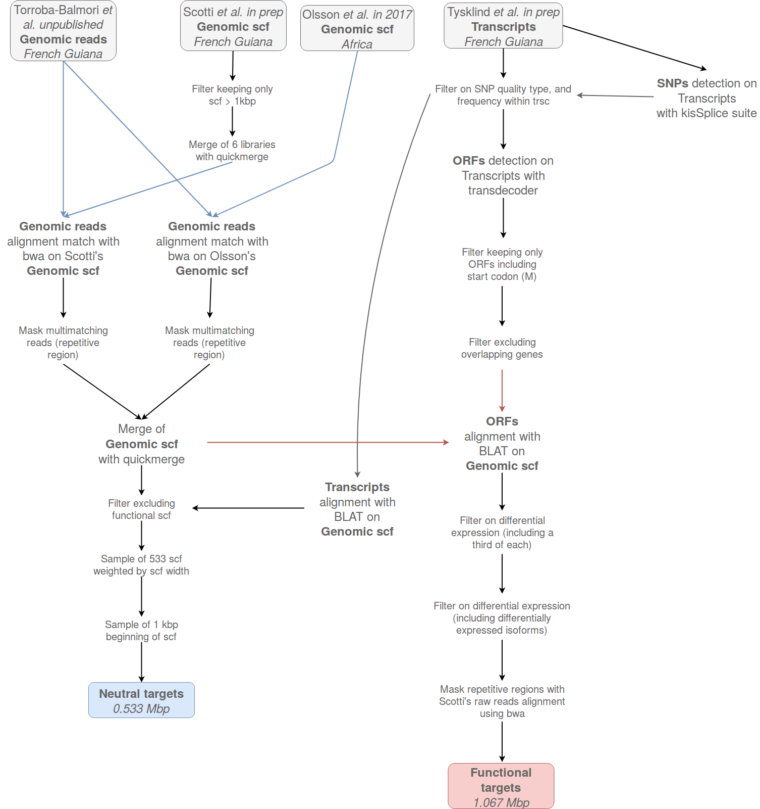

\makeatletter
\renewcommand*{\thetable}{\arabic{table}}
\renewcommand*{\thefigure}{\arabic{figure}}
\let\c@table\c@figure
\makeatother 

\renewcommand{\figurename}{Supplementary Material S.}
\renewcommand{\tablename}{Supplementary Material S.}

```{r config, message=FALSE, warning=FALSE, include=FALSE}
rm(list = ls()); invisible(gc())
library(knitr)
library(kableExtra)
if(knitr:::is_html_output()) options(knitr.table.format = "html") 
if(knitr:::is_latex_output()) options(knitr.table.format = "latex") 
library(tidyverse)
theme_set(bayesplot::theme_default())
opts_chunk$set(echo = F, message = F, warning = F, 
               fig.height = 8, fig.width = 8,
               cache = T, cache.lazy = F)
```

<!-- SUPPLEMENTARY MATERIALS -->

```{r probeDesign, fig.cap="Probes designe scheme..."}

```
