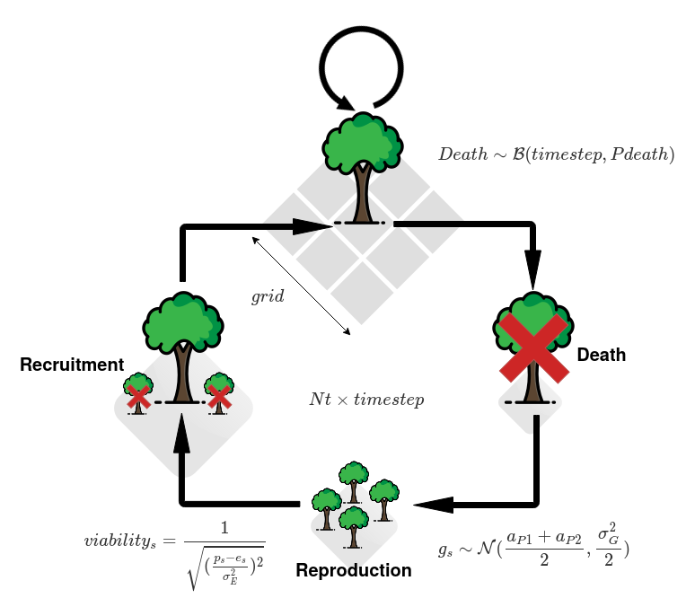

```{r setupintro, include=FALSE}
rm(list = ls()) ; invisible(gc()) ; set.seed(42)
library(knitr)
library(kableExtra)
if(knitr:::is_html_output()) options(knitr.table.format = "html") 
if(knitr:::is_latex_output()) options(knitr.table.format = "latex") 
library(tidyverse)
theme_set(bayesplot::theme_default())
opts_chunk$set(
  echo = F, message = F, warning = F, fig.height = 6, fig.width = 8,
  cache = T, cache.lazy = F)
# path <- "../../data/Paracou/"
```

# Introduction {-}

This document address the joint effects of topography and forest gap dynamics on the conditions for tree species coexistence discussed in my [PhD thesis](https://phdthesissylvainschmitt.netlify.app/thesis.pdf).
We are using the model `ecoevosimulator` (Fig. \@ref(fig:simintro)), 
that is developed in parallel in the Rcpp package `ecoevosimulator` 
available on [GitHub](https://github.com/sylvainschmitt/ecoevosimulator) as a different project. 
More particularly, a user interface is hosted on [ShinyApps](https://sylvainschmitt.shinyapps.io/ecoevosimulator/) to run the simulator.
We specifically wanted to address the following questions:

1. What are the conditions for the stable coexistence of genotypes and species with topography and/or forest gap dynamics in the forest community?
    * Forest gap dynamics only
    * Topography only
    * Joint effect
    * Random distribution start
    * Coexistence versus out-competition conditions
1. What are the conditions for the successful establishment of genotypic adaptations to forest gap dynamics in the forest community?
    * Null distribution start
1. What are the conditions for the reinforcement of species barriers or speciation of species connected through gene flow along topography?
    * Factors leading to population structure 

```{r simintro, fig.cap="Scheme of the EcoEvoSimulator with death, reproduction and recruitment steps."}

```

