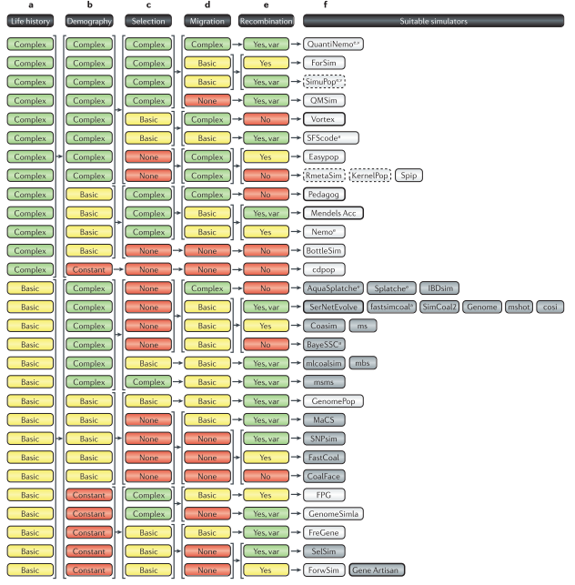

```{r setuplit, include=FALSE}
rm(list = ls()) ; invisible(gc()) ; set.seed(42)
library(knitr)
library(kableExtra)
if(knitr:::is_html_output()) options(knitr.table.format = "html") 
if(knitr:::is_latex_output()) options(knitr.table.format = "latex") 
library(tidyverse)
theme_set(bayesplot::theme_default())
opts_chunk$set(
  echo = F, message = F, warning = F, fig.height = 6, fig.width = 8,
  cache = T, cache.lazy = F)
# path <- "../../data/Paracou/"
```

# Literature

Here is a more extensive but raw review of the literature use throughout the analyses.

## Methodology

* Population-based
* Individual-based
    * might be needed for individual genotypic evolution
* Processus-based
* Sotck/Flux-based
* Spatially-explicit
    * might be needed for forest gaps dynamics
* Genetically-explicit
    * might be avoided to gain simplicity
* matrix models for populations with stages

### Tools

* **TROLL** for gaps only [@Chave1999; @Marechaux2017]
* **FORMIND** [@Kohler1998]
* **SELVA** to model growth directly, include a genetics module
* **SELVa** changing fitness landscape, only evolution
* **@Vellend2006a** lotka-Voltera spatialized
* **@Ellner1994** differential equations overlapping generations of 
* Ordinary differential equations (ODE, possible in `stan` [see for instance](https://juliettearchambeau.github.io/BiogecoBayes/workshop6_ODE_SIR.html))
* Eco-Gene Degen et al.,
* **Nemo** With the availability of a geneitc map, Nemo can be used to study the **genetics of adaption**, model scenarios of adaptation with gene flow, of population expansion into a new environment, **adaptation to fluctuating environments**, or the joint evolution of dispersal and deleterious mutations in structured populations, among other things.
* **SLim3** explicit space, overlapping generations, individual variation in reproduction, density-dependent population regulation, individual var-iation in dispersal or migration, local extinction and recolonization, mating between subpopulations, age structure, fitness-based survival and hard selection
* [cancercontrol popmodels list](https://popmodels.cancercontrol.cancer.gov/gsr/)

```{r, fig.cap="Decision matrix for choosing an evolutionary simulator adapted from  @Hoban2012."}

```


## Processes

* Species adaptations
    * to topography
* Genotypic adaptations
    * microgeogrpahic
    * to forest gaps dynamics
* Phenotypic plasticity
    * noise
    * ontogeny
    * reaction norm
    * heritability
* Mating
    * random
    * assortative
* Time
    * year
* Space
    * 2D explicit
    * non explicit
* Fitness
    * indirect growth, survival and reproduction (process based)
* Genetics
    * implicit
    * explicit
    * evolving traits
    * loci
    * neutral genes
    * mutations
    * ploidy
    * inheritance

## Uncategorized

### @Romero-Mujalli2019

**Individual-based modeling of eco-evolutionary dynamics: state of the art and future directions**

* Individual based models simulate emerging processes from individual entities > what we need for individual genotypic evolution
* few models with phenotypic plasticity
* Plasticity as noise or reaction norm
* Response to CC and lande use change > genetic adaptation, plasticity, shift of distribution or extinction
* modelling for complex dynamics, complex experiments, endangered speices, or long generation times
* Fussman et al. 2003 rotifers highly cited as an example of eco-evolutionary dynamics
* Two categories: distribution models and process-based models
* Plasticity: epigenetics, maternal effects, environmental induction, acclimation, developmental plasticity, random noise
* Plasticity: ontogenic & flexible
* explicit or implicit genetics
* three responses: dispersal, plasticity & adaptation
* Local adaptation models often non-spatial
* most of the time random mating but assortative mating for speciation
* Implicit genetics based on the infiniesimal model has the advantage to simplify genetics while olding robust assumptions
* Table 2 is perfect to select key-features of an eco-evolutionary individual based model:
    * Ecology:
        * Species nuber and interactions: closely-related species within a species complex with inter- and intra-specific competition
        * Time scale: year because of overlapping and long generations
        * Space: 2D explicit or non-spatial (more 2D for gaps dynamics)
        * Environmental feedback: yes for gaps dynamics
        * Reproduction: random mating with sexual species but hybridization ?
        * fitness: indirect through growth, survival and reproduction
    * Genetics: Implicit or explicit ?
    * Plasticity: 
        * Implementation: random noise or reaction norm ?
        * Costs: not explicit
        * Evolution: not included
        
### @Vellend2006a

**The consequences of genetic diversity in competitive communities**
   
* modified Lotka-Voltera model with competing species $m$ and genotyypes $i$ within species
* genotypic richness and range determine the probability for a species to possess genetic variants to survive in an environment in face of multispecies competition
* genotypic richness decrease variation in community composition while increasing species diversity (sampling effect ?)

### Nabieva2019

**SELVa: Simulator of Evolution with Landscape Variation**

* fitness landscape
* only evolutive

### @Schwilk2002

**Genetic niche-hiking: An alternative explanation for the evolution of flammability**

* Genetic niche-hiking with forest gap dynamics for trees ?
* Genotype increase despite fitness disadvantage
* association between alleles is the important point in hitchhiking
* Spatial structure leading to a genetic association
* Niche construction: when individuals influence their environment. Shading in forest gaps dynamics ?
* Conditions: (i) fire spread to all nieghbors, (ii) pollen and dispersal are local, (iii) gaps are colonized by seed produced before the opening, (iv) background mortality is low, (v) fitness is determined by other alleles matching a changing optimum
* Events: (1) background mortality, (2) fires, (3) seedlings recruitment depending on dispersal and poliinisation, (4) selection
* Genetic niche-hiking, a delterious allele causing flammability invades due to its association with gaps where its seedlings can track the changing environment
* Recombination of fitness alleles with probability mu
* haploid, 150x150 lattice, toroid
* a flammability locus Torch or Damp
* 25 fitness loci
* Less logevity but increased offspring advantage ~ gaps genotypes ?
* The T allele is unlinked to fitness but finally associated to fitter genotypes
* expansion of mating distances and dispersal or increase in background mortality will deacrease the assocaition between T allele and the tracking opportunity
* ecological mediation of generation time ~ fast growth in gaps = shorter generations ?
* Niche-hiking can use a trait that causes the death of its possessor after reproduction but result simulatneously in the death of neighbors

### @Vincenzi2014

**Evolution of serotiny in maritime pine (Pinus pinaster) in the light of increasing frequency of fires**

* individual phenotype for a quantitative trait a with breeding value z_i = a_i + e_i , a_i ~ N(mu_a, sigmaG), e_i ~ N(mu_e, sigmaE), h2 = sigmaG/sigmaZ, aprogeny ~ N(mean(ap1,ap2),sigmaG/2)
* Inheritance for a quntitaive trait 

### @Bocedi2014

**RangeShifter: a platform for modelling spatial eco-evolutionary dynamics and species’ responses to environmental changes** 

* population dynamics and dispersal behaviours in an individual-based framework and allowing them to be simulated on landscapes at different scales
* matrix model for population dynamics

### @Haller2019

**SLiM 3: Forward Genetic Simulations Beyond the Wright-Fisher Model**

* explicit space, overlapping generations, individual variation in reproduction, density-dependent population regulation, individual var-iation in dispersal or migration, local extinction and recolonization, mating between subpopulations, age structure, fitness-based survival and hard selection
* could be the perfect solution, online workshop, but need training

### @Guillaume2006

**Nemo: An evolutionary and population genetics programming framework**

* C++ framework to expand with custom functions, needs a big investment

### @Okamoto2018

**A framework for high-throughput eco-evolutionary simulations integrating multilocus forward-time population genetics and community ecology**

### @Hoban2012

**Computer simulations: Tools for population and evolutionary genetics**

A general guide for evolutionary simulations

### @Ellner1994


### @Vindenes2015

**Individual heterogeneity in life histories and eco-evolutionary dynamics**

### @Thuiller2013

**A road map for integrating eco-evolutionary processes into biodiversity models**

