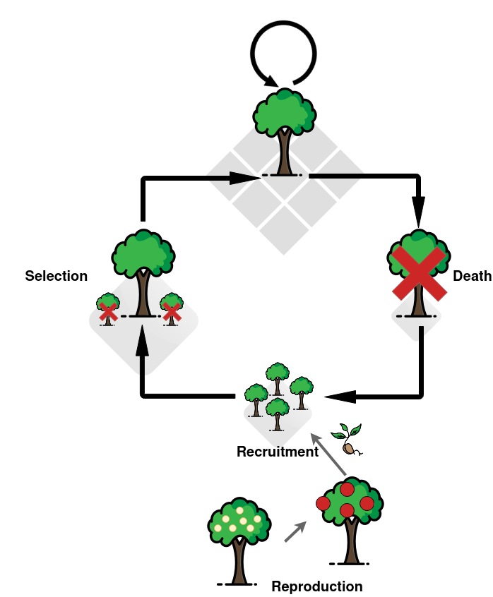

```{r config, message=FALSE, warning=FALSE, include=FALSE}
rm(list = ls()); invisible(gc()) ; set.seed(42)
library(knitr)
library(tidyverse)
library(bayesplot)
theme_set(bayesplot::theme_default())
opts_chunk$set(echo = F, message = F, warning = F, 
               fig.height = 4, fig.width = 6,
               cache = T, cache.lazy = F)
```

1. Sylvain Schmitt
    - Corresponding author
    - sylvain.m.schmitt@gmail.com
    - orcid.org/0000-0001-7759-7106
    - CNRS, UMR EcoFoG (Agroparistech, Cirad, INRAE, Université des Antilles, Université de la Guyane), Campus Agronomique, 97310 Kourou, French Guiana
    - Univ. Bordeaux, INRAE, BIOGECO, 69 route d’Arcachon, 33610 Cestas France
1. Niklas Tysklind
    - Niklas.Tysklind@ecofog.gf
    - INRAE, UMR EcoFoG (Agroparistech, CNRS, Cirad, Université des Antilles, Université de la Guyane), Campus Agronomique, 97310 Kourou, French Guiana
1. Myriam Heuertz
    - heuertzm@gmail.com
    - orcid.org/0000-0002-6322-3645
    - Univ. Bordeaux, INRAE, BIOGECO, 69 route d’Arcachon, 33610 Cestas France
1. Bruno Hérault
    - bruno.herault@cirad.fr
    - orcid.org/0000-0002-6950-7286
    - CIRAD, UPR Forêts et Sociétés, Yamoussoukro, Côte d’Ivoire
    - Forêts et Sociétés, Univ Montpellier, CIRAD, Montpellier, France
    - Institut National Polytechnique Félix Houphouët-Boigny, INP-HB, Yamoussoukro, Côte d’Ivoire

\newpage 

# Abstract

*To be writen depending on manuscript review and aimed journal.*


## Keywords

xx ; xx ; xx

\newpage 

# Introduction

* topography effect on local adaptation and population structure
* forest gap dynamics effect on local adaptation and population structure
* joint interaction?
* evolution simulator
* ecological simulator
* eco-evo-simulator with changing environment
* simulator with spatial processes
* overlapping generations
* ours = first with all needed for tropical forests
* questions
  * What are the effects of species biological parameters on the establishment of genotypic adaptations to forest gap dynamics and topography in the forest community?
  * What are the effects of species biological parameters on the population structure and divergence with forest gap dynamics and topography in the forest community?
* hypotheses

# Material and Methods

## Simulator

Trees are simulated on a grid of size $grid×grid$.
Each cell of the grid is defined with two environmental values,
one for topography and one for forest gap dynamics.
Mature canopy trees are initialized in each cell.
Then, simulations follow three basic steps for each tree in each cell of the  grid over $Nt$ time-steps (Fig. \@ref(fig:ecoevosim)):
(1) death, (2) reproduction and recruitment, and (3) selection.
The source code is written as a R package in R and C++.
Version 1.0.0 used in this study is available at https://github.com/sylvainschmitt/ecoevosimulator .

```{r ecoevosim, fig.cap="Representation of life cyle for individual trees in a spatially explicit grid in the simulator. Trees risk dying at each time step with a year-probability drawn in a binomial distribution (top). Dead trees (right) are replaced by recruitment of parent trees reproduction (bottom). A single individual is selected in each cell (left) from all seedlings based on their viability. See material and methods for further details."}

```

### Environments

The grid is defined with two environmental variables:
(1) a topographic wetness index (TWI) 
representing abiotic environment through topography [@Schmitt2020],
and (2) a neighbourhood crowding index (NCI),
representing biotic environment through forest gap dynamics [@Schmitt2020a].

The topographic wetness index  (TWI) is a proxy of water accumulation. 
The TWI is defined by the watershed of the cell divided by the local slope, 
and thus represents a relative measure of soil moisture availability [@Kopecky2010],
where a higher TWI represents greater soil moisture availability.
Water access and topography have been identified as crucial to forest dynamics [@ferry2010higher] and species distribution [@Allie2015; @Schmitt2020].
The TWI was directly derived at 1 m resolution from a 1 m resolution digital elevation model using SAGA-GIS [@Conrad2015] based on a LiDAR campaign carried out in 2015 at the Paracou field station (5°18′N, 52°53′W) in French Guiana.


The neighbourhood crowding index [NCI; @Uriarte2004a] was used as a proxy of forest gap dynamics [@Schmitt2020a].
The neighbourhood crowding index $NCI_i$ for each tree individual $i$  was defined with the following formula:

\begin{equation} 
  NCI_i = \sum^J_{j|δi,j<20m} DBH_j^2e^{-\frac14\delta_{i,j}}
  (\#eq:nci)
\end{equation} 

where $DBH_j$ is the diameter at breast height of neighbouring tree j 
and $\delta_{i,j}$ its distance to individual tree i.
$NCI_i$ is defined for neighbours at a distance $\delta_{i,j}$ of up to 20m.
The size effect of neighbours was taken as their squared diameter, 
and hence proportional to their basal area. 
The distance effect of neighbours was set to $-\frac{1}{4}$,
corresponding to neighbours beyond 20m having less than 1% effect compared to the effect of neighbours at 0m.
We computed NCI for all individual and every census years at the Paracou field station (5°18′N, 52°53′W) in French Guiana.
We simulated NCI over time using four distributions:

1. a normal distribution to initialize NCI values in each cells
1. a bernoulli distribution to decide if the cell observed an increase NCI at the next time-step, i.e. growing neighbours, or a decrease in NCI at the next time-step, i.e. a treefall
1. a lognormal distribution for increasing NCI, i.e. growing neighbours
1. an exponential distribution  for decreasing NCI, i.e. a treefall

We used the following formula to simulate NCI over time $t$:

\begin{equation} 
  NCI_{i,t=0} \sim \mathcal N(\mu_{NCI}, \sigma_{NCI}) \\
  NCI_{i,t} = NCI_{i,t-1} + \delta_{NCI_{i,t}} \\
  P(\delta_{NCI_{i,t}} \leq 0) \sim \mathcal B(logit^{-1}(\alpha + \beta.NCI_{i,t-1})) \\
  \delta_{NCI_{i,t}}\sim \left\{
    \begin{array}{ll}
        \mathcal {logN} (\mu_{\delta_{NCI} > 0}, \sigma_{\delta_{NCI} > 0}) & \mbox{if } \delta NCI > 0 \\
        \mathcal - {Exp} (\lambda_{\delta_{NCI} \leq 0}) & \mbox{ifelse}
    \end{array}
\right.
  (\#eq:ncisim)
\end{equation} 

We aggregated the simulated NCI at three meters to represent spatial auto-correlation in observed values of NCI in the Paracou field station.

### Initialization 

The grid is initialized with mature canopy trees.
Trees genotypes $g_i$ are drawn in a normal distribution centered on environmental mean $\mu_E$ of genetic variance $\sigma^2_G$. 
Trees phenotypes $p_i$ are drawn from a normal distribution centered on trees genotypes $g_i$ with a plastic variance $\sigma^2_P$:

\begin{equation} 
  p_i ∼ \mathcal N(g_i, \sigma^2_P) \\
  g_i ∼ \mathcal N(\mu_E,\sigma^2_G)
  (\#eq:init)
\end{equation} 

Note that two genotypes and phenotypes are defined for trees, 
one for topography and one for forest gap dynamics.
We further defined heritability as the genetic variance $\sigma^2_G$ divided by total variance, to be used as a unique biological parameter:

\begin{equation} 
  h^2 = \frac{\sigma^2_G}{\sigma^2_G+\sigma^2_P}
  (\#eq:h2)
\end{equation} 

### Death

Trees risk dying with a random draw in a binomial distribution: 

\begin{equation} 
  Death∼B(timestep,P_{death})
  (\#eq:death)
\end{equation} 

where $timestep$ (year) is the number of Bernoulli trials and $P_{death}$ is the annual death probability. 
Dead trees are replaced with reproduction and recruitment steps. 
Remaining trees form the overlapping generations.

### Reproduction and recruitment

Following tree death, $N_s$ seedlings are recruited in each empty cell.
Seedlings parents are drawn using all trees from the previous time-step, 
i.e. including tree dying at the current time-step. 
The mother tree is selected at a distance $R_{dispersion}$ from the empty cell.
The father tree is selected at a distance $R_{pollination}$ from the mother tree.
Dispersal kernels are discrete circles with uniform probabilities and include the empty cell, i.e. allowing auto-fecundation. 
Seedlings genotypes $g_s$ are drawn from a normal distribution centered on parental mean genotype with variance of half of genetic variance $\frac{\sigma^2_G}{2}$ [@Vincenzi2014].
Seedlings phenotypes $p_s$ are drawn from a normal distribution centered on seedlings genotypes $g_s$ with plastic variance $\sigma^2_P$:

\begin{equation} 
  p_s ∼ \mathcal N (g_s, \sigma^2_P) \\
  g_s ∼ \mathcal N (\frac{g_{mother}+g_{father}}{2}, \frac{\sigma^2_G}{2})
  (\#eq:repro)
\end{equation} 

Note that two genotypes and phenotypes are defined for each seedling, 
for topography and forest gap dynamics.

### Selection

Finally, the seedling with the highest viability is selected to replace the dead tree as a mature tree in canopy among the $N_s$ seedlings.
Viability is defined as the inverse of the Euclidean distance between seedlings phenotype $p_s$ and the environment $e_s$ reduced by environment variance $\sigma^2_E$:

\begin{equation} 
  viability_s = [\sqrt{(\frac{p_s−e_s}{\sigma^2_E})^2}]^{-1}
  (\#eq:viability)
\end{equation}

Note that the Euclidean distance used for viability is calculated in two dimensions composed by topography and forest gap dynamics.

## Simulation experiment

We varied four biological parameters of interest (Tab. \@ref(tab:params), see SI? for choice):

* heritability associated with topography, $h^2_{TWI}$, from 0.1 to 0.9
* heritability associated with forest gap dynamics, $h^2_{NCI}$, from 0.1 to 0.9
* number of seedlings, $N_s$, from 4 to 128
* dispersion radius, $R_{dispersion}$, from 1 to 10 cells

We used a grid of 50x50 over 60 time-steps of length 30 years (estimated time to reach canopy for *Symphonia globulifera* trees since recruitment at 10cm DBH, SI?).
TWI was extracted directly and standardized to the unit.
Values of NCI parameters and death probability were inferred from NCI values and death events observed in the Paracou field station across all censuses.
Pollination radius was set to one to focus on the variation of dispersion radius as they are symmetric (SI?).
Simulation stochasticity was low (SI?).
We thus ran one simulation per parameter set, 
resulting in 6,000 simulations 
($10~h^2_{TWI}\times10~h^2_{NCI}\times6~N_s\times10~R_{dispersion}$)


```{r params}
data.frame(
  Parameter = c(
    "$grid$", "$N_t$", "$timestep$",
    "$\\mu_{TWI}$", "$\\sigma^2_{P,TWI}$",
    "$\\mu_{NCI}$", "$\\sigma^2_{P,NCI}$",
    "$\\alpha$", "$\\beta$",
    "$\\mu_{\\delta_{NCI} > 0}$", "$\\sigma_{\\delta_{NCI} > 0}$",
    "$\\lambda_{\\delta_{NCI} \\leq 0}$",
    "$h^2_{TWI}$", "$h^2_{NCI}$",
    "$P_{death}$", "$N_s$", 
    "$R_{pollination}$", "$R_{dispersion}$"
  ),
  Equation = c(
    "", "", "\\@ref(eq:death)",
    "\\@ref(eq:init)", "\\@ref(eq:init)", 
    "\\@ref(eq:ncisim), \\@ref(eq:init)", "\\@ref(eq:ncisim), \\@ref(eq:init)",
    "\\@ref(eq:ncisim)", "\\@ref(eq:ncisim)",
    "\\@ref(eq:ncisim)", "\\@ref(eq:ncisim)",
    "\\@ref(eq:ncisim)",
    "\\@ref(eq:h2)", "\\@ref(eq:h2)",
    "\\@ref(eq:death)", "\\@ref(eq:repro)",
    "\\@ref(eq:repro)", "\\@ref(eq:repro)"
  ),
  Values = c(
    "50", "60", "30",
    "0", "1", 
    "123", "26",
    "-1.32", "0.003",
    "0.749", "2.651",
    "0.31",
    "$[1:9].10^{-1}$", "$[1:9].10^{-1}$",
    "0.013", "$2^{[2:7]}$",
    "1", "$[1:10]$"
  ),
  Description = c(
    "grid size", 
    "number of time-steps (ca 3m)",
    "length of a timestep (years)",
    "TWI mean",
    "TWI plastic variance",
    "NCI mean",
    "NCI plastic variance",
    "Odd of negative NCI variation",
    "Effect of NCI from previous year on the odd of negative NCI variation",
    "Mode of positive NCI variation",
    "Scale of positive NCI variation",
    "Rate of negative NCI variation",
    "Heritability associated with TWI",
    "Heritability associated with NCI",
    "Death probability per year",
    "Number of seedlings",
    "Pollination radius (number of cells)",
    "Dispersion radius (number of cells)"
  )
) %>% kable(caption = "Model parameters with their name, referenced equation, values in the experiment, and description.")
```

## Analysis

### Local adaptation

In one cell, we defined local adaptation as the Euclidean distance between observed between tree genotype $g_i$ and tree environment $e_i$ reduced by environment variance $\sigma^2_E$. 
We used the mean value $D_G$ across the grid as a metric of local adaptation at time-step $t$:

\begin{equation} 
  D_G(t) = \overline{\sqrt{(\frac{g_i(t)−e_i(t)}{\sigma^2_E})^2}}
  (\#eq:Dg)
\end{equation}

When $D_G(t)$ approaches 0, individual genotypes perfectly fit their local environment, indicating maximal local adaptation.

### Population structure

We used k-means to test for the existence of at least two genetically distinct groups in the tree community, using the localization of genotypes along environmental gradients.
We defined a $WSS_{score}$ as an index of population structure based on the weighted sum of squares of every individual distance for a k-means of respectively 1 and 2 groups:

\begin{equation} 
  WSS_{score}(t) = \frac{WSS_{k=1}(t)}{WSS_{k=2}(t)} \frac12
  (\#eq:WSSscore)
\end{equation}

The weighted sum of squares ($WSS$) represent the group total variation along environmental gradients.
A mean $WSS$ of the two groups equal to half the $WSS$ of the whole community indicates adjacent groups, revealing an absence of population structure.
On the opposite, a mean $WSS$ of the two groups lower than half the $WSS$ of the whole community indicates distant groups, revealing population structure.
In a nutshell, $WSS_{score}$ close to one indicates an absence of population structure, whereas high $WSS_{score}$ indicates at least two structured populations.

### Statistical analysis

We tested the effect of the four biological parameters and their first order interaction on the variation of local adaptation $D_G$ and population structure $WSS_{score}$ for $TWI$ and $NCI$ after 60 time-steps (ca 1,800 years): heritabilites associated with TWI ($h^2_{TWI}$ and NCI ($h^2_{NCI}$) number of seedlings ($N_s$),  and dispersion radius ($R_{dispersion}$) as follows:

$$
log(Y) \sim \mathcal N(\mu + \theta_{topo} \times h^2_{TWI} + \theta_{gaps} \times h^2_{NCI} + \\ \theta_{seed} \times N_s + \theta_{disp} \times R_{dispersion} +  \theta_{topo:gaps} \times h^2_{TWI} \times h^2_{NCI} + \\\theta_{topo:seed} \times h^2_{TWI} \times N_s + \theta_{topo:disp} \times h^2_{TWI} \times R_{dispersion} + \\ \\\theta_{gaps:seed} \times h^2_{NCI} \times N_s + \theta_{gaps:disp} \times h^2_{NCI} \times R_{dispersion} +\\ \theta_{seed:disp} \times N_s \times R_{dispersion}, ^\sigma)
$$


# Results

# Discussion

# Acknowledgements

We thank the University of Bordeaux for a PhD grant to Sylvain Schmitt. 
XXX.
This study was partially funded by an Investissement d’Avenir grant of the ANR: CEBA (ANR-10-LABEX-0025).

# Authors’ contributions

# Data accessibility

\newpage 

# References

<div id="refs"></div>

\newpage 

## Table captions

__Table \@ref(tab:headcount)__ 

## Figure captions

__Figure \@ref(fig:PCA)__ 
