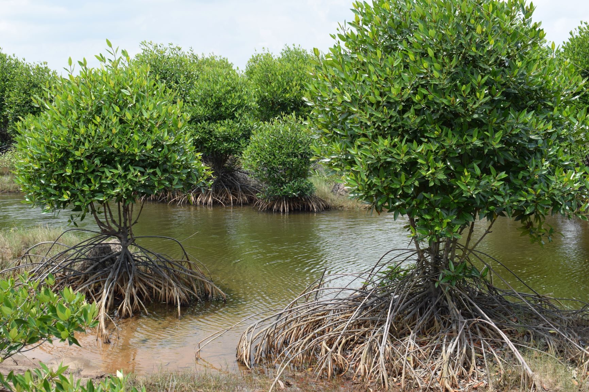
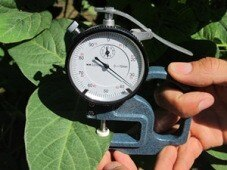
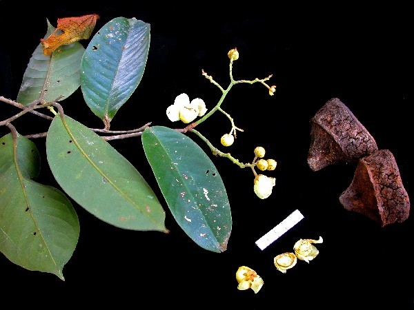
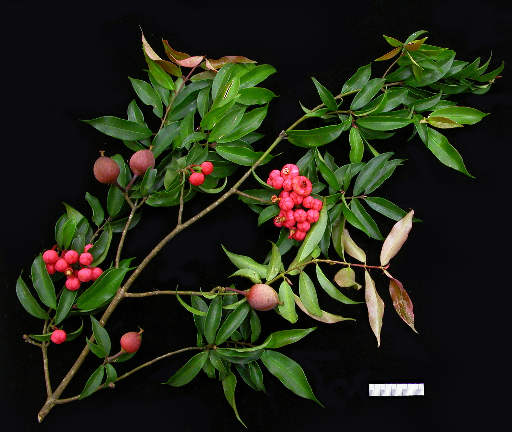
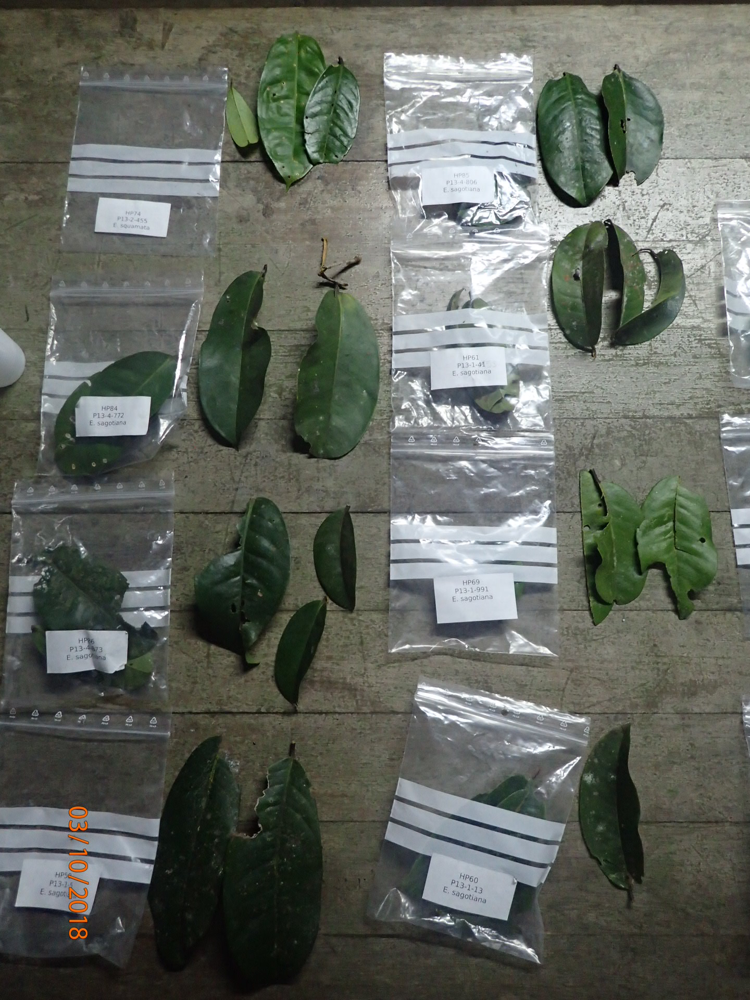
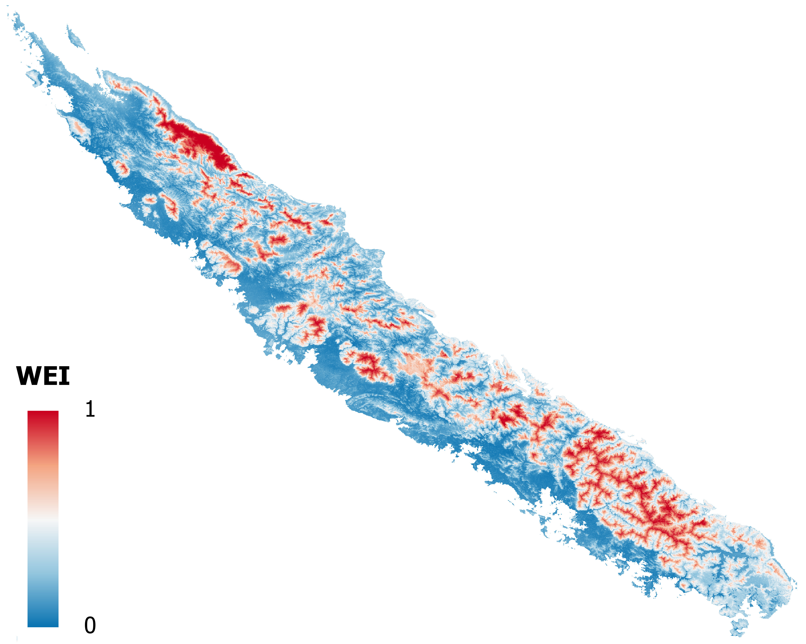

# [Mangrove](mangrove/index.html)

# [Modelling](modelling/index.html)

# [thickness](thickness/index.html)

# [Parvicapture](parvicapture/index.html)

# [Symcapture](symcapture/index.html)

# [Functional](functional/index.html)

# [Distribution](distribution/index.html)

