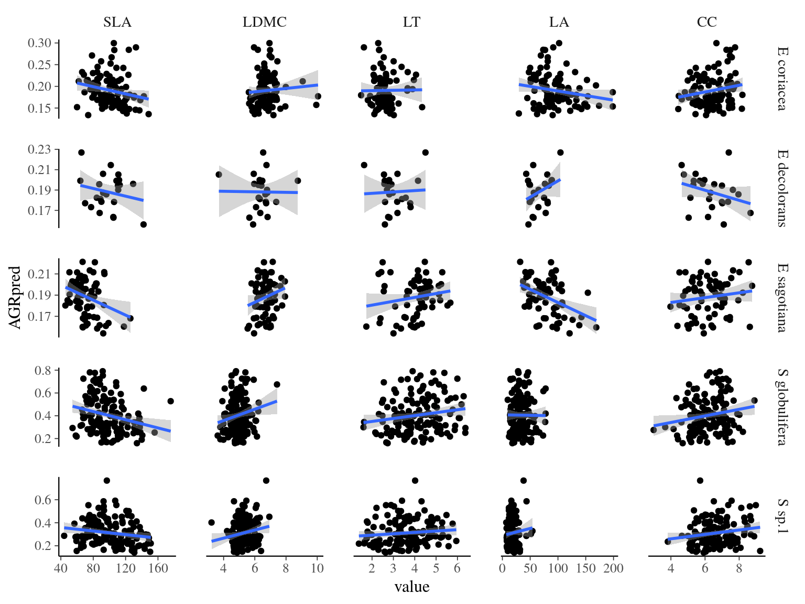
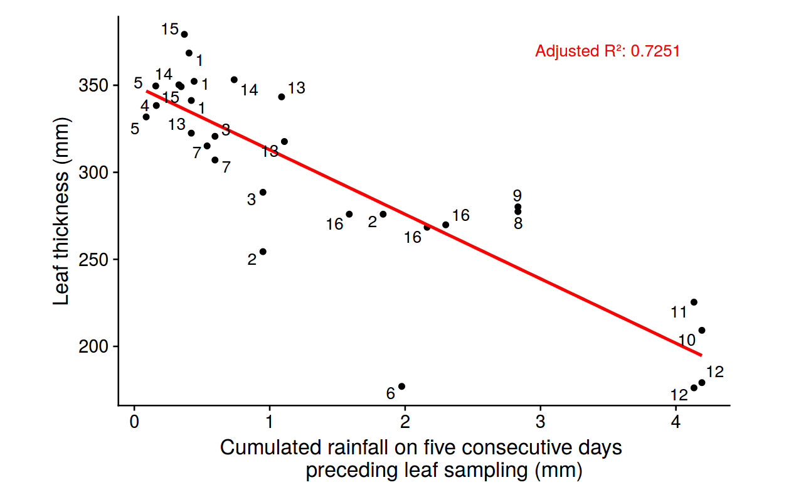
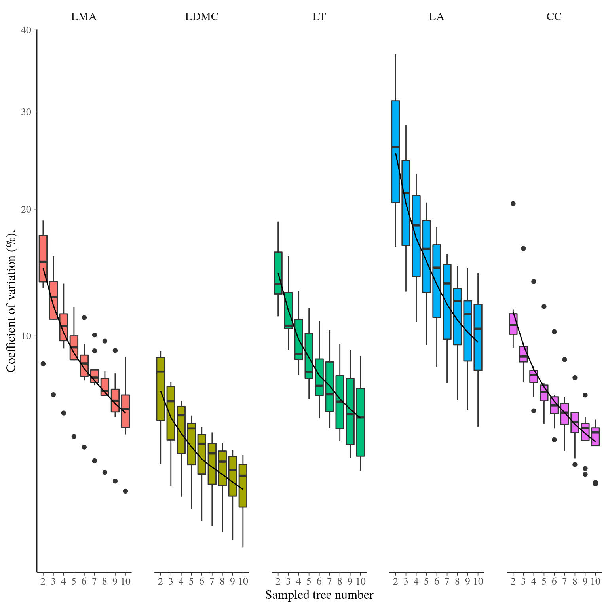

# (APPENDIX) Appendix {-} 

```{r setupA1, include=FALSE}
rm(list = ls()) ; invisible(gc()) ; set.seed(42)
library(knitr)
# library(kableExtra)
library(tidyverse)
library(ggfortify)
library(bayesplot)
theme_set(bayesplot::theme_default())
opts_chunk$set(echo = F, message = F, warning = F, fig.height = 6, fig.width = 6, cache = T)
# load("rdata/Ch3SupMat.Rdata")
```

# Appendix 1: Discussion Supplementary Materials

The following Supporting Information is available for the discussion:

**Fig. \@ref(fig:A1functionalpca).** Principal component analyses of leaf functional traits for *Symphonia* and *Eschweilera* clade *Parvifolia* species.

**Fig. \@ref(fig:A1growthtrajectories).** Growth trajectories of *Symphonia* and *Eschweilera* clade *Parvifolia* species.

**Fig. \@ref(fig:A1symphoniasfs).** Site frequency spectra for *Symphonia* species.

**Fig. \@ref(fig:A1symphoniaphylogeny).** Phylogeny for *Symphonia* species.

**Fig. \@ref(fig:A1functionalgenomics).** Variance partitioning of leaf functional traits in *Symphonia* species.

**Fig. \@ref(fig:A1sfunctionalgrowth).** Functioncal traits and individual growth potential for *Symphonia* species.

**Fig. \@ref(fig:A1weatherthickness).** Leaf thickness variation with precipitation for *Symphonia* species.

**Fig. \@ref(fig:A1traitsampling).** Effect of sampling on the estimate of the species mean trait value within *Symphonia* species.

**Fig. \@ref(fig:A1ncigrowtheschweilera).**  Variance partitioning for neighbourhood crowding index and individual growth potential in *Eschweilera* clade *Parvifolia* species.

**Fig. \@ref(fig:A1batreefalls).** Local basal area distribution prior to basal area loss in Paracou.

**Simulator S[1](#A1ecoevo1D).**  `C++` code for the one-dimension eco-evolutionary simulator.

**Simulator S[2](#A1ecoevo2D).**  `R` code for the two-dimensions eco-evolutionary simulator.

**Fig. \@ref(fig:A1gmaxspecies).** Species variation in growth trajectories of *Symphonia* and *Eschweilera* clade *Parvifolia* species.

\newpage

```{r A1functionalpca, fig.cap="Principal component analyses of leaf functional traits for *Symphonia* and *Eschweilera* clade *Parvifolia* species. Dot colors indicate the species, whereas dot sizes indicate diameter at breast height."}
read_tsv("rdata/A1functionalpca.tsv") %>% 
  filter(SpeciesLong %in% c("S sp.1", "S globulifera", "E coriacea", "E sagotiana", "E decolorans")) %>% 
  autoplot(princomp(~ SLA + LDMC + LT + LA + CC, data = ., cor = T), 
           data = .,
           colour = "SpeciesLong", alpha = 0.5, size = "DBH",
           loadings.label.size = 6,
           loadings.label.colour = 'black', loadings.label.vjust = 1.1,
           loadings = T, loadings.label = T, loadings.colour = 'black') +
  geom_hline(aes(yintercept = 0), col = 'black', linetype = "dotted") +
  geom_vline(aes(xintercept = 0), col = 'black', linetype = "dotted") +
  scale_color_discrete("Species") +
  scale_size("Diameter at\nbreast\nheight")
```

\newpage

```{r A1growthtrajectories, fig.cap="Growth trajectories of *Symphonia* and *Eschweilera* clade *Parvifolia* species."}
load("./rdata/fitGmaxGenoSympho.Rdata")
load("./rdata/fitGmaxGenoParvi.Rdata")
ggplot(data.frame(DBH = 0:200, AGR = 2), aes(x = DBH, y = AGR)) +
  stat_function(aes(col = "S. globulifera Paracou"), fun = function(.x)
    median(as.array(fitGmaxGenoSympho, "thetap1[1]"))*
      exp(-.5*(log(.x/(100*median(as.array(fitGmaxGenoSympho, "thetap2[1]"))))/
                 median(as.array(fitGmaxGenoSympho, "thetap3[1]")))^2)) +
    stat_function(aes(col = "S. globulifera Regina"), fun = function(.x)
    median(as.array(fitGmaxGenoSympho, "thetap1[2]"))*
      exp(-.5*(log(.x/(100*median(as.array(fitGmaxGenoSympho, "thetap2[2]"))))/
                 median(as.array(fitGmaxGenoSympho, "thetap3[2]")))^2)) +
    stat_function(aes(col = "S. sp1"), fun = function(.x)
    median(as.array(fitGmaxGenoSympho, "thetap1[3]"))*
      exp(-.5*(log(.x/(100*median(as.array(fitGmaxGenoSympho, "thetap2[3]"))))/
                 median(as.array(fitGmaxGenoSympho, "thetap3[3]")))^2)) +
    stat_function(aes(col = "E. coriacea cluster"), fun = function(.x) 
    median(as.array(fitGmaxGenoParvi, "thetap1[1]"))*
      exp(-.5*(log(.x/(100*median(as.array(fitGmaxGenoParvi, "thetap2[1]"))))/
                 median(as.array(fitGmaxGenoParvi, "thetap3[1]")))^2)) +
    stat_function(aes(col = "E. sagotiana cluster"), fun = function(.x) 
    median(as.array(fitGmaxGenoParvi, "thetap1[2]"))*
      exp(-.5*(log(.x/(100*median(as.array(fitGmaxGenoParvi, "thetap2[2]"))))/
                 median(as.array(fitGmaxGenoParvi, "thetap3[2]")))^2)) +
    stat_function(aes(col = "E. decolorans cluster"), fun = function(.x) 
    median(as.array(fitGmaxGenoParvi, "thetap1[3]"))*
      exp(-.5*(log(.x/(100*median(as.array(fitGmaxGenoParvi, "thetap2[3]"))))/
                 median(as.array(fitGmaxGenoParvi, "thetap3[3]")))^2)) +
  scale_color_discrete("Species")
rm(fitGmaxGenoSympho, fitGmaxGenoParvi)
```

\newpage

```{r A1symphoniasfs, fig.cap="Pairwise site frequency spectra for *Symphonia* species. We used the genome-transcriptome alignments built for the design of probes sets to classify called SNPs into (i) anonymous SNPs, i.e. neutral (on scaffolds matching no transcripts), and (iii) genic SNPs, i.e. functional (within an exon)."}
load("./rdata/sfs.Rdata")
cowplot::plot_grid(plotlist = g, nrow = 2)
```

\newpage

```{r A1symphoniaphylogeny, fig.cap="Phylogeny for *Symphonia* species. Drift-based phylogeny of *Symphonia* and *Pentadesma* populations with `treemix` [@Pickrell2012]. Subfigure **A** present the log-likelihood of the phylogeny topology depending on the number of allowed migration events per SNP type, suggesting 1 migration event to better represent the phylogeny topology than none. Others subfigures represent the phylogeny for anonymous (**B**), genic (**C**) and putatively-hitchhiker (**D**) SNPs. The red arrow represents the most likely migration event. Population are named by their localities, including *Symphonia* species only or *Symphonia* and *Pentadesma* species in Africa. At the exception of the three Paracou populations: *S. sp1*, *S. globulifera type Paracou* and *S. globulifera type Regina* respectivelly named Ssp1, SgParacou and SgRegina."}
load("rdata/treemix.Rdata")
cowplot::plot_grid(g.llik, g.tree[[1]], g.tree[[2]], g.tree[[3]], 
                   labels = LETTERS[1:4])
```

\newpage

```{r A1functionalgenomics, fig.cap="Variance partitioning of leaf functional traits in *Symphonia* species. ..."}
load("./rdata/fitFT.Rdata")
lapply(fitFT, mcmc_intervals_data, regex_pars = c("Vp", "Vg", "Vdbh", "Vplot", "Vr")) %>% 
  bind_rows(.id = "variable") %>% 
  mutate(variance = recode_factor(parameter, 
                           "Vp" = "Population", "Vg" = "Genotype", "Vdbh" = "DBH",
                           "Vplot" = "Plot", "Vr" = "Residual")) %>% 
  group_by(variable) %>%
  mutate(pct = paste0(round(m / sum(m) * 100), "%")) %>%
  ggplot(aes(x = variable, fill = variance)) +
  geom_col(aes(y = m)) +
  geom_text(aes(y = m, label = pct), col = "white", 
            position = position_stack(vjust = .5)) +
  facet_wrap(~ variable, scales = "free", nrow = 1) +
  theme(axis.title.x = element_blank(), axis.title.y = element_blank(),
        axis.text.x = element_blank(), axis.line.x = element_blank(), 
        axis.ticks.x = element_blank(),
        legend.position = "bottom") +
  scale_fill_discrete(expression(sigma^2))
rm(fitFT)
```

\newpage

```{r A1sfunctionalgrowth, fig.cap="Functioncal traits and individual growth potential for \\emph{Symphonia globulifera} species. Individual growth predicted in 2015 against sampled trait value in 2015.", out.width="\\linewidth", fig.align="center", fig.pos="H"}

```

\newpage

```{r A1weatherthickness, fig.cap="Leaf thickness variation with precipitation for \\emph{Symphonia globulifera} species. Leaf thickness in milimeters against cumulated rainfall on five consecutive days preceeding leaf sampling in milimeters.", out.width="\\linewidth", fig.align="center", fig.pos="H"}

```

\newpage

```{r A1traitsampling, fig.cap="Effect of sampling on the estimate of the species mean trait value within \\emph{Symphonia globulifera} species. Coefficient of variation of mean estimation depending on the number of individuals sampled of DBH>30 cm.", out.width="\\linewidth", fig.align="center", fig.pos="H"}

```

\newpage

```{r A1ncigrowtheschweilera, fig.cap="Variance partitioning for neighbourhood crowding index (NCI) and individual growth potential (Gmax) in *Eschweilera* clade *Parvifolia* species. Variance partitioning for neighbourhood crowding index (NCI), an indirect measurement of access to light, and individual maximum growth potential (Gmax). Variation of each variable has been partitioned into between-species (red), between-genotype (green), and residual (blue) variation."}
load("./rdata/fitGmaxGenoParvi.Rdata")
load("./rdata/fitEnvParvi.Rdata")
g.nci <- mcmc_intervals_data(fitEnvParvi$NCImean, regex_pars = c("Vp", "Vg", "Vr")) %>% 
  mutate(parameter = recode(parameter, "Vp" = "Population", 
                            "Vg" = "Genotype", "Vr" = "Residual")) %>% 
  mutate(pct = paste0(round(m / sum(m) * 100), "%")) %>%
  ggplot(aes(x = "Gmax", fill = parameter)) +
  geom_col(aes(y = m)) +
  geom_text(aes(y = m, label = pct), col = "white", position = position_stack(vjust = .5)) +
  theme(axis.title.x = element_blank(), axis.title.y = element_blank(),
        axis.text.x = element_blank(), axis.line.x = element_blank(), axis.ticks.x = element_blank()) +
  scale_fill_discrete(expression(sigma^2)) +
  ggtitle("NCI")
g.gmax <- mcmc_intervals_data(fitGmaxGenoParvi, regex_pars = c("Vp", "Vg", "Vr")) %>% 
  mutate(parameter = recode(parameter, "Vp" = "Population", 
                            "Vg" = "Genotype", "Vr" = "Residual")) %>% 
  mutate(pct = paste0(round(m / sum(m) * 100), "%")) %>%
  ggplot(aes(x = "Gmax", fill = parameter)) +
  geom_col(aes(y = m)) +
  geom_text(aes(y = m, label = pct), col = "white", position = position_stack(vjust = .5)) +
  theme(axis.title.x = element_blank(), axis.title.y = element_blank(),
        axis.text.x = element_blank(), axis.line.x = element_blank(), axis.ticks.x = element_blank()) +
  scale_fill_discrete(expression(sigma^2))  +
  ggtitle("Gmax")
rm(fitGmaxGeno, fitGmaxGenoParvi)
cowplot::plot_grid(g.nci, g.gmax)
```

\newpage

```{r A1batreefalls, fig.cap="Local basal area distribution prior to basal area loss, i.e. the successional stage of the forest patch before a treefall occurs. Treefall are defined is a loss of basal area superior to 10."}
read_tsv("rdata/A1batreefalls.tsv") %>% 
  mutate(Treefall = (DeltaBADeltat < -10)) %>% 
  ggplot(aes(BAlag)) +
  geom_histogram() +
  xlab("Local basal area of the year before a decrease of basal area.") +
  facet_wrap(~ Treefall, labeller = "label_both")
```

\newpage

## Simulator S2: `R` code for the one-dimension eco-evolutionary simulator. {#A1ecoevo1D}

```{Rcpp A1ecoevo1D}, eval=F, echo=T, cache=F}
#include <Rcpp.h>
using namespace Rcpp;

// [[Rcpp::export]]
NumericVector build_gradient(
    double gradientlim,
    int length
){
  double step = gradientlim*2/(length-1) ;
  NumericVector gradient(length) ;
  gradient[0] = - gradientlim ;
  for (int i = 1; i < length; i++)
    gradient[i] = gradient[i-1] + step ;
  return gradient ;
}

// [[Rcpp::export]]
List simulator1D_cpp(
    int  Nind = 50,
    int Ngen = 50,
    double muG = 0,
    double sigmaG = 1,
    double muE = 0,
    double sigmaE = 1,
    double Elim = 10,
    int seedlings = 4,
    int dispersal = 1,
    bool viability_deterministic = true
) {
  NumericMatrix A(Ngen, Nind) ;
  NumericMatrix Z(Ngen, Nind) ;
  NumericVector E = build_gradient(Elim, Nind) ;
  NumericMatrix Aoffsprings(Nind, seedlings) ;
  NumericMatrix Zoffsprings(Nind, seedlings) ;
  NumericVector Ap(2*dispersal+1) ;
  NumericVector w(seedlings) ;
  IntegerVector seeds(seedlings) ;
  int imin , imax, winner ;
  double muS ;
  A.row(0) = rnorm(Nind, muG, sigmaG) ; 
  Z.row(0) = rnorm(Nind, muE, sigmaE) ;
  for(int s = 0; s < seedlings; s++)
    seeds(s) = s ;
  for (int g = 1; g < Ngen; g++){
    for (int i = 0; i < Nind; i++){
      imin = 0 ;
      imax = Nind ;
      if(i-dispersal > 0){
        imin = i-dispersal ;
      } 
      if(i+dispersal+1 < Nind){
        imax = i+dispersal+1 ;
      }
      NumericVector Ap(imax-imin) ;
      for(int p = 0; p < imax-imin; p++) Ap(p) = A(g-1,imin+p) ;
      for (int s = 0; s < seedlings; s++){
        Aoffsprings(i,s) = rnorm(1, mean(sample(Ap, 2)), sigmaG/2)[0] ;
        Zoffsprings(i,s) = Aoffsprings(i,s) + rnorm(1, muE, sigmaE)[0] ;
      }
      if(viability_deterministic){
        winner = which_min(sqrt(pow(Zoffsprings(i,_)-E(i), 2))) ; 
      } else {
        w = 1/sqrt(pow(Zoffsprings(i,_)-E(i), 2)) ;
        winner = sample(seeds, 1, true, w)[0] ;
      }
      A(g,i) = Aoffsprings(i,winner) ;
      Z(g,i) =  Zoffsprings(i,winner) ;
    }
  }
  List sim = List::create(Named("A") = A, 
                          Named("Z") = Z,
                          Named("E") = E) ;
  return sim;
}
```

\newpage

## Simulator S2: `R` code for the two-dimensions eco-evolutionary simulator. {#A1ecoevo2D}

```{R A1ecoevo2D, eval=F, echo=T, cache=F}
simulator2D <- function(
    grid = 20, # size
    Ngen = 50,
    muG = 0, # genetics
    sigmaG = 1,
    muE = 0, # environment
    sigmaE = 1,
    Elim = 5,
    seedlings = 4, # reproduction
    dispersal = 1,
    viability_deterministic = T
){
    A <- array(dim = c(grid, grid, Ngen)) # objects
    Z <- array(dim = c(grid, grid, Ngen))
    A[,,1] <- array(rnorm(grid*grid, muG, sigmaG), dim = c(grid,grid))
    Z[,,1] <- A[,,1] + array(rnorm(grid*grid, muE, sigmaE), dim = c(grid,grid))
    E <- seq(-Elim, Elim, length.out = grid) %*% t(seq(-Elim, Elim, length.out = grid))
    for(g in 2:Ngen){ # iterations
      Aoffsprings <- array(
        as.vector(
          sapply(1:grid, function(i)
            sapply(1:grid, function(j)
              sapply(1:seedlings, function(s)
                rnorm(1, 
                      sample(A[max(1,i-dispersal):min(i+dispersal,grid),
                               max(1,j-dispersal):min(j+dispersal,grid),
                               g-1], 2),
                      sigmaG/2)
              )
            )
          )
        ), dim = c(grid, grid, seedlings))
        Zoffsprings <- Aoffsprings + array(rnorm(grid*grid*seedlings, muE, sigmaE), dim = c(grid,grid,seedlings))
        if(viability_deterministic){
            survivors <- array(apply(apply(Zoffsprings, 3, function(x) as.array(sqrt((x - E)^2), dim = c(grid,grid))), 1, which.min), dim = c(grid,grid))
        } else {
          survivors <- array(apply(1/apply(Zoffsprings, 3, function(x) as.array(sqrt((x - E)^2), dim = c(grid,grid))), 1, 
                                   function(w) sample.int(seedlings, 1, replace = T, prob = w)), dim = c(grid,grid))
        }
        A[,,g] <- Aoffsprings[cbind(rep(1:grid, grid), rep(1:grid, each = grid), as.vector(survivors))]
        Z[,,g] <- Zoffsprings[cbind(rep(1:grid, grid), rep(1:grid, each = grid), as.vector(survivors))]
        
    }
    return(lapply(list("breeding value (a)" = A, "trait value (z)" = Z), function(M)
        reshape2::melt(M) %>%
          dplyr::rename(X = Var1, Y = Var2, generation = Var3)) %>%
        bind_rows(.id = "var") %>%
          left_join(reshape2::melt(E) %>%
                      dplyr::rename(X = Var1, Y = Var2, environment = value),
                    by = c("X", "Y")) %>% 
          mutate(individual = paste0("X",X,"Y",Y)))
}
```

\newpage

```{r A1gmaxspecies, fig.cap="Species variation in growth trajectories of *Symphonia* and *Eschweilera* clade *Parvifolia* species. ..."}
load("./rdata/fitGmaxSympho.Rdata")
load("./rdata/fitGmaxParvi.Rdata")
g.sympho <-  mcmc_intervals_data(fitGmaxSympho, regex_pars = c("Vp", "Vr")) %>% 
  mutate(parameter = recode(parameter, "Vp" = "Species", "Vr" = "Residual")) %>% 
  mutate(pct = paste0(round(m / sum(m) * 100), "%")) %>%
  ggplot(aes(x = "Gmax", fill = parameter)) +
  geom_col(aes(y = m)) +
  geom_text(aes(y = m, label = pct), col = "white", position = position_stack(vjust = .5)) +
  theme(axis.title.x = element_blank(), axis.title.y = element_blank(),
        axis.text.x = element_blank(), axis.line.x = element_blank(), axis.ticks.x = element_blank()) +
  scale_fill_discrete(expression(sigma^2)) +
  ggtitle("Symphonia")
g.parvi <- mcmc_intervals_data(fitGmaxParvi, regex_pars = c("Vp", "Vg", "Vr")) %>% 
  mutate(parameter = recode(parameter, "Vp" = "Species", 
                            "Vg" = "Genotype", "Vr" = "Residual")) %>% 
  mutate(pct = paste0(round(m / sum(m) * 100), "%")) %>%
  ggplot(aes(x = "Gmax", fill = parameter)) +
  geom_col(aes(y = m)) +
  geom_text(aes(y = m, label = pct), col = "white", position = position_stack(vjust = .5)) +
  theme(axis.title.x = element_blank(), axis.title.y = element_blank(),
        axis.text.x = element_blank(), axis.line.x = element_blank(), axis.ticks.x = element_blank()) +
  scale_fill_discrete(expression(sigma^2))  +
  ggtitle("Eschweilera")
rm(fitGmaxSympho, fitGmaxParvi)
cowplot::plot_grid(g.sympho, g.parvi)
```
